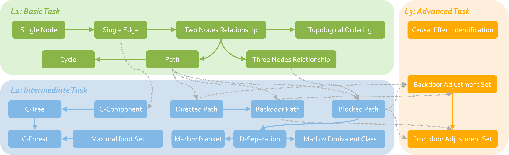

# CLEAR
This is the official data and code of the paper: [CLEAR: Can Language Models Really Understand Causal Graphs?](https://arxiv.org/pdf/2406.16605)

## Dataset
### Structure
```
├── data
| ├── assets
| ├── human-readable # Human-friendly format for the datasets
| ├── images # Graph visualization. Each graph is represented by two files: a DOT language representation file and a PNG image file.
| ├── json # Each row contains a graph and a set of diverse questions about it
| ├── json_single # Each row contains a graph and a question about it
| ├── judge.html # Tool for human evaluation
| └── stats.md # Data statistics
├── evaluate
└── ...
```

### Dataset Statistics
Our `CLEAR` benchmark includes 20 causal tasks, spanning all three complexity levels. We generate 2808 questions in total. For each causal task, we ensure that the number of questions exceeds 100 to support the validity of our experimental conclusions.



| **Causal task**                    | **Find all** | **Find one** | **How many** | **Choice selection** | **YN** | **Existence** | **Total** |
| :--------------------------------- | :----------- | :----------- | :----------- | :------------------- | :----- | :------------ | :-------- |
| Single node (SN)                   | 48           | -            | 48           | 48                   | 48     | -             | 192       |
| Single edge (SE)                   | 48           | -            | 48           | 48                   | 48     | -             | 192       |
| Two nodes relationship (2NR)       | 24           | -            | 24           | 24                   | 24     | 24            | 120       |
| Three nodes relationship (3NR)     | 24           | -            | 24           | 24                   | 24     | 24            | 120       |
| Path (PT)                          | 24           | 72           | 24           | 24                   | 24     | -             | 168       |
| Cycle (CL)                         | -            | 36           | -            | 36                   | 36     | 36            | 144       |
| Topological ordering (TO)          | -            | 48           | -            | 48                   | 48     | -             | 144       |
| Blocked path (BLP)                 | -            | 72           | -            | 36                   | 36     | -             | 144       |
| D-separation (DS)                  | -            | 60           | -            | 30                   | 30     | -             | 120       |
| Markov equivalent class (MEC)      | -            | 60           | -            | -                    | 60     | -             | 120       |
| Markov blanket (MB)                | -            | 48           | -            | 48                   | 48     | -             | 144       |
| Directed path (DP)                 | 24           | -            | 24           | 24                   | 24     | 24            | 120       |
| Backdoor path (BKP)                | 24           | 48           | 24           | 24                   | 24     | -             | 144       |
| C-component (CC)                   | 36           | -            | 36           | -                    | 36     | -             | 108       |
| C-tree (CT)                        | -            | -            | -            | -                    | 120    | -             | 120       |
| C-forest (CF)                      | -            | -            | -            | -                    | 120    | -             | 120       |
| Maximal root set (MRS)             | 48           | -            | 48           | 48                   | 48     | -             | 192       |
| Backdoor adjustment  set (BAS)     | -            | 72           | -            | 24                   | 24     | 12            | 132       |
| Frontdoor adjustment set (FAS)     | -            | 72           | -            | 24                   | 24     | 24            | 144       |
| Causal effect identification (CEI) | -            | -            | -            | -                    | 120    | -             | 120       |
| **Total**                          | 300          | 588          | 300          | 510                  | 966    | 144           | **2808**  |


## Quick Start
### Installation
```
git clone https://github.com/OpenCausaLab/CLEAR.git
conda create -n clear python=3.8
conda activate clear
pip install -r requirements.txt
```

### Testing
Specify the script to test different models. 
Please note that you need to provide your own API key for `GPT-3.5-Turbo`, `GPT-4` and `Gemini-pro`.
```
sh test/test_gpt4.sh
```

### Evaluation
#### Step 1: Split the json file
To facilitate subsequent operations, the results will be split according to question type (FA/FO/HM/MC/YN/EX). The script will also add a "format_prompt" field to the results of objective question (HM/MC/YN/EX). This field is used to prompt the GPT-4 to extract the answers.
```
python evaluate/split.py output/gpt-4-1106.jsonl output/gpt-4-split
```

#### Step 2: Answer extraction using GPT-4 for objective questions
Please note that you need to provide your own API key for `GPT-4`.
```
sh evaluate/sh_evaluate.sh
```

#### Step 3: Human evaluation for subjective questions
Use the `/data/judge.html` tool and select a file (i.e., `output/gpt-4-split/FA.json`). The result will be saved to `output/gpt-4-split/FA_manual.json`.


#### Step 4: Calculate the accuracy
Objective questions (HM, CS, YN, and EX):
```
sh evaluate/sh_format.sh
```

Subjective questions (FA and FO):
```
sh evaluate/sh_manual.sh
```


# 🖇️ Citation
Please cite our paper if you find this repository benefits your work.
```bibtex
@misc{chen2024clear,
      title={CLEAR: Can Language Models Really Understand Causal Graphs?}, 
      author={Sirui Chen and Mengying Xu and Kun Wang and Xingyu Zeng and Rui Zhao and Shengjie Zhao and Chaochao Lu},
      year={2024},
      eprint={2406.16605},
      archivePrefix={arXiv},
      primaryClass={cs.CL}
}

```

# 📧 Contact 
- chensirui@pjlab.org.cn
- xumengying@sensetime.com
- wangkun@sensetime.com
- xyzeng@sensetime.com
- luchaochao@pjlab.org.cn
