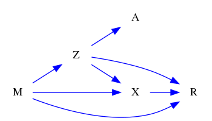
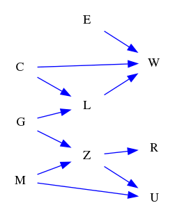

| Find All |How Many |Find One |Yes or No |Multiple Choice |Existence | total |
|:------:|:------:|:------:|:------:|:------:|:------:|:------:|
| 24 |24 |0 |24 |24 |24 | 120 |

|  N=4 | N=5 | N=6 | N=7 | N=8 | N=9 | total |
|:------:|:------:|:------:|:------:|:------:|:------:|:------:|
| 20 |20 |20 |20 |20 |20 | 120 |

|  Yes. | No. | judge_total |
|:------:|:------:|:------:|
| 19 |29 | 48 |

|  A | B | C | D | MC_total |
|:------:|:------:|:------:|:------:|:------:|
| 7 |3 |7 |7 | 24 |

## ID: 11378664
### Graph
- graph type: DAG
- description: Given a DAG (directed acyclic graph) with nodes P, G, S, N and directed edges P->N, G->S, P->S, P->G.

### Questions
- [FA] List all parents of node N. 
- [HM] How many children does node P have? 
- [YN] Is node G one of ancestors of node P? 
- [MC] Which of the following is one of descendants of node P?\
A. S\
B. T\
C. E\
D. W 
- [EX] Does node G have any descendants? 
### Answers
- {'P'}
- 3
- No.
- A
- Yes.
## ID: 23435083
### Graph
- graph type: DAG
- description: Given a DAG (directed acyclic graph) with nodes H, I, A, T and directed edges H->I, H->A, H->T, I->T, I->A, A->T.

### Questions
- [FA] List all descendants of node I. 
- [HM] How many ancestors does node A have? 
- [YN] Is node T one of ancestors of node H? 
- [MC] Which of the following is one of descendants of node I?\
A. N\
B. T\
C. L\
D. H 
- [EX] Does node I have any descendants? 
### Answers
- {'T', 'A'}
- 2
- No.
- B
- Yes.
## ID: 09478135
### Graph
- graph type: DAG
- description: Given a DAG (directed acyclic graph) with nodes M, X, L, U, N and directed edges M->X, U->N, M->U, L->U, M->L, M->N, L->N.

### Questions
- [FA] List all descendants of node L. 
- [HM] How many children does node X have? 
- [YN] Is node X one of children of node U? 
- [MC] Which of the following is one of descendants of node U?\
A. N\
B. X\
C. L\
D. M 
- [EX] Does node M have any descendants? 
### Answers
- {'U', 'N'}
- 0
- No.
- A
- Yes.
## ID: 12573711
### Graph
- graph type: DAG
- description: Given a DAG (directed acyclic graph) with nodes M, Z, A, X, R and directed edges M->X, X->R, Z->A, M->Z, M->R, Z->X, Z->R.

### Questions
- [FA] List all children of node X. 
- [HM] How many parents does node Z have? 
- [YN] Is node Z one of ancestors of node X? 
- [MC] Which of the following is one of ancestors of node R?\
A. K\
B. H\
C. A\
D. Z 
- [EX] Does node A have any children? 
### Answers
- {'R'}
- 1
- Yes.
- D
- No.
## ID: 57969567
### Graph
- graph type: DAG
- description: Given a DAG (directed acyclic graph) with nodes B, N, V, R, D, C and directed edges D->C, V->R, B->D, N->C, V->D, B->V, R->D, R->C, N->R.

### Questions
- [FA] List all ancestors of node V. 
- [HM] How many descendants does node C have? 
- [YN] Is node N one of parents of node R? 
- [MC] Which of the following is one of descendants of node D?\
A. R\
B. B\
C. V\
D. C 
- [EX] Does node D have any children? 
### Answers
- {'B'}
- 0
- Yes.
- D
- Yes.
## ID: 62640566
### Graph
- graph type: DAG
- description: Given a DAG (directed acyclic graph) with nodes Q, H, G, Y, L, T and directed edges H->T, Q->H, G->L, H->L, Q->G, G->Y, Q->Y, Y->T, H->Y, Y->L.

### Questions
- [FA] List all children of node H. 
- [HM] How many parents does node H have? 
- [YN] Is node H one of descendants of node Y? 
- [MC] Which of the following is one of parents of node T?\
A. H\
B. Q\
C. L\
D. G 
- [EX] Does node T have any ancestors? 
### Answers
- {'T', 'L', 'Y'}
- 1
- No.
- A
- Yes.
## ID: 07805756
### Graph
- graph type: DAG
- description: Given a DAG (directed acyclic graph) with nodes I, S, T, L, W, D, M and directed edges I->S, W->M, T->W, W->D, I->L, S->L, L->W, L->D, T->L.

### Questions
- [FA] List all children of node L. 
- [HM] How many ancestors does node W have? 
- [YN] Is node T one of children of node I? 
- [MC] Which of the following is one of parents of node L?\
A. D\
B. W\
C. M\
D. T 
- [EX] Does node D have any descendants? 
### Answers
- {'D', 'W'}
- 4
- No.
- D
- No.
## ID: 50998853
### Graph
- graph type: DAG
- description: Given a DAG (directed acyclic graph) with nodes V, N, J, Q, Z, F, T and directed edges N->Z, N->Q, Z->T, Q->T, N->F, Q->F, V->Z, J->Q.

### Questions
- [FA] List all ancestors of node T. 
- [HM] How many ancestors does node Q have? 
- [YN] Is node T one of descendants of node V? 
- [MC] Which of the following is one of descendants of node Q?\
A. J\
B. V\
C. N\
D. F 
- [EX] Does node F have any parents? 
### Answers
- {'Z', 'J', 'V', 'Q', 'N'}
- 2
- Yes.
- D
- Yes.
## ID: 52465487
### Graph
- graph type: DAG
- description: Given a DAG (directed acyclic graph) with nodes G, L, J, U, V, Q, A, W and directed edges U->V, L->U, J->Q, U->Q, L->V, J->W, L->W, G->W, Q->A.

### Questions
- [FA] List all children of node J. 
- [HM] How many descendants does node U have? 
- [YN] Is node W one of ancestors of node V? 
- [MC] Which of the following is one of ancestors of node A?\
A. W\
B. G\
C. V\
D. L 
- [EX] Does node L have any ancestors? 
### Answers
- {'Q', 'W'}
- 3
- No.
- D
- No.
## ID: 30841726
### Graph
- graph type: DAG
- description: Given a DAG (directed acyclic graph) with nodes U, R, P, E, W, M, I, K and directed edges P->E, U->M, P->I, E->K, U->W, U->P, U->I, E->W, R->M.

### Questions
- [FA] List all children of node E. 
- [HM] How many ancestors does node K have? 
- [YN] Is node R one of descendants of node W? 
- [MC] Which of the following is one of children of node R?\
A. M\
B. I\
C. K\
D. W 
- [EX] Does node P have any ancestors? 
### Answers
- {'K', 'W'}
- 3
- No.
- A
- Yes.
## ID: 88813945
### Graph
- graph type: DAG
- description: Given a DAG (directed acyclic graph) with nodes X, Y, T, P, H, M, I, W, V and directed edges T->V, X->M, T->P, X->V, H->M, T->W, H->I, P->I, Y->M, Y->T.

### Questions
- [FA] List all children of node Y. 
- [HM] How many descendants does node M have? 
- [YN] Is node T one of parents of node M? 
- [MC] Which of the following is one of ancestors of node I?\
A. V\
B. X\
C. P\
D. W 
- [EX] Does node I have any descendants? 
### Answers
- {'T', 'M'}
- 0
- No.
- C
- No.
## ID: 32652475
### Graph
- graph type: DAG
- description: Given a DAG (directed acyclic graph) with nodes E, G, C, L, M, Z, R, W, U and directed edges M->Z, E->W, Z->U, Z->R, C->L, G->L, G->Z, M->U, C->W, L->W.

### Questions
- [FA] List all children of node M. 
- [HM] How many descendants does node Z have? 
- [YN] Is node W one of parents of node Z? 
- [MC] Which of the following is one of children of node M?\
A. C\
B. W\
C. U\
D. L 
- [EX] Does node G have any parents? 
### Answers
- {'Z', 'U'}
- 2
- No.
- C
- No.
## ID: 55639177
### Graph
- graph type: ADMG
- description: Given an ADMG (acyclic directed mixed graph) with nodes T, R, W, Z, directed edges R->Z, W->Z, T->W and bi-directed edges T<->W.

### Questions
- [FA] List all descendants of node R. 
- [HM] How many ancestors does node W have? 
- [YN] Is node R one of descendants of node T? 
- [MC] Which of the following is one of children of node R?\
A. W\
B. T\
C. Z\
D. B 
- [EX] Does node T have any ancestors? 
### Answers
- {'Z'}
- 1
- No.
- C
- No.
## ID: 39363780
### Graph
- graph type: ADMG
- description: Given an ADMG (acyclic directed mixed graph) with nodes Q, Y, B, X, directed edges Y->B, Q->B, Q->X, Y->X, Q->Y and bi-directed edges Q<->B, Y<->X.

### Questions
- [FA] List all parents of node Y. 
- [HM] How many parents does node X have? 
- [YN] Is node B one of parents of node X? 
- [MC] Which of the following is one of descendants of node Q?\
A. X\
B. G\
C. P\
D. R 
- [EX] Does node Y have any parents? 
### Answers
- {'Q'}
- 2
- No.
- A
- Yes.
## ID: 09810484
### Graph
- graph type: ADMG
- description: Given an ADMG (acyclic directed mixed graph) with nodes B, Y, L, V, M, directed edges L->V, B->V, Y->V, Y->M, B->Y, B->L, B->M, Y->L, V->M, L->M and bi-directed edges B<->Y, V<->M, Y<->M, L<->V, Y<->V.

### Questions
- [FA] List all parents of node M. 
- [HM] How many parents does node V have? 
- [YN] Is node V one of ancestors of node Y? 
- [MC] Which of the following is one of descendants of node L?\
A. M\
B. P\
C. Y\
D. B 
- [EX] Does node V have any descendants? 
### Answers
- {'L', 'V', 'Y', 'B'}
- 3
- No.
- A
- Yes.
## ID: 05238884
### Graph
- graph type: ADMG
- description: Given an ADMG (acyclic directed mixed graph) with nodes A, T, D, P, H, directed edges D->P, T->H, P->H, A->P, T->D and bi-directed edges D<->P.

### Questions
- [FA] List all parents of node P. 
- [HM] How many parents does node H have? 
- [YN] Is node H one of parents of node P? 
- [MC] Which of the following is one of ancestors of node D?\
A. A\
B. T\
C. H\
D. P 
- [EX] Does node D have any children? 
### Answers
- {'A', 'D'}
- 2
- No.
- B
- Yes.
## ID: 84323466
### Graph
- graph type: ADMG
- description: Given an ADMG (acyclic directed mixed graph) with nodes P, Y, F, A, T, K, directed edges Y->K, F->A, T->K, P->A, Y->T, P->T and bi-directed edges Y<->T, P<->A.

### Questions
- [FA] List all ancestors of node K. 
- [HM] How many children does node K have? 
- [YN] Is node P one of descendants of node Y? 
- [MC] Which of the following is one of children of node T?\
A. F\
B. K\
C. A\
D. P 
- [EX] Does node T have any ancestors? 
### Answers
- {'T', 'Y', 'P'}
- 0
- No.
- B
- Yes.
## ID: 15404880
### Graph
- graph type: ADMG
- description: Given an ADMG (acyclic directed mixed graph) with nodes B, M, I, C, N, G, directed edges M->I, N->G, M->N, B->N, B->C, B->G, I->G, I->N, B->M, B->I and bi-directed edges M<->G, B<->M, I<->N, M<->N, B<->N.

### Questions
- [FA] List all children of node N. 
- [HM] How many parents does node M have? 
- [YN] Is node B one of descendants of node C? 
- [MC] Which of the following is one of children of node I?\
A. B\
B. C\
C. M\
D. G 
- [EX] Does node B have any parents? 
### Answers
- {'G'}
- 1
- No.
- D
- No.
## ID: 66807141
### Graph
- graph type: ADMG
- description: Given an ADMG (acyclic directed mixed graph) with nodes K, Q, S, A, P, I, Y, directed edges K->I, S->P, K->P, P->Y, K->Q, A->Y, S->I, Q->I and bi-directed edges K<->I, Q<->S, P<->Y, K<->Q.

### Questions
- [FA] List all children of node S. 
- [HM] How many children does node Y have? 
- [YN] Is node K one of children of node A? 
- [MC] Which of the following is one of children of node K?\
A. Y\
B. S\
C. I\
D. A 
- [EX] Does node I have any descendants? 
### Answers
- {'I', 'P'}
- 0
- No.
- C
- No.
## ID: 34995436
### Graph
- graph type: ADMG
- description: Given an ADMG (acyclic directed mixed graph) with nodes I, N, O, X, M, S, R, directed edges S->R, X->S, O->R, I->S, O->X, N->O, I->M, I->N, N->S, I->X and bi-directed edges N<->O, O<->M, X<->R.

### Questions
- [FA] List all descendants of node I. 
- [HM] How many ancestors does node I have? 
- [YN] Is node X one of descendants of node I? 
- [MC] Which of the following is one of children of node S?\
A. N\
B. O\
C. R\
D. I 
- [EX] Does node S have any children? 
### Answers
- {'S', 'R', 'M', 'O', 'N', 'X'}
- 0
- Yes.
- C
- Yes.
## ID: 65638086
### Graph
- graph type: ADMG
- description: Given an ADMG (acyclic directed mixed graph) with nodes C, I, B, F, E, K, M, N, directed edges B->M, I->B, M->N, C->B, F->K, I->F, I->N, K->M, E->K, E->M and bi-directed edges M<->N, I<->F, B<->K, F<->M, F<->N.

### Questions
- [FA] List all parents of node N. 
- [HM] How many parents does node N have? 
- [YN] Is node B one of children of node K? 
- [MC] Which of the following is one of parents of node N?\
A. I\
B. F\
C. C\
D. B 
- [EX] Does node B have any ancestors? 
### Answers
- {'M', 'I'}
- 2
- No.
- A
- Yes.
## ID: 17042156
### Graph
- graph type: ADMG
- description: Given an ADMG (acyclic directed mixed graph) with nodes C, G, V, H, I, N, Y, P, directed edges G->V, C->I, V->H, H->N, H->I, Y->P, C->Y and bi-directed edges V<->H, G<->N, C<->H.

### Questions
- [FA] List all ancestors of node Y. 
- [HM] How many descendants does node Y have? 
- [YN] Is node I one of descendants of node V? 
- [MC] Which of the following is one of parents of node N?\
A. C\
B. G\
C. V\
D. H 
- [EX] Does node I have any descendants? 
### Answers
- {'C'}
- 1
- Yes.
- D
- No.
## ID: 89441746
### Graph
- graph type: ADMG
- description: Given an ADMG (acyclic directed mixed graph) with nodes H, W, D, C, Q, U, V, Y, X, directed edges V->X, Y->X, C->X, D->Q, W->D, H->U, Q->X, U->V and bi-directed edges U<->Y, W<->X, H<->D, H<->Q.

### Questions
- [FA] List all children of node W. 
- [HM] How many descendants does node V have? 
- [YN] Is node C one of children of node W? 
- [MC] Which of the following is one of descendants of node W?\
A. U\
B. V\
C. Q\
D. C 
- [EX] Does node W have any parents? 
### Answers
- {'D'}
- 1
- No.
- C
- No.
## ID: 97200705
### Graph
- graph type: ADMG
- description: Given an ADMG (acyclic directed mixed graph) with nodes W, A, S, Q, O, L, U, T, X, directed edges A->Q, T->X, O->L, O->X, S->O, S->Q, W->L, S->U and bi-directed edges W<->T, W<->Q, A<->U.

### Questions
- [FA] List all ancestors of node X. 
- [HM] How many children does node W have? 
- [YN] Is node S one of ancestors of node U? 
- [MC] Which of the following is one of descendants of node T?\
A. O\
B. W\
C. X\
D. U 
- [EX] Does node T have any ancestors? 
### Answers
- {'T', 'S', 'O'}
- 1
- Yes.
- C
- No.
