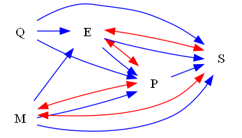
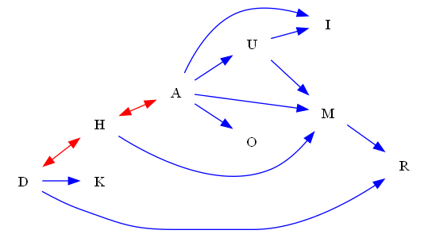

| Find All |How Many |Find One |Yes or No |Multiple Choice |Existence | total |
|:------:|:------:|:------:|:------:|:------:|:------:|:------:|
| 24 |24 |0 |24 |24 |24 | 120 |

|  N=4 | N=5 | N=6 | N=7 | N=8 | N=9 | total |
|:------:|:------:|:------:|:------:|:------:|:------:|:------:|
| 20 |20 |20 |20 |20 |20 | 120 |

|  Yes. | No. | judge_total |
|:------:|:------:|:------:|
| 25 |23 | 48 |

|  A | B | C | D | MC_total |
|:------:|:------:|:------:|:------:|:------:|
| 8 |3 |8 |5 | 24 |

## ID: 33390704
### Graph
- graph type: DAG
- description: Given a DAG (directed acyclic graph) with nodes P, O, R, C and directed edges O->R, P->C, P->O, P->R, R->C.

### Questions
- [FA] List all forks of this graph. 
- [HM] How many forks does this graph have? 
- [YN] Does nodes {C, O, R} form a chain in this graph? 
- [MC] Which of the following is a chain of this graph?\
A. ('P', 'O', 'C')\
B. ('P', 'O', 'R')\
C. ('O', 'R', 'C')\
D. ('P', 'R', 'C') 
- [EX] Are there any v-structure of this graph? 
### Answers
- [('P', 'O', 'C')]
- 1
- Yes.
- C
- No.
## ID: 69522288
### Graph
- graph type: DAG
- description: Given a DAG (directed acyclic graph) with nodes W, F, N, O and directed edges F->O, W->F, W->O, N->O, F->N.

### Questions
- [FA] List all chains of this graph. 
- [HM] How many v-structures does this graph have? 
- [YN] Does nodes {W, O, N} form a v-structure in this graph? 
- [MC] Which of the following is a v-structure of this graph?\
A. ('F', 'N', 'O')\
B. ('W', 'F', 'N')\
C. ('W', 'F', 'O')\
D. ('W', 'N', 'O') 
- [EX] Are there any chain of this graph? 
### Answers
- [('W', 'F', 'N')]
- 1
- Yes.
- D
- Yes.
## ID: 79004173
### Graph
- graph type: DAG
- description: Given a DAG (directed acyclic graph) with nodes P, A, R, T, I and directed edges A->R, A->I, A->T, P->I, P->A, P->T.

### Questions
- [FA] List all v-structures of this graph. 
- [HM] How many chains does this graph have? 
- [YN] Does nodes {T, R, A} form a chain in this graph? 
- [MC] Which of the following is a fork of this graph?\
A. ('P', 'R', 'I')\
B. ('P', 'A', 'I')\
C. ('A', 'R', 'I')\
D. ('P', 'A', 'R') 
- [EX] Are there any v-structure of this graph? 
### Answers
- []
- 1
- No.
- C
- No.
## ID: 44580810
### Graph
- graph type: DAG
- description: Given a DAG (directed acyclic graph) with nodes Y, S, T, K, C and directed edges Y->S, Y->K, S->T, T->C.

### Questions
- [FA] List all chains of this graph. 
- [HM] How many forks does this graph have? 
- [YN] Does nodes {S, K, Y} form a fork in this graph? 
- [MC] Which of the following is a chain of this graph?\
A. ('S', 'T', 'K')\
B. ('S', 'T', 'C')\
C. ('Y', 'T', 'C')\
D. ('Y', 'K', 'C') 
- [EX] Are there any v-structure of this graph? 
### Answers
- [('Y', 'S', 'T'), ('S', 'T', 'C')]
- 1
- Yes.
- B
- No.
## ID: 87956073
### Graph
- graph type: DAG
- description: Given a DAG (directed acyclic graph) with nodes E, J, G, H, Q, U and directed edges H->Q, E->U, E->G, E->J, J->U, G->H, G->Q, H->U, G->U.

### Questions
- [FA] List all forks of this graph. 
- [HM] How many v-structures does this graph have? 
- [YN] Does nodes {E, U, G} form a fork in this graph? 
- [MC] Which of the following is a v-structure of this graph?\
A. ('E', 'G', 'U')\
B. ('G', 'H', 'U')\
C. ('E', 'H', 'U')\
D. ('E', 'G', 'H') 
- [EX] Are there any fork of this graph? 
### Answers
- [('E', 'J', 'G'), ('G', 'Q', 'U'), ('H', 'Q', 'U')]
- 3
- No.
- C
- Yes.
## ID: 77836595
### Graph
- graph type: DAG
- description: Given a DAG (directed acyclic graph) with nodes I, J, V, Z, O, R and directed edges O->R, V->R, I->J, I->R, V->Z.

### Questions
- [FA] List all chains of this graph. 
- [HM] How many forks does this graph have? 
- [YN] Does nodes {Z, R, J} form a chain in this graph? 
- [MC] Which of the following is a v-structure of this graph?\
A. ('V', 'O', 'R')\
B. ('I', 'J', 'Z')\
C. ('V', 'Z', 'R')\
D. ('I', 'V', 'Z') 
- [EX] Are there any fork of this graph? 
### Answers
- []
- 2
- No.
- A
- Yes.
## ID: 70943182
### Graph
- graph type: DAG
- description: Given a DAG (directed acyclic graph) with nodes X, O, W, T, E, L, S and directed edges X->O, O->L, E->S, O->S, X->S, O->T, T->E, X->W, W->T.

### Questions
- [FA] List all forks of this graph. 
- [HM] How many forks does this graph have? 
- [YN] Does nodes {O, E, W} form a chain in this graph? 
- [MC] Which of the following is a v-structure of this graph?\
A. ('X', 'O', 'W')\
B. ('X', 'O', 'E')\
C. ('O', 'E', 'S')\
D. ('O', 'T', 'S') 
- [EX] Are there any fork of this graph? 
### Answers
- [('X', 'O', 'W'), ('X', 'W', 'S'), ('O', 'T', 'L'), ('O', 'T', 'S'), ('O', 'L', 'S')]
- 5
- No.
- C
- Yes.
## ID: 91091781
### Graph
- graph type: DAG
- description: Given a DAG (directed acyclic graph) with nodes H, A, K, J, N, Q, I and directed edges K->Q, H->Q, H->A, K->I, K->J, A->N, H->I, N->Q, A->Q, A->J.

### Questions
- [FA] List all chains of this graph. 
- [HM] How many chains does this graph have? 
- [YN] Does nodes {A, K, Q} form a fork in this graph? 
- [MC] Which of the following is a v-structure of this graph?\
A. ('A', 'N', 'I')\
B. ('H', 'A', 'K')\
C. ('A', 'K', 'Q')\
D. ('K', 'J', 'Q') 
- [EX] Are there any v-structure of this graph? 
### Answers
- [('H', 'A', 'J'), ('H', 'A', 'N')]
- 2
- No.
- C
- Yes.
## ID: 39171316
### Graph
- graph type: DAG
- description: Given a DAG (directed acyclic graph) with nodes D, W, F, X, C, J, M, Q and directed edges F->C, W->X, J->Q, F->M, W->F, D->C, F->X, D->Q, X->J, W->J.

### Questions
- [FA] List all v-structures of this graph. 
- [HM] How many forks does this graph have? 
- [YN] Does nodes {D, J, Q} form a v-structure in this graph? 
- [MC] Which of the following is a chain of this graph?\
A. ('D', 'C', 'M')\
B. ('W', 'C', 'J')\
C. ('W', 'F', 'M')\
D. ('X', 'J', 'M') 
- [EX] Are there any v-structure of this graph? 
### Answers
- [('D', 'F', 'C'), ('D', 'J', 'Q')]
- 5
- Yes.
- C
- Yes.
## ID: 65081707
### Graph
- graph type: DAG
- description: Given a DAG (directed acyclic graph) with nodes H, E, S, R, O, Z, L, V and directed edges R->V, O->L, H->S, O->V, R->O, E->S, E->R, E->Z, H->E.

### Questions
- [FA] List all v-structures of this graph. 
- [HM] How many forks does this graph have? 
- [YN] Does nodes {O, S, V} form a v-structure in this graph? 
- [MC] Which of the following is a chain of this graph?\
A. ('H', 'R', 'Z')\
B. ('Z', 'L', 'V')\
C. ('H', 'E', 'V')\
D. ('E', 'R', 'O') 
- [EX] Are there any v-structure of this graph? 
### Answers
- []
- 4
- No.
- D
- No.
## ID: 00121052
### Graph
- graph type: DAG
- description: Given a DAG (directed acyclic graph) with nodes L, I, S, G, V, X, M, Q, K and directed edges I->K, L->K, G->K, I->M, L->Q, V->M, V->X, L->S.

### Questions
- [FA] List all v-structures of this graph. 
- [HM] How many v-structures does this graph have? 
- [YN] Does nodes {K, G, I} form a v-structure in this graph? 
- [MC] Which of the following is a v-structure of this graph?\
A. ('L', 'I', 'K')\
B. ('V', 'X', 'M')\
C. ('S', 'V', 'K')\
D. ('I', 'G', 'M') 
- [EX] Are there any chain of this graph? 
### Answers
- [('L', 'I', 'K'), ('L', 'G', 'K'), ('I', 'G', 'K'), ('I', 'V', 'M')]
- 4
- Yes.
- A
- No.
## ID: 74214143
### Graph
- graph type: DAG
- description: Given a DAG (directed acyclic graph) with nodes V, A, K, I, E, B, W, M, S and directed edges E->M, K->E, W->M, A->K, V->E, V->M, B->S, V->I, V->B, I->W.

### Questions
- [FA] List all v-structures of this graph. 
- [HM] How many chains does this graph have? 
- [YN] Does nodes {B, I, V} form a fork in this graph? 
- [MC] Which of the following is a fork of this graph?\
A. ('V', 'B', 'M')\
B. ('K', 'B', 'M')\
C. ('I', 'W', 'M')\
D. ('V', 'K', 'M') 
- [EX] Are there any v-structure of this graph? 
### Answers
- [('V', 'K', 'E'), ('V', 'W', 'M'), ('E', 'W', 'M')]
- 5
- Yes.
- A
- Yes.
## ID: 06863344
### Graph
- graph type: ADMG
- description: Given an ADMG (acyclic directed mixed graph) with nodes J, F, L, N, directed edges J->F, F->L, J->N, L->N, J->L and bi-directed edges J<->L.

### Questions
- [FA] List all chains of this graph. 
- [HM] How many forks does this graph have? 
- [YN] Does nodes {J, F, L} form a fork in this graph? 
- [MC] Which of the following is a fork of this graph?\
A. ('J', 'F', 'N')\
B. ('J', 'F', 'L')\
C. ('F', 'L', 'N')\
D. ('J', 'L', 'N') 
- [EX] Are there any fork of this graph? 
### Answers
- [('F', 'L', 'N')]
- 1
- No.
- A
- Yes.
## ID: 64131556
### Graph
- graph type: ADMG
- description: Given an ADMG (acyclic directed mixed graph) with nodes C, I, E, O, directed edges E->O, I->E, C->O, C->E, C->I and bi-directed edges E<->O.

### Questions
- [FA] List all chains of this graph. 
- [HM] How many forks does this graph have? 
- [YN] Does nodes {I, O, C} form a fork in this graph? 
- [MC] Which of the following is a chain of this graph?\
A. ('C', 'I', 'E')\
B. ('C', 'E', 'O')\
C. ('C', 'I', 'O')\
D. ('I', 'E', 'O') 
- [EX] Are there any v-structure of this graph? 
### Answers
- [('I', 'E', 'O')]
- 1
- Yes.
- D
- No.
## ID: 88451344
### Graph
- graph type: ADMG
- description: Given an ADMG (acyclic directed mixed graph) with nodes Q, M, E, P, S, directed edges E->S, Q->E, P->S, E->P, Q->S, M->S, Q->P, M->E, M->P and bi-directed edges E<->S, M<->P, E<->P, M<->S.

### Questions
- [FA] List all chains of this graph. 
- [HM] How many chains does this graph have? 
- [YN] Does nodes {S, Q, M} form a v-structure in this graph? 
- [MC] Which of the following is a v-structure of this graph?\
A. ('M', 'E', 'P')\
B. ('Q', 'M', 'P')\
C. ('M', 'E', 'S')\
D. ('E', 'P', 'S') 
- [EX] Are there any v-structure of this graph? 
### Answers
- []
- 0
- Yes.
- B
- Yes.
## ID: 86704397
### Graph
- graph type: ADMG
- description: Given an ADMG (acyclic directed mixed graph) with nodes I, U, H, S, C, directed edges I->H, U->H, U->S, I->U, U->C, S->C, H->S, I->S and bi-directed edges I<->S, H<->S.

### Questions
- [FA] List all forks of this graph. 
- [HM] How many v-structures does this graph have? 
- [YN] Does nodes {H, U, C} form a fork in this graph? 
- [MC] Which of the following is a chain of this graph?\
A. ('U', 'S', 'C')\
B. ('I', 'S', 'C')\
C. ('U', 'H', 'S')\
D. ('I', 'U', 'H') 
- [EX] Are there any v-structure of this graph? 
### Answers
- [('U', 'H', 'C')]
- 0
- Yes.
- B
- No.
## ID: 63598140
### Graph
- graph type: ADMG
- description: Given an ADMG (acyclic directed mixed graph) with nodes D, Q, N, U, M, B, directed edges N->U, D->M, M->B, Q->M, D->U, Q->B, D->Q, U->B and bi-directed edges Q<->N, D<->B, Q<->B.

### Questions
- [FA] List all forks of this graph. 
- [HM] How many chains does this graph have? 
- [YN] Does nodes {Q, M, B} form a fork in this graph? 
- [MC] Which of the following is a v-structure of this graph?\
A. ('D', 'Q', 'B')\
B. ('D', 'U', 'M')\
C. ('Q', 'N', 'B')\
D. ('D', 'N', 'U') 
- [EX] Are there any v-structure of this graph? 
### Answers
- [('D', 'Q', 'U'), ('D', 'U', 'M')]
- 4
- No.
- D
- Yes.
## ID: 81774761
### Graph
- graph type: ADMG
- description: Given an ADMG (acyclic directed mixed graph) with nodes V, C, X, H, M, P, directed edges V->X, V->C, H->M, V->M, V->H, C->P, H->P, X->H, C->H, C->X and bi-directed edges V<->P, V<->H, C<->H, M<->P, X<->H.

### Questions
- [FA] List all forks of this graph. 
- [HM] How many v-structures does this graph have? 
- [YN] Does nodes {P, H, M} form a fork in this graph? 
- [MC] Which of the following is a chain of this graph?\
A. ('X', 'H', 'P')\
B. ('V', 'C', 'X')\
C. ('C', 'X', 'M')\
D. ('V', 'X', 'P') 
- [EX] Are there any v-structure of this graph? 
### Answers
- [('V', 'C', 'M'), ('V', 'X', 'M'), ('C', 'X', 'P'), ('H', 'M', 'P')]
- 0
- Yes.
- A
- No.
## ID: 10505504
### Graph
- graph type: ADMG
- description: Given an ADMG (acyclic directed mixed graph) with nodes U, W, C, R, E, L, Y, directed edges R->L, W->L, U->L, R->E, W->C, U->Y and bi-directed edges W<->C, E<->L.

### Questions
- [FA] List all v-structures of this graph. 
- [HM] How many v-structures does this graph have? 
- [YN] Does nodes {R, W, U} form a v-structure in this graph? 
- [MC] Which of the following is a fork of this graph?\
A. ('U', 'C', 'R')\
B. ('W', 'C', 'R')\
C. ('U', 'C', 'Y')\
D. ('R', 'E', 'L') 
- [EX] Are there any chain of this graph? 
### Answers
- [('U', 'W', 'L'), ('U', 'R', 'L'), ('W', 'R', 'L')]
- 3
- No.
- D
- No.
## ID: 39552335
### Graph
- graph type: ADMG
- description: Given an ADMG (acyclic directed mixed graph) with nodes R, W, T, C, G, H, N, directed edges C->H, W->H, C->N, W->T, C->G, R->T, T->N and bi-directed edges T<->G, T<->H.

### Questions
- [FA] List all chains of this graph. 
- [HM] How many chains does this graph have? 
- [YN] Does nodes {R, T, N} form a chain in this graph? 
- [MC] Which of the following is a fork of this graph?\
A. ('R', 'W', 'H')\
B. ('R', 'H', 'N')\
C. ('C', 'G', 'N')\
D. ('W', 'C', 'G') 
- [EX] Are there any v-structure of this graph? 
### Answers
- [('R', 'T', 'N'), ('W', 'T', 'N')]
- 2
- Yes.
- C
- Yes.
## ID: 49427403
### Graph
- graph type: ADMG
- description: Given an ADMG (acyclic directed mixed graph) with nodes Z, S, I, D, O, M, P, T, directed edges M->P, D->T, I->D, Z->S, S->I, I->M, D->O and bi-directed edges I<->T.

### Questions
- [FA] List all chains of this graph. 
- [HM] How many forks does this graph have? 
- [YN] Does nodes {T, Z, I} form a chain in this graph? 
- [MC] Which of the following is a fork of this graph?\
A. ('S', 'O', 'P')\
B. ('Z', 'I', 'P')\
C. ('D', 'O', 'T')\
D. ('O', 'M', 'P') 
- [EX] Are there any v-structure of this graph? 
### Answers
- [('Z', 'S', 'I'), ('S', 'I', 'D'), ('S', 'I', 'M'), ('I', 'D', 'O'), ('I', 'D', 'T'), ('I', 'M', 'P')]
- 2
- No.
- C
- No.
## ID: 74418242
### Graph
- graph type: ADMG
- description: Given an ADMG (acyclic directed mixed graph) with nodes U, Q, R, B, I, M, Z, Y, directed edges Q->M, I->Z, I->M, U->Y, Q->Y, U->M, U->B, R->M, R->Y and bi-directed edges U<->Y.

### Questions
- [FA] List all chains of this graph. 
- [HM] How many forks does this graph have? 
- [YN] Does nodes {I, Y, Z} form a v-structure in this graph? 
- [MC] Which of the following is a fork of this graph?\
A. ('R', 'M', 'Y')\
B. ('B', 'Z', 'Y')\
C. ('Q', 'R', 'Y')\
D. ('U', 'R', 'B') 
- [EX] Are there any chain of this graph? 
### Answers
- []
- 6
- No.
- A
- No.
## ID: 70109672
### Graph
- graph type: ADMG
- description: Given an ADMG (acyclic directed mixed graph) with nodes B, D, M, H, A, S, L, O, Z, directed edges M->O, D->L, H->L, B->A, M->Z, S->O, H->O, B->Z, H->S and bi-directed edges O<->Z, B<->M, B<->L.

### Questions
- [FA] List all chains of this graph. 
- [HM] How many chains does this graph have? 
- [YN] Does nodes {S, O, M} form a v-structure in this graph? 
- [MC] Which of the following is a fork of this graph?\
A. ('H', 'S', 'L')\
B. ('D', 'M', 'Z')\
C. ('M', 'S', 'O')\
D. ('M', 'H', 'Z') 
- [EX] Are there any chain of this graph? 
### Answers
- []
- 0
- Yes.
- A
- No.
## ID: 36844528
### Graph
- graph type: ADMG
- description: Given an ADMG (acyclic directed mixed graph) with nodes D, H, A, U, I, M, K, O, R, directed edges H->M, A->O, M->R, D->R, A->I, U->M, A->U, U->I, D->K, A->M and bi-directed edges D<->H, H<->A.

### Questions
- [FA] List all chains of this graph. 
- [HM] How many chains does this graph have? 
- [YN] Does nodes {R, M, A} form a chain in this graph? 
- [MC] Which of the following is a v-structure of this graph?\
A. ('H', 'A', 'M')\
B. ('U', 'K', 'O')\
C. ('D', 'O', 'R')\
D. ('D', 'H', 'R') 
- [EX] Are there any chain of this graph? 
### Answers
- [('H', 'M', 'R'), ('A', 'M', 'R'), ('U', 'M', 'R')]
- 3
- Yes.
- A
- Yes.
