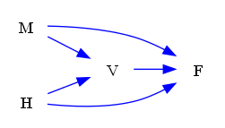
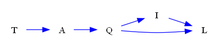
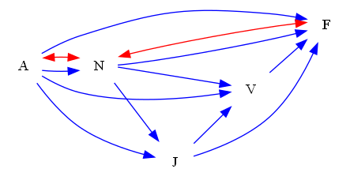
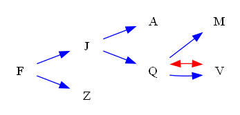

| Find All |How Many |Find One |Yes or No |Multiple Choice |Existence | total |
|:------:|:------:|:------:|:------:|:------:|:------:|:------:|
| 0 |0 |72 |24 |24 |12 | 132 |

|  N=4 | N=5 | N=6 | N=7 | N=8 | N=9 | total |
|:------:|:------:|:------:|:------:|:------:|:------:|:------:|
| 22 |22 |22 |22 |22 |22 | 132 |

|  Yes. | No. | judge_total |
|:------:|:------:|:------:|
| 17 |19 | 36 |

|  A | B | C | D | MC_total |
|:------:|:------:|:------:|:------:|:------:|
| 7 |4 |6 |7 | 24 |

## ID: 74089888
### Graph
- graph type: DAG
- description: Given a DAG (directed acyclic graph) with nodes M, H, V, F and directed edges M->F, V->F, H->V, M->V, H->F.

### Questions
- [FO] Find one valid backdoor adjustment set for treatment V and outcome F. 
- [FO] Find one minimal valid backdoor adjustment set for treatment V and outcome F. 
- [FO] Find one maximal valid backdoor adjustment set for treatment V and outcome F. 
- [YN] Is set() a valid backdoor adjustment set for treatment V and outcome F? 
- [MC] Which of the following sets is a valid backdoor adjustment set for treatment V and outcome F?\
A. {'M'}\
B. set()\
C. {'H'}\
D. {'M', 'H'} 
### Answers
- [{'M', 'H'}]
- {'M', 'H'}
- {'M', 'H'}
- No.
- D
## ID: 06569748
### Graph
- graph type: DAG
- description: Given a DAG (directed acyclic graph) with nodes X, V, Z, M and directed edges X->Z, V->Z, X->M, V->M, X->V.

### Questions
- [FO] Find one valid backdoor adjustment set for treatment V and outcome Z. 
- [FO] Find one minimal valid backdoor adjustment set for treatment V and outcome Z. 
- [FO] Find one maximal valid backdoor adjustment set for treatment V and outcome Z. 
- [YN] Is {'X'} a valid backdoor adjustment set for treatment V and outcome M? 
- [MC] Which of the following sets is a valid backdoor adjustment set for treatment V and outcome M?\
A. {'Z'}\
B. {'Z', 'X'}\
C. {'X'}\
D. set() 
### Answers
- [{'X'}]
- {'X'}
- {'X'}
- Yes.
- C
## ID: 03794006
### Graph
- graph type: DAG
- description: Given a DAG (directed acyclic graph) with nodes L, C, B, R, E and directed edges L->C, B->R, L->R, L->B, C->E, R->E.

### Questions
- [FO] Find one valid backdoor adjustment set for treatment B and outcome R. 
- [FO] Find one minimal valid backdoor adjustment set for treatment B and outcome R. 
- [FO] Find one maximal valid backdoor adjustment set for treatment B and outcome R. 
- [YN] Is {'E'} a valid backdoor adjustment set for treatment B and outcome R? 
- [MC] Which of the following sets is a valid backdoor adjustment set for treatment B and outcome R?\
A. {'E', 'C'}\
B. {'E', 'L'}\
C. {'L'}\
D. set() 
### Answers
- [{'L'}, {'C', 'L'}]
- {'L'}
- {'C', 'L'}
- No.
- C
## ID: 71494588
### Graph
- graph type: DAG
- description: Given a DAG (directed acyclic graph) with nodes T, A, Q, I, L and directed edges T->A, Q->L, Q->I, A->Q, I->L.

### Questions
- [FO] Find one valid backdoor adjustment set for treatment A and outcome Q. 
- [FO] Find one minimal valid backdoor adjustment set for treatment A and outcome Q. 
- [FO] Find one maximal valid backdoor adjustment set for treatment A and outcome Q. 
- [YN] Is {'T', 'L', 'A'} a valid backdoor adjustment set for treatment Q and outcome I? 
- [MC] Which of the following sets is a valid backdoor adjustment set for treatment Q and outcome I?\
A. {'L'}\
B. {'T', 'L'}\
C. set()\
D. {'T', 'L', 'A'} 
### Answers
- [set(), {'T'}]
- set()
- {'T'}
- No.
- C
## ID: 78082402
### Graph
- graph type: DAG
- description: Given a DAG (directed acyclic graph) with nodes P, X, K, W, L, N and directed edges P->L, K->L, P->N, K->N, W->N, L->N, P->X.

### Questions
- [FO] Find one valid backdoor adjustment set for treatment L and outcome N. 
- [FO] Find one minimal valid backdoor adjustment set for treatment L and outcome N. 
- [FO] Find one maximal valid backdoor adjustment set for treatment L and outcome N. 
- [YN] Is {'P', 'W', 'K'} a valid backdoor adjustment set for treatment L and outcome N? 
- [MC] Which of the following sets is a valid backdoor adjustment set for treatment L and outcome N?\
A. {'P', 'K'}\
B. {'P', 'W'}\
C. {'W', 'X'}\
D. {'K'} 
### Answers
- [{'P', 'K'}, {'P', 'W', 'K'}, {'P', 'K', 'X'}, {'P', 'W', 'K', 'X'}]
- {'P', 'K'}
- {'P', 'W', 'K', 'X'}
- Yes.
- A
## ID: 78917882
### Graph
- graph type: DAG
- description: Given a DAG (directed acyclic graph) with nodes Y, U, X, S, W, G and directed edges U->W, U->G, S->G, S->W, Y->W, Y->X, U->X, X->S, X->G, U->S, Y->U.

### Questions
- [FO] Find one valid backdoor adjustment set for treatment X and outcome W. 
- [FO] Find one minimal valid backdoor adjustment set for treatment X and outcome W. 
- [FO] Find one maximal valid backdoor adjustment set for treatment X and outcome W. 
- [YN] Is {'W', 'G', 'U'} a valid backdoor adjustment set for treatment X and outcome S? 
- [MC] Which of the following sets is a valid backdoor adjustment set for treatment X and outcome W?\
A. {'Y', 'U'}\
B. {'S', 'U'}\
C. set()\
D. {'G'} 
### Answers
- [{'Y', 'U'}]
- {'Y', 'U'}
- {'Y', 'U'}
- No.
- A
## ID: 29807252
### Graph
- graph type: DAG
- description: Given a DAG (directed acyclic graph) with nodes B, O, J, I, M, H, X and directed edges B->X, J->I, O->J, M->H, M->X, J->X, J->H, O->H, O->X, H->X, B->J, I->M.

### Questions
- [FO] Find one valid backdoor adjustment set for treatment I and outcome H. 
- [FO] Find one minimal valid backdoor adjustment set for treatment I and outcome H. 
- [FO] Find one maximal valid backdoor adjustment set for treatment I and outcome H. 
- [YN] Is {'B', 'O', 'H'} a valid backdoor adjustment set for treatment J and outcome X? 
- [MC] Which of the following sets is a valid backdoor adjustment set for treatment I and outcome M?\
A. {'O'}\
B. {'B', 'O', 'X'}\
C. {'J', 'O', 'X'}\
D. {'J', 'O', 'H'} 
### Answers
- [{'J'}, {'J', 'B'}, {'J', 'O'}, {'J', 'B', 'O'}]
- {'J'}
- {'J', 'B', 'O'}
- No.
- A
## ID: 30111585
### Graph
- graph type: DAG
- description: Given a DAG (directed acyclic graph) with nodes Z, H, Q, K, W, L, X and directed edges W->L, H->Q, L->X, Q->X, Q->L, H->K, Q->K, Z->Q, Z->H, Z->W, Q->W, K->W.

### Questions
- [FO] Find one valid backdoor adjustment set for treatment Q and outcome X. 
- [FO] Find one minimal valid backdoor adjustment set for treatment Q and outcome X. 
- [FO] Find one maximal valid backdoor adjustment set for treatment Q and outcome X. 
- [YN] Is {'Z'} a valid backdoor adjustment set for treatment H and outcome X? 
- [MC] Which of the following sets is a valid backdoor adjustment set for treatment W and outcome L?\
A. {'Z', 'X'}\
B. {'K', 'Q', 'Z', 'H', 'X'}\
C. {'X'}\
D. {'Z', 'H', 'Q'} 
### Answers
- [{'Z', 'H'}]
- {'Z', 'H'}
- {'Z', 'H'}
- Yes.
- D
## ID: 78064016
### Graph
- graph type: DAG
- description: Given a DAG (directed acyclic graph) with nodes N, U, P, O, L, X, C, D and directed edges U->D, L->C, X->C, N->X, P->C, L->X, O->L, N->D, N->L, C->D, O->D.

### Questions
- [FO] Find one valid backdoor adjustment set for treatment L and outcome D. 
- [FO] Find one minimal valid backdoor adjustment set for treatment L and outcome D. 
- [FO] Find one maximal valid backdoor adjustment set for treatment L and outcome D. 
- [YN] Is {'P', 'N', 'O', 'U', 'L'} a valid backdoor adjustment set for treatment X and outcome C? 
- [MC] Which of the following sets is a valid backdoor adjustment set for treatment C and outcome D?\
A. {'P', 'L', 'O'}\
B. {'P', 'X', 'N', 'U'}\
C. {'P', 'L', 'U'}\
D. {'P', 'L', 'X'} 
### Answers
- [{'O', 'N'}, {'P', 'O', 'N'}, {'O', 'N', 'U'}, {'P', 'O', 'N', 'U'}]
- {'O', 'N'}
- {'P', 'O', 'N', 'U'}
- Yes.
- D
## ID: 05280395
### Graph
- graph type: DAG
- description: Given a DAG (directed acyclic graph) with nodes A, H, V, O, T, W, F, N and directed edges H->F, W->F, A->V, H->N, T->N, H->T, T->F, A->O, A->T.

### Questions
- [FO] Find one valid backdoor adjustment set for treatment T and outcome N. 
- [FO] Find one minimal valid backdoor adjustment set for treatment T and outcome N. 
- [FO] Find one maximal valid backdoor adjustment set for treatment T and outcome N. 
- [YN] Is {'O', 'A'} a valid backdoor adjustment set for treatment T and outcome F? 
- [MC] Which of the following sets is a valid backdoor adjustment set for treatment T and outcome N?\
A. {'F', 'H', 'A'}\
B. {'W', 'H', 'A'}\
C. {'F'}\
D. {'W', 'V'} 
### Answers
- [{'H'}, {'V', 'H'}, {'H', 'O'}, {'H', 'A'}, {'W', 'H'}, {'V', 'H', 'O'}, {'A', 'V', 'H'}, {'W', 'V', 'H'}, {'H', 'A', 'O'}, {'W', 'H', 'O'}, {'W', 'H', 'A'}, {'A', 'V', 'H', 'O'}, {'W', 'V', 'H', 'O'}, {'A', 'W', 'V', 'H'}, {'W', 'H', 'A', 'O'}, {'V', 'H', 'O', 'A', 'W'}]
- {'H'}
- {'V', 'H', 'O', 'A', 'W'}
- No.
- B
## ID: 18307059
### Graph
- graph type: DAG
- description: Given a DAG (directed acyclic graph) with nodes N, I, B, M, O, K, W, A, C and directed edges I->M, M->O, N->A, M->K, O->W, N->O, K->C, N->B, O->A, M->A, B->M, I->K.

### Questions
- [FO] Find one valid backdoor adjustment set for treatment B and outcome K. 
- [FO] Find one minimal valid backdoor adjustment set for treatment B and outcome K. 
- [FO] Find one maximal valid backdoor adjustment set for treatment B and outcome K. 
- [YN] Is {'B', 'W'} a valid backdoor adjustment set for treatment M and outcome K? 
- [MC] Which of the following sets is a valid backdoor adjustment set for treatment B and outcome A?\
A. {'C', 'K', 'N', 'M', 'O'}\
B. {'C', 'I', 'K', 'N', 'W'}\
C. {'M', 'I', 'K', 'N'}\
D. {'I', 'N'} 
### Answers
- [set(), {'I'}, {'N'}, {'I', 'N'}]
- set()
- {'I', 'N'}
- No.
- D
## ID: 31163291
### Graph
- graph type: DAG
- description: Given a DAG (directed acyclic graph) with nodes Y, O, X, Z, V, W, R, N, B and directed edges O->W, X->V, O->R, Z->N, Z->V, O->N, Y->B, V->W, W->B.

### Questions
- [FO] Find one valid backdoor adjustment set for treatment V and outcome W. 
- [FO] Find one minimal valid backdoor adjustment set for treatment V and outcome W. 
- [FO] Find one maximal valid backdoor adjustment set for treatment V and outcome W. 
- [YN] Is {'W', 'X', 'Y'} a valid backdoor adjustment set for treatment V and outcome B? 
- [MC] Which of the following sets is a valid backdoor adjustment set for treatment V and outcome W?\
A. {'Z'}\
B. {'R', 'B', 'X', 'Y'}\
C. {'B', 'Y', 'R', 'Z', 'N'}\
D. {'R', 'B'} 
### Answers
- [set(), {'Y'}, {'R'}, {'Z'}, {'O'}, {'X'}, {'R', 'Y'}, {'Z', 'Y'}, {'O', 'Y'}, {'X', 'Y'}, {'R', 'Z'}, {'R', 'O'}, {'R', 'X'}, {'Z', 'N'}, {'Z', 'O'}, {'Z', 'X'}, {'O', 'N'}, {'O', 'X'}, {'R', 'Z', 'Y'}, {'R', 'O', 'Y'}, {'R', 'X', 'Y'}, {'Z', 'N', 'Y'}, {'Z', 'O', 'Y'}, {'Z', 'X', 'Y'}, {'O', 'N', 'Y'}, {'O', 'X', 'Y'}, {'R', 'Z', 'N'}, {'R', 'Z', 'O'}, {'R', 'Z', 'X'}, {'R', 'O', 'N'}, {'R', 'O', 'X'}, {'Z', 'O', 'N'}, {'X', 'Z', 'N'}, {'Z', 'O', 'X'}, {'X', 'O', 'N'}, {'R', 'Z', 'N', 'Y'}, {'R', 'Z', 'O', 'Y'}, {'R', 'Z', 'X', 'Y'}, {'R', 'O', 'N', 'Y'}, {'R', 'O', 'X', 'Y'}, {'Z', 'O', 'N', 'Y'}, {'X', 'Z', 'N', 'Y'}, {'Z', 'O', 'X', 'Y'}, {'X', 'O', 'N', 'Y'}, {'R', 'Z', 'O', 'N'}, {'R', 'Z', 'X', 'N'}, {'R', 'Z', 'O', 'X'}, {'R', 'O', 'N', 'X'}, {'X', 'Z', 'O', 'N'}, {'Y', 'R', 'Z', 'N', 'O'}, {'Y', 'R', 'Z', 'N', 'X'}, {'Y', 'R', 'Z', 'O', 'X'}, {'Y', 'R', 'N', 'O', 'X'}, {'Y', 'Z', 'N', 'O', 'X'}, {'R', 'Z', 'N', 'O', 'X'}, {'Y', 'R', 'Z', 'N', 'O', 'X'}]
- set()
- {'Y', 'R', 'Z', 'N', 'O', 'X'}
- No.
- A
## ID: 06995451
### Graph
- graph type: ADMG
- description: Given an ADMG (acyclic directed mixed graph) with nodes G, J, B, C, directed edges G->B, G->J, J->C, G->C, B->C, J->B and bi-directed edges B<->C, G<->B.

### Questions
- [FO] Find one valid backdoor adjustment set for treatment J and outcome B. 
- [FO] Find one minimal valid backdoor adjustment set for treatment J and outcome B. 
- [FO] Find one maximal valid backdoor adjustment set for treatment J and outcome B. 
- [YN] Is {'C', 'G'} a valid backdoor adjustment set for treatment J and outcome B? 
- [MC] Which of the following sets is a valid backdoor adjustment set for treatment J and outcome B?\
A. {'C', 'G'}\
B. set()\
C. {'C'}\
D. {'G'} 
- [EX] Does there exist a valid backdoor adjustment set for treatment B and outcome C? 
### Answers
- [{'G'}]
- {'G'}
- {'G'}
- No.
- D
- No.
## ID: 67147051
### Graph
- graph type: ADMG
- description: Given an ADMG (acyclic directed mixed graph) with nodes F, T, J, O, directed edges T->J, T->O, J->O, F->O, F->T, F->J and bi-directed edges F<->T, F<->J.

### Questions
- [FO] Find one valid backdoor adjustment set for treatment J and outcome O. 
- [FO] Find one minimal valid backdoor adjustment set for treatment J and outcome O. 
- [FO] Find one maximal valid backdoor adjustment set for treatment J and outcome O. 
- [YN] Is {'F'} a valid backdoor adjustment set for treatment J and outcome O? 
- [MC] Which of the following sets is a valid backdoor adjustment set for treatment J and outcome O?\
A. {'F', 'T'}\
B. set()\
C. {'F'}\
D. {'T'} 
- [EX] Does there exist a valid backdoor adjustment set for treatment J and outcome O? 
### Answers
- [{'F', 'T'}]
- {'F', 'T'}
- {'F', 'T'}
- No.
- A
- Yes.
## ID: 08245012
### Graph
- graph type: ADMG
- description: Given an ADMG (acyclic directed mixed graph) with nodes Y, V, G, N, L, directed edges G->L, V->N, Y->G, V->L and bi-directed edges Y<->L.

### Questions
- [FO] Find one valid backdoor adjustment set for treatment G and outcome L. 
- [FO] Find one minimal valid backdoor adjustment set for treatment G and outcome L. 
- [FO] Find one maximal valid backdoor adjustment set for treatment G and outcome L. 
- [YN] Is {'V'} a valid backdoor adjustment set for treatment G and outcome L? 
- [MC] Which of the following sets is a valid backdoor adjustment set for treatment G and outcome L?\
A. {'V', 'N'}\
B. {'V', 'Y'}\
C. {'V'}\
D. set() 
- [EX] Does there exist a valid backdoor adjustment set for treatment G and outcome L? 
### Answers
- [{'Y'}, {'V', 'Y'}, {'N', 'Y'}, {'V', 'N', 'Y'}]
- {'Y'}
- {'V', 'N', 'Y'}
- No.
- B
- Yes.
## ID: 70568578
### Graph
- graph type: ADMG
- description: Given an ADMG (acyclic directed mixed graph) with nodes A, N, J, V, F, directed edges A->V, A->F, N->V, N->J, A->J, J->V, N->F, V->F, A->N, J->F and bi-directed edges A<->N, N<->F.

### Questions
- [FO] Find one valid backdoor adjustment set for treatment V and outcome F. 
- [FO] Find one minimal valid backdoor adjustment set for treatment V and outcome F. 
- [FO] Find one maximal valid backdoor adjustment set for treatment V and outcome F. 
- [YN] Is {'F', 'V', 'A'} a valid backdoor adjustment set for treatment N and outcome J? 
- [MC] Which of the following sets is a valid backdoor adjustment set for treatment N and outcome V?\
A. {'A'}\
B. {'J'}\
C. set()\
D. {'J', 'A'} 
- [EX] Does there exist a valid backdoor adjustment set for treatment N and outcome F? 
### Answers
- [{'J', 'N', 'A'}]
- {'J', 'N', 'A'}
- {'J', 'N', 'A'}
- No.
- A
- No.
## ID: 47944566
### Graph
- graph type: ADMG
- description: Given an ADMG (acyclic directed mixed graph) with nodes L, R, S, E, J, G, directed edges R->G, J->G, E->J, R->E, L->S, L->J, L->G, E->G, L->R, S->G, R->S, S->E and bi-directed edges R<->J.

### Questions
- [FO] Find one valid backdoor adjustment set for treatment S and outcome G. 
- [FO] Find one minimal valid backdoor adjustment set for treatment S and outcome G. 
- [FO] Find one maximal valid backdoor adjustment set for treatment S and outcome G. 
- [YN] Is {'R'} a valid backdoor adjustment set for treatment S and outcome E? 
- [MC] Which of the following sets is a valid backdoor adjustment set for treatment E and outcome J?\
A. {'S'}\
B. {'R', 'S'}\
C. {'L'}\
D. {'L', 'S', 'G'} 
- [EX] Does there exist a valid backdoor adjustment set for treatment R and outcome S? 
### Answers
- [{'R', 'L'}]
- {'R', 'L'}
- {'R', 'L'}
- Yes.
- B
- Yes.
## ID: 63236981
### Graph
- graph type: ADMG
- description: Given an ADMG (acyclic directed mixed graph) with nodes K, Y, M, C, T, X, directed edges K->M, C->X, K->T, K->Y, C->T, M->T and bi-directed edges C<->X, M<->X, Y<->T, K<->T.

### Questions
- [FO] Find one valid backdoor adjustment set for treatment M and outcome T. 
- [FO] Find one minimal valid backdoor adjustment set for treatment M and outcome T. 
- [FO] Find one maximal valid backdoor adjustment set for treatment M and outcome T. 
- [YN] Is {'C', 'X', 'Y'} a valid backdoor adjustment set for treatment M and outcome T? 
- [MC] Which of the following sets is a valid backdoor adjustment set for treatment M and outcome T?\
A. set()\
B. {'Y'}\
C. {'C', 'K', 'Y'}\
D. {'C', 'X'} 
- [EX] Does there exist a valid backdoor adjustment set for treatment M and outcome T? 
### Answers
- [{'K'}, {'C', 'K'}, {'K', 'Y'}, {'C', 'K', 'X'}, {'C', 'K', 'Y'}, {'C', 'K', 'X', 'Y'}]
- {'K'}
- {'C', 'K', 'X', 'Y'}
- No.
- C
- Yes.
## ID: 53022153
### Graph
- graph type: ADMG
- description: Given an ADMG (acyclic directed mixed graph) with nodes Q, P, X, E, Z, B, Y, directed edges Z->Y, X->B, X->E, Q->X, Q->B, X->Y, Q->E, P->Z, E->Z, P->E, E->B, P->X and bi-directed edges P<->Z, B<->Y, X<->Z, Q<->E, X<->E.

### Questions
- [FO] Find one valid backdoor adjustment set for treatment E and outcome B. 
- [FO] Find one minimal valid backdoor adjustment set for treatment E and outcome B. 
- [FO] Find one maximal valid backdoor adjustment set for treatment E and outcome B. 
- [YN] Is {'P', 'E', 'X'} a valid backdoor adjustment set for treatment Z and outcome Y? 
- [MC] Which of the following sets is a valid backdoor adjustment set for treatment Z and outcome Y?\
A. {'P', 'E', 'B', 'Q'}\
B. {'P', 'E', 'Q'}\
C. {'E', 'B', 'X', 'Q'}\
D. {'P', 'B'} 
- [EX] Does there exist a valid backdoor adjustment set for treatment E and outcome B? 
### Answers
- [{'X', 'Q'}, {'P', 'X', 'Q'}]
- {'X', 'Q'}
- {'P', 'X', 'Q'}
- Yes.
- C
- Yes.
## ID: 21476212
### Graph
- graph type: ADMG
- description: Given an ADMG (acyclic directed mixed graph) with nodes F, J, A, Z, Q, M, V, directed edges J->Q, F->J, Q->V, F->Z, Q->M, J->A and bi-directed edges Q<->V.

### Questions
- [FO] Find one valid backdoor adjustment set for treatment J and outcome A. 
- [FO] Find one minimal valid backdoor adjustment set for treatment J and outcome A. 
- [FO] Find one maximal valid backdoor adjustment set for treatment J and outcome A. 
- [YN] Is {'Z', 'V', 'Q'} a valid backdoor adjustment set for treatment J and outcome M? 
- [MC] Which of the following sets is a valid backdoor adjustment set for treatment J and outcome A?\
A. {'Z', 'V', 'Q'}\
B. {'F'}\
C. {'M', 'V'}\
D. {'F', 'Z', 'M', 'Q'} 
- [EX] Does there exist a valid backdoor adjustment set for treatment Q and outcome V? 
### Answers
- [set(), {'F'}, {'Z'}, {'F', 'Z'}]
- set()
- {'F', 'Z'}
- No.
- B
- No.
## ID: 42317369
### Graph
- graph type: ADMG
- description: Given an ADMG (acyclic directed mixed graph) with nodes J, Z, V, F, N, T, H, B, directed edges N->T, J->V, J->N, T->H, Z->F, F->N, F->T, Z->N, N->H, J->Z, N->B and bi-directed edges Z<->V, V<->H, T<->B, Z<->H, Z<->F, Z<->N, Z<->B.

### Questions
- [FO] Find one valid backdoor adjustment set for treatment T and outcome H. 
- [FO] Find one minimal valid backdoor adjustment set for treatment T and outcome H. 
- [FO] Find one maximal valid backdoor adjustment set for treatment T and outcome H. 
- [YN] Is {'F', 'J', 'N'} a valid backdoor adjustment set for treatment T and outcome H? 
- [MC] Which of the following sets is a valid backdoor adjustment set for treatment T and outcome H?\
A. {'F', 'Z', 'B', 'J'}\
B. {'Z', 'V'}\
C. {'F', 'Z', 'V', 'N'}\
D. {'F', 'Z', 'B', 'V'} 
- [EX] Does there exist a valid backdoor adjustment set for treatment F and outcome B? 
### Answers
- [{'F', 'N'}, {'F', 'V', 'N'}, {'F', 'J', 'N'}, {'F', 'Z', 'N'}, {'F', 'J', 'V', 'N'}, {'F', 'Z', 'V', 'N'}, {'F', 'Z', 'J', 'N'}, {'F', 'V', 'J', 'Z', 'N'}]
- {'F', 'N'}
- {'F', 'V', 'J', 'Z', 'N'}
- Yes.
- C
- No.
## ID: 68063599
### Graph
- graph type: ADMG
- description: Given an ADMG (acyclic directed mixed graph) with nodes X, C, L, S, W, J, I, F, directed edges L->J, S->W, I->F, L->I, C->J, L->W, L->S, C->F, X->F, X->L and bi-directed edges X<->L, X<->I, W<->F, L<->I, C<->I.

### Questions
- [FO] Find one valid backdoor adjustment set for treatment S and outcome W. 
- [FO] Find one minimal valid backdoor adjustment set for treatment S and outcome W. 
- [FO] Find one maximal valid backdoor adjustment set for treatment S and outcome W. 
- [YN] Is set() a valid backdoor adjustment set for treatment L and outcome W? 
- [MC] Which of the following sets is a valid backdoor adjustment set for treatment I and outcome F?\
A. {'J', 'W', 'L', 'S'}\
B. {'J', 'C', 'W', 'S'}\
C. {'C', 'S'}\
D. {'C', 'S', 'J', 'L', 'W', 'X'} 
- [EX] Does there exist a valid backdoor adjustment set for treatment L and outcome S? 
### Answers
- [{'L'}, {'F', 'L'}, {'C', 'L'}, {'I', 'L'}, {'J', 'L'}, {'L', 'X'}, {'F', 'C', 'L'}, {'F', 'I', 'L'}, {'F', 'J', 'L'}, {'F', 'L', 'X'}, {'C', 'I', 'L'}, {'J', 'C', 'L'}, {'C', 'L', 'X'}, {'J', 'I', 'L'}, {'I', 'L', 'X'}, {'J', 'L', 'X'}, {'F', 'C', 'I', 'L'}, {'F', 'C', 'J', 'L'}, {'F', 'C', 'L', 'X'}, {'F', 'J', 'I', 'L'}, {'F', 'I', 'L', 'X'}, {'F', 'J', 'L', 'X'}, {'J', 'C', 'I', 'L'}, {'C', 'I', 'L', 'X'}, {'J', 'C', 'L', 'X'}, {'J', 'I', 'L', 'X'}, {'F', 'C', 'I', 'J', 'L'}, {'F', 'C', 'I', 'L', 'X'}, {'F', 'C', 'J', 'L', 'X'}, {'F', 'I', 'J', 'L', 'X'}, {'C', 'I', 'J', 'L', 'X'}, {'F', 'C', 'I', 'J', 'L', 'X'}]
- {'L'}
- {'F', 'C', 'I', 'J', 'L', 'X'}
- Yes.
- D
- Yes.
## ID: 58825043
### Graph
- graph type: ADMG
- description: Given an ADMG (acyclic directed mixed graph) with nodes E, Q, H, I, O, N, B, J, R, directed edges E->N, O->N, I->R, I->N, E->O, B->J, N->R, H->B, Q->B, E->B, O->J and bi-directed edges Q<->B, N<->B, B<->R, J<->R, I<->N, N<->R.

### Questions
- [FO] Find one valid backdoor adjustment set for treatment O and outcome R. 
- [FO] Find one minimal valid backdoor adjustment set for treatment O and outcome R. 
- [FO] Find one maximal valid backdoor adjustment set for treatment O and outcome R. 
- [YN] Is {'E', 'B', 'I', 'H'} a valid backdoor adjustment set for treatment O and outcome J? 
- [MC] Which of the following sets is a valid backdoor adjustment set for treatment O and outcome N?\
A. {'I', 'Q'}\
B. {'H'}\
C. {'J', 'H'}\
D. {'E', 'B', 'H', 'Q'} 
- [EX] Does there exist a valid backdoor adjustment set for treatment O and outcome R? 
### Answers
- [{'E'}, {'E', 'B'}, {'E', 'I'}, {'E', 'Q'}, {'E', 'H'}, {'E', 'B', 'I'}, {'E', 'B', 'Q'}, {'E', 'B', 'H'}, {'E', 'I', 'Q'}, {'E', 'I', 'H'}, {'E', 'H', 'Q'}, {'E', 'B', 'I', 'Q'}, {'E', 'B', 'I', 'H'}, {'E', 'B', 'H', 'Q'}, {'E', 'I', 'H', 'Q'}, {'B', 'I', 'Q', 'E', 'H'}]
- {'E'}
- {'B', 'I', 'Q', 'E', 'H'}
- Yes.
- D
- Yes.
## ID: 17486923
### Graph
- graph type: ADMG
- description: Given an ADMG (acyclic directed mixed graph) with nodes J, K, D, L, N, G, A, M, Q, directed edges N->A, D->G, K->L, N->M, M->Q, L->A, J->L, A->M, N->Q, L->G, D->N, J->G and bi-directed edges J<->Q, J<->G, J<->N, K<->L, L<->A, K<->G, N<->Q, L<->M.

### Questions
- [FO] Find one valid backdoor adjustment set for treatment M and outcome Q. 
- [FO] Find one minimal valid backdoor adjustment set for treatment M and outcome Q. 
- [FO] Find one maximal valid backdoor adjustment set for treatment M and outcome Q. 
- [YN] Is {'G', 'Q'} a valid backdoor adjustment set for treatment N and outcome M? 
- [MC] Which of the following sets is a valid backdoor adjustment set for treatment N and outcome A?\
A. {'J', 'D'}\
B. {'K', 'J', 'M', 'G', 'L'}\
C. {'Q', 'J', 'M', 'G', 'L'}\
D. {'J', 'L', 'D', 'Q'} 
- [EX] Does there exist a valid backdoor adjustment set for treatment N and outcome A? 
### Answers
- [{'J', 'N'}, {'J', 'K', 'N'}, {'J', 'N', 'D'}, {'J', 'N', 'A'}, {'J', 'L', 'N'}, {'J', 'K', 'N', 'D'}, {'J', 'K', 'N', 'A'}, {'J', 'L', 'K', 'N'}, {'J', 'A', 'N', 'D'}, {'J', 'L', 'N', 'D'}, {'J', 'L', 'N', 'A'}, {'K', 'J', 'N', 'D', 'A'}, {'K', 'J', 'N', 'D', 'L'}, {'K', 'J', 'N', 'A', 'L'}, {'J', 'N', 'D', 'A', 'L'}, {'K', 'J', 'N', 'D', 'A', 'L'}]
- {'J', 'N'}
- {'K', 'J', 'N', 'D', 'A', 'L'}
- No.
- A
- Yes.
