| Find All |How Many |Find One |Yes or No |Multiple Choice |Existence | total |
|:------:|:------:|:------:|:------:|:------:|:------:|:------:|
| 24 |24 |48 |24 |24 |0 | 144 |

|  N=4 | N=5 | N=6 | N=7 | N=8 | N=9 | total |
|:------:|:------:|:------:|:------:|:------:|:------:|:------:|
| 24 |24 |24 |24 |24 |24 | 144 |

|  Yes. | No. | judge_total |
|:------:|:------:|:------:|
| 11 |13 | 24 |

|  A | B | C | D | MC_total |
|:------:|:------:|:------:|:------:|:------:|
| 7 |8 |7 |2 | 24 |

## ID: 72212724
### Graph
- graph type: DAG
- description: Given a DAG (directed acyclic graph) with nodes V, W, L, A and directed edges W->A, V->W, W->L, V->A, L->A.

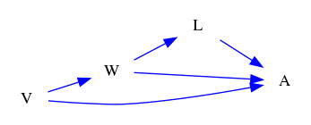
### Questions
- [FA] Find all backdoor paths from node L to node A. 
- [HM] How many backdoor paths are from node L to node A. 
- [FO] Find the shortest backdoor path from node L to node A. 
- [FO] Find the longest backdoor path from node L to node A. 
- [MC] Which of the following is a backdoor path from W to L?\
A. W->A<-L\
B. W<-V->A<-L\
C. W<-A<->V->L\
D. W->L 
- [YN] Is W<-V->A a backdoor path from W to A? 
### Answers
- ['L<-W->A', 'L<-W<-V->A']
- 2
- L<-W->A
- L<-W<-V->A
- B
- Yes.
## ID: 38635416
### Graph
- graph type: DAG
- description: Given a DAG (directed acyclic graph) with nodes Q, N, F, K and directed edges Q->F, Q->N, N->F, N->K, Q->K.

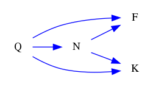
### Questions
- [FA] Find all backdoor paths from node N to node F. 
- [HM] How many backdoor paths are from node N to node K. 
- [FO] Find the shortest backdoor path from node N to node K. 
- [FO] Find the longest backdoor path from node N to node K. 
- [MC] Which of the following is a backdoor path from N to K?\
A. N<-Q->K\
B. N->F<-Q->K\
C. N->K\
D. N<->Q<->F<-K 
- [YN] Is N<-Q->K a backdoor path from N to K? 
### Answers
- ['N<-Q->F']
- 1
- N<-Q->K
- N<-Q->K
- A
- Yes.
## ID: 41720728
### Graph
- graph type: DAG
- description: Given a DAG (directed acyclic graph) with nodes B, D, T, K, G and directed edges T->K, B->G, T->G, D->K, B->D, D->T.

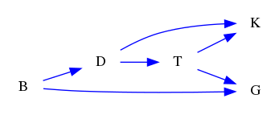
### Questions
- [FA] Find all backdoor paths from node D to node G. 
- [HM] How many backdoor paths are from node T to node G. 
- [FO] Find the shortest backdoor path from node D to node T. 
- [FO] Find the longest backdoor path from node D to node T. 
- [MC] Which of the following is a backdoor path from D to T?\
A. D<->B<->K<-T\
B. D<-B->G<-T\
C. D->K<-T\
D. D->T 
- [YN] Is D<-B->G<-T a backdoor path from D to T? 
### Answers
- ['D<-B->G']
- 1
- D<-B->G<-T
- D<-B->G<-T
- B
- Yes.
## ID: 22376943
### Graph
- graph type: DAG
- description: Given a DAG (directed acyclic graph) with nodes P, M, I, X, R and directed edges I->R, I->X, M->X, P->M, P->I.

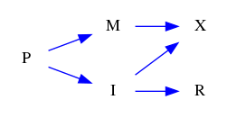
### Questions
- [FA] Find all backdoor paths from node M to node X. 
- [HM] How many backdoor paths are from node M to node X. 
- [FO] Find the shortest backdoor path from node I to node X. 
- [FO] Find the longest backdoor path from node I to node X. 
- [MC] Which of the following is a backdoor path from I to X?\
A. I<-P->M->X\
B. I->X\
C. I<->R->X\
D. I<->M<->P<->X 
- [YN] Is I->R a backdoor path from I to R? 
### Answers
- ['M<-P->I->X']
- 1
- I<-P->M->X
- I<-P->M->X
- A
- No.
## ID: 27014256
### Graph
- graph type: DAG
- description: Given a DAG (directed acyclic graph) with nodes G, X, U, H, O, S and directed edges X->U, G->O, U->S, O->S, X->S, G->H, G->X, G->U, U->O.

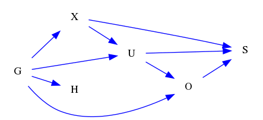
### Questions
- [FA] Find all backdoor paths from node O to node S. 
- [HM] How many backdoor paths are from node X to node U. 
- [FO] Find the shortest backdoor path from node X to node O. 
- [FO] Find the longest backdoor path from node X to node O. 
- [MC] Which of the following is a backdoor path from U to S?\
A. U->O<-G->X->S\
B. U->S\
C. U<-G->X->S\
D. U->O->S 
- [YN] Is X<-G->U->O a backdoor path from X to O? 
### Answers
- ['O<-U->S', 'O<-G->U->S', 'O<-G->X->S', 'O<-U<-X->S', 'O<-G->U<-X->S', 'O<-G->X->U->S', 'O<-U<-G->X->S']
- 3
- X<-G->O
- X<-G->U->S<-O
- C
- Yes.
## ID: 30902466
### Graph
- graph type: DAG
- description: Given a DAG (directed acyclic graph) with nodes D, Y, Q, P, C, L and directed edges C->L, D->L, D->Y, Q->P, Y->C, Y->P, P->L, D->C.

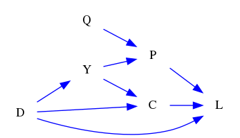
### Questions
- [FA] Find all backdoor paths from node P to node L. 
- [HM] How many backdoor paths are from node C to node L. 
- [FO] Find the shortest backdoor path from node C to node L. 
- [FO] Find the longest backdoor path from node C to node L. 
- [MC] Which of the following is a backdoor path from Y to C?\
A. Y->P->L<-D->C\
B. Y->C\
C. Y->P->L<-C\
D. Y<-D->L<-C 
- [YN] Is Y->P a backdoor path from Y to P? 
### Answers
- ['P<-Y<-D->L', 'P<-Y->C->L', 'P<-Y<-D->C->L', 'P<-Y->C<-D->L']
- 4
- C<-D->L
- C<-D->Y->P->L
- D
- No.
## ID: 95745142
### Graph
- graph type: DAG
- description: Given a DAG (directed acyclic graph) with nodes S, A, P, V, H, L, G and directed edges S->H, P->G, A->L, P->L, L->G, A->P, V->L, H->L, P->H, V->H, V->G, A->G.

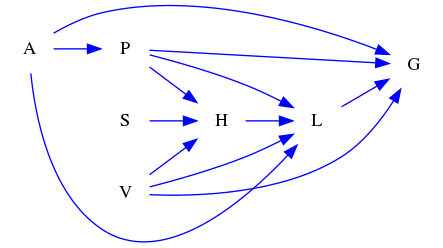
### Questions
- [FA] Find all backdoor paths from node H to node G. 
- [HM] How many backdoor paths are from node P to node H. 
- [FO] Find the shortest backdoor path from node P to node G. 
- [FO] Find the longest backdoor path from node P to node G. 
- [MC] Which of the following is a backdoor path from L to G?\
A. L->A<-H->P<-V<-G\
B. L<-V->H<-P<-A->G\
C. L<->S<-V->P<->G\
D. L->G 
- [YN] Is P->H->L<-V->G a backdoor path from P to G? 
### Answers
- ['H<-V->G', 'H<-P->G', 'H<-V->L->G', 'H<-P->L->G', 'H<-P<-A->G', 'H<-V->L<-P->G', 'H<-V->L<-A->G', 'H<-P->L<-V->G', 'H<-P->L<-A->G', 'H<-P<-A->L->G', 'H<-V->L<-P<-A->G', 'H<-V->L<-A->P->G', 'H<-P<-A->L<-V->G']
- 7
- P<-A->G
- P<-A->L<-H<-V->G
- B
- No.
## ID: 15286643
### Graph
- graph type: DAG
- description: Given a DAG (directed acyclic graph) with nodes I, L, Z, G, T, K, R and directed edges L->G, Z->T, T->R, L->R, K->R, Z->K, T->K, I->L, Z->R, Z->G, L->T, I->T.

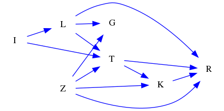
### Questions
- [FA] Find all backdoor paths from node L to node T. 
- [HM] How many backdoor paths are from node L to node G. 
- [FO] Find the shortest backdoor path from node T to node R. 
- [FO] Find the longest backdoor path from node T to node R. 
- [MC] Which of the following is a backdoor path from L to R?\
A. L->G<-Z->K->R\
B. L->G<-Z->K<-T->R\
C. L<-I->T<-Z->K->R\
D. L->G<-Z->T->K->R 
- [YN] Is K->R a backdoor path from K to R? 
### Answers
- ['L<-I->T']
- 5
- T<-Z->R
- T<-I->L->G<-Z->K->R
- C
- No.
## ID: 43606949
### Graph
- graph type: DAG
- description: Given a DAG (directed acyclic graph) with nodes U, N, W, Y, T, L, B, C and directed edges U->T, U->W, W->L, N->C, N->B, U->B, N->L, Y->B, T->L, L->B, B->C.

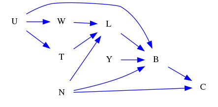
### Questions
- [FA] Find all backdoor paths from node L to node C. 
- [HM] How many backdoor paths are from node T to node C. 
- [FO] Find the shortest backdoor path from node T to node C. 
- [FO] Find the longest backdoor path from node T to node C. 
- [MC] Which of the following is a backdoor path from L to C?\
A. L->B<-N->C\
B. L<->W->B->N<->T<-C\
C. L<-W<-U->B<-N->C\
D. L->B->C 
- [YN] Is L->B a backdoor path from L to B? 
### Answers
- ['L<-N->C', 'L<-N->B->C', 'L<-W<-U->B->C', 'L<-T<-U->B->C', 'L<-W<-U->B<-N->C', 'L<-T<-U->B<-N->C']
- 7
- T<-U->B->C
- T<-U->W->L->B<-N->C
- C
- No.
## ID: 54234933
### Graph
- graph type: DAG
- description: Given a DAG (directed acyclic graph) with nodes K, V, Z, D, O, I, B, M and directed edges K->D, O->B, K->I, D->M, V->O, K->Z, K->V, D->O.

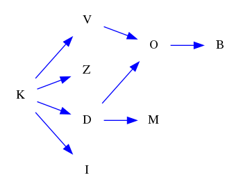
### Questions
- [FA] Find all backdoor paths from node V to node O. 
- [HM] How many backdoor paths are from node D to node B. 
- [FO] Find the shortest backdoor path from node V to node O. 
- [FO] Find the longest backdoor path from node V to node O. 
- [MC] Which of the following is a backdoor path from V to B?\
A. V<->M->K<-D<-O->B\
B. V<-K->D->O->B\
C. V<-Z<->B\
D. V->O->B 
- [YN] Is V->O a backdoor path from V to O? 
### Answers
- ['V<-K->D->O']
- 1
- V<-K->D->O
- V<-K->D->O
- B
- No.
## ID: 88416959
### Graph
- graph type: DAG
- description: Given a DAG (directed acyclic graph) with nodes C, Y, X, K, U, O, W, B, L and directed edges Y->O, C->U, Y->L, X->O, Y->K, Y->X, O->W, X->B, C->X, K->B, U->W, Y->B.

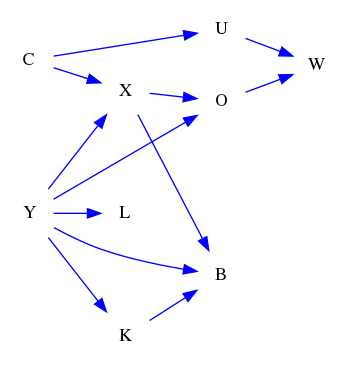
### Questions
- [FA] Find all backdoor paths from node O to node W. 
- [HM] How many backdoor paths are from node U to node W. 
- [FO] Find the shortest backdoor path from node U to node W. 
- [FO] Find the longest backdoor path from node U to node W. 
- [MC] Which of the following is a backdoor path from X to W?\
A. X->B<-K<-Y->O->W\
B. X<-C->U->W\
C. X->B<-Y->O->W\
D. X->O->W 
- [YN] Is X->B<-K<-Y->O->W a backdoor path from X to W? 
### Answers
- ['O<-X<-C->U->W', 'O<-Y->X<-C->U->W', 'O<-Y->B<-X<-C->U->W', 'O<-Y->K->B<-X<-C->U->W']
- 4
- U<-C->X->O->W
- U<-C->X->B<-K<-Y->O->W
- B
- No.
## ID: 72179857
### Graph
- graph type: DAG
- description: Given a DAG (directed acyclic graph) with nodes N, K, T, Q, M, U, W, P, X and directed edges M->U, N->W, Q->X, Q->P, N->K, N->T, Q->U, T->M, N->Q.

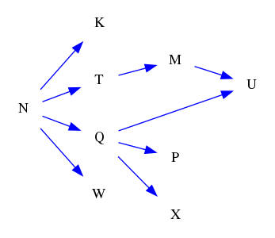
### Questions
- [FA] Find all backdoor paths from node M to node U. 
- [HM] How many backdoor paths are from node Q to node U. 
- [FO] Find the shortest backdoor path from node T to node M. 
- [FO] Find the longest backdoor path from node T to node M. 
- [MC] Which of the following is a backdoor path from T to M?\
A. T<-N->Q->U<-M\
B. T<->U<-Q->N<-W<-X<-M\
C. T<-U<-P<->X<->N->Q<->K<-W<-M\
D. T->M 
- [YN] Is T<-N->Q->U<-M a backdoor path from T to M? 
### Answers
- ['M<-T<-N->Q->U']
- 1
- T<-N->Q->U<-M
- T<-N->Q->U<-M
- A
- Yes.
## ID: 53270121
### Graph
- graph type: ADMG
- description: Given an ADMG (acyclic directed mixed graph) with nodes G, K, U, L, directed edges G->L, G->U, G->K, U->L and bi-directed edges K<->L.

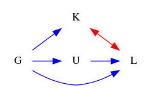
### Questions
- [FA] Find all backdoor paths from node U to node L. 
- [HM] How many backdoor paths are from node U to node L. 
- [FO] Find the shortest backdoor path from node U to node L. 
- [FO] Find the longest backdoor path from node U to node L. 
- [MC] Which of the following is a backdoor path from U to L?\
A. U->L\
B. U<->K->L\
C. U<-G->K<->L\
D. U<-G<->K<-L 
- [YN] Is U<-G->L a backdoor path from U to L? 
### Answers
- ['U<-G->L', 'U<-G->K<->L']
- 2
- U<-G->L
- U<-G->K<->L
- C
- Yes.
## ID: 83914130
### Graph
- graph type: ADMG
- description: Given an ADMG (acyclic directed mixed graph) with nodes K, F, V, C, directed edges F->C, K->F, V->C and bi-directed edges K<->C.

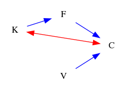
### Questions
- [FA] Find all backdoor paths from node F to node C. 
- [HM] How many backdoor paths are from node F to node C. 
- [FO] Find the shortest backdoor path from node F to node C. 
- [FO] Find the longest backdoor path from node F to node C. 
- [MC] Which of the following is a backdoor path from F to C?\
A. F<-K<->C\
B. F->C\
C. F->V<->C\
D. F<->K->V<->C 
- [YN] Is F->C a backdoor path from F to C? 
### Answers
- ['F<-K<->C']
- 1
- F<-K<->C
- F<-K<->C
- A
- No.
## ID: 79360393
### Graph
- graph type: ADMG
- description: Given an ADMG (acyclic directed mixed graph) with nodes V, D, W, N, F, directed edges W->N, D->F, V->D, V->F, W->F, D->W, V->W, V->N, D->N and bi-directed edges D<->F, W<->N, D<->N.

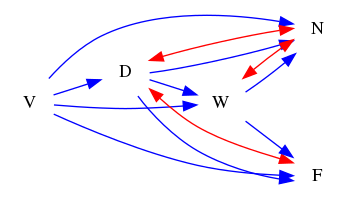
### Questions
- [FA] Find all backdoor paths from node D to node F. 
- [HM] How many backdoor paths are from node D to node F. 
- [FO] Find the shortest backdoor path from node W to node F. 
- [FO] Find the longest backdoor path from node W to node F. 
- [MC] Which of the following is a backdoor path from W to N?\
A. W->F<->D<-V->N\
B. W<-V->N\
C. W->F<-V->D<->N\
D. W->F<-V->D->N 
- [YN] Is D<-V->F<-W a backdoor path from D to W? 
### Answers
- ['D<->F', 'D<-V->F', 'D<->N<-W->F', 'D<->N<->W->F', 'D<->N<-V->F', 'D<-V->W->F', 'D<->N<-W<-V->F', 'D<->N<->W<-V->F', 'D<->N<-V->W->F', 'D<-V->N<-W->F', 'D<-V->N<->W->F']
- 11
- W<-D->F
- W<-V->N<->D<->F
- B
- Yes.
## ID: 17115292
### Graph
- graph type: ADMG
- description: Given an ADMG (acyclic directed mixed graph) with nodes U, V, H, R, Z, directed edges H->Z, U->H, H->R, V->Z, U->Z, V->H, U->R, R->Z, V->R, U->V and bi-directed edges H<->Z, U<->Z, V<->R, U<->R.

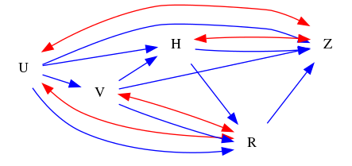
### Questions
- [FA] Find all backdoor paths from node R to node Z. 
- [HM] How many backdoor paths are from node V to node R. 
- [FO] Find the shortest backdoor path from node V to node Z. 
- [FO] Find the longest backdoor path from node V to node Z. 
- [MC] Which of the following is a backdoor path from H to Z?\
A. H<-U->V->Z\
B. H->R<->V<-U<->Z\
C. H->R<->V->Z\
D. H->R<->V<-U->Z 
- [YN] Is V<-U->R<-H a backdoor path from V to H? 
### Answers
- ['R<-U->Z', 'R<-U<->Z', 'R<->U->Z', 'R<->U<->Z', 'R<-V->Z', 'R<->V->Z', 'R<-H->Z', 'R<-H<->Z', 'R<-U->V->Z', 'R<-U->H->Z', 'R<-U->H<->Z', 'R<->U->V->Z', 'R<->U->H->Z', 'R<->U->H<->Z', 'R<-V<-U->Z', 'R<-V<-U<->Z', 'R<-V->H->Z', 'R<-V->H<->Z', 'R<->V<-U->Z', 'R<->V<-U<->Z', 'R<->V->H->Z', 'R<->V->H<->Z', 'R<-H<-U->Z', 'R<-H<-U<->Z', 'R<-H<-V->Z', 'R<-U->V->H->Z', 'R<-U->V->H<->Z', 'R<-U->H<-V->Z', 'R<->U->V->H->Z', 'R<->U->V->H<->Z', 'R<->U->H<-V->Z', 'R<-V<-U->H->Z', 'R<-V<-U->H<->Z', 'R<-V->H<-U->Z', 'R<-V->H<-U<->Z', 'R<->V<-U->H->Z', 'R<->V<-U->H<->Z', 'R<->V->H<-U->Z', 'R<->V->H<-U<->Z', 'R<-H<-U->V->Z', 'R<-H<-V<-U->Z', 'R<-H<-V<-U<->Z']
- 12
- V<-U->Z
- V<->R<->U->H<->Z
- A
- Yes.
## ID: 55364731
### Graph
- graph type: ADMG
- description: Given an ADMG (acyclic directed mixed graph) with nodes Y, B, G, L, S, M, directed edges B->M, L->S, Y->S, B->L, B->S, G->S, B->G, Y->G, Y->M, S->M and bi-directed edges Y<->G.

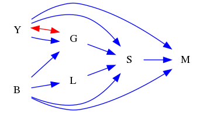
### Questions
- [FA] Find all backdoor paths from node L to node S. 
- [HM] How many backdoor paths are from node L to node S. 
- [FO] Find the shortest backdoor path from node S to node M. 
- [FO] Find the longest backdoor path from node S to node M. 
- [MC] Which of the following is a backdoor path from S to M?\
A. S->M\
B. S<-L<-B->G<-Y->M\
C. S<->L<-M\
D. S<-B->Y->L<-G->M 
- [YN] Is G->S a backdoor path from G to S? 
### Answers
- ['L<-B->S', 'L<-B->G->S', 'L<-B->M<-S', 'L<-B->G<-Y->S', 'L<-B->G<->Y->S', 'L<-B->M<-Y->S', 'L<-B->G<-Y->M<-S', 'L<-B->G<->Y->M<-S', 'L<-B->M<-Y->G->S', 'L<-B->M<-Y<->G->S']
- 10
- S<-B->M
- S<-L<-B->G<->Y->M
- B
- No.
## ID: 75224824
### Graph
- graph type: ADMG
- description: Given an ADMG (acyclic directed mixed graph) with nodes B, O, A, I, W, E, directed edges B->E, I->E, O->I, B->A, O->A, A->I, A->W, A->E, O->E, I->W, B->O, B->W and bi-directed edges O<->A, B<->E.

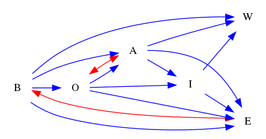
### Questions
- [FA] Find all backdoor paths from node I to node W. 
- [HM] How many backdoor paths are from node O to node A. 
- [FO] Find the shortest backdoor path from node O to node I. 
- [FO] Find the longest backdoor path from node O to node I. 
- [MC] Which of the following is a backdoor path from O to I?\
A. O->E<-B->A->W<-I\
B. O->A->W<-B->E<-I\
C. O->E<->B->A->W<-I\
D. O<->A->I 
- [YN] Is I<-O->E<->B->W a backdoor path from I to W? 
### Answers
- ['I<-A->W', 'I<-A<-B->W', 'I<-O<-B->W', 'I<-O->A->W', 'I<-O<->A->W', 'I<-A->E<-B->W', 'I<-A->E<->B->W', 'I<-A<-O<-B->W', 'I<-A<->O<-B->W', 'I<-O->E<-B->W', 'I<-O->E<->B->W', 'I<-O->E<-A->W', 'I<-O<-B->A->W', 'I<-O->A<-B->W', 'I<-O<->A<-B->W', 'I<-A->E<-O<-B->W', 'I<-A<-O->E<-B->W', 'I<-A<-O->E<->B->W', 'I<-A<->O->E<-B->W', 'I<-A<->O->E<->B->W', 'I<-O->E<-B->A->W', 'I<-O->E<->B->A->W', 'I<-O->E<-A<-B->W', 'I<-O<-B->E<-A->W', 'I<-O<-B<->E<-A->W', 'I<-O->A->E<-B->W', 'I<-O->A->E<->B->W', 'I<-O<->A->E<-B->W', 'I<-O<->A->E<->B->W']
- 11
- O<->A->I
- O<->A->W<-B<->E<-I
- D
- Yes.
## ID: 50835326
### Graph
- graph type: ADMG
- description: Given an ADMG (acyclic directed mixed graph) with nodes G, C, P, K, H, R, O, directed edges H->R, C->H, P->R, P->K, C->P, C->O, G->O, P->H, C->K, K->R, H->O, P->O and bi-directed edges C<->R, G<->R.

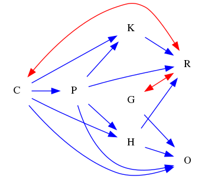
### Questions
- [FA] Find all backdoor paths from node P to node R. 
- [HM] How many backdoor paths are from node P to node K. 
- [FO] Find the shortest backdoor path from node P to node R. 
- [FO] Find the longest backdoor path from node P to node R. 
- [MC] Which of the following is a backdoor path from H to O?\
A. H->R<-K<-P->O\
B. H->R<-K<-C->O\
C. H<-C<->R<-K<-P->O\
D. H->R<-P->O 
- [YN] Is H->O<-C->P->K->R a backdoor path from H to R? 
### Answers
- ['P<-C<->R', 'P<-C->K->R', 'P<-C->H->R', 'P<-C->O<-G<->R', 'P<-C->O<-H->R', 'P<-C->H->O<-G<->R']
- 6
- P<-C<->R
- P<-C->H->O<-G<->R
- C
- No.
## ID: 02928234
### Graph
- graph type: ADMG
- description: Given an ADMG (acyclic directed mixed graph) with nodes Q, E, X, Y, M, N, H, directed edges E->Y, Q->Y, X->M, E->X, Q->E, Y->M, Q->N, Q->M, E->N, Q->H, N->H and bi-directed edges Q<->Y, E<->Y, X<->M.

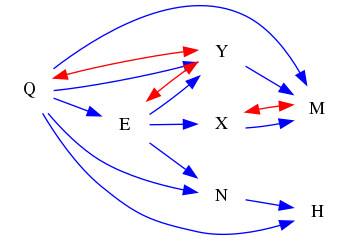
### Questions
- [FA] Find all backdoor paths from node X to node M. 
- [HM] How many backdoor paths are from node E to node H. 
- [FO] Find the shortest backdoor path from node N to node H. 
- [FO] Find the longest backdoor path from node N to node H. 
- [MC] Which of the following is a backdoor path from E to H?\
A. E<->Y<->Q->H\
B. E->Y->M<-Q->H\
C. E->X->M<-Y<-Q->N->H\
D. E->X<->M<-Y<->Q->H 
- [YN] Is E->Y<-Q->N a backdoor path from E to N? 
### Answers
- ['X<->M', 'X<-E<-Q->M', 'X<-E->Y->M', 'X<-E<->Y->M', 'X<-E<-Q->Y->M', 'X<-E<-Q<->Y->M', 'X<-E->Y<-Q->M', 'X<-E->Y<->Q->M', 'X<-E<->Y<-Q->M', 'X<-E<->Y<->Q->M', 'X<-E->N<-Q->M', 'X<-E->N<-Q->Y->M', 'X<-E->N<-Q<->Y->M', 'X<-E->N->H<-Q->M', 'X<-E->N->H<-Q->Y->M', 'X<-E->N->H<-Q<->Y->M']
- 8
- N<-Q->H
- N<-E->X<->M<-Y<->Q->H
- A
- No.
## ID: 90551758
### Graph
- graph type: ADMG
- description: Given an ADMG (acyclic directed mixed graph) with nodes M, R, D, U, I, P, E, Z, directed edges R->Z, D->Z, I->P, E->Z, M->U, M->Z, U->Z, I->Z, D->P, M->E and bi-directed edges U<->P, M<->E.

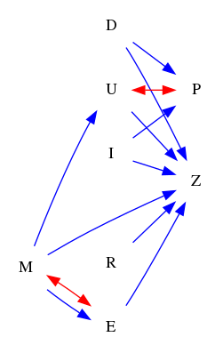
### Questions
- [FA] Find all backdoor paths from node E to node Z. 
- [HM] How many backdoor paths are from node E to node Z. 
- [FO] Find the shortest backdoor path from node U to node Z. 
- [FO] Find the longest backdoor path from node U to node Z. 
- [MC] Which of the following is a backdoor path from U to Z?\
A. U<-I->D<-P<->E<->M<-R<->Z\
B. U->Z\
C. U<-M->E->Z\
D. U<->R->I<-M->Z 
- [YN] Is U<-M->Z a backdoor path from U to Z? 
### Answers
- ['E<-M->Z', 'E<->M->Z', 'E<-M->U->Z', 'E<->M->U->Z', 'E<-M->U<->P<-D->Z', 'E<-M->U<->P<-I->Z', 'E<->M->U<->P<-D->Z', 'E<->M->U<->P<-I->Z']
- 8
- U<-M->Z
- U<->P<-D->Z
- C
- Yes.
## ID: 62087386
### Graph
- graph type: ADMG
- description: Given an ADMG (acyclic directed mixed graph) with nodes K, A, Y, M, I, S, D, R, directed edges A->I, K->M, A->D, D->R, A->Y, M->S, K->S, Y->M, S->R, A->S, Y->D and bi-directed edges Y<->R, D<->R, A<->Y, A<->S, K<->Y, I<->S, A<->D.

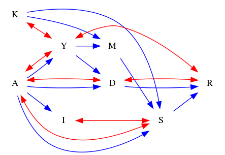
### Questions
- [FA] Find all backdoor paths from node Y to node R. 
- [HM] How many backdoor paths are from node M to node S. 
- [FO] Find the shortest backdoor path from node S to node R. 
- [FO] Find the longest backdoor path from node S to node R. 
- [MC] Which of the following is a backdoor path from Y to R?\
A. Y<->K->M->S<->A->D<->R\
B. Y->M<-K->S<->I<-A<->D->R\
C. Y->M->S<-A->D->R\
D. Y->M<-K->S<-A<->D->R 
- [YN] Is Y<->A->S a backdoor path from Y to S? 
### Answers
- ['Y<->R', 'Y<->K->S->R', 'Y<-A->D->R', 'Y<-A->D<->R', 'Y<-A<->D->R', 'Y<-A<->D<->R', 'Y<-A->S->R', 'Y<-A<->S->R', 'Y<->A->D->R', 'Y<->A->D<->R', 'Y<->A<->D->R', 'Y<->A<->D<->R', 'Y<->A->S->R', 'Y<->A<->S->R', 'Y<->K->M->S->R', 'Y<-A->I<->S->R', 'Y<->A->I<->S->R', 'Y<->K->S<-A->D->R', 'Y<->K->S<-A->D<->R', 'Y<->K->S<-A<->D->R', 'Y<->K->S<-A<->D<->R', 'Y<->K->S<->A->D->R', 'Y<->K->S<->A->D<->R', 'Y<->K->S<->A<->D->R', 'Y<->K->S<->A<->D<->R', 'Y<->K->S<->I<-A->D->R', 'Y<->K->S<->I<-A->D<->R', 'Y<->K->S<->I<-A<->D->R', 'Y<->K->S<->I<-A<->D<->R', 'Y<->K->M->S<-A->D->R', 'Y<->K->M->S<-A->D<->R', 'Y<->K->M->S<-A<->D->R', 'Y<->K->M->S<-A<->D<->R', 'Y<->K->M->S<->A->D->R', 'Y<->K->M->S<->A->D<->R', 'Y<->K->M->S<->A<->D->R', 'Y<->K->M->S<->A<->D<->R', 'Y<->K->M->S<->I<-A->D->R', 'Y<->K->M->S<->I<-A->D<->R', 'Y<->K->M->S<->I<-A<->D->R', 'Y<->K->M->S<->I<-A<->D<->R']
- 72
- S<-A->D->R
- S<-M<-K<->Y<->A<->D<->R
- A
- Yes.
## ID: 71298855
### Graph
- graph type: ADMG
- description: Given an ADMG (acyclic directed mixed graph) with nodes C, N, I, O, X, K, R, P, Q, directed edges O->K, N->P, X->Q, O->P, C->O, K->R, N->Q, I->Q, X->R, I->X, R->P, X->P and bi-directed edges O<->R.

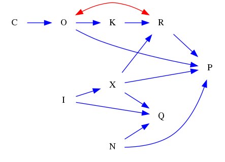
### Questions
- [FA] Find all backdoor paths from node O to node P. 
- [HM] How many backdoor paths are from node O to node P. 
- [FO] Find the shortest backdoor path from node K to node R. 
- [FO] Find the longest backdoor path from node K to node R. 
- [MC] Which of the following is a backdoor path from R to P?\
A. R->K->Q<->I<->X->C<->N->O->P\
B. R<-X->P\
C. R<->X<->C<->I<->O<-Q->P\
D. R->P 
- [YN] Is K->R a backdoor path from K to R? 
### Answers
- ['O<->R->P', 'O<->R<-X->P', 'O<->R<-X->Q<-N->P', 'O<->R<-X<-I->Q<-N->P']
- 4
- K<-O<->R
- K<-O->P<-N->Q<-I->X->R
- B
- No.
## ID: 32299919
### Graph
- graph type: ADMG
- description: Given an ADMG (acyclic directed mixed graph) with nodes N, B, P, H, X, D, J, L, K, directed edges J->K, B->L, B->D, H->D, N->P, P->K, P->X, N->D, N->B, N->H and bi-directed edges X<->D, B<->J.

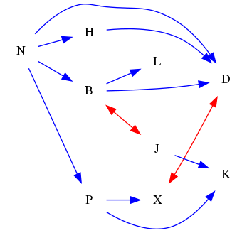
### Questions
- [FA] Find all backdoor paths from node B to node D. 
- [HM] How many backdoor paths are from node H to node D. 
- [FO] Find the shortest backdoor path from node P to node X. 
- [FO] Find the longest backdoor path from node P to node X. 
- [MC] Which of the following is a backdoor path from B to D?\
A. B<-X->P->N->K<->H->L<->J<->D\
B. B<->N<-H<-J<-P->K<-L<-X<->D\
C. B<-N->P->X<->D\
D. B->D 
- [YN] Is B->D a backdoor path from B to D? 
### Answers
- ['B<-N->D', 'B<-N->H->D', 'B<-N->P->X<->D', 'B<->J->K<-P->X<->D', 'B<->J->K<-P<-N->D', 'B<->J->K<-P<-N->H->D']
- 5
- P<-N->D<->X
- P<-N->B->D<->X
- C
- No.
