| Find All |How Many |Find One |Yes or No |Multiple Choice |Existence | total |
|:------:|:------:|:------:|:------:|:------:|:------:|:------:|
| 0 |0 |72 |36 |36 |0 | 144 |

|  N=4 | N=5 | N=6 | N=7 | N=8 | N=9 | total |
|:------:|:------:|:------:|:------:|:------:|:------:|:------:|
| 24 |24 |24 |24 |24 |24 | 144 |

|  Yes. | No. | judge_total |
|:------:|:------:|:------:|
| 19 |17 | 36 |

|  A | B | C | D | MC_total |
|:------:|:------:|:------:|:------:|:------:|
| 11 |7 |8 |10 | 36 |

## ID: 33847625
### Graph
- graph type: DAG
- description: Given a DAG (directed acyclic graph) with nodes K, S, H, O and directed edges K->O, S->O, K->H, H->O, S->H, K->S.

### Questions
- [FO] Find one valid nodeset that can block path S->O<-H. 
- [FO] Find the minimal nodeset that can block path S->O<-H. 
- [YN] Can path K->S->O<-H be blocked by nodeset {'S'}? 
- [MC] Which of the following nodesets can block path K->H<-S?\
A. set()\
B. {'O'}\
C. {'H', 'O'}\
D. {'H'} 
### Answers
- [set(), {'K'}]
- set()
- Yes.
- A
## ID: 51186770
### Graph
- graph type: DAG
- description: Given a DAG (directed acyclic graph) with nodes V, D, U, F and directed edges V->U, U->F, D->U, V->F, V->D, D->F.

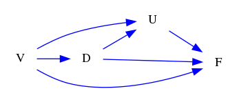
### Questions
- [FO] Find one valid nodeset that can block path V->D->F<-U. 
- [FO] Find the minimal nodeset that can block path V->D->F<-U. 
- [YN] Can path U<-V->D->F be blocked by nodeset {'D'}? 
- [MC] Which of the following nodesets can block path V->U<-D?\
A. {'U'}\
B. set()\
C. {'F', 'U'}\
D. {'F'} 
### Answers
- [set(), {'D'}, {'D', 'F'}]
- set()
- Yes.
- B
## ID: 37881010
### Graph
- graph type: DAG
- description: Given a DAG (directed acyclic graph) with nodes Z, W, N, H and directed edges W->N, N->H, Z->H, W->H, Z->W, Z->N.

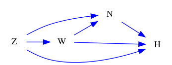
### Questions
- [FO] Find one valid nodeset that can block path N<-Z->W->H. 
- [FO] Find the minimal nodeset that can block path N<-Z->W->H. 
- [YN] Can path Z->N->H<-W be blocked by nodeset {'H', 'N'}? 
- [MC] Which of the following nodesets can block path Z->N<-W?\
A. {'H', 'N'}\
B. set()\
C. {'H'}\
D. {'N'} 
### Answers
- [{'Z'}, {'W'}, {'Z', 'W'}]
- {'Z'}
- Yes.
- B
## ID: 08322039
### Graph
- graph type: DAG
- description: Given a DAG (directed acyclic graph) with nodes N, V, C, G, Z and directed edges C->G, G->Z, V->Z, V->G, N->G.

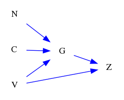
### Questions
- [FO] Find one valid nodeset that can block path V->Z<-G. 
- [FO] Find the minimal nodeset that can block path V->Z<-G. 
- [YN] Can path C->G<-V->Z be blocked by nodeset {'G', 'N'}? 
- [MC] Which of the following nodesets can block path C->G->Z?\
A. {'G', 'N'}\
B. {'V', 'N'}\
C. {'N'}\
D. {'V'} 
### Answers
- [set(), {'C'}, {'N'}, {'C', 'N'}]
- set()
- No.
- A
## ID: 44924149
### Graph
- graph type: DAG
- description: Given a DAG (directed acyclic graph) with nodes F, L, D, U, Y and directed edges L->U, F->L, L->D, F->U, D->Y, F->D.

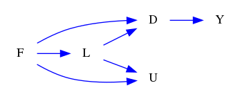
### Questions
- [FO] Find one valid nodeset that can block path F->L->D->Y. 
- [FO] Find the minimal nodeset that can block path F->L->D->Y. 
- [YN] Can path F->U<-L be blocked by nodeset {'Y'}? 
- [MC] Which of the following nodesets can block path F->D<-L->U?\
A. {'Y'}\
B. {'D', 'Y'}\
C. {'D'}\
D. set() 
### Answers
- [{'D'}, {'L'}, {'D', 'L'}, {'D', 'U'}, {'L', 'U'}, {'D', 'L', 'U'}]
- {'D'}
- Yes.
- D
## ID: 04394897
### Graph
- graph type: DAG
- description: Given a DAG (directed acyclic graph) with nodes E, B, O, W, Z and directed edges E->B, E->Z, B->W, E->W, W->Z, E->O.

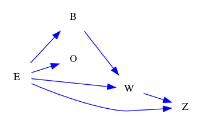
### Questions
- [FO] Find one valid nodeset that can block path E->Z<-W<-B. 
- [FO] Find the minimal nodeset that can block path E->Z<-W<-B. 
- [YN] Can path E->B->W->Z be blocked by nodeset {'B', 'W', 'O'}? 
- [MC] Which of the following nodesets can block path E->B->W?\
A. {'B', 'O'}\
B. {'O'}\
C. {'Z'}\
D. {'Z', 'O'} 
### Answers
- [set(), {'W'}, {'O'}, {'Z', 'W'}, {'W', 'O'}, {'Z', 'W', 'O'}]
- set()
- Yes.
- A
## ID: 68039197
### Graph
- graph type: DAG
- description: Given a DAG (directed acyclic graph) with nodes B, L, C, D, K, M and directed edges L->D, L->M, B->L, K->M, B->K, C->M, L->C, C->D, L->K, D->K, C->K, B->D.

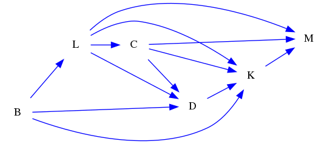
### Questions
- [FO] Find one valid nodeset that can block path L<-B->K->M<-C. 
- [FO] Find the minimal nodeset that can block path L<-B->K->M<-C. 
- [YN] Can path B->D->K<-L->C->M be blocked by nodeset set()? 
- [MC] Which of the following nodesets can block path K<-L->M?\
A. {'L', 'C', 'B'}\
B. {'D'}\
C. {'D', 'C', 'B'}\
D. {'C', 'B'} 
### Answers
- [set(), {'D'}, {'B'}, {'K'}, {'M', 'B'}, {'M', 'K'}, {'D', 'B'}, {'D', 'K'}, {'B', 'K'}, {'M', 'D', 'B'}, {'M', 'D', 'K'}, {'M', 'B', 'K'}, {'D', 'B', 'K'}, {'M', 'D', 'B', 'K'}]
- set()
- Yes.
- A
## ID: 74423004
### Graph
- graph type: DAG
- description: Given a DAG (directed acyclic graph) with nodes Z, O, I, S, G, T and directed edges I->G, I->S, Z->G, G->T, O->I.

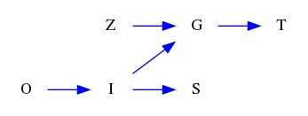
### Questions
- [FO] Find one valid nodeset that can block path I->G->T. 
- [FO] Find the minimal nodeset that can block path I->G->T. 
- [YN] Can path O->I->G be blocked by nodeset {'I', 'Z', 'S', 'T'}? 
- [MC] Which of the following nodesets can block path O->I->G->T?\
A. {'S'}\
B. {'I', 'Z', 'G'}\
C. {'Z', 'S'}\
D. {'Z'} 
### Answers
- [{'G'}, {'G', 'Z'}, {'G', 'S'}, {'G', 'O'}, {'G', 'Z', 'S'}, {'G', 'Z', 'O'}, {'G', 'S', 'O'}, {'G', 'Z', 'S', 'O'}]
- {'G'}
- Yes.
- B
## ID: 99746588
### Graph
- graph type: DAG
- description: Given a DAG (directed acyclic graph) with nodes L, K, R, C, Y, U and directed edges C->Y, C->U, R->Y, L->C, R->C, L->R, L->U, K->R, K->C, Y->U, L->K.

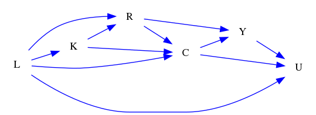
### Questions
- [FO] Find one valid nodeset that can block path R->Y<-C<-K<-L->U. 
- [FO] Find the minimal nodeset that can block path R->Y<-C<-K<-L->U. 
- [YN] Can path L->U<-Y<-R->C be blocked by nodeset {'K', 'U', 'Y'}? 
- [MC] Which of the following nodesets can block path L->C<-R<-K?\
A. {'C', 'U'}\
B. {'U', 'Y'}\
C. {'R'}\
D. {'C'} 
### Answers
- [set(), {'L'}, {'C'}, {'K'}, {'L', 'Y'}, {'C', 'Y'}, {'K', 'Y'}, {'L', 'C'}, {'L', 'K'}, {'C', 'K'}, {'L', 'C', 'Y'}, {'L', 'K', 'Y'}, {'C', 'K', 'Y'}, {'L', 'C', 'K'}, {'L', 'C', 'K', 'Y'}]
- set()
- Yes.
- C
## ID: 94842928
### Graph
- graph type: DAG
- description: Given a DAG (directed acyclic graph) with nodes F, Q, J, E, G, N, T and directed edges E->T, E->N, Q->J, G->T, F->T, G->N, F->J.

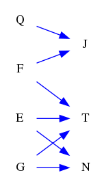
### Questions
- [FO] Find one valid nodeset that can block path E->T<-G->N. 
- [FO] Find the minimal nodeset that can block path E->T<-G->N. 
- [YN] Can path G->N<-E->T be blocked by nodeset {'J', 'N'}? 
- [MC] Which of the following nodesets can block path E->N<-G->T?\
A. {'N'}\
B. {'J', 'F', 'N'}\
C. {'G', 'Q'}\
D. {'F', 'N', 'Q'} 
### Answers
- [set(), {'G'}, {'Q'}, {'J'}, {'F'}, {'G', 'Q'}, {'J', 'G'}, {'G', 'F'}, {'G', 'T'}, {'J', 'Q'}, {'F', 'Q'}, {'J', 'F'}, {'J', 'G', 'Q'}, {'G', 'F', 'Q'}, {'G', 'T', 'Q'}, {'J', 'G', 'F'}, {'J', 'G', 'T'}, {'G', 'F', 'T'}, {'J', 'F', 'Q'}, {'J', 'G', 'F', 'Q'}, {'J', 'G', 'T', 'Q'}, {'G', 'F', 'T', 'Q'}, {'J', 'G', 'F', 'T'}, {'G', 'Q', 'J', 'F', 'T'}]
- set()
- No.
- C
## ID: 15987908
### Graph
- graph type: DAG
- description: Given a DAG (directed acyclic graph) with nodes J, A, D, C, H, R, W and directed edges J->H, D->C, J->W, C->R, A->D, A->H, D->R.

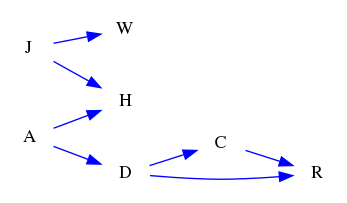
### Questions
- [FO] Find one valid nodeset that can block path A->D->C->R. 
- [FO] Find the minimal nodeset that can block path A->D->C->R. 
- [YN] Can path C<-D->R be blocked by nodeset {'A'}? 
- [MC] Which of the following nodesets can block path A->D->R<-C?\
A. {'R'}\
B. {'J', 'H', 'R'}\
C. {'D', 'H', 'J', 'R'}\
D. {'J', 'H', 'W', 'R'} 
### Answers
- [{'D'}, {'C'}, {'D', 'H'}, {'D', 'W'}, {'D', 'J'}, {'D', 'C'}, {'H', 'C'}, {'W', 'C'}, {'J', 'C'}, {'D', 'H', 'W'}, {'D', 'H', 'J'}, {'D', 'H', 'C'}, {'D', 'W', 'J'}, {'D', 'W', 'C'}, {'D', 'C', 'J'}, {'H', 'W', 'C'}, {'J', 'H', 'C'}, {'J', 'W', 'C'}, {'D', 'H', 'W', 'J'}, {'D', 'H', 'W', 'C'}, {'D', 'H', 'C', 'J'}, {'D', 'W', 'J', 'C'}, {'J', 'H', 'W', 'C'}, {'D', 'H', 'W', 'J', 'C'}]
- {'D'}
- No.
- C
## ID: 14558094
### Graph
- graph type: DAG
- description: Given a DAG (directed acyclic graph) with nodes G, M, B, X, N, V, J and directed edges G->X, G->V, B->V, N->J, M->N, M->B, G->N, G->M, B->X, M->V.

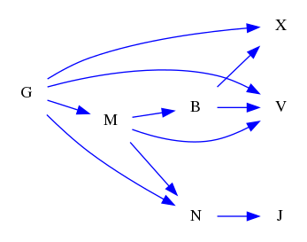
### Questions
- [FO] Find one valid nodeset that can block path G->V<-B<-M->N. 
- [FO] Find the minimal nodeset that can block path G->V<-B<-M->N. 
- [YN] Can path M->N<-G->X<-B be blocked by nodeset {'X', 'J', 'N'}? 
- [MC] Which of the following nodesets can block path B<-M<-G->V?\
A. {'X'}\
B. {'N'}\
C. {'M', 'X', 'G'}\
D. {'J'} 
### Answers
- [set(), {'B'}, {'M'}, {'X'}, {'J'}, {'M', 'B'}, {'X', 'B'}, {'V', 'B'}, {'J', 'B'}, {'M', 'X'}, {'M', 'V'}, {'M', 'J'}, {'X', 'J'}, {'M', 'X', 'B'}, {'M', 'V', 'B'}, {'M', 'J', 'B'}, {'X', 'V', 'B'}, {'X', 'J', 'B'}, {'J', 'V', 'B'}, {'M', 'X', 'V'}, {'M', 'X', 'J'}, {'M', 'J', 'V'}, {'M', 'X', 'V', 'B'}, {'M', 'X', 'J', 'B'}, {'M', 'J', 'V', 'B'}, {'X', 'V', 'J', 'B'}, {'M', 'X', 'V', 'J'}, {'B', 'M', 'V', 'J', 'X'}]
- set()
- No.
- C
## ID: 86225333
### Graph
- graph type: DAG
- description: Given a DAG (directed acyclic graph) with nodes W, J, M, Y, F, V, C, G and directed edges C->G, F->V, J->C, W->J, W->G, J->Y, J->F, W->V, J->V, W->Y, M->C, M->G.

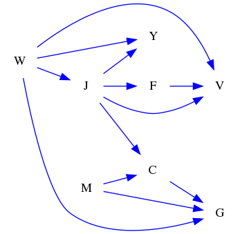
### Questions
- [FO] Find one valid nodeset that can block path W->V<-J->C. 
- [FO] Find the minimal nodeset that can block path W->V<-J->C. 
- [YN] Can path W->V<-F<-J->C->G be blocked by nodeset {'V', 'Y'}? 
- [MC] Which of the following nodesets can block path J->V<-W->Y?\
A. {'V', 'F', 'W'}\
B. {'M', 'V', 'G', 'F'}\
C. {'V', 'G', 'F', 'C'}\
D. {'M', 'V', 'C'} 
### Answers
- [set(), {'G'}, {'M'}, {'J'}, {'F'}, {'Y'}, {'M', 'G'}, {'J', 'G'}, {'G', 'F'}, {'G', 'Y'}, {'M', 'J'}, {'M', 'F'}, {'M', 'Y'}, {'J', 'V'}, {'J', 'F'}, {'J', 'Y'}, {'F', 'Y'}, {'M', 'J', 'G'}, {'M', 'G', 'F'}, {'M', 'G', 'Y'}, {'V', 'G', 'J'}, {'J', 'G', 'F'}, {'J', 'G', 'Y'}, {'G', 'F', 'Y'}, {'M', 'J', 'V'}, {'M', 'J', 'F'}, {'M', 'J', 'Y'}, {'M', 'F', 'Y'}, {'J', 'V', 'F'}, {'J', 'V', 'Y'}, {'J', 'F', 'Y'}, {'M', 'V', 'G', 'J'}, {'M', 'J', 'G', 'F'}, {'M', 'J', 'G', 'Y'}, {'M', 'G', 'F', 'Y'}, {'V', 'G', 'F', 'J'}, {'V', 'G', 'J', 'Y'}, {'J', 'G', 'F', 'Y'}, {'M', 'J', 'V', 'F'}, {'M', 'J', 'V', 'Y'}, {'M', 'J', 'F', 'Y'}, {'J', 'V', 'F', 'Y'}, {'G', 'M', 'V', 'J', 'F'}, {'G', 'M', 'V', 'J', 'Y'}, {'G', 'M', 'J', 'F', 'Y'}, {'G', 'V', 'J', 'F', 'Y'}, {'M', 'V', 'J', 'F', 'Y'}, {'G', 'M', 'V', 'J', 'F', 'Y'}]
- set()
- No.
- A
## ID: 13080398
### Graph
- graph type: DAG
- description: Given a DAG (directed acyclic graph) with nodes K, U, A, Z, Y, D, C, I and directed edges U->I, A->Z, K->A, C->I, A->D, A->I, Z->I, K->Y, Y->C.

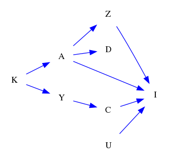
### Questions
- [FO] Find one valid nodeset that can block path Y->C->I. 
- [FO] Find the minimal nodeset that can block path Y->C->I. 
- [YN] Can path A<-K->Y->C->I<-Z be blocked by nodeset {'D', 'I', 'C', 'K'}? 
- [MC] Which of the following nodesets can block path Y<-K->A->Z->I<-C?\
A. {'D', 'I'}\
B. {'I', 'A', 'K'}\
C. {'I', 'U'}\
D. {'I'} 
### Answers
- [{'C'}, {'D', 'C'}, {'Z', 'C'}, {'C', 'A'}, {'C', 'K'}, {'C', 'U'}, {'D', 'Z', 'C'}, {'D', 'C', 'A'}, {'D', 'C', 'K'}, {'D', 'C', 'U'}, {'Z', 'C', 'A'}, {'Z', 'C', 'K'}, {'Z', 'C', 'U'}, {'C', 'A', 'K'}, {'C', 'A', 'U'}, {'C', 'U', 'K'}, {'D', 'Z', 'C', 'A'}, {'D', 'Z', 'C', 'K'}, {'D', 'Z', 'C', 'U'}, {'D', 'C', 'A', 'K'}, {'D', 'C', 'A', 'U'}, {'D', 'C', 'U', 'K'}, {'Z', 'C', 'A', 'K'}, {'Z', 'C', 'A', 'U'}, {'Z', 'C', 'U', 'K'}, {'C', 'A', 'U', 'K'}, {'D', 'Z', 'A', 'K', 'C'}, {'D', 'Z', 'A', 'U', 'C'}, {'D', 'Z', 'U', 'K', 'C'}, {'D', 'A', 'U', 'K', 'C'}, {'Z', 'A', 'U', 'K', 'C'}, {'D', 'Z', 'A', 'U', 'K', 'C'}]
- {'C'}
- Yes.
- B
## ID: 72525447
### Graph
- graph type: DAG
- description: Given a DAG (directed acyclic graph) with nodes N, X, H, K, D, B, S, U and directed edges D->B, D->S, H->K, X->S, H->D, S->U, X->U, N->K, K->B, H->B, D->U, H->U.

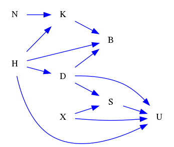
### Questions
- [FO] Find one valid nodeset that can block path H->B<-D->S<-X->U. 
- [FO] Find the minimal nodeset that can block path H->B<-D->S<-X->U. 
- [YN] Can path D->S->U be blocked by nodeset {'S', 'N', 'K'}? 
- [MC] Which of the following nodesets can block path H->K->B<-D->U?\
A. {'X', 'D'}\
B. {'S', 'N', 'B'}\
C. {'X', 'B'}\
D. {'X', 'N', 'B'} 
### Answers
- [set(), {'D'}, {'S'}, {'N'}, {'B'}, {'K'}, {'X'}, {'D', 'S'}, {'D', 'N'}, {'D', 'B'}, {'D', 'K'}, {'X', 'D'}, {'S', 'N'}, {'S', 'K'}, {'X', 'S'}, {'N', 'B'}, {'N', 'K'}, {'X', 'N'}, {'B', 'K'}, {'X', 'B'}, {'X', 'K'}, {'D', 'S', 'N'}, {'D', 'S', 'B'}, {'D', 'S', 'K'}, {'X', 'D', 'S'}, {'D', 'N', 'B'}, {'D', 'N', 'K'}, {'X', 'D', 'N'}, {'D', 'B', 'K'}, {'X', 'D', 'B'}, {'X', 'D', 'K'}, {'S', 'N', 'K'}, {'X', 'S', 'N'}, {'X', 'S', 'B'}, {'X', 'S', 'K'}, {'N', 'B', 'K'}, {'X', 'N', 'B'}, {'X', 'N', 'K'}, {'X', 'B', 'K'}, {'D', 'S', 'N', 'B'}, {'D', 'S', 'N', 'K'}, {'X', 'D', 'S', 'N'}, {'D', 'S', 'B', 'K'}, {'X', 'D', 'S', 'B'}, {'X', 'D', 'S', 'K'}, {'D', 'N', 'B', 'K'}, {'X', 'D', 'N', 'B'}, {'X', 'D', 'N', 'K'}, {'X', 'D', 'B', 'K'}, {'X', 'S', 'N', 'B'}, {'X', 'S', 'N', 'K'}, {'X', 'S', 'B', 'K'}, {'X', 'N', 'B', 'K'}, {'D', 'S', 'N', 'B', 'K'}, {'D', 'S', 'N', 'B', 'X'}, {'D', 'S', 'N', 'K', 'X'}, {'D', 'S', 'B', 'K', 'X'}, {'D', 'N', 'B', 'K', 'X'}, {'S', 'N', 'B', 'K', 'X'}, {'D', 'S', 'N', 'B', 'K', 'X'}]
- set()
- Yes.
- A
## ID: 11585581
### Graph
- graph type: DAG
- description: Given a DAG (directed acyclic graph) with nodes Y, U, A, K, M, V, Z, B, P and directed edges M->Z, Y->A, A->K, A->P, K->V, U->V, A->V, Z->B, Y->P, U->M, U->B.

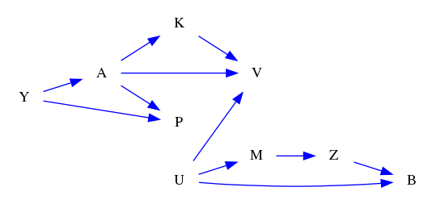
### Questions
- [FO] Find one valid nodeset that can block path Y->A->V. 
- [FO] Find the minimal nodeset that can block path Y->A->V. 
- [YN] Can path M->Z->B be blocked by nodeset {'Z', 'A', 'U', 'P', 'Y'}? 
- [MC] Which of the following nodesets can block path Y->P<-A->V<-K?\
A. {'Z', 'B', 'M', 'P', 'V'}\
B. {'P', 'V', 'Z', 'U'}\
C. {'Z', 'B', 'U', 'P', 'V'}\
D. {'V', 'Z', 'B', 'U'} 
### Answers
- [{'A'}, {'Z', 'A'}, {'A', 'B'}, {'A', 'K'}, {'M', 'A'}, {'A', 'U'}, {'P', 'A'}, {'Z', 'A', 'B'}, {'Z', 'A', 'K'}, {'M', 'Z', 'A'}, {'Z', 'A', 'U'}, {'P', 'Z', 'A'}, {'A', 'B', 'K'}, {'M', 'A', 'B'}, {'A', 'B', 'U'}, {'P', 'A', 'B'}, {'M', 'A', 'K'}, {'A', 'U', 'K'}, {'P', 'A', 'K'}, {'M', 'A', 'U'}, {'M', 'P', 'A'}, {'P', 'A', 'U'}, {'Z', 'A', 'B', 'K'}, {'M', 'Z', 'A', 'B'}, {'Z', 'A', 'B', 'U'}, {'P', 'Z', 'A', 'B'}, {'M', 'Z', 'A', 'K'}, {'Z', 'A', 'U', 'K'}, {'P', 'Z', 'A', 'K'}, {'M', 'Z', 'A', 'U'}, {'M', 'Z', 'A', 'P'}, {'P', 'Z', 'A', 'U'}, {'M', 'A', 'B', 'K'}, {'U', 'A', 'B', 'K'}, {'P', 'A', 'B', 'K'}, {'M', 'A', 'B', 'U'}, {'M', 'P', 'A', 'B'}, {'P', 'A', 'B', 'U'}, {'M', 'A', 'U', 'K'}, {'M', 'P', 'A', 'K'}, {'P', 'A', 'U', 'K'}, {'M', 'P', 'A', 'U'}, {'Z', 'A', 'B', 'K', 'M'}, {'Z', 'A', 'B', 'U', 'K'}, {'Z', 'A', 'B', 'K', 'P'}, {'Z', 'A', 'B', 'U', 'M'}, {'Z', 'A', 'B', 'M', 'P'}, {'Z', 'A', 'B', 'U', 'P'}, {'Z', 'A', 'U', 'M', 'K'}, {'Z', 'A', 'K', 'M', 'P'}, {'Z', 'A', 'U', 'K', 'P'}, {'Z', 'A', 'U', 'M', 'P'}, {'A', 'B', 'U', 'M', 'K'}, {'A', 'B', 'K', 'M', 'P'}, {'A', 'B', 'U', 'K', 'P'}, {'A', 'B', 'U', 'M', 'P'}, {'A', 'U', 'M', 'K', 'P'}, {'Z', 'A', 'B', 'K', 'M', 'U'}, {'Z', 'A', 'B', 'K', 'M', 'P'}, {'Z', 'A', 'B', 'U', 'K', 'P'}, {'Z', 'A', 'B', 'U', 'M', 'P'}, {'Z', 'A', 'U', 'M', 'K', 'P'}, {'A', 'B', 'U', 'M', 'K', 'P'}, {'Z', 'A', 'B', 'K', 'M', 'U', 'P'}]
- {'A'}
- Yes.
- D
## ID: 67443221
### Graph
- graph type: DAG
- description: Given a DAG (directed acyclic graph) with nodes M, E, Z, I, V, Q, T, D, R and directed edges M->E, I->D, V->D, Q->T, T->R, M->I, M->V, Z->I, E->D, E->R, E->Q, Z->Q.

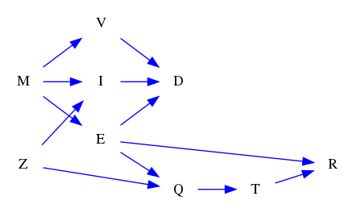
### Questions
- [FO] Find one valid nodeset that can block path M->V->D<-I<-Z->Q<-E. 
- [FO] Find the minimal nodeset that can block path M->V->D<-I<-Z->Q<-E. 
- [YN] Can path Z->Q->T->R<-E<-M->I be blocked by nodeset {'D', 'T', 'Q'}? 
- [MC] Which of the following nodesets can block path M->E->R<-T?\
A. {'Z', 'R'}\
B. {'D', 'I', 'Z', 'V', 'R'}\
C. {'D', 'Z', 'R', 'Q'}\
D. {'Z', 'Q'} 
### Answers
- [set(), {'D'}, {'I'}, {'Z'}, {'V'}, {'Q'}, {'T'}, {'R'}, {'D', 'I'}, {'D', 'Z'}, {'D', 'V'}, {'I', 'Z'}, {'V', 'I'}, {'I', 'Q'}, {'I', 'T'}, {'I', 'R'}, {'V', 'Z'}, {'Z', 'Q'}, {'Z', 'T'}, {'Z', 'R'}, {'V', 'Q'}, {'V', 'T'}, {'V', 'R'}, {'T', 'Q'}, {'R', 'Q'}, {'T', 'R'}, {'D', 'I', 'Z'}, {'D', 'I', 'V'}, {'D', 'I', 'Q'}, {'D', 'I', 'T'}, {'D', 'I', 'R'}, {'D', 'V', 'Z'}, {'D', 'Z', 'Q'}, {'D', 'Z', 'T'}, {'D', 'Z', 'R'}, {'D', 'V', 'Q'}, {'D', 'V', 'T'}, {'D', 'V', 'R'}, {'V', 'I', 'Z'}, {'I', 'Z', 'Q'}, {'I', 'Z', 'T'}, {'I', 'Z', 'R'}, {'V', 'I', 'Q'}, {'V', 'I', 'T'}, {'V', 'I', 'R'}, {'I', 'T', 'Q'}, {'I', 'R', 'Q'}, {'I', 'T', 'R'}, {'V', 'Z', 'Q'}, {'V', 'Z', 'T'}, {'V', 'Z', 'R'}, {'Z', 'T', 'Q'}, {'Z', 'R', 'Q'}, {'Z', 'T', 'R'}, {'V', 'T', 'Q'}, {'V', 'R', 'Q'}, {'V', 'T', 'R'}, {'T', 'R', 'Q'}, {'D', 'I', 'Z', 'V'}, {'D', 'I', 'Z', 'Q'}, {'D', 'I', 'Z', 'T'}, {'D', 'I', 'Z', 'R'}, {'D', 'I', 'V', 'Q'}, {'D', 'I', 'T', 'V'}, {'D', 'I', 'V', 'R'}, {'D', 'I', 'T', 'Q'}, {'D', 'I', 'R', 'Q'}, {'D', 'I', 'T', 'R'}, {'D', 'V', 'Z', 'Q'}, {'D', 'V', 'Z', 'T'}, {'D', 'V', 'Z', 'R'}, {'D', 'Z', 'T', 'Q'}, {'D', 'Z', 'R', 'Q'}, {'D', 'Z', 'T', 'R'}, {'D', 'V', 'T', 'Q'}, {'D', 'V', 'R', 'Q'}, {'D', 'V', 'T', 'R'}, {'V', 'I', 'Z', 'Q'}, {'V', 'I', 'Z', 'T'}, {'V', 'I', 'Z', 'R'}, {'I', 'Z', 'T', 'Q'}, {'I', 'Z', 'R', 'Q'}, {'I', 'Z', 'T', 'R'}, {'V', 'I', 'T', 'Q'}, {'V', 'I', 'R', 'Q'}, {'V', 'I', 'T', 'R'}, {'I', 'T', 'R', 'Q'}, {'V', 'Z', 'T', 'Q'}, {'V', 'Z', 'R', 'Q'}, {'V', 'Z', 'T', 'R'}, {'R', 'Z', 'T', 'Q'}, {'V', 'T', 'R', 'Q'}, {'D', 'I', 'Z', 'V', 'Q'}, {'D', 'I', 'Z', 'V', 'T'}, {'D', 'I', 'Z', 'V', 'R'}, {'D', 'I', 'Z', 'Q', 'T'}, {'D', 'I', 'Z', 'Q', 'R'}, {'D', 'I', 'Z', 'T', 'R'}, {'D', 'I', 'V', 'Q', 'T'}, {'D', 'I', 'V', 'Q', 'R'}, {'D', 'I', 'V', 'T', 'R'}, {'D', 'I', 'Q', 'T', 'R'}, {'D', 'Z', 'V', 'Q', 'T'}, {'D', 'Z', 'V', 'Q', 'R'}, {'D', 'Z', 'V', 'T', 'R'}, {'D', 'Z', 'Q', 'T', 'R'}, {'D', 'V', 'Q', 'T', 'R'}, {'I', 'Z', 'V', 'Q', 'T'}, {'I', 'Z', 'V', 'Q', 'R'}, {'I', 'Z', 'V', 'T', 'R'}, {'I', 'Z', 'Q', 'T', 'R'}, {'I', 'V', 'Q', 'T', 'R'}, {'Z', 'V', 'Q', 'T', 'R'}, {'D', 'I', 'Z', 'V', 'Q', 'T'}, {'D', 'I', 'Z', 'V', 'Q', 'R'}, {'D', 'I', 'Z', 'V', 'T', 'R'}, {'D', 'I', 'Z', 'Q', 'T', 'R'}, {'D', 'I', 'V', 'Q', 'T', 'R'}, {'D', 'Z', 'V', 'Q', 'T', 'R'}, {'I', 'Z', 'V', 'Q', 'T', 'R'}, {'D', 'I', 'Z', 'V', 'Q', 'T', 'R'}]
- set()
- Yes.
- D
## ID: 63905178
### Graph
- graph type: DAG
- description: Given a DAG (directed acyclic graph) with nodes G, K, M, F, J, C, R, Z, A and directed edges J->C, C->Z, F->J, C->R, M->Z, J->Z, K->M, G->M, F->A, F->R, G->C, K->F.

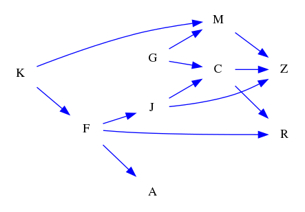
### Questions
- [FO] Find one valid nodeset that can block path G->C->Z. 
- [FO] Find the minimal nodeset that can block path G->C->Z. 
- [YN] Can path G->C->R<-F->J->Z<-M be blocked by nodeset {'Z', 'R', 'K'}? 
- [MC] Which of the following nodesets can block path K->M<-G->C->Z<-J<-F->R?\
A. {'J', 'Z', 'A'}\
B. {'M', 'Z', 'A'}\
C. {'Z'}\
D. {'Z', 'A'} 
### Answers
- [{'C'}, {'C', 'A'}, {'C', 'K'}, {'M', 'C'}, {'J', 'C'}, {'F', 'C'}, {'C', 'R'}, {'C', 'A', 'K'}, {'M', 'C', 'A'}, {'J', 'C', 'A'}, {'F', 'C', 'A'}, {'C', 'A', 'R'}, {'M', 'C', 'K'}, {'J', 'C', 'K'}, {'F', 'C', 'K'}, {'C', 'R', 'K'}, {'M', 'J', 'C'}, {'M', 'F', 'C'}, {'M', 'C', 'R'}, {'J', 'F', 'C'}, {'J', 'C', 'R'}, {'F', 'C', 'R'}, {'M', 'C', 'A', 'K'}, {'J', 'C', 'A', 'K'}, {'F', 'C', 'A', 'K'}, {'C', 'A', 'R', 'K'}, {'M', 'J', 'C', 'A'}, {'M', 'F', 'C', 'A'}, {'M', 'C', 'A', 'R'}, {'J', 'F', 'C', 'A'}, {'J', 'C', 'A', 'R'}, {'F', 'C', 'A', 'R'}, {'M', 'J', 'C', 'K'}, {'M', 'F', 'C', 'K'}, {'M', 'C', 'R', 'K'}, {'J', 'F', 'C', 'K'}, {'J', 'C', 'R', 'K'}, {'F', 'C', 'R', 'K'}, {'M', 'J', 'F', 'C'}, {'M', 'J', 'C', 'R'}, {'M', 'F', 'C', 'R'}, {'J', 'F', 'C', 'R'}, {'A', 'K', 'M', 'J', 'C'}, {'A', 'K', 'M', 'F', 'C'}, {'A', 'K', 'M', 'C', 'R'}, {'A', 'K', 'J', 'F', 'C'}, {'A', 'K', 'J', 'C', 'R'}, {'A', 'K', 'F', 'C', 'R'}, {'A', 'M', 'J', 'F', 'C'}, {'A', 'M', 'J', 'C', 'R'}, {'A', 'M', 'F', 'C', 'R'}, {'A', 'J', 'F', 'C', 'R'}, {'K', 'M', 'J', 'F', 'C'}, {'K', 'M', 'J', 'C', 'R'}, {'K', 'M', 'F', 'C', 'R'}, {'K', 'J', 'F', 'C', 'R'}, {'M', 'J', 'F', 'C', 'R'}, {'A', 'K', 'M', 'J', 'F', 'C'}, {'A', 'K', 'M', 'J', 'C', 'R'}, {'A', 'K', 'M', 'F', 'C', 'R'}, {'A', 'K', 'J', 'F', 'C', 'R'}, {'A', 'M', 'J', 'F', 'C', 'R'}, {'K', 'M', 'J', 'F', 'C', 'R'}, {'A', 'K', 'M', 'J', 'F', 'C', 'R'}]
- {'C'}
- No.
- A
## ID: 80821416
### Graph
- graph type: ADMG
- description: Given an ADMG (acyclic directed mixed graph) with nodes F, J, T, P, directed edges T->P, J->T, F->P, F->T, F->J, J->P and bi-directed edges F<->P.

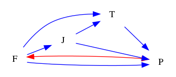
### Questions
- [FO] Find one valid nodeset that can block path F->P<-T<-J. 
- [FO] Find the minimal nodeset that can block path F->P<-T<-J. 
- [YN] Can path F<->P<-J->T be blocked by nodeset set()? 
- [MC] Which of the following nodesets can block path F->T<-J?\
A. {'P', 'T'}\
B. {'P'}\
C. set()\
D. {'T'} 
### Answers
- [set(), {'T'}, {'P', 'T'}]
- set()
- Yes.
- C
## ID: 22786568
### Graph
- graph type: ADMG
- description: Given an ADMG (acyclic directed mixed graph) with nodes K, M, W, B, directed edges K->B, K->W, W->B, M->W, K->M and bi-directed edges M<->W.

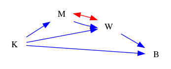
### Questions
- [FO] Find one valid nodeset that can block path M->W<-K->B. 
- [FO] Find the minimal nodeset that can block path M->W<-K->B. 
- [YN] Can path M<->W->B be blocked by nodeset {'K'}? 
- [MC] Which of the following nodesets can block path K->M<->W?\
A. set()\
B. {'M', 'B'}\
C. {'B'}\
D. {'M'} 
### Answers
- [set(), {'K'}, {'W', 'K'}]
- set()
- No.
- A
## ID: 26680650
### Graph
- graph type: ADMG
- description: Given an ADMG (acyclic directed mixed graph) with nodes P, J, D, H, directed edges P->J, D->H, J->H, P->H, J->D and bi-directed edges D<->H, P<->J, P<->H.

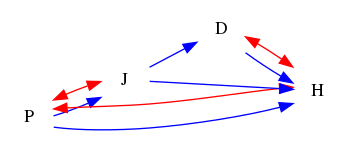
### Questions
- [FO] Find one valid nodeset that can block path P<->H<-D<-J. 
- [FO] Find the minimal nodeset that can block path P<->H<-D<-J. 
- [YN] Can path P->J->D->H be blocked by nodeset set()? 
- [MC] Which of the following nodesets can block path J<->P<->H?\
A. {'P', 'D'}\
B. {'D'}\
C. {'P'}\
D. set() 
### Answers
- [set(), {'D'}, {'D', 'H'}]
- set()
- No.
- D
## ID: 87587820
### Graph
- graph type: ADMG
- description: Given an ADMG (acyclic directed mixed graph) with nodes V, O, R, X, N, directed edges O->R, X->N, R->N, V->X, O->N, V->O, R->X, V->R, O->X and bi-directed edges O<->N, V<->X, V<->R, R<->X, R<->N.

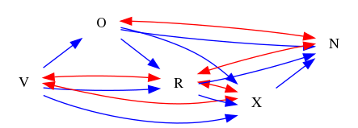
### Questions
- [FO] Find one valid nodeset that can block path V<->X->N<->O->R. 
- [FO] Find the minimal nodeset that can block path V<->X->N<->O->R. 
- [YN] Can path V<->X->N<->R be blocked by nodeset {'N'}? 
- [MC] Which of the following nodesets can block path V->O<->N?\
A. {'O', 'R'}\
B. set()\
C. {'R'}\
D. {'X', 'O'} 
### Answers
- [set(), {'X'}, {'O'}, {'X', 'N'}, {'X', 'O'}, {'N', 'O'}, {'X', 'N', 'O'}]
- set()
- No.
- B
## ID: 31345404
### Graph
- graph type: ADMG
- description: Given an ADMG (acyclic directed mixed graph) with nodes K, B, U, C, M, directed edges B->U, K->U, K->B, C->M, B->C, U->M, U->C, K->C and bi-directed edges B<->M, K<->U, U<->M, C<->M.

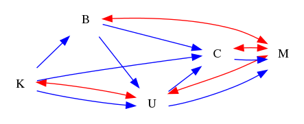
### Questions
- [FO] Find one valid nodeset that can block path K->U<-B->C->M. 
- [FO] Find the minimal nodeset that can block path K->U<-B->C->M. 
- [YN] Can path B<-K<->U->M be blocked by nodeset {'C'}? 
- [MC] Which of the following nodesets can block path B->C<->M?\
A. {'C', 'U'}\
B. {'C', 'K'}\
C. {'C'}\
D. {'U', 'K'} 
### Answers
- [set(), {'C'}, {'B'}, {'C', 'B'}, {'C', 'U'}, {'B', 'U'}, {'C', 'B', 'U'}]
- set()
- No.
- D
## ID: 76337240
### Graph
- graph type: ADMG
- description: Given an ADMG (acyclic directed mixed graph) with nodes M, T, Z, G, N, directed edges G->N, Z->G, T->G, M->Z, Z->N and bi-directed edges T<->G, Z<->N, M<->T.

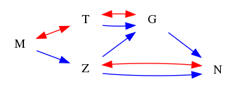
### Questions
- [FO] Find one valid nodeset that can block path G<-T<->M->Z->N. 
- [FO] Find the minimal nodeset that can block path G<-T<->M->Z->N. 
- [YN] Can path M->Z<->N<-G be blocked by nodeset set()? 
- [MC] Which of the following nodesets can block path Z->N<-G?\
A. {'M', 'T', 'N'}\
B. {'N'}\
C. set()\
D. {'T', 'N'} 
### Answers
- [{'M'}, {'Z'}, {'T'}, {'M', 'Z'}, {'M', 'T'}, {'Z', 'T'}, {'M', 'Z', 'T'}]
- {'M'}
- Yes.
- C
## ID: 53721553
### Graph
- graph type: ADMG
- description: Given an ADMG (acyclic directed mixed graph) with nodes G, E, J, F, M, Y, directed edges J->M, E->J, G->J, F->Y, E->Y, M->Y, J->Y, G->F, J->F, G->M and bi-directed edges G<->E, G<->Y, G<->F, J<->Y, E<->J, E<->M, M<->Y.

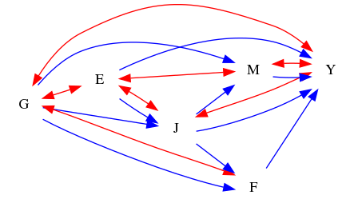
### Questions
- [FO] Find one valid nodeset that can block path E<->M<-J<-G<->Y. 
- [FO] Find the minimal nodeset that can block path E<->M<-J<-G<->Y. 
- [YN] Can path J<-E<->M<-G->F->Y be blocked by nodeset {'G'}? 
- [MC] Which of the following nodesets can block path J<-E->Y<->G<->F?\
A. {'M', 'G', 'E', 'Y'}\
B. {'Y'}\
C. {'M', 'Y'}\
D. {'G', 'Y'} 
### Answers
- [set(), {'J'}, {'G'}, {'F'}, {'M', 'J'}, {'M', 'G'}, {'J', 'G'}, {'J', 'F'}, {'G', 'F'}, {'M', 'J', 'G'}, {'M', 'J', 'F'}, {'M', 'G', 'F'}, {'J', 'G', 'F'}, {'M', 'J', 'G', 'F'}]
- set()
- Yes.
- A
## ID: 53759464
### Graph
- graph type: ADMG
- description: Given an ADMG (acyclic directed mixed graph) with nodes W, D, X, M, K, P, directed edges W->P, W->M, X->M, D->P, D->X, X->K, W->D, D->K, D->M, M->P and bi-directed edges W<->P, D<->X, X<->K.

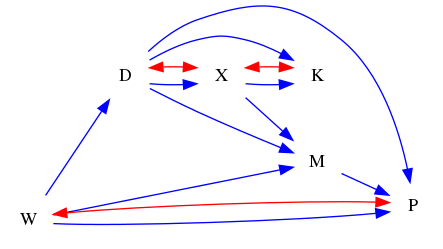
### Questions
- [FO] Find one valid nodeset that can block path X->K<-D->P<-M. 
- [FO] Find the minimal nodeset that can block path X->K<-D->P<-M. 
- [YN] Can path W<->P<-D->K<-X->M be blocked by nodeset {'P', 'D', 'K'}? 
- [MC] Which of the following nodesets can block path X<-D->M->P?\
A. {'W'}\
B. {'K'}\
C. set()\
D. {'D', 'W'} 
### Answers
- [set(), {'P'}, {'D'}, {'W'}, {'K'}, {'P', 'D'}, {'P', 'W'}, {'D', 'W'}, {'D', 'K'}, {'W', 'K'}, {'P', 'D', 'W'}, {'P', 'D', 'K'}, {'D', 'W', 'K'}, {'P', 'D', 'W', 'K'}]
- set()
- Yes.
- D
## ID: 13376836
### Graph
- graph type: ADMG
- description: Given an ADMG (acyclic directed mixed graph) with nodes Y, V, S, O, T, Z, directed edges V->T, V->S, Y->S, Y->Z, T->Z, O->T and bi-directed edges Y<->S, T<->Z, S<->Z.

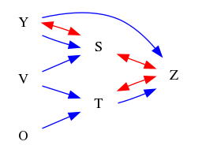
### Questions
- [FO] Find one valid nodeset that can block path O->T<-V->S<->Z. 
- [FO] Find the minimal nodeset that can block path O->T<-V->S<->Z. 
- [YN] Can path Y->Z<->T<-V->S be blocked by nodeset {'Z', 'T', 'O'}? 
- [MC] Which of the following nodesets can block path V->S<->Z?\
A. {'T', 'S', 'O', 'Y'}\
B. {'S', 'O'}\
C. {'T', 'S'}\
D. {'T'} 
### Answers
- [set(), {'V'}, {'T'}, {'S'}, {'Y'}, {'V', 'T'}, {'V', 'S'}, {'V', 'Y'}, {'T', 'Y'}, {'S', 'Y'}, {'V', 'T', 'S'}, {'V', 'T', 'Y'}, {'V', 'S', 'Y'}, {'V', 'T', 'S', 'Y'}]
- set()
- No.
- D
## ID: 27725846
### Graph
- graph type: ADMG
- description: Given an ADMG (acyclic directed mixed graph) with nodes W, J, G, U, E, N, V, directed edges N->V, J->N, U->E, J->G, G->U, G->N, W->E, W->V, W->G and bi-directed edges W<->E, E<->V, U<->E.

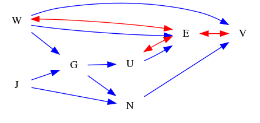
### Questions
- [FO] Find one valid nodeset that can block path W->V<->E. 
- [FO] Find the minimal nodeset that can block path W->V<->E. 
- [YN] Can path G<-W->E<->V<-N be blocked by nodeset {'J', 'V', 'E', 'U'}? 
- [MC] Which of the following nodesets can block path W->G<-J->N->V<->E?\
A. {'V', 'U'}\
B. {'V', 'G', 'U'}\
C. {'J', 'V', 'N'}\
D. {'V'} 
### Answers
- [set(), {'G'}, {'N'}, {'U'}, {'J'}, {'G', 'N'}, {'G', 'U'}, {'J', 'G'}, {'N', 'U'}, {'J', 'N'}, {'J', 'U'}, {'G', 'N', 'U'}, {'J', 'G', 'N'}, {'J', 'G', 'U'}, {'J', 'N', 'U'}, {'J', 'G', 'N', 'U'}]
- set()
- No.
- C
## ID: 40163509
### Graph
- graph type: ADMG
- description: Given an ADMG (acyclic directed mixed graph) with nodes Q, B, X, L, V, U, D, directed edges Q->D, B->X, X->V, Q->X, B->V, Q->L, X->U, V->U, Q->V and bi-directed edges X<->U, B<->L, B<->V, Q<->L, B<->U.

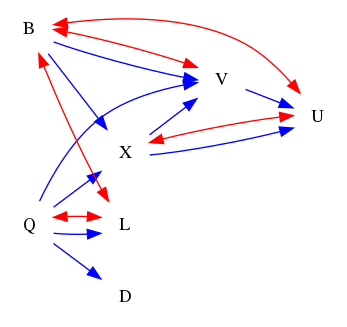
### Questions
- [FO] Find one valid nodeset that can block path X->U<->B<->L<->Q->V. 
- [FO] Find the minimal nodeset that can block path X->U<->B<->L<->Q->V. 
- [YN] Can path B<->L<-Q->X->U<-V be blocked by nodeset {'L', 'U'}? 
- [MC] Which of the following nodesets can block path B<->V<-Q->X?\
A. {'D', 'V', 'L', 'U'}\
B. {'U'}\
C. {'D', 'U'}\
D. {'D', 'Q', 'U'} 
### Answers
- [set(), {'D'}, {'B'}, {'U'}, {'Q'}, {'L'}, {'D', 'B'}, {'D', 'U'}, {'D', 'Q'}, {'D', 'L'}, {'B', 'U'}, {'Q', 'B'}, {'L', 'B'}, {'Q', 'U'}, {'L', 'Q'}, {'D', 'B', 'U'}, {'D', 'Q', 'B'}, {'D', 'L', 'B'}, {'D', 'Q', 'U'}, {'D', 'L', 'Q'}, {'Q', 'B', 'U'}, {'L', 'Q', 'B'}, {'L', 'Q', 'U'}, {'D', 'Q', 'B', 'U'}, {'D', 'L', 'Q', 'B'}, {'D', 'L', 'Q', 'U'}, {'L', 'Q', 'B', 'U'}, {'D', 'B', 'U', 'Q', 'L'}]
- set()
- No.
- D
## ID: 10524701
### Graph
- graph type: ADMG
- description: Given an ADMG (acyclic directed mixed graph) with nodes S, B, H, J, V, F, Y, directed edges J->Y, H->V, B->H, J->V, F->Y, S->H, S->V and bi-directed edges B<->F, H<->V.

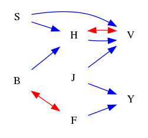
### Questions
- [FO] Find one valid nodeset that can block path S->V<-H. 
- [FO] Find the minimal nodeset that can block path S->V<-H. 
- [YN] Can path J->V<->H<-B<->F->Y be blocked by nodeset {'V', 'H'}? 
- [MC] Which of the following nodesets can block path S->H->V?\
A. {'H', 'B'}\
B. {'J', 'B'}\
C. {'J', 'F', 'Y'}\
D. {'F', 'Y'} 
### Answers
- [set(), {'B'}, {'J'}, {'F'}, {'Y'}, {'J', 'B'}, {'F', 'B'}, {'B', 'Y'}, {'J', 'F'}, {'J', 'Y'}, {'F', 'Y'}, {'J', 'F', 'B'}, {'J', 'B', 'Y'}, {'F', 'B', 'Y'}, {'J', 'F', 'Y'}, {'J', 'F', 'B', 'Y'}]
- set()
- No.
- A
## ID: 99284596
### Graph
- graph type: ADMG
- description: Given an ADMG (acyclic directed mixed graph) with nodes B, P, Q, D, J, V, K, W, directed edges P->Q, P->J, D->V, Q->K, B->P, B->W, B->K, J->V, V->K, J->K and bi-directed edges P<->W, K<->W.

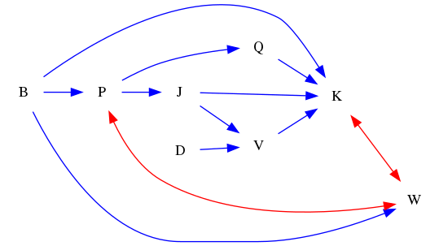
### Questions
- [FO] Find one valid nodeset that can block path J->K<-V. 
- [FO] Find the minimal nodeset that can block path J->K<-V. 
- [YN] Can path D->V<-J->K be blocked by nodeset {'B', 'W', 'P', 'V', 'Q'}? 
- [MC] Which of the following nodesets can block path P<->W<->K<-Q?\
A. {'V', 'W', 'K'}\
B. {'W', 'B', 'K'}\
C. {'D', 'V', 'K'}\
D. {'V', 'W', 'B', 'K'} 
### Answers
- [set(), {'D'}, {'B'}, {'W'}, {'P'}, {'Q'}, {'D', 'B'}, {'D', 'W'}, {'P', 'D'}, {'D', 'Q'}, {'W', 'B'}, {'P', 'B'}, {'Q', 'B'}, {'P', 'W'}, {'W', 'Q'}, {'P', 'Q'}, {'D', 'W', 'B'}, {'P', 'D', 'B'}, {'D', 'Q', 'B'}, {'P', 'D', 'W'}, {'D', 'W', 'Q'}, {'P', 'D', 'Q'}, {'P', 'W', 'B'}, {'Q', 'W', 'B'}, {'P', 'Q', 'B'}, {'P', 'W', 'Q'}, {'P', 'D', 'W', 'B'}, {'D', 'Q', 'W', 'B'}, {'P', 'D', 'Q', 'B'}, {'P', 'D', 'W', 'Q'}, {'P', 'Q', 'W', 'B'}, {'D', 'B', 'W', 'P', 'Q'}]
- set()
- No.
- C
## ID: 13672825
### Graph
- graph type: ADMG
- description: Given an ADMG (acyclic directed mixed graph) with nodes J, H, O, F, Q, U, K, I, directed edges F->K, J->F, O->F, K->I, O->U, H->O, J->K, J->U, J->Q and bi-directed edges F<->I, H<->K, F<->Q, J<->U, H<->F.

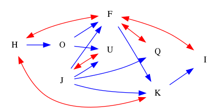
### Questions
- [FO] Find one valid nodeset that can block path K<-J<->U<-O<-H<->F<->I. 
- [FO] Find the minimal nodeset that can block path K<-J<->U<-O<-H<->F<->I. 
- [YN] Can path F<->H->O->U<-J->K be blocked by nodeset {'I', 'Q'}? 
- [MC] Which of the following nodesets can block path J->U<-O<-H<->F<->I<-K?\
A. {'I', 'U'}\
B. {'F', 'Q', 'O', 'U'}\
C. {'I', 'F', 'U'}\
D. {'I', 'Q', 'U'} 
### Answers
- [set(), {'O'}, {'U'}, {'H'}, {'Q'}, {'J'}, {'F'}, {'O', 'U'}, {'H', 'O'}, {'Q', 'O'}, {'J', 'O'}, {'F', 'O'}, {'H', 'U'}, {'Q', 'U'}, {'J', 'U'}, {'H', 'Q'}, {'J', 'H'}, {'F', 'H'}, {'J', 'Q'}, {'F', 'Q'}, {'J', 'F'}, {'H', 'O', 'U'}, {'Q', 'O', 'U'}, {'J', 'O', 'U'}, {'F', 'O', 'U'}, {'H', 'Q', 'O'}, {'J', 'H', 'O'}, {'F', 'H', 'O'}, {'J', 'Q', 'O'}, {'F', 'Q', 'O'}, {'J', 'F', 'O'}, {'H', 'Q', 'U'}, {'J', 'H', 'U'}, {'F', 'H', 'U'}, {'J', 'Q', 'U'}, {'J', 'F', 'U'}, {'J', 'H', 'Q'}, {'F', 'H', 'Q'}, {'J', 'F', 'H'}, {'J', 'F', 'Q'}, {'H', 'Q', 'O', 'U'}, {'J', 'H', 'O', 'U'}, {'F', 'H', 'O', 'U'}, {'J', 'Q', 'O', 'U'}, {'F', 'Q', 'O', 'U'}, {'J', 'F', 'O', 'U'}, {'J', 'H', 'Q', 'O'}, {'F', 'H', 'Q', 'O'}, {'J', 'F', 'H', 'O'}, {'J', 'F', 'Q', 'O'}, {'J', 'H', 'Q', 'U'}, {'F', 'H', 'Q', 'U'}, {'J', 'F', 'H', 'U'}, {'J', 'F', 'Q', 'U'}, {'J', 'F', 'H', 'Q'}, {'O', 'U', 'H', 'Q', 'J'}, {'O', 'U', 'H', 'Q', 'F'}, {'O', 'U', 'H', 'J', 'F'}, {'O', 'U', 'Q', 'J', 'F'}, {'O', 'H', 'Q', 'J', 'F'}, {'U', 'H', 'Q', 'J', 'F'}, {'O', 'U', 'H', 'Q', 'J', 'F'}]
- set()
- Yes.
- B
## ID: 65496000
### Graph
- graph type: ADMG
- description: Given an ADMG (acyclic directed mixed graph) with nodes R, J, U, S, B, L, H, D, directed edges J->D, J->U, R->H, U->L, R->S, L->D, U->D, B->H, J->H, B->D and bi-directed edges U<->D, R<->J, J<->H, R<->S.

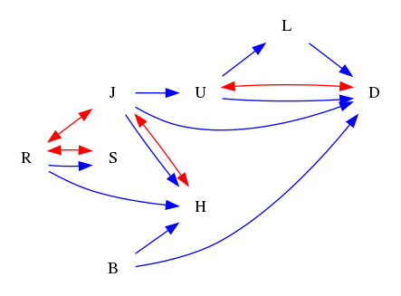
### Questions
- [FO] Find one valid nodeset that can block path J<->R->H<-B->D<->U->L. 
- [FO] Find the minimal nodeset that can block path J<->R->H<-B->D<->U->L. 
- [YN] Can path B->H<->J->U<->D be blocked by nodeset {'L', 'S', 'R', 'U'}? 
- [MC] Which of the following nodesets can block path J->H<-B->D?\
A. {'H', 'S', 'U'}\
B. {'S', 'B', 'U'}\
C. {'H', 'L', 'R'}\
D. {'H'} 
### Answers
- [set(), {'D'}, {'S'}, {'B'}, {'U'}, {'H'}, {'R'}, {'D', 'S'}, {'D', 'B'}, {'D', 'U'}, {'D', 'R'}, {'S', 'B'}, {'S', 'U'}, {'H', 'S'}, {'S', 'R'}, {'B', 'U'}, {'H', 'B'}, {'R', 'B'}, {'H', 'U'}, {'R', 'U'}, {'H', 'R'}, {'D', 'S', 'B'}, {'D', 'S', 'U'}, {'D', 'S', 'R'}, {'D', 'B', 'U'}, {'D', 'H', 'B'}, {'D', 'R', 'B'}, {'D', 'H', 'U'}, {'D', 'R', 'U'}, {'D', 'H', 'R'}, {'S', 'B', 'U'}, {'H', 'S', 'B'}, {'S', 'R', 'B'}, {'H', 'S', 'U'}, {'S', 'R', 'U'}, {'H', 'S', 'R'}, {'H', 'B', 'U'}, {'R', 'B', 'U'}, {'H', 'R', 'B'}, {'H', 'R', 'U'}, {'D', 'S', 'B', 'U'}, {'D', 'H', 'S', 'B'}, {'D', 'S', 'R', 'B'}, {'D', 'H', 'S', 'U'}, {'D', 'S', 'R', 'U'}, {'D', 'H', 'S', 'R'}, {'D', 'H', 'B', 'U'}, {'D', 'R', 'B', 'U'}, {'D', 'H', 'R', 'B'}, {'D', 'H', 'R', 'U'}, {'H', 'S', 'B', 'U'}, {'S', 'R', 'B', 'U'}, {'H', 'S', 'R', 'B'}, {'H', 'S', 'R', 'U'}, {'H', 'R', 'B', 'U'}, {'D', 'S', 'B', 'U', 'H'}, {'D', 'S', 'B', 'U', 'R'}, {'D', 'S', 'B', 'H', 'R'}, {'D', 'S', 'U', 'H', 'R'}, {'D', 'B', 'U', 'H', 'R'}, {'S', 'B', 'U', 'H', 'R'}, {'D', 'S', 'B', 'U', 'H', 'R'}]
- set()
- Yes.
- B
## ID: 13708323
### Graph
- graph type: ADMG
- description: Given an ADMG (acyclic directed mixed graph) with nodes C, X, I, H, F, V, A, Y, Q, directed edges I->F, X->H, X->Y, C->A, H->F, X->Q, C->F, C->Y, I->Y, F->Q, H->V and bi-directed edges H<->V, X<->H, X<->F, H<->Q, F<->Y, C<->A.

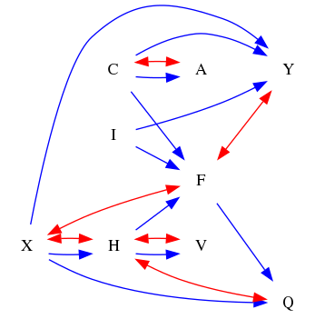
### Questions
- [FO] Find one valid nodeset that can block path X<->F<-H->V. 
- [FO] Find the minimal nodeset that can block path X<->F<-H->V. 
- [YN] Can path H<->Q<-X->Y<-I->F be blocked by nodeset {'X', 'V', 'I', 'Q'}? 
- [MC] Which of the following nodesets can block path C->F->Q<-X->Y?\
A. {'I', 'A', 'H', 'V', 'Q'}\
B. {'V', 'I', 'Q'}\
C. {'V', 'I', 'A', 'Q'}\
D. {'X', 'V', 'H', 'Q'} 
### Answers
- [set(), {'I'}, {'A'}, {'H'}, {'C'}, {'Y'}, {'I', 'A'}, {'I', 'H'}, {'I', 'C'}, {'I', 'Y'}, {'H', 'A'}, {'C', 'A'}, {'A', 'Y'}, {'H', 'Q'}, {'F', 'H'}, {'H', 'C'}, {'H', 'Y'}, {'C', 'Y'}, {'I', 'H', 'A'}, {'I', 'C', 'A'}, {'I', 'A', 'Y'}, {'I', 'H', 'Q'}, {'F', 'I', 'H'}, {'I', 'H', 'C'}, {'I', 'H', 'Y'}, {'I', 'C', 'Y'}, {'H', 'A', 'Q'}, {'F', 'H', 'A'}, {'H', 'C', 'A'}, {'H', 'A', 'Y'}, {'C', 'A', 'Y'}, {'F', 'H', 'Q'}, {'H', 'C', 'Q'}, {'H', 'Q', 'Y'}, {'F', 'H', 'C'}, {'F', 'H', 'Y'}, {'H', 'C', 'Y'}, {'I', 'H', 'A', 'Q'}, {'F', 'I', 'H', 'A'}, {'I', 'H', 'C', 'A'}, {'I', 'H', 'A', 'Y'}, {'I', 'C', 'A', 'Y'}, {'F', 'I', 'H', 'Q'}, {'I', 'H', 'C', 'Q'}, {'I', 'H', 'Q', 'Y'}, {'F', 'I', 'H', 'C'}, {'F', 'I', 'H', 'Y'}, {'I', 'H', 'C', 'Y'}, {'F', 'H', 'A', 'Q'}, {'H', 'C', 'A', 'Q'}, {'H', 'A', 'Q', 'Y'}, {'F', 'H', 'C', 'A'}, {'F', 'H', 'A', 'Y'}, {'H', 'C', 'A', 'Y'}, {'F', 'H', 'C', 'Q'}, {'F', 'H', 'Q', 'Y'}, {'H', 'C', 'Q', 'Y'}, {'F', 'H', 'C', 'Y'}, {'I', 'A', 'H', 'Q', 'F'}, {'I', 'A', 'H', 'Q', 'C'}, {'I', 'A', 'H', 'Q', 'Y'}, {'I', 'A', 'H', 'F', 'C'}, {'I', 'A', 'H', 'F', 'Y'}, {'I', 'A', 'H', 'C', 'Y'}, {'I', 'H', 'Q', 'F', 'C'}, {'I', 'H', 'Q', 'F', 'Y'}, {'I', 'H', 'Q', 'C', 'Y'}, {'I', 'H', 'F', 'C', 'Y'}, {'A', 'H', 'Q', 'F', 'C'}, {'A', 'H', 'Q', 'F', 'Y'}, {'A', 'H', 'Q', 'C', 'Y'}, {'A', 'H', 'F', 'C', 'Y'}, {'H', 'Q', 'F', 'C', 'Y'}, {'I', 'A', 'H', 'Q', 'F', 'C'}, {'I', 'A', 'H', 'Q', 'F', 'Y'}, {'I', 'A', 'H', 'Q', 'C', 'Y'}, {'I', 'A', 'H', 'F', 'C', 'Y'}, {'I', 'H', 'Q', 'F', 'C', 'Y'}, {'A', 'H', 'Q', 'F', 'C', 'Y'}, {'I', 'A', 'H', 'Q', 'F', 'C', 'Y'}]
- set()
- Yes.
- D
## ID: 44525380
### Graph
- graph type: ADMG
- description: Given an ADMG (acyclic directed mixed graph) with nodes K, P, J, R, S, L, T, O, E, directed edges J->L, J->T, L->O, P->R, S->O, R->T, K->J, S->L, P->E, L->T, K->O, P->O and bi-directed edges S<->O, J<->R, P<->S, P<->R, K<->S, O<->E.

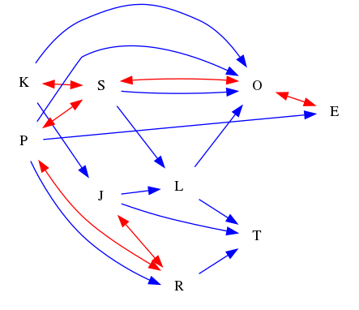
### Questions
- [FO] Find one valid nodeset that can block path K->J<->R<-P->E<->O<-S->L->T. 
- [FO] Find the minimal nodeset that can block path K->J<->R<-P->E<->O<-S->L->T. 
- [YN] Can path P<->R<->J->L<-S<->O<->E be blocked by nodeset {'T', 'O'}? 
- [MC] Which of the following nodesets can block path L<-S->O?\
A. {'J', 'T', 'R', 'K'}\
B. {'T', 'E', 'R', 'K'}\
C. {'P', 'R', 'K'}\
D. {'S', 'K', 'P', 'J', 'E'} 
### Answers
- [set(), {'S'}, {'O'}, {'P'}, {'R'}, {'J'}, {'L'}, {'E'}, {'S', 'O'}, {'P', 'S'}, {'S', 'R'}, {'J', 'S'}, {'L', 'S'}, {'S', 'E'}, {'P', 'O'}, {'R', 'O'}, {'J', 'O'}, {'L', 'O'}, {'E', 'O'}, {'P', 'R'}, {'P', 'J'}, {'P', 'L'}, {'P', 'E'}, {'J', 'R'}, {'L', 'R'}, {'E', 'R'}, {'J', 'L'}, {'J', 'E'}, {'L', 'E'}, {'P', 'S', 'O'}, {'S', 'R', 'O'}, {'J', 'S', 'O'}, {'L', 'S', 'O'}, {'S', 'E', 'O'}, {'P', 'S', 'R'}, {'P', 'J', 'S'}, {'P', 'L', 'S'}, {'P', 'S', 'E'}, {'J', 'S', 'R'}, {'L', 'S', 'R'}, {'S', 'E', 'R'}, {'J', 'L', 'S'}, {'J', 'S', 'E'}, {'L', 'S', 'E'}, {'P', 'R', 'O'}, {'P', 'J', 'O'}, {'P', 'L', 'O'}, {'P', 'E', 'O'}, {'J', 'R', 'O'}, {'L', 'R', 'O'}, {'J', 'L', 'O'}, {'J', 'E', 'O'}, {'L', 'E', 'O'}, {'P', 'J', 'R'}, {'P', 'L', 'R'}, {'P', 'E', 'R'}, {'P', 'J', 'L'}, {'P', 'J', 'E'}, {'P', 'L', 'E'}, {'J', 'L', 'R'}, {'J', 'E', 'R'}, {'L', 'E', 'R'}, {'J', 'L', 'E'}, {'P', 'S', 'R', 'O'}, {'P', 'J', 'S', 'O'}, {'P', 'L', 'S', 'O'}, {'P', 'S', 'E', 'O'}, {'J', 'S', 'R', 'O'}, {'L', 'S', 'R', 'O'}, {'E', 'S', 'R', 'O'}, {'J', 'L', 'S', 'O'}, {'J', 'S', 'E', 'O'}, {'L', 'S', 'E', 'O'}, {'P', 'J', 'S', 'R'}, {'P', 'L', 'S', 'R'}, {'P', 'S', 'E', 'R'}, {'P', 'J', 'L', 'S'}, {'P', 'J', 'S', 'E'}, {'P', 'L', 'S', 'E'}, {'J', 'L', 'S', 'R'}, {'J', 'S', 'E', 'R'}, {'L', 'S', 'E', 'R'}, {'J', 'L', 'S', 'E'}, {'P', 'J', 'R', 'O'}, {'P', 'L', 'R', 'O'}, {'P', 'E', 'R', 'O'}, {'P', 'J', 'L', 'O'}, {'P', 'J', 'E', 'O'}, {'P', 'L', 'E', 'O'}, {'J', 'L', 'R', 'O'}, {'E', 'L', 'R', 'O'}, {'J', 'L', 'E', 'O'}, {'P', 'J', 'L', 'R'}, {'P', 'J', 'E', 'R'}, {'P', 'L', 'E', 'R'}, {'P', 'J', 'L', 'E'}, {'J', 'L', 'E', 'R'}, {'S', 'O', 'P', 'J', 'R'}, {'S', 'O', 'P', 'L', 'R'}, {'S', 'O', 'P', 'R', 'E'}, {'S', 'O', 'P', 'J', 'L'}, {'S', 'O', 'P', 'J', 'E'}, {'S', 'O', 'P', 'L', 'E'}, {'S', 'O', 'J', 'L', 'R'}, {'S', 'O', 'R', 'J', 'E'}, {'S', 'O', 'R', 'L', 'E'}, {'S', 'O', 'J', 'L', 'E'}, {'S', 'P', 'J', 'L', 'R'}, {'S', 'P', 'R', 'J', 'E'}, {'S', 'P', 'R', 'L', 'E'}, {'S', 'P', 'J', 'L', 'E'}, {'S', 'R', 'J', 'L', 'E'}, {'O', 'P', 'J', 'L', 'R'}, {'O', 'P', 'R', 'J', 'E'}, {'O', 'P', 'R', 'L', 'E'}, {'O', 'P', 'J', 'L', 'E'}, {'O', 'R', 'J', 'L', 'E'}, {'P', 'R', 'J', 'L', 'E'}, {'S', 'O', 'P', 'J', 'L', 'R'}, {'S', 'O', 'P', 'E', 'J', 'R'}, {'S', 'O', 'P', 'E', 'L', 'R'}, {'S', 'O', 'P', 'J', 'L', 'E'}, {'S', 'O', 'E', 'J', 'L', 'R'}, {'S', 'P', 'E', 'J', 'L', 'R'}, {'O', 'P', 'E', 'J', 'L', 'R'}, {'S', 'O', 'P', 'E', 'J', 'L', 'R'}]
- set()
- No.
- D
## ID: 57314426
### Graph
- graph type: ADMG
- description: Given an ADMG (acyclic directed mixed graph) with nodes Q, G, K, Z, C, T, B, R, D, directed edges K->C, K->T, Q->D, G->D, K->D, K->R, Q->G, K->Z, Q->B and bi-directed edges Z<->R, Z<->C, B<->D.

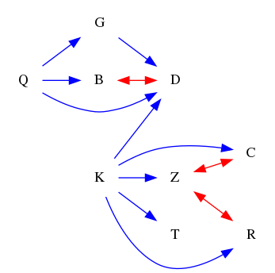
### Questions
- [FO] Find one valid nodeset that can block path Q->G->D. 
- [FO] Find the minimal nodeset that can block path Q->G->D. 
- [YN] Can path K->Z<->C be blocked by nodeset {'D', 'G', 'Z', 'B', 'Q', 'R'}? 
- [MC] Which of the following nodesets can block path Q->B<->D?\
A. {'Z', 'C', 'T'}\
B. {'T', 'R', 'B'}\
C. {'G', 'T', 'C', 'B'}\
D. {'C', 'R', 'B', 'K'} 
### Answers
- [{'G'}, {'G', 'Z'}, {'G', 'B'}, {'G', 'K'}, {'G', 'T'}, {'G', 'C'}, {'G', 'R'}, {'G', 'Z', 'B'}, {'G', 'Z', 'K'}, {'G', 'Z', 'T'}, {'G', 'Z', 'C'}, {'G', 'Z', 'R'}, {'G', 'B', 'K'}, {'G', 'T', 'B'}, {'G', 'C', 'B'}, {'G', 'R', 'B'}, {'G', 'T', 'K'}, {'G', 'C', 'K'}, {'G', 'R', 'K'}, {'G', 'T', 'C'}, {'G', 'T', 'R'}, {'G', 'C', 'R'}, {'G', 'Z', 'B', 'K'}, {'G', 'Z', 'T', 'B'}, {'G', 'Z', 'C', 'B'}, {'G', 'Z', 'R', 'B'}, {'G', 'Z', 'T', 'K'}, {'G', 'Z', 'C', 'K'}, {'G', 'Z', 'R', 'K'}, {'G', 'Z', 'C', 'T'}, {'G', 'Z', 'T', 'R'}, {'G', 'Z', 'C', 'R'}, {'G', 'T', 'B', 'K'}, {'G', 'C', 'B', 'K'}, {'G', 'R', 'B', 'K'}, {'G', 'T', 'C', 'B'}, {'G', 'T', 'R', 'B'}, {'G', 'C', 'R', 'B'}, {'G', 'T', 'C', 'K'}, {'G', 'T', 'R', 'K'}, {'G', 'C', 'R', 'K'}, {'G', 'T', 'C', 'R'}, {'G', 'Z', 'B', 'K', 'T'}, {'G', 'Z', 'B', 'K', 'C'}, {'G', 'Z', 'B', 'K', 'R'}, {'G', 'Z', 'B', 'T', 'C'}, {'G', 'Z', 'B', 'T', 'R'}, {'G', 'Z', 'B', 'C', 'R'}, {'G', 'Z', 'K', 'T', 'C'}, {'G', 'Z', 'K', 'T', 'R'}, {'G', 'Z', 'K', 'C', 'R'}, {'G', 'Z', 'T', 'C', 'R'}, {'G', 'B', 'K', 'T', 'C'}, {'G', 'B', 'K', 'T', 'R'}, {'G', 'B', 'K', 'C', 'R'}, {'G', 'B', 'T', 'C', 'R'}, {'G', 'K', 'T', 'C', 'R'}, {'G', 'Z', 'B', 'K', 'T', 'C'}, {'G', 'Z', 'B', 'K', 'T', 'R'}, {'G', 'Z', 'B', 'K', 'C', 'R'}, {'G', 'Z', 'B', 'T', 'C', 'R'}, {'G', 'Z', 'K', 'T', 'C', 'R'}, {'G', 'B', 'K', 'T', 'C', 'R'}, {'G', 'Z', 'B', 'K', 'T', 'C', 'R'}]
- {'G'}
- No.
- A
