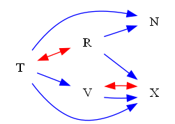
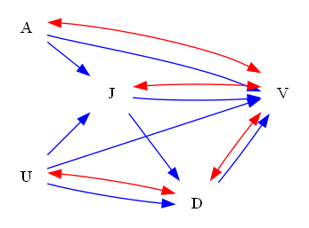
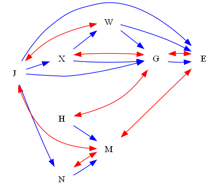

| Find All |How Many |Find One |Yes or No |Multiple Choice |Existence | total |
|:------:|:------:|:------:|:------:|:------:|:------:|:------:|
| 36 |36 |0 |36 |0 |0 | 108 |

|  N=4 | N=5 | N=6 | N=7 | N=8 | N=9 | total |
|:------:|:------:|:------:|:------:|:------:|:------:|:------:|
| 18 |18 |18 |18 |18 |18 | 108 |

|  Yes. | No. | judge_total |
|:------:|:------:|:------:|
| 18 |18 | 36 |

## ID: 18240651
### Graph
- graph type: ADMG
- description: Given an ADMG (acyclic directed mixed graph) with nodes I, Y, H, U, directed edges I->H, I->Y, I->U, H->U, Y->H and bi-directed edges H<->U, I<->Y.

### Questions
- [FA] It can be uniquely partitioned into a set C(G) of subgraphs, each a maximal C-component. Write down such partition of the given graph. 
- [HM] It can be uniquely partitioned into a set C(G) of subgraphs, each a maximal C-component. How many subgraphs are there in C(G)? 
- [YN] Is it a C-component? 
### Answers
- [{'I', 'Y'}, {'U', 'H'}]
- 2
- No.
## ID: 55420574
### Graph
- graph type: ADMG
- description: Given an ADMG (acyclic directed mixed graph) with nodes V, Z, R, O, directed edges R->O, Z->O, V->Z, V->R and bi-directed edges Z<->R.

### Questions
- [FA] It can be uniquely partitioned into a set C(G) of subgraphs, each a maximal C-component. Write down such partition of the given graph. 
- [HM] It can be uniquely partitioned into a set C(G) of subgraphs, each a maximal C-component. How many subgraphs are there in C(G)? 
- [YN] Is it a C-component? 
### Answers
- [{'V'}, {'R', 'Z'}, {'O'}]
- 3
- No.
## ID: 94087909
### Graph
- graph type: ADMG
- description: Given an ADMG (acyclic directed mixed graph) with nodes Q, N, G, D, directed edges Q->G, N->D, Q->D, N->G, G->D, Q->N and bi-directed edges Q<->N, N<->G.

### Questions
- [FA] It can be uniquely partitioned into a set C(G) of subgraphs, each a maximal C-component. Write down such partition of the given graph. 
- [HM] It can be uniquely partitioned into a set C(G) of subgraphs, each a maximal C-component. How many subgraphs are there in C(G)? 
- [YN] Is it a C-component? 
### Answers
- [{'G', 'Q', 'N'}, {'D'}]
- 2
- No.
## ID: 95742089
### Graph
- graph type: ADMG
- description: Given an ADMG (acyclic directed mixed graph) with nodes T, R, V, N, X, directed edges T->N, R->X, T->X, T->V, R->N, V->X and bi-directed edges T<->R, V<->X.

### Questions
- [FA] It can be uniquely partitioned into a set C(G) of subgraphs, each a maximal C-component. Write down such partition of the given graph. 
- [HM] It can be uniquely partitioned into a set C(G) of subgraphs, each a maximal C-component. How many subgraphs are there in C(G)? 
- [YN] Is it a C-component? 
### Answers
- [{'R', 'T'}, {'V', 'X'}, {'N'}]
- 3
- No.
## ID: 69702058
### Graph
- graph type: ADMG
- description: Given an ADMG (acyclic directed mixed graph) with nodes S, P, L, G, X, directed edges P->G, G->X, S->X, P->X, L->G, L->X, S->G, S->L, P->L and bi-directed edges L<->G, P<->G, S<->G.

### Questions
- [FA] It can be uniquely partitioned into a set C(G) of subgraphs, each a maximal C-component. Write down such partition of the given graph. 
- [HM] It can be uniquely partitioned into a set C(G) of subgraphs, each a maximal C-component. How many subgraphs are there in C(G)? 
- [YN] Is it a C-component? 
### Answers
- [{'L', 'S', 'P', 'G'}, {'X'}]
- 2
- No.
## ID: 12639138
### Graph
- graph type: ADMG
- description: Given an ADMG (acyclic directed mixed graph) with nodes Z, P, O, N, F, directed edges P->F, O->N, Z->O, N->F, P->O, Z->N and bi-directed edges P<->F.

### Questions
- [FA] It can be uniquely partitioned into a set C(G) of subgraphs, each a maximal C-component. Write down such partition of the given graph. 
- [HM] It can be uniquely partitioned into a set C(G) of subgraphs, each a maximal C-component. How many subgraphs are there in C(G)? 
- [YN] Is it a C-component? 
### Answers
- [{'Z'}, {'F', 'P'}, {'O'}, {'N'}]
- 4
- No.
## ID: 57651321
### Graph
- graph type: ADMG
- description: Given an ADMG (acyclic directed mixed graph) with nodes M, I, A, D, N, Y, directed edges M->N, M->A, N->Y, I->A, A->N, D->Y, M->I, D->N, I->N, M->Y, A->Y, I->D and bi-directed edges M<->I, M<->Y, A<->N.

### Questions
- [FA] It can be uniquely partitioned into a set C(G) of subgraphs, each a maximal C-component. Write down such partition of the given graph. 
- [HM] It can be uniquely partitioned into a set C(G) of subgraphs, each a maximal C-component. How many subgraphs are there in C(G)? 
- [YN] Is it a C-component? 
### Answers
- [{'I', 'Y', 'M'}, {'A', 'N'}, {'D'}]
- 3
- No.
## ID: 34707962
### Graph
- graph type: ADMG
- description: Given an ADMG (acyclic directed mixed graph) with nodes C, M, G, P, U, Y, directed edges M->G, C->G, C->P, P->U, G->U, C->U, P->Y, C->M, G->Y, C->Y, U->Y, G->P and bi-directed edges M<->U, M<->G, P<->U, C<->P, C<->G, M<->P.

### Questions
- [FA] It can be uniquely partitioned into a set C(G) of subgraphs, each a maximal C-component. Write down such partition of the given graph. 
- [HM] It can be uniquely partitioned into a set C(G) of subgraphs, each a maximal C-component. How many subgraphs are there in C(G)? 
- [YN] Is it a C-component? 
### Answers
- [{'U', 'C', 'P', 'G', 'M'}, {'Y'}]
- 2
- No.
## ID: 30396291
### Graph
- graph type: ADMG
- description: Given an ADMG (acyclic directed mixed graph) with nodes D, Y, G, K, W, N, directed edges D->N, K->N, D->G, Y->G, G->N, Y->W, G->W and bi-directed edges Y<->K.

### Questions
- [FA] It can be uniquely partitioned into a set C(G) of subgraphs, each a maximal C-component. Write down such partition of the given graph. 
- [HM] It can be uniquely partitioned into a set C(G) of subgraphs, each a maximal C-component. How many subgraphs are there in C(G)? 
- [YN] Is it a C-component? 
### Answers
- [{'D'}, {'K', 'Y'}, {'G'}, {'W'}, {'N'}]
- 5
- No.
## ID: 77515132
### Graph
- graph type: ADMG
- description: Given an ADMG (acyclic directed mixed graph) with nodes B, F, J, O, Z, P, L, directed edges B->J, B->P, Z->L, O->Z, F->J, F->P, J->P, O->L, Z->P, F->O and bi-directed edges O<->Z, F<->P, F<->Z.

### Questions
- [FA] It can be uniquely partitioned into a set C(G) of subgraphs, each a maximal C-component. Write down such partition of the given graph. 
- [HM] It can be uniquely partitioned into a set C(G) of subgraphs, each a maximal C-component. How many subgraphs are there in C(G)? 
- [YN] Is it a C-component? 
### Answers
- [{'B'}, {'F', 'P', 'O', 'Z'}, {'J'}, {'L'}]
- 4
- No.
## ID: 94611860
### Graph
- graph type: ADMG
- description: Given an ADMG (acyclic directed mixed graph) with nodes Y, B, X, L, S, P, F, directed edges Y->S, B->X, B->S, S->F, B->L, S->P and bi-directed edges Y<->F, X<->F.

### Questions
- [FA] It can be uniquely partitioned into a set C(G) of subgraphs, each a maximal C-component. Write down such partition of the given graph. 
- [HM] It can be uniquely partitioned into a set C(G) of subgraphs, each a maximal C-component. How many subgraphs are there in C(G)? 
- [YN] Is it a C-component? 
### Answers
- [{'F', 'Y', 'X'}, {'B'}, {'L'}, {'S'}, {'P'}]
- 5
- No.
## ID: 24121037
### Graph
- graph type: ADMG
- description: Given an ADMG (acyclic directed mixed graph) with nodes Q, H, A, K, Z, C, E, directed edges C->E, Q->C, K->C, H->A, A->C, H->Z, Z->E, H->C and bi-directed edges H<->K.

### Questions
- [FA] It can be uniquely partitioned into a set C(G) of subgraphs, each a maximal C-component. Write down such partition of the given graph. 
- [HM] It can be uniquely partitioned into a set C(G) of subgraphs, each a maximal C-component. How many subgraphs are there in C(G)? 
- [YN] Is it a C-component? 
### Answers
- [{'Q'}, {'K', 'H'}, {'A'}, {'Z'}, {'C'}, {'E'}]
- 6
- No.
## ID: 98704920
### Graph
- graph type: ADMG
- description: Given an ADMG (acyclic directed mixed graph) with nodes F, T, M, L, Y, X, K, U, directed edges F->Y, T->M, T->L, Y->X, F->L, M->K, M->U, K->U, F->T and bi-directed edges T<->Y, F<->Y.

### Questions
- [FA] It can be uniquely partitioned into a set C(G) of subgraphs, each a maximal C-component. Write down such partition of the given graph. 
- [HM] It can be uniquely partitioned into a set C(G) of subgraphs, each a maximal C-component. How many subgraphs are there in C(G)? 
- [YN] Is it a C-component? 
### Answers
- [{'F', 'T', 'Y'}, {'M'}, {'L'}, {'X'}, {'K'}, {'U'}]
- 6
- No.
## ID: 80514374
### Graph
- graph type: ADMG
- description: Given an ADMG (acyclic directed mixed graph) with nodes H, V, Q, M, D, U, S, R, directed edges H->M, H->U, V->Q, Q->D, V->S, U->S, H->R and bi-directed edges U<->S, H<->V, H<->S.

### Questions
- [FA] It can be uniquely partitioned into a set C(G) of subgraphs, each a maximal C-component. Write down such partition of the given graph. 
- [HM] It can be uniquely partitioned into a set C(G) of subgraphs, each a maximal C-component. How many subgraphs are there in C(G)? 
- [YN] Is it a C-component? 
### Answers
- [{'V', 'S', 'U', 'H'}, {'Q'}, {'M'}, {'D'}, {'R'}]
- 5
- No.
## ID: 99948105
### Graph
- graph type: ADMG
- description: Given an ADMG (acyclic directed mixed graph) with nodes E, V, G, O, C, T, H, X, directed edges E->H, G->C, V->G, H->X, T->H, C->H, E->O and bi-directed edges G<->C.

### Questions
- [FA] It can be uniquely partitioned into a set C(G) of subgraphs, each a maximal C-component. Write down such partition of the given graph. 
- [HM] It can be uniquely partitioned into a set C(G) of subgraphs, each a maximal C-component. How many subgraphs are there in C(G)? 
- [YN] Is it a C-component? 
### Answers
- [{'E'}, {'V'}, {'C', 'G'}, {'O'}, {'T'}, {'H'}, {'X'}]
- 7
- No.
## ID: 77395790
### Graph
- graph type: ADMG
- description: Given an ADMG (acyclic directed mixed graph) with nodes H, Y, L, J, V, G, N, O, C, directed edges N->O, L->J, G->N, J->V, G->C, L->V, V->G, Y->N, H->Y and bi-directed edges H<->C, Y<->V.

### Questions
- [FA] It can be uniquely partitioned into a set C(G) of subgraphs, each a maximal C-component. Write down such partition of the given graph. 
- [HM] It can be uniquely partitioned into a set C(G) of subgraphs, each a maximal C-component. How many subgraphs are there in C(G)? 
- [YN] Is it a C-component? 
### Answers
- [{'C', 'H'}, {'V', 'Y'}, {'L'}, {'J'}, {'G'}, {'N'}, {'O'}]
- 7
- No.
## ID: 90119995
### Graph
- graph type: ADMG
- description: Given an ADMG (acyclic directed mixed graph) with nodes W, R, K, Q, T, F, V, Z, P, directed edges W->Z, K->Z, R->Q, Q->Z, F->Z, Q->P, T->Z, R->V, F->P, W->Q and bi-directed edges F<->Z, R<->K, K<->P.

### Questions
- [FA] It can be uniquely partitioned into a set C(G) of subgraphs, each a maximal C-component. Write down such partition of the given graph. 
- [HM] It can be uniquely partitioned into a set C(G) of subgraphs, each a maximal C-component. How many subgraphs are there in C(G)? 
- [YN] Is it a C-component? 
### Answers
- [{'W'}, {'K', 'P', 'R'}, {'Q'}, {'T'}, {'F', 'Z'}, {'V'}]
- 6
- No.
## ID: 24774120
### Graph
- graph type: ADMG
- description: Given an ADMG (acyclic directed mixed graph) with nodes J, S, B, Z, D, O, I, Q, U, directed edges B->I, Q->U, D->Q, B->O, D->U, S->O, J->D, O->U, J->Z, O->Q and bi-directed edges S<->B, J<->B, I<->U, B<->Q, Z<->U.

### Questions
- [FA] It can be uniquely partitioned into a set C(G) of subgraphs, each a maximal C-component. Write down such partition of the given graph. 
- [HM] It can be uniquely partitioned into a set C(G) of subgraphs, each a maximal C-component. How many subgraphs are there in C(G)? 
- [YN] Is it a C-component? 
### Answers
- [{'S', 'Q', 'B', 'J'}, {'U', 'I', 'Z'}, {'D'}, {'O'}]
- 4
- No.
## ID: 92492689
### Graph
- graph type: C-component
- description: Given an ADMG (acyclic directed mixed graph) with nodes Q, K, M, Y, directed edges K->Y, K->M, M->Y, Q->K, Q->Y and bi-directed edges K<->Y, Q<->K, Q<->M.

### Questions
- [FA] It can be uniquely partitioned into a set C(G) of subgraphs, each a maximal C-component. Write down such partition of the given graph. 
- [HM] It can be uniquely partitioned into a set C(G) of subgraphs, each a maximal C-component. How many subgraphs are there in C(G)? 
- [YN] Is it a C-component? 
### Answers
- [{'M', 'K', 'Q', 'Y'}]
- 1
- Yes.
## ID: 24259921
### Graph
- graph type: C-component
- description: Given an ADMG (acyclic directed mixed graph) with nodes W, E, Z, N, directed edges W->Z, E->N, W->N, Z->N and bi-directed edges E<->Z, W<->Z, Z<->N.

### Questions
- [FA] It can be uniquely partitioned into a set C(G) of subgraphs, each a maximal C-component. Write down such partition of the given graph. 
- [HM] It can be uniquely partitioned into a set C(G) of subgraphs, each a maximal C-component. How many subgraphs are there in C(G)? 
- [YN] Is it a C-component? 
### Answers
- [{'E', 'W', 'N', 'Z'}]
- 1
- Yes.
## ID: 14137049
### Graph
- graph type: C-component
- description: Given an ADMG (acyclic directed mixed graph) with nodes J, I, Z, G, directed edges I->G, J->I, Z->G, I->Z, J->G and bi-directed edges I<->G, Z<->G, J<->G.

### Questions
- [FA] It can be uniquely partitioned into a set C(G) of subgraphs, each a maximal C-component. Write down such partition of the given graph. 
- [HM] It can be uniquely partitioned into a set C(G) of subgraphs, each a maximal C-component. How many subgraphs are there in C(G)? 
- [YN] Is it a C-component? 
### Answers
- [{'I', 'G', 'Z', 'J'}]
- 1
- Yes.
## ID: 69652675
### Graph
- graph type: C-component
- description: Given an ADMG (acyclic directed mixed graph) with nodes B, U, M, E, W, directed edges U->M, B->W, U->W, B->E, M->E, B->M, B->U, E->W and bi-directed edges B<->M, M<->W, M<->E, U<->M.

### Questions
- [FA] It can be uniquely partitioned into a set C(G) of subgraphs, each a maximal C-component. Write down such partition of the given graph. 
- [HM] It can be uniquely partitioned into a set C(G) of subgraphs, each a maximal C-component. How many subgraphs are there in C(G)? 
- [YN] Is it a C-component? 
### Answers
- [{'W', 'E', 'B', 'U', 'M'}]
- 1
- Yes.
## ID: 96045273
### Graph
- graph type: C-component
- description: Given an ADMG (acyclic directed mixed graph) with nodes K, S, T, G, C, directed edges K->C, S->G, T->C, S->T and bi-directed edges T<->C, G<->C, K<->G, S<->T.

### Questions
- [FA] It can be uniquely partitioned into a set C(G) of subgraphs, each a maximal C-component. Write down such partition of the given graph. 
- [HM] It can be uniquely partitioned into a set C(G) of subgraphs, each a maximal C-component. How many subgraphs are there in C(G)? 
- [YN] Is it a C-component? 
### Answers
- [{'K', 'C', 'G', 'S', 'T'}]
- 1
- Yes.
## ID: 64973693
### Graph
- graph type: C-component
- description: Given an ADMG (acyclic directed mixed graph) with nodes U, A, J, D, V, directed edges J->V, U->J, A->J, U->D, U->V, A->V, D->V, J->D and bi-directed edges D<->V, U<->D, J<->V, A<->V.

### Questions
- [FA] It can be uniquely partitioned into a set C(G) of subgraphs, each a maximal C-component. Write down such partition of the given graph. 
- [HM] It can be uniquely partitioned into a set C(G) of subgraphs, each a maximal C-component. How many subgraphs are there in C(G)? 
- [YN] Is it a C-component? 
### Answers
- [{'U', 'D', 'V', 'A', 'J'}]
- 1
- Yes.
## ID: 98354570
### Graph
- graph type: C-component
- description: Given an ADMG (acyclic directed mixed graph) with nodes D, G, S, W, T, U, directed edges W->U, D->U, G->U, G->T, W->T, D->S and bi-directed edges G<->S, S<->W, G<->U, T<->U, D<->T.

### Questions
- [FA] It can be uniquely partitioned into a set C(G) of subgraphs, each a maximal C-component. Write down such partition of the given graph. 
- [HM] It can be uniquely partitioned into a set C(G) of subgraphs, each a maximal C-component. How many subgraphs are there in C(G)? 
- [YN] Is it a C-component? 
### Answers
- [{'W', 'U', 'D', 'G', 'S', 'T'}]
- 1
- Yes.
## ID: 23432277
### Graph
- graph type: C-component
- description: Given an ADMG (acyclic directed mixed graph) with nodes X, O, H, P, D, K, directed edges O->D, O->H, P->D, X->D, P->K and bi-directed edges X<->P, X<->O, X<->K, P<->D, H<->K.

### Questions
- [FA] It can be uniquely partitioned into a set C(G) of subgraphs, each a maximal C-component. Write down such partition of the given graph. 
- [HM] It can be uniquely partitioned into a set C(G) of subgraphs, each a maximal C-component. How many subgraphs are there in C(G)? 
- [YN] Is it a C-component? 
### Answers
- [{'H', 'O', 'X', 'K', 'P', 'D'}]
- 1
- Yes.
## ID: 19453344
### Graph
- graph type: C-component
- description: Given an ADMG (acyclic directed mixed graph) with nodes N, H, V, K, F, I, directed edges V->I, V->K, N->F, H->I, N->H, N->K, K->F, N->I, N->V, H->F, K->I and bi-directed edges H<->I, H<->F, H<->V, K<->I, N<->V.

### Questions
- [FA] It can be uniquely partitioned into a set C(G) of subgraphs, each a maximal C-component. Write down such partition of the given graph. 
- [HM] It can be uniquely partitioned into a set C(G) of subgraphs, each a maximal C-component. How many subgraphs are there in C(G)? 
- [YN] Is it a C-component? 
### Answers
- [{'F', 'I', 'H', 'N', 'K', 'V'}]
- 1
- Yes.
## ID: 76784390
### Graph
- graph type: C-component
- description: Given an ADMG (acyclic directed mixed graph) with nodes N, F, E, J, K, C, X, directed edges K->C, E->X, N->E, N->X, F->E, F->K, N->J and bi-directed edges E<->K, E<->X, K<->C, J<->C, N<->K, F<->K.

### Questions
- [FA] It can be uniquely partitioned into a set C(G) of subgraphs, each a maximal C-component. Write down such partition of the given graph. 
- [HM] It can be uniquely partitioned into a set C(G) of subgraphs, each a maximal C-component. How many subgraphs are there in C(G)? 
- [YN] Is it a C-component? 
### Answers
- [{'F', 'E', 'N', 'X', 'K', 'C', 'J'}]
- 1
- Yes.
## ID: 46077630
### Graph
- graph type: C-component
- description: Given an ADMG (acyclic directed mixed graph) with nodes E, F, Z, J, V, X, D, directed edges E->J, F->D, Z->X, J->V, F->J, E->Z, J->X and bi-directed edges E<->Z, E<->V, E<->F, Z<->X, Z<->J, E<->D.

### Questions
- [FA] It can be uniquely partitioned into a set C(G) of subgraphs, each a maximal C-component. Write down such partition of the given graph. 
- [HM] It can be uniquely partitioned into a set C(G) of subgraphs, each a maximal C-component. How many subgraphs are there in C(G)? 
- [YN] Is it a C-component? 
### Answers
- [{'F', 'Z', 'E', 'X', 'D', 'V', 'J'}]
- 1
- Yes.
## ID: 35133817
### Graph
- graph type: C-component
- description: Given an ADMG (acyclic directed mixed graph) with nodes E, G, A, V, M, P, O, directed edges E->V, E->O, V->P, A->M, A->O, A->P, M->P, G->A, P->O, V->M, G->M and bi-directed edges A<->P, A<->M, E<->A, E<->O, V<->P, G<->P.

### Questions
- [FA] It can be uniquely partitioned into a set C(G) of subgraphs, each a maximal C-component. Write down such partition of the given graph. 
- [HM] It can be uniquely partitioned into a set C(G) of subgraphs, each a maximal C-component. How many subgraphs are there in C(G)? 
- [YN] Is it a C-component? 
### Answers
- [{'E', 'O', 'P', 'G', 'M', 'V', 'A'}]
- 1
- Yes.
## ID: 37471193
### Graph
- graph type: C-component
- description: Given an ADMG (acyclic directed mixed graph) with nodes J, N, H, M, X, W, G, E, directed edges J->X, J->N, J->E, J->G, W->G, X->G, H->M, N->M, W->E, X->W, G->E and bi-directed edges M<->E, J<->M, G<->E, N<->M, H<->G, J<->W, X<->G.

### Questions
- [FA] It can be uniquely partitioned into a set C(G) of subgraphs, each a maximal C-component. Write down such partition of the given graph. 
- [HM] It can be uniquely partitioned into a set C(G) of subgraphs, each a maximal C-component. How many subgraphs are there in C(G)? 
- [YN] Is it a C-component? 
### Answers
- [{'W', 'H', 'E', 'N', 'X', 'G', 'M', 'J'}]
- 1
- Yes.
## ID: 68097103
### Graph
- graph type: C-component
- description: Given an ADMG (acyclic directed mixed graph) with nodes W, T, O, Z, L, N, M, J, directed edges Z->M, T->J, O->N, W->M, T->N, W->L, L->N, W->J, Z->J, N->J, W->N, L->J and bi-directed edges Z<->N, Z<->L, W<->L, N<->M, O<->N, Z<->J, T<->J.

### Questions
- [FA] It can be uniquely partitioned into a set C(G) of subgraphs, each a maximal C-component. Write down such partition of the given graph. 
- [HM] It can be uniquely partitioned into a set C(G) of subgraphs, each a maximal C-component. How many subgraphs are there in C(G)? 
- [YN] Is it a C-component? 
### Answers
- [{'W', 'O', 'N', 'L', 'J', 'M', 'T', 'Z'}]
- 1
- Yes.
## ID: 80140109
### Graph
- graph type: C-component
- description: Given an ADMG (acyclic directed mixed graph) with nodes J, G, A, M, Y, L, E, U, directed edges J->Y, J->M, E->U, J->A, M->Y, M->E, L->E, M->L, G->L and bi-directed edges Y<->E, G<->Y, G<->U, G<->M, G<->L, G<->A, J<->Y.

### Questions
- [FA] It can be uniquely partitioned into a set C(G) of subgraphs, each a maximal C-component. Write down such partition of the given graph. 
- [HM] It can be uniquely partitioned into a set C(G) of subgraphs, each a maximal C-component. How many subgraphs are there in C(G)? 
- [YN] Is it a C-component? 
### Answers
- [{'E', 'U', 'L', 'G', 'M', 'A', 'Y', 'J'}]
- 1
- Yes.
## ID: 86584786
### Graph
- graph type: C-component
- description: Given an ADMG (acyclic directed mixed graph) with nodes J, O, R, W, L, V, E, P, Y, directed edges P->Y, V->E, J->V, R->L, J->W, W->L, R->W, V->Y, L->Y, J->L, O->V, L->V and bi-directed edges O<->L, O<->Y, O<->R, O<->W, V<->Y, J<->L, O<->P, V<->E.

### Questions
- [FA] It can be uniquely partitioned into a set C(G) of subgraphs, each a maximal C-component. Write down such partition of the given graph. 
- [HM] It can be uniquely partitioned into a set C(G) of subgraphs, each a maximal C-component. How many subgraphs are there in C(G)? 
- [YN] Is it a C-component? 
### Answers
- [{'W', 'O', 'E', 'L', 'P', 'R', 'V', 'Y', 'J'}]
- 1
- Yes.
## ID: 20496238
### Graph
- graph type: C-component
- description: Given an ADMG (acyclic directed mixed graph) with nodes B, J, E, N, C, P, Z, Y, K, directed edges E->Z, B->N, B->P, C->Z, J->K, E->P, N->Z, J->P, J->E, E->K, J->Y, N->Y and bi-directed edges P<->Z, B<->Z, B<->Y, E<->Y, N<->Z, J<->E, C<->Y, P<->K.

### Questions
- [FA] It can be uniquely partitioned into a set C(G) of subgraphs, each a maximal C-component. Write down such partition of the given graph. 
- [HM] It can be uniquely partitioned into a set C(G) of subgraphs, each a maximal C-component. How many subgraphs are there in C(G)? 
- [YN] Is it a C-component? 
### Answers
- [{'Z', 'E', 'N', 'B', 'K', 'C', 'P', 'Y', 'J'}]
- 1
- Yes.
## ID: 65544630
### Graph
- graph type: C-component
- description: Given an ADMG (acyclic directed mixed graph) with nodes A, I, R, K, E, O, J, C, Z, directed edges I->C, I->E, I->R, A->I, K->O, R->K, A->Z, E->Z, A->J and bi-directed edges R<->C, R<->O, A<->O, R<->Z, I<->R, K<->Z, R<->J, E<->C.

### Questions
- [FA] It can be uniquely partitioned into a set C(G) of subgraphs, each a maximal C-component. Write down such partition of the given graph. 
- [HM] It can be uniquely partitioned into a set C(G) of subgraphs, each a maximal C-component. How many subgraphs are there in C(G)? 
- [YN] Is it a C-component? 
### Answers
- [{'I', 'O', 'E', 'K', 'C', 'J', 'R', 'A', 'Z'}]
- 1
- Yes.
