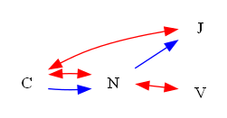
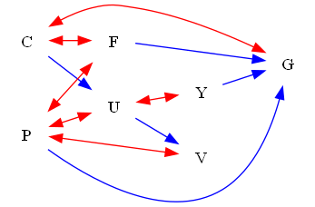
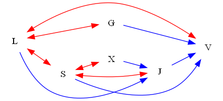
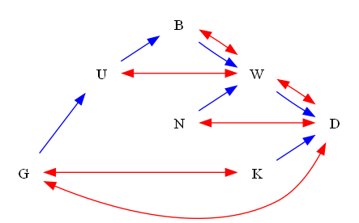

| Find All |How Many |Find One |Yes or No |Multiple Choice |Existence | total |
|:------:|:------:|:------:|:------:|:------:|:------:|:------:|
| 0 |0 |0 |120 |0 |0 | 120 |

|  N=4 | N=5 | N=6 | N=7 | N=8 | N=9 | total |
|:------:|:------:|:------:|:------:|:------:|:------:|:------:|
| 20 |20 |20 |20 |20 |20 | 120 |

|  Yes. | No. | judge_total |
|:------:|:------:|:------:|
| 60 |60 | 120 |

## ID: 25895315
### Graph
- graph type: ADMG
- description: Given an ADMG (acyclic directed mixed graph) with nodes Z, T, P, S, directed edges Z->T, T->P, P->S, T->S and bi-directed edges T<->P, P<->S.

### Questions
- [YN] Is it a C-forest? 
### Answers
- No.
## ID: 15897824
### Graph
- graph type: ADMG
- description: Given an ADMG (acyclic directed mixed graph) with nodes U, K, S, J, directed edges U->S, K->J, U->J, U->K and bi-directed edges K<->J.

### Questions
- [YN] Is it a C-forest? 
### Answers
- No.
## ID: 06638957
### Graph
- graph type: ADMG
- description: Given an ADMG (acyclic directed mixed graph) with nodes E, W, M, J, directed edges W->M, E->J, E->M and bi-directed edges E<->M.

### Questions
- [YN] Is it a C-forest? 
### Answers
- No.
## ID: 32568471
### Graph
- graph type: ADMG
- description: Given an ADMG (acyclic directed mixed graph) with nodes Y, D, C, Q, directed edges C->Q, Y->C, Y->D, D->Q, Y->Q and bi-directed edges Y<->D.

### Questions
- [YN] Is it a C-forest? 
### Answers
- No.
## ID: 21496828
### Graph
- graph type: ADMG
- description: Given an ADMG (acyclic directed mixed graph) with nodes J, X, U, L, directed edges U->L, J->L, X->L, J->X and bi-directed edges J<->L, J<->X.

### Questions
- [YN] Is it a C-forest? 
### Answers
- No.
## ID: 26517002
### Graph
- graph type: ADMG
- description: Given an ADMG (acyclic directed mixed graph) with nodes A, U, C, T, I, directed edges A->I, U->I, A->C, U->C, C->I, C->T, A->T, A->U, T->I and bi-directed edges C<->T, A<->U, A<->T.

### Questions
- [YN] Is it a C-forest? 
### Answers
- No.
## ID: 47871465
### Graph
- graph type: ADMG
- description: Given an ADMG (acyclic directed mixed graph) with nodes P, N, R, S, B, directed edges P->B, P->N, N->B, S->B, N->S, R->S, P->S, N->R, R->B and bi-directed edges N<->R, P<->S.

### Questions
- [YN] Is it a C-forest? 
### Answers
- No.
## ID: 57718186
### Graph
- graph type: ADMG
- description: Given an ADMG (acyclic directed mixed graph) with nodes N, O, X, A, S, directed edges X->S, O->S, N->A, X->A, A->S, O->A, O->X and bi-directed edges O<->A, X<->S, N<->S.

### Questions
- [YN] Is it a C-forest? 
### Answers
- No.
## ID: 91379396
### Graph
- graph type: ADMG
- description: Given an ADMG (acyclic directed mixed graph) with nodes T, O, F, C, J, directed edges O->C, F->C, T->J, O->J, F->J, T->C, T->F, C->J and bi-directed edges C<->J, O<->C, T<->C, O<->F.

### Questions
- [YN] Is it a C-forest? 
### Answers
- No.
## ID: 62001120
### Graph
- graph type: ADMG
- description: Given an ADMG (acyclic directed mixed graph) with nodes Y, M, V, A, P, directed edges Y->P, Y->V, V->A, M->P, Y->M, A->P, V->P, M->A and bi-directed edges Y<->P, Y<->V, Y<->M.

### Questions
- [YN] Is it a C-forest? 
### Answers
- No.
## ID: 74920755
### Graph
- graph type: ADMG
- description: Given an ADMG (acyclic directed mixed graph) with nodes S, O, I, E, H, Y, directed edges H->Y, I->Y, S->H, O->E, S->E and bi-directed edges O<->I.

### Questions
- [YN] Is it a C-forest? 
### Answers
- No.
## ID: 01737905
### Graph
- graph type: ADMG
- description: Given an ADMG (acyclic directed mixed graph) with nodes L, T, S, V, K, G, directed edges L->T, K->G, T->S, T->K, S->G, T->V and bi-directed edges L<->V, T<->S.

### Questions
- [YN] Is it a C-forest? 
### Answers
- No.
## ID: 21600863
### Graph
- graph type: ADMG
- description: Given an ADMG (acyclic directed mixed graph) with nodes K, I, J, U, D, G, directed edges U->D, I->G, K->J, K->I, J->G, D->G, K->U, U->G, K->G, I->D, J->U and bi-directed edges D<->G, J<->U.

### Questions
- [YN] Is it a C-forest? 
### Answers
- No.
## ID: 07288067
### Graph
- graph type: ADMG
- description: Given an ADMG (acyclic directed mixed graph) with nodes U, L, V, R, I, W, directed edges U->V, L->R, I->W, U->R, R->W, L->I, L->V, R->I, U->W, V->R, U->I, L->W and bi-directed edges R<->W, U<->R.

### Questions
- [YN] Is it a C-forest? 
### Answers
- No.
## ID: 47980640
### Graph
- graph type: ADMG
- description: Given an ADMG (acyclic directed mixed graph) with nodes M, R, G, X, P, A, directed edges M->A, X->A, R->P, M->G, M->X, R->A, P->A, G->A, R->G and bi-directed edges M<->P, M<->A, X<->A.

### Questions
- [YN] Is it a C-forest? 
### Answers
- No.
## ID: 68069324
### Graph
- graph type: ADMG
- description: Given an ADMG (acyclic directed mixed graph) with nodes C, U, E, R, V, O, B, directed edges U->R, C->V, V->O, C->R, R->V, E->V, O->B, U->E and bi-directed edges O<->B, C<->R.

### Questions
- [YN] Is it a C-forest? 
### Answers
- No.
## ID: 07251280
### Graph
- graph type: ADMG
- description: Given an ADMG (acyclic directed mixed graph) with nodes D, C, T, W, I, Q, G, directed edges D->W, T->G, D->G, C->W, D->Q, C->Q, I->Q and bi-directed edges I<->G.

### Questions
- [YN] Is it a C-forest? 
### Answers
- No.
## ID: 90403004
### Graph
- graph type: ADMG
- description: Given an ADMG (acyclic directed mixed graph) with nodes Q, L, T, O, E, K, H, directed edges T->E, T->K, Q->H, Q->E, L->H, O->K, L->T, Q->O, L->E, Q->K and bi-directed edges Q<->T, K<->H, T<->K, T<->O.

### Questions
- [YN] Is it a C-forest? 
### Answers
- No.
## ID: 83090561
### Graph
- graph type: ADMG
- description: Given an ADMG (acyclic directed mixed graph) with nodes K, C, A, F, G, I, J, directed edges I->J, C->I, K->C, K->A, F->G, A->G, K->G, A->F, A->I, A->J, K->J, F->I and bi-directed edges K<->C, F<->I, I<->J, C<->A, C<->F.

### Questions
- [YN] Is it a C-forest? 
### Answers
- No.
## ID: 32529857
### Graph
- graph type: ADMG
- description: Given an ADMG (acyclic directed mixed graph) with nodes Q, D, G, Z, N, T, H, directed edges G->Z, G->T, D->G, T->H, D->T, Q->Z, Z->N, Q->D, G->N, Q->H, Q->G, G->H and bi-directed edges Q<->Z, G<->Z, D<->Z, D<->H, Z<->T.

### Questions
- [YN] Is it a C-forest? 
### Answers
- No.
## ID: 20211761
### Graph
- graph type: ADMG
- description: Given an ADMG (acyclic directed mixed graph) with nodes H, N, B, J, R, Z, S, M, directed edges J->Z, B->J, H->M, N->S, B->S, H->R, S->M and bi-directed edges H<->Z.

### Questions
- [YN] Is it a C-forest? 
### Answers
- No.
## ID: 62169898
### Graph
- graph type: ADMG
- description: Given an ADMG (acyclic directed mixed graph) with nodes G, L, S, H, K, M, V, O, directed edges G->S, G->L, L->V, S->O, G->V, H->K, K->O, G->K, L->M and bi-directed edges L<->K, K<->V, H<->V, G<->S.

### Questions
- [YN] Is it a C-forest? 
### Answers
- No.
## ID: 89040601
### Graph
- graph type: ADMG
- description: Given an ADMG (acyclic directed mixed graph) with nodes O, C, S, A, F, M, X, V, directed edges S->X, M->V, F->V, C->A, O->M, O->X, O->C, S->F, A->F and bi-directed edges S<->F.

### Questions
- [YN] Is it a C-forest? 
### Answers
- No.
## ID: 66634333
### Graph
- graph type: ADMG
- description: Given an ADMG (acyclic directed mixed graph) with nodes Y, Q, X, B, N, R, U, Z, directed edges Q->Z, Y->X, Y->Q, Q->R, B->N, B->Z, Y->U, N->U, B->R, Y->Z and bi-directed edges B<->R, Y<->R, Y<->Z, X<->R.

### Questions
- [YN] Is it a C-forest? 
### Answers
- No.
## ID: 94316429
### Graph
- graph type: ADMG
- description: Given an ADMG (acyclic directed mixed graph) with nodes G, S, P, N, L, I, F, Q, directed edges S->Q, N->Q, L->Q, G->N, P->N, F->Q, P->I, G->Q, G->F, I->F, S->L and bi-directed edges P<->F, S<->F, S<->P, P<->L.

### Questions
- [YN] Is it a C-forest? 
### Answers
- No.
## ID: 41811814
### Graph
- graph type: ADMG
- description: Given an ADMG (acyclic directed mixed graph) with nodes T, H, D, I, J, E, W, C, V, directed edges T->J, D->I, E->C, C->V, T->E, H->D, H->W, J->E, J->C, T->C, E->V, T->W and bi-directed edges C<->V, E<->C, E<->W, T<->C.

### Questions
- [YN] Is it a C-forest? 
### Answers
- No.
## ID: 50167054
### Graph
- graph type: ADMG
- description: Given an ADMG (acyclic directed mixed graph) with nodes D, I, H, F, W, C, G, X, Y, directed edges W->Y, F->C, D->X, D->W, F->G, I->Y, G->Y, H->Y, D->C and bi-directed edges D<->F, D<->W, H<->G.

### Questions
- [YN] Is it a C-forest? 
### Answers
- No.
## ID: 53160897
### Graph
- graph type: ADMG
- description: Given an ADMG (acyclic directed mixed graph) with nodes L, T, X, V, J, G, Z, Q, O, directed edges T->X, L->O, X->V, Z->O, V->Q, X->J, T->O, L->G, G->Q, J->G, L->Q and bi-directed edges L<->Z, J<->G, T<->G.

### Questions
- [YN] Is it a C-forest? 
### Answers
- No.
## ID: 15267434
### Graph
- graph type: ADMG
- description: Given an ADMG (acyclic directed mixed graph) with nodes L, U, J, G, D, V, N, A, Z, directed edges L->J, L->Z, G->N, A->Z, D->V, U->V, G->V, D->N, G->Z and bi-directed edges D<->A.

### Questions
- [YN] Is it a C-forest? 
### Answers
- No.
## ID: 46352074
### Graph
- graph type: ADMG
- description: Given an ADMG (acyclic directed mixed graph) with nodes S, X, Q, V, G, W, F, A, K, directed edges V->W, W->F, Q->K, S->K, W->A, X->Q, Q->F, S->X, G->A, Q->G, S->A and bi-directed edges G<->A, X<->A, X<->W.

### Questions
- [YN] Is it a C-forest? 
### Answers
- No.
## ID: 74407774
### Graph
- graph type: C-component
- description: Given an ADMG (acyclic directed mixed graph) with nodes R, J, P, D, directed edges J->D, R->P, J->P and bi-directed edges R<->D, R<->P, R<->J.

### Questions
- [YN] Is it a C-forest? 
### Answers
- No.
## ID: 86310650
### Graph
- graph type: C-component
- description: Given an ADMG (acyclic directed mixed graph) with nodes U, W, B, E, directed edges U->B, B->E, W->B, W->E, U->W and bi-directed edges W<->B, U<->W, W<->E.

### Questions
- [YN] Is it a C-forest? 
### Answers
- No.
## ID: 84349756
### Graph
- graph type: C-component
- description: Given an ADMG (acyclic directed mixed graph) with nodes U, A, J, W, directed edges U->W, U->J, A->J, A->W, U->A, J->W and bi-directed edges J<->W, A<->J, U<->A.

### Questions
- [YN] Is it a C-forest? 
### Answers
- No.
## ID: 20672624
### Graph
- graph type: C-component
- description: Given an ADMG (acyclic directed mixed graph) with nodes R, P, K, I, directed edges R->K, P->K, R->I, R->P and bi-directed edges R<->P, P<->I, R<->K.

### Questions
- [YN] Is it a C-forest? 
### Answers
- No.
## ID: 28843175
### Graph
- graph type: C-component
- description: Given an ADMG (acyclic directed mixed graph) with nodes Z, E, G, V, directed edges E->V, Z->E, G->V and bi-directed edges Z<->V, E<->V, Z<->G.

### Questions
- [YN] Is it a C-forest? 
### Answers
- No.
## ID: 87816326
### Graph
- graph type: C-component
- description: Given an ADMG (acyclic directed mixed graph) with nodes P, X, Q, U, Y, directed edges U->Y, X->Q, X->Y, P->Q, P->U, X->U, P->Y, Q->U, Q->Y and bi-directed edges U<->Y, X<->Y, P<->Y, Q<->U.

### Questions
- [YN] Is it a C-forest? 
### Answers
- No.
## ID: 19018268
### Graph
- graph type: C-component
- description: Given an ADMG (acyclic directed mixed graph) with nodes S, P, L, F, Z, directed edges L->F, S->Z, P->Z, S->P, L->Z, P->F, S->F, P->L, F->Z and bi-directed edges L<->F, P<->L, P<->Z, S<->Z.

### Questions
- [YN] Is it a C-forest? 
### Answers
- No.
## ID: 70409373
### Graph
- graph type: C-component
- description: Given an ADMG (acyclic directed mixed graph) with nodes F, I, E, U, X, directed edges U->X, I->U, E->X, I->E, I->X, F->E, F->U, E->U, F->I, F->X and bi-directed edges I<->U, F<->U, I<->X, E<->X.

### Questions
- [YN] Is it a C-forest? 
### Answers
- No.
## ID: 76594856
### Graph
- graph type: C-component
- description: Given an ADMG (acyclic directed mixed graph) with nodes N, W, L, V, O, directed edges N->L, N->O, W->V, N->W, N->V and bi-directed edges N<->L, N<->V, W<->V, N<->O.

### Questions
- [YN] Is it a C-forest? 
### Answers
- No.
## ID: 69089350
### Graph
- graph type: C-component
- description: Given an ADMG (acyclic directed mixed graph) with nodes X, G, K, E, A, directed edges X->K, K->E, G->K, G->E, G->A, X->A and bi-directed edges X<->A, G<->A, G<->K, K<->E.

### Questions
- [YN] Is it a C-forest? 
### Answers
- No.
## ID: 63434854
### Graph
- graph type: C-component
- description: Given an ADMG (acyclic directed mixed graph) with nodes U, G, A, N, S, D, directed edges N->D, G->D, A->D, S->D, U->G, A->S and bi-directed edges A<->N, U<->A, G<->A, U<->S, N<->D.

### Questions
- [YN] Is it a C-forest? 
### Answers
- No.
## ID: 34303109
### Graph
- graph type: C-component
- description: Given an ADMG (acyclic directed mixed graph) with nodes Z, U, O, G, P, L, directed edges G->P, O->G, Z->P, O->P, Z->L, Z->O, U->P, G->L, U->G, P->L and bi-directed edges Z<->U, Z<->O, U<->G, Z<->P, G<->L.

### Questions
- [YN] Is it a C-forest? 
### Answers
- No.
## ID: 68341589
### Graph
- graph type: C-component
- description: Given an ADMG (acyclic directed mixed graph) with nodes W, J, E, D, S, Z, directed edges W->D, J->D, W->Z, J->E, D->S, W->J, E->S, J->Z, E->Z, D->Z, J->S and bi-directed edges W<->Z, W<->E, J<->E, W<->S, D<->Z.

### Questions
- [YN] Is it a C-forest? 
### Answers
- No.
## ID: 35489088
### Graph
- graph type: C-component
- description: Given an ADMG (acyclic directed mixed graph) with nodes P, U, L, V, D, W, directed edges V->W, P->W, P->L, U->D, P->D and bi-directed edges U<->V, P<->V, U<->W, U<->D, U<->L.

### Questions
- [YN] Is it a C-forest? 
### Answers
- No.
## ID: 32543805
### Graph
- graph type: C-component
- description: Given an ADMG (acyclic directed mixed graph) with nodes Z, A, G, V, T, S, directed edges Z->A, A->V, Z->G, G->S, G->V, A->S, V->T, A->G, A->T, Z->S, T->S, V->S and bi-directed edges Z<->G, Z<->S, V<->S, A<->G, Z<->T.

### Questions
- [YN] Is it a C-forest? 
### Answers
- No.
## ID: 46882450
### Graph
- graph type: C-component
- description: Given an ADMG (acyclic directed mixed graph) with nodes P, C, N, I, O, U, H, directed edges C->O, P->H, N->H, P->C, P->U, C->N, I->O and bi-directed edges P<->C, P<->O, O<->H, P<->U, N<->U, I<->U.

### Questions
- [YN] Is it a C-forest? 
### Answers
- No.
## ID: 41446632
### Graph
- graph type: C-component
- description: Given an ADMG (acyclic directed mixed graph) with nodes N, I, X, G, Q, D, E, directed edges I->D, X->D, G->E, I->Q, I->X, I->E, N->D, N->I, X->E, G->Q and bi-directed edges I<->Q, N<->I, G<->Q, G<->D, N<->E, X<->G.

### Questions
- [YN] Is it a C-forest? 
### Answers
- No.
## ID: 38416096
### Graph
- graph type: C-component
- description: Given an ADMG (acyclic directed mixed graph) with nodes J, W, D, L, T, V, K, directed edges L->T, J->L, T->V, D->L, T->K, W->D, D->K, L->K, W->K, V->K, J->W, D->V and bi-directed edges J<->W, W<->K, V<->K, D<->V, D<->L, T<->K.

### Questions
- [YN] Is it a C-forest? 
### Answers
- No.
## ID: 48417039
### Graph
- graph type: C-component
- description: Given an ADMG (acyclic directed mixed graph) with nodes R, Y, C, S, B, Q, I, directed edges B->Q, R->I, S->Q, R->Q, Y->C, R->Y, B->I and bi-directed edges B<->Q, S<->B, R<->B, B<->I, Y<->S, C<->I.

### Questions
- [YN] Is it a C-forest? 
### Answers
- No.
## ID: 77804443
### Graph
- graph type: C-component
- description: Given an ADMG (acyclic directed mixed graph) with nodes L, P, W, C, I, O, E, directed edges C->O, P->W, P->C, P->I, L->O, L->E, W->I and bi-directed edges W<->E, W<->O, I<->O, C<->I, P<->C, L<->E.

### Questions
- [YN] Is it a C-forest? 
### Answers
- No.
## ID: 18387213
### Graph
- graph type: C-component
- description: Given an ADMG (acyclic directed mixed graph) with nodes U, M, L, Y, E, T, P, R, directed edges Y->E, M->Y, Y->T, U->T, Y->R, U->M, M->E, M->L, E->P and bi-directed edges M<->P, P<->R, T<->R, E<->R, M<->Y, U<->Y, L<->T.

### Questions
- [YN] Is it a C-forest? 
### Answers
- No.
## ID: 66643230
### Graph
- graph type: C-component
- description: Given an ADMG (acyclic directed mixed graph) with nodes U, Q, L, H, M, Y, N, G, directed edges L->M, L->N, N->G, M->Y, U->N, U->G, Y->G, L->G, Q->L, Q->H and bi-directed edges U<->Q, U<->G, N<->G, U<->M, L<->M, L<->Y, H<->G.

### Questions
- [YN] Is it a C-forest? 
### Answers
- No.
## ID: 81298528
### Graph
- graph type: C-component
- description: Given an ADMG (acyclic directed mixed graph) with nodes D, S, K, W, R, Q, E, I, directed edges D->Q, S->I, K->Q, Q->I, S->K, Q->E, R->Q, D->K, D->S, D->I, S->W and bi-directed edges Q<->I, K<->Q, Q<->E, D<->E, W<->E, K<->R, S<->W.

### Questions
- [YN] Is it a C-forest? 
### Answers
- No.
## ID: 94718581
### Graph
- graph type: C-component
- description: Given an ADMG (acyclic directed mixed graph) with nodes O, U, A, I, P, N, H, L, directed edges N->L, O->N, O->L, A->L, I->N, O->U, U->A, U->H, O->H, U->I, U->P and bi-directed edges N<->H, I<->H, I<->L, O<->N, O<->U, I<->P, A<->N.

### Questions
- [YN] Is it a C-forest? 
### Answers
- No.
## ID: 27835805
### Graph
- graph type: C-component
- description: Given an ADMG (acyclic directed mixed graph) with nodes N, R, G, H, L, B, P, S, directed edges L->B, N->L, R->L, G->H, L->P, R->B, R->H, G->P, H->S, H->B and bi-directed edges L<->S, H<->S, R<->L, L<->B, N<->B, R<->G, G<->P.

### Questions
- [YN] Is it a C-forest? 
### Answers
- No.
## ID: 35408835
### Graph
- graph type: C-component
- description: Given an ADMG (acyclic directed mixed graph) with nodes V, Q, S, E, M, P, T, J, F, directed edges Q->S, P->T, P->J, Q->M, M->J, E->M, E->F, V->Q, Q->F, E->T and bi-directed edges M<->P, Q<->P, S<->M, Q<->E, S<->T, P<->F, E<->J, V<->M.

### Questions
- [YN] Is it a C-forest? 
### Answers
- No.
## ID: 40492149
### Graph
- graph type: C-component
- description: Given an ADMG (acyclic directed mixed graph) with nodes C, M, Q, H, D, V, U, G, J, directed edges M->H, Q->U, D->G, H->V, H->J, M->U, C->U, C->J, U->G, M->Q, M->G, D->J and bi-directed edges V<->U, U<->J, H<->J, M<->U, C<->H, V<->G, C<->D, M<->Q.

### Questions
- [YN] Is it a C-forest? 
### Answers
- No.
## ID: 32133266
### Graph
- graph type: C-component
- description: Given an ADMG (acyclic directed mixed graph) with nodes W, H, B, P, N, T, G, R, I, directed edges B->I, N->T, T->G, H->G, W->N, H->B, W->P, W->R, P->G, G->I and bi-directed edges B<->R, W<->R, P<->R, P<->I, W<->G, N<->R, H<->P, T<->I.

### Questions
- [YN] Is it a C-forest? 
### Answers
- No.
## ID: 63511976
### Graph
- graph type: C-component
- description: Given an ADMG (acyclic directed mixed graph) with nodes Y, Q, Z, C, O, M, F, W, T, directed edges Y->T, M->W, Y->Z, Q->T, Q->M, F->W, Y->F, Z->F, O->T, C->O, M->T, O->W and bi-directed edges Y<->T, Z<->T, Q<->T, Z<->O, O<->W, Z<->C, M<->W, M<->F.

### Questions
- [YN] Is it a C-forest? 
### Answers
- No.
## ID: 41670758
### Graph
- graph type: C-component
- description: Given an ADMG (acyclic directed mixed graph) with nodes T, J, V, I, W, K, M, C, U, directed edges J->V, I->U, T->W, T->U, K->C, T->I, T->J, V->W, W->K, V->M and bi-directed edges J<->W, J<->K, K<->U, J<->M, J<->I, T<->I, J<->V, W<->C.

### Questions
- [YN] Is it a C-forest? 
### Answers
- No.
## ID: 73671453
### Graph
- graph type: C-forest
- description: Given an ADMG (acyclic directed mixed graph) with nodes P, Q, N, U, directed edges Q->U, P->U and bi-directed edges P<->Q, P<->N, N<->U.

### Questions
- [YN] Is it a C-forest? 
### Answers
- Yes.
## ID: 91905325
### Graph
- graph type: C-forest
- description: Given an ADMG (acyclic directed mixed graph) with nodes A, K, Q, E, directed edges K->Q, A->Q and bi-directed edges K<->Q, A<->Q, A<->E.

### Questions
- [YN] Is it a C-forest? 
### Answers
- Yes.
## ID: 01450463
### Graph
- graph type: C-forest
- description: Given an ADMG (acyclic directed mixed graph) with nodes C, N, J, V, directed edges N->J, C->N and bi-directed edges C<->J, C<->N, N<->V.

### Questions
- [YN] Is it a C-forest? 
### Answers
- Yes.
## ID: 58947858
### Graph
- graph type: C-forest
- description: Given an ADMG (acyclic directed mixed graph) with nodes B, X, Q, Z, directed edges X->Z, B->Z and bi-directed edges X<->Z, B<->X, X<->Q.

### Questions
- [YN] Is it a C-forest? 
### Answers
- Yes.
## ID: 97701072
### Graph
- graph type: C-forest
- description: Given an ADMG (acyclic directed mixed graph) with nodes K, V, U, X, directed edges V->U, K->U and bi-directed edges V<->U, K<->V, V<->X.

### Questions
- [YN] Is it a C-forest? 
### Answers
- Yes.
## ID: 42852481
### Graph
- graph type: C-forest
- description: Given an ADMG (acyclic directed mixed graph) with nodes Z, W, O, X, E, directed edges W->E, Z->X and bi-directed edges Z<->E, Z<->W, Z<->X, O<->X.

### Questions
- [YN] Is it a C-forest? 
### Answers
- Yes.
## ID: 47879813
### Graph
- graph type: C-forest
- description: Given an ADMG (acyclic directed mixed graph) with nodes T, X, S, D, E, directed edges X->S, T->E and bi-directed edges S<->D, X<->D, D<->E, T<->D.

### Questions
- [YN] Is it a C-forest? 
### Answers
- Yes.
## ID: 62399519
### Graph
- graph type: C-forest
- description: Given an ADMG (acyclic directed mixed graph) with nodes V, W, H, C, B, directed edges H->B, W->B, V->C and bi-directed edges H<->C, V<->H, C<->B, W<->H.

### Questions
- [YN] Is it a C-forest? 
### Answers
- Yes.
## ID: 82164116
### Graph
- graph type: C-forest
- description: Given an ADMG (acyclic directed mixed graph) with nodes V, A, Z, W, L, directed edges Z->W, A->W, V->Z and bi-directed edges Z<->L, V<->L, Z<->W, A<->W.

### Questions
- [YN] Is it a C-forest? 
### Answers
- Yes.
## ID: 04348659
### Graph
- graph type: C-forest
- description: Given an ADMG (acyclic directed mixed graph) with nodes L, B, W, X, Z, directed edges W->X, B->W, L->W and bi-directed edges B<->X, L<->X, L<->Z, W<->X.

### Questions
- [YN] Is it a C-forest? 
### Answers
- Yes.
## ID: 09950889
### Graph
- graph type: C-forest
- description: Given an ADMG (acyclic directed mixed graph) with nodes G, Q, P, Z, W, B, directed edges Z->W, P->B, Q->Z, G->B and bi-directed edges G<->Z, P<->Z, P<->B, G<->W, Q<->P.

### Questions
- [YN] Is it a C-forest? 
### Answers
- Yes.
## ID: 77688871
### Graph
- graph type: C-forest
- description: Given an ADMG (acyclic directed mixed graph) with nodes N, A, P, F, J, S, directed edges A->J, N->A and bi-directed edges P<->S, P<->J, A<->P, N<->P, F<->J.

### Questions
- [YN] Is it a C-forest? 
### Answers
- Yes.
## ID: 24806188
### Graph
- graph type: C-forest
- description: Given an ADMG (acyclic directed mixed graph) with nodes O, T, J, V, M, Z, directed edges J->Z, T->Z, O->V and bi-directed edges J<->V, T<->J, O<->T, J<->Z, O<->M.

### Questions
- [YN] Is it a C-forest? 
### Answers
- Yes.
## ID: 36427633
### Graph
- graph type: C-forest
- description: Given an ADMG (acyclic directed mixed graph) with nodes T, W, I, E, Q, M, directed edges W->I, T->I and bi-directed edges E<->Q, Q<->M, W<->Q, T<->Q, I<->Q.

### Questions
- [YN] Is it a C-forest? 
### Answers
- Yes.
## ID: 55335750
### Graph
- graph type: C-forest
- description: Given an ADMG (acyclic directed mixed graph) with nodes L, Q, G, Z, P, D, directed edges Z->D, G->Z, Q->G, L->G and bi-directed edges Q<->D, G<->D, Q<->Z, G<->P, L<->P.

### Questions
- [YN] Is it a C-forest? 
### Answers
- Yes.
## ID: 48795421
### Graph
- graph type: C-forest
- description: Given an ADMG (acyclic directed mixed graph) with nodes H, X, O, W, T, D, F, directed edges W->F, O->D, X->F, H->F and bi-directed edges X<->F, H<->F, H<->D, O<->D, O<->W, W<->T.

### Questions
- [YN] Is it a C-forest? 
### Answers
- Yes.
## ID: 74362258
### Graph
- graph type: C-forest
- description: Given an ADMG (acyclic directed mixed graph) with nodes R, L, Q, Z, K, U, A, directed edges Z->U, Q->U, L->Z, R->Q and bi-directed edges R<->A, R<->K, Z<->A, R<->L, K<->U, Q<->U.

### Questions
- [YN] Is it a C-forest? 
### Answers
- Yes.
## ID: 72417098
### Graph
- graph type: C-forest
- description: Given an ADMG (acyclic directed mixed graph) with nodes C, P, F, U, Y, V, G, directed edges Y->G, U->V, F->G, P->G, C->U and bi-directed edges P<->F, P<->U, P<->V, C<->F, C<->G, U<->Y.

### Questions
- [YN] Is it a C-forest? 
### Answers
- Yes.
## ID: 23159804
### Graph
- graph type: C-forest
- description: Given an ADMG (acyclic directed mixed graph) with nodes A, I, J, S, E, F, X, directed edges S->F, J->X, I->F, A->J and bi-directed edges F<->X, S<->F, J<->X, A<->S, E<->X, I<->F.

### Questions
- [YN] Is it a C-forest? 
### Answers
- Yes.
## ID: 22887493
### Graph
- graph type: C-forest
- description: Given an ADMG (acyclic directed mixed graph) with nodes B, Q, D, R, U, G, V, directed edges D->V, Q->G, B->G and bi-directed edges R<->G, G<->V, D<->G, B<->D, R<->U, Q<->V.

### Questions
- [YN] Is it a C-forest? 
### Answers
- Yes.
## ID: 46763889
### Graph
- graph type: C-forest
- description: Given an ADMG (acyclic directed mixed graph) with nodes B, F, D, J, G, P, E, K, directed edges G->P, J->E, D->J, F->D, B->J and bi-directed edges P<->E, J<->E, D<->J, D<->K, F<->P, B<->F, B<->G.

### Questions
- [YN] Is it a C-forest? 
### Answers
- Yes.
## ID: 77089738
### Graph
- graph type: C-forest
- description: Given an ADMG (acyclic directed mixed graph) with nodes L, V, Z, F, B, N, M, C, directed edges N->M, B->N, F->B, Z->B, V->M, L->V and bi-directed edges L<->Z, L<->M, F<->M, N<->M, M<->C, F<->B, V<->B.

### Questions
- [YN] Is it a C-forest? 
### Answers
- Yes.
## ID: 31585316
### Graph
- graph type: C-forest
- description: Given an ADMG (acyclic directed mixed graph) with nodes Z, F, T, W, X, C, M, Y, directed edges W->X, T->W, F->T, Z->C and bi-directed edges F<->C, T<->C, T<->Y, T<->W, Z<->Y, W<->M, W<->X.

### Questions
- [YN] Is it a C-forest? 
### Answers
- Yes.
## ID: 32909289
### Graph
- graph type: C-forest
- description: Given an ADMG (acyclic directed mixed graph) with nodes Y, Q, X, B, C, R, U, J, directed edges R->J, C->R, B->J, X->B, Q->R, Y->B and bi-directed edges C<->R, Q<->R, Q<->X, X<->B, C<->U, U<->J, Y<->X.

### Questions
- [YN] Is it a C-forest? 
### Answers
- Yes.
## ID: 14434167
### Graph
- graph type: C-forest
- description: Given an ADMG (acyclic directed mixed graph) with nodes X, Q, K, O, H, M, Z, J, directed edges M->Z, H->J, O->J, K->H, Q->Z, X->Z and bi-directed edges K<->Z, X<->K, X<->O, Q<->K, Z<->J, M<->Z, O<->H.

### Questions
- [YN] Is it a C-forest? 
### Answers
- Yes.
## ID: 01954182
### Graph
- graph type: C-forest
- description: Given an ADMG (acyclic directed mixed graph) with nodes R, J, C, M, G, D, S, L, Z, directed edges S->L, D->L, G->Z, M->S, C->G, J->G, R->C and bi-directed edges D<->S, R<->S, J<->S, G<->S, R<->Z, M<->G, J<->L, J<->C.

### Questions
- [YN] Is it a C-forest? 
### Answers
- Yes.
## ID: 79737080
### Graph
- graph type: C-forest
- description: Given an ADMG (acyclic directed mixed graph) with nodes F, M, T, D, X, C, O, W, U, directed edges X->C, D->X, T->C, M->O, F->M and bi-directed edges M<->O, M<->T, F<->T, F<->D, F<->C, C<->W, M<->U, X<->O.

### Questions
- [YN] Is it a C-forest? 
### Answers
- Yes.
## ID: 30622843
### Graph
- graph type: C-forest
- description: Given an ADMG (acyclic directed mixed graph) with nodes D, F, C, J, O, R, W, H, S, directed edges R->S, O->S, J->R, C->H, F->W, D->H and bi-directed edges W<->H, R<->W, J<->R, F<->W, J<->S, O<->S, F<->C, D<->F.

### Questions
- [YN] Is it a C-forest? 
### Answers
- Yes.
## ID: 74394754
### Graph
- graph type: C-forest
- description: Given an ADMG (acyclic directed mixed graph) with nodes X, B, Y, L, J, F, A, D, W, directed edges J->A, L->D, Y->W, B->F, X->L and bi-directed edges L<->W, D<->W, X<->W, L<->A, X<->F, Y<->W, B<->W, J<->A.

### Questions
- [YN] Is it a C-forest? 
### Answers
- Yes.
## ID: 09143666
### Graph
- graph type: C-forest
- description: Given an ADMG (acyclic directed mixed graph) with nodes Q, P, A, K, O, C, G, U, Y, directed edges C->Y, O->Y, K->O, A->Y, P->G, Q->O and bi-directed edges A<->U, G<->U, P<->A, A<->Y, P<->C, Q<->G, K<->U, K<->O.

### Questions
- [YN] Is it a C-forest? 
### Answers
- Yes.
## ID: 79094596
### Graph
- graph type: C-tree
- description: Given an ADMG (acyclic directed mixed graph) with nodes S, U, X, E, directed edges X->E, U->X, S->E and bi-directed edges S<->E, U<->E, U<->X.

### Questions
- [YN] Is it a C-forest? 
### Answers
- Yes.
## ID: 41731833
### Graph
- graph type: C-tree
- description: Given an ADMG (acyclic directed mixed graph) with nodes M, D, S, B, directed edges S->B, D->B, M->D and bi-directed edges D<->S, M<->S, D<->B.

### Questions
- [YN] Is it a C-forest? 
### Answers
- Yes.
## ID: 55368603
### Graph
- graph type: C-tree
- description: Given an ADMG (acyclic directed mixed graph) with nodes N, I, G, S, directed edges G->S, I->G, N->S and bi-directed edges I<->G, G<->S, N<->S.

### Questions
- [YN] Is it a C-forest? 
### Answers
- Yes.
## ID: 90334593
### Graph
- graph type: C-tree
- description: Given an ADMG (acyclic directed mixed graph) with nodes B, P, O, E, directed edges O->E, P->O, B->E and bi-directed edges P<->E, P<->O, B<->P.

### Questions
- [YN] Is it a C-forest? 
### Answers
- Yes.
## ID: 66586861
### Graph
- graph type: C-tree
- description: Given an ADMG (acyclic directed mixed graph) with nodes T, D, U, O, directed edges U->O, D->U, T->O and bi-directed edges U<->O, T<->U, D<->U.

### Questions
- [YN] Is it a C-forest? 
### Answers
- Yes.
## ID: 84395422
### Graph
- graph type: C-tree
- description: Given an ADMG (acyclic directed mixed graph) with nodes Z, C, Q, S, X, directed edges S->X, Q->S, C->S, Z->C and bi-directed edges Z<->S, S<->X, C<->S, Q<->X.

### Questions
- [YN] Is it a C-forest? 
### Answers
- Yes.
## ID: 92612740
### Graph
- graph type: C-tree
- description: Given an ADMG (acyclic directed mixed graph) with nodes N, J, U, R, T, directed edges R->T, U->R, J->T, N->T and bi-directed edges N<->U, N<->R, R<->T, N<->J.

### Questions
- [YN] Is it a C-forest? 
### Answers
- Yes.
## ID: 50997867
### Graph
- graph type: C-tree
- description: Given an ADMG (acyclic directed mixed graph) with nodes B, L, T, E, H, directed edges E->H, T->H, L->H, B->L and bi-directed edges B<->H, B<->E, T<->E, L<->H.

### Questions
- [YN] Is it a C-forest? 
### Answers
- Yes.
## ID: 58921927
### Graph
- graph type: C-tree
- description: Given an ADMG (acyclic directed mixed graph) with nodes M, T, H, X, G, directed edges X->G, H->X, T->X, M->H and bi-directed edges M<->G, M<->T, M<->H, X<->G.

### Questions
- [YN] Is it a C-forest? 
### Answers
- Yes.
## ID: 09366397
### Graph
- graph type: C-tree
- description: Given an ADMG (acyclic directed mixed graph) with nodes G, S, P, W, X, directed edges W->X, P->W, S->W, G->X and bi-directed edges P<->X, G<->X, S<->X, S<->W.

### Questions
- [YN] Is it a C-forest? 
### Answers
- Yes.
## ID: 89278580
### Graph
- graph type: C-tree
- description: Given an ADMG (acyclic directed mixed graph) with nodes L, S, X, G, J, V, directed edges J->V, G->V, X->J, S->V, L->J and bi-directed edges S<->J, L<->S, L<->V, L<->G, S<->X.

### Questions
- [YN] Is it a C-forest? 
### Answers
- Yes.
## ID: 87185620
### Graph
- graph type: C-tree
- description: Given an ADMG (acyclic directed mixed graph) with nodes Z, Y, E, O, X, M, directed edges X->M, O->X, E->M, Y->X, Z->M and bi-directed edges X<->M, Y<->X, Z<->M, O<->M, Y<->E.

### Questions
- [YN] Is it a C-forest? 
### Answers
- Yes.
## ID: 98710166
### Graph
- graph type: C-tree
- description: Given an ADMG (acyclic directed mixed graph) with nodes J, O, B, F, I, W, directed edges I->W, F->I, B->W, O->W, J->I and bi-directed edges J<->W, J<->B, I<->W, J<->F, J<->O.

### Questions
- [YN] Is it a C-forest? 
### Answers
- Yes.
## ID: 69161130
### Graph
- graph type: C-tree
- description: Given an ADMG (acyclic directed mixed graph) with nodes L, W, Y, B, R, P, directed edges R->P, B->R, Y->R, W->P, L->B and bi-directed edges W<->B, L<->B, L<->R, Y<->R, R<->P.

### Questions
- [YN] Is it a C-forest? 
### Answers
- Yes.
## ID: 16985552
### Graph
- graph type: C-tree
- description: Given an ADMG (acyclic directed mixed graph) with nodes Q, L, I, J, R, A, directed edges R->A, J->A, I->R, L->A, Q->J and bi-directed edges Q<->J, J<->R, I<->J, L<->I, Q<->A.

### Questions
- [YN] Is it a C-forest? 
### Answers
- Yes.
## ID: 58130663
### Graph
- graph type: C-tree
- description: Given an ADMG (acyclic directed mixed graph) with nodes N, D, Q, F, T, H, W, directed edges H->W, T->H, F->H, Q->F, D->F, N->D and bi-directed edges N<->Q, Q<->H, D<->Q, H<->W, N<->T, F<->W.

### Questions
- [YN] Is it a C-forest? 
### Answers
- Yes.
## ID: 92091469
### Graph
- graph type: C-tree
- description: Given an ADMG (acyclic directed mixed graph) with nodes K, L, H, O, D, Z, C, directed edges Z->C, D->C, O->Z, H->C, L->Z, K->D and bi-directed edges O<->C, L<->O, L<->Z, H<->C, K<->L, L<->D.

### Questions
- [YN] Is it a C-forest? 
### Answers
- Yes.
## ID: 67681266
### Graph
- graph type: C-tree
- description: Given an ADMG (acyclic directed mixed graph) with nodes D, A, T, W, Z, Y, K, directed edges Y->K, Z->K, W->K, T->W, A->K, D->Y and bi-directed edges A<->Z, T<->Z, Z<->Y, A<->W, Y<->K, D<->Y.

### Questions
- [YN] Is it a C-forest? 
### Answers
- Yes.
## ID: 94127727
### Graph
- graph type: C-tree
- description: Given an ADMG (acyclic directed mixed graph) with nodes G, U, N, B, W, K, D, directed edges K->D, W->D, B->W, N->W, U->B, G->U and bi-directed edges N<->D, G<->D, W<->D, B<->W, U<->W, G<->K.

### Questions
- [YN] Is it a C-forest? 
### Answers
- Yes.
## ID: 43954622
### Graph
- graph type: C-tree
- description: Given an ADMG (acyclic directed mixed graph) with nodes D, B, N, E, T, H, X, directed edges H->X, T->X, E->H, N->T, B->T, D->E and bi-directed edges H<->X, T<->H, E<->T, D<->T, N<->H, B<->N.

### Questions
- [YN] Is it a C-forest? 
### Answers
- Yes.
## ID: 37382502
### Graph
- graph type: C-tree
- description: Given an ADMG (acyclic directed mixed graph) with nodes Y, I, U, V, B, W, X, L, directed edges X->L, W->L, B->L, V->B, U->V, I->V, Y->L and bi-directed edges Y<->I, Y<->V, Y<->B, Y<->U, Y<->X, Y<->W, W<->L.

### Questions
- [YN] Is it a C-forest? 
### Answers
- Yes.
## ID: 59887887
### Graph
- graph type: C-tree
- description: Given an ADMG (acyclic directed mixed graph) with nodes J, L, I, O, K, Y, F, U, directed edges F->U, Y->F, K->F, O->U, I->U, L->F, J->U and bi-directed edges L<->K, I<->K, I<->O, O<->Y, J<->Y, L<->U, L<->F.

### Questions
- [YN] Is it a C-forest? 
### Answers
- Yes.
## ID: 79374349
### Graph
- graph type: C-tree
- description: Given an ADMG (acyclic directed mixed graph) with nodes M, F, J, N, H, V, Q, I, directed edges Q->I, V->Q, H->V, N->I, J->N, F->H, M->Q and bi-directed edges J<->H, M<->H, F<->H, F<->V, H<->I, N<->H, Q<->I.

### Questions
- [YN] Is it a C-forest? 
### Answers
- Yes.
## ID: 81021326
### Graph
- graph type: C-tree
- description: Given an ADMG (acyclic directed mixed graph) with nodes E, R, N, A, L, U, P, K, directed edges P->K, U->P, L->K, A->L, N->P, R->A, E->A and bi-directed edges E<->L, A<->L, E<->U, N<->A, R<->A, A<->P, A<->K.

### Questions
- [YN] Is it a C-forest? 
### Answers
- Yes.
## ID: 12077738
### Graph
- graph type: C-tree
- description: Given an ADMG (acyclic directed mixed graph) with nodes U, Z, Y, W, B, S, I, H, directed edges I->H, S->H, B->I, W->H, Y->B, Z->I, U->Z and bi-directed edges U<->I, Z<->I, U<->B, U<->H, Y<->I, Z<->W, S<->I.

### Questions
- [YN] Is it a C-forest? 
### Answers
- Yes.
## ID: 49783641
### Graph
- graph type: C-tree
- description: Given an ADMG (acyclic directed mixed graph) with nodes R, Q, H, D, I, Y, X, W, A, directed edges W->A, X->W, Y->X, I->A, D->X, H->X, Q->D, R->X and bi-directed edges I<->W, X<->W, W<->A, Q<->W, I<->Y, R<->I, H<->W, D<->A.

### Questions
- [YN] Is it a C-forest? 
### Answers
- Yes.
## ID: 60538962
### Graph
- graph type: C-tree
- description: Given an ADMG (acyclic directed mixed graph) with nodes C, T, H, V, L, D, Y, R, O, directed edges R->O, Y->O, D->Y, L->R, V->D, H->D, T->L, C->D and bi-directed edges V<->O, D<->O, H<->D, V<->Y, L<->O, V<->R, T<->R, C<->V.

### Questions
- [YN] Is it a C-forest? 
### Answers
- Yes.
## ID: 73897227
### Graph
- graph type: C-tree
- description: Given an ADMG (acyclic directed mixed graph) with nodes T, A, E, J, B, M, P, Q, S, directed edges Q->S, P->Q, M->S, B->P, J->M, E->J, A->P, T->Q and bi-directed edges J<->S, T<->J, P<->S, B<->S, M<->P, J<->Q, E<->M, T<->A.

### Questions
- [YN] Is it a C-forest? 
### Answers
- Yes.
## ID: 30478883
### Graph
- graph type: C-tree
- description: Given an ADMG (acyclic directed mixed graph) with nodes V, B, Y, C, H, G, K, U, A, directed edges U->A, K->A, G->A, H->K, C->U, Y->C, B->K, V->U and bi-directed edges G<->U, H<->U, G<->A, C<->U, B<->U, Y<->C, V<->C, Y<->K.

### Questions
- [YN] Is it a C-forest? 
### Answers
- Yes.
## ID: 97213060
### Graph
- graph type: C-tree
- description: Given an ADMG (acyclic directed mixed graph) with nodes C, I, W, M, B, A, H, T, D, directed edges T->D, H->T, A->D, B->D, M->H, W->B, I->M, C->B and bi-directed edges C<->B, C<->T, W<->B, C<->D, A<->D, I<->W, W<->H, M<->B.

### Questions
- [YN] Is it a C-forest? 
### Answers
- Yes.
