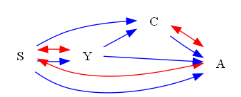
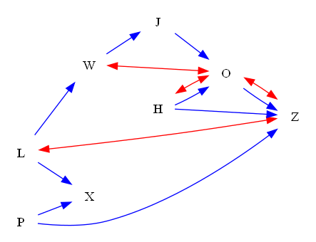
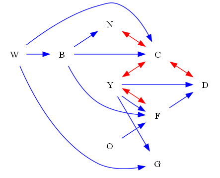
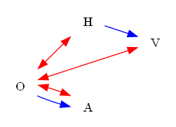
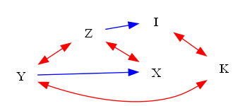
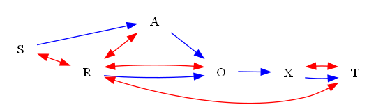

| Find All |How Many |Find One |Yes or No |Multiple Choice |Existence | total |
|:------:|:------:|:------:|:------:|:------:|:------:|:------:|
| 0 |0 |0 |120 |0 |0 | 120 |

|  N=4 | N=5 | N=6 | N=7 | N=8 | N=9 | total |
|:------:|:------:|:------:|:------:|:------:|:------:|:------:|
| 20 |20 |20 |20 |20 |20 | 120 |

|  Yes. | No. | judge_total |
|:------:|:------:|:------:|
| 30 |90 | 120 |

## ID: 05151979
### Graph
- graph type: ADMG
- description: Given an ADMG (acyclic directed mixed graph) with nodes E, D, S, V, directed edges D->S, E->V, E->D, E->S, S->V and bi-directed edges S<->V.

### Questions
- [YN] Is it a C-tree? 
### Answers
- No.
## ID: 13847440
### Graph
- graph type: ADMG
- description: Given an ADMG (acyclic directed mixed graph) with nodes G, P, Z, E, directed edges Z->E, G->E, G->Z, P->E, G->P, P->Z and bi-directed edges Z<->E, P<->Z, G<->E.

### Questions
- [YN] Is it a C-tree? 
### Answers
- No.
## ID: 57475838
### Graph
- graph type: ADMG
- description: Given an ADMG (acyclic directed mixed graph) with nodes H, V, Y, X, directed edges H->Y, V->Y, V->X and bi-directed edges V<->X.

### Questions
- [YN] Is it a C-tree? 
### Answers
- No.
## ID: 25700463
### Graph
- graph type: ADMG
- description: Given an ADMG (acyclic directed mixed graph) with nodes S, Y, C, A, directed edges Y->C, C->A, Y->A, S->C, S->A, S->Y and bi-directed edges S<->A, S<->Y, C<->A.

### Questions
- [YN] Is it a C-tree? 
### Answers
- No.
## ID: 79997458
### Graph
- graph type: ADMG
- description: Given an ADMG (acyclic directed mixed graph) with nodes C, J, D, E, directed edges J->E, J->D, C->E, C->D, C->J and bi-directed edges J<->E.

### Questions
- [YN] Is it a C-tree? 
### Answers
- No.
## ID: 47341150
### Graph
- graph type: ADMG
- description: Given an ADMG (acyclic directed mixed graph) with nodes U, K, J, O, E, directed edges U->E, O->E, U->K, K->E, U->O, K->O, U->J, J->O, K->J, J->E and bi-directed edges K<->J.

### Questions
- [YN] Is it a C-tree? 
### Answers
- No.
## ID: 96904187
### Graph
- graph type: ADMG
- description: Given an ADMG (acyclic directed mixed graph) with nodes D, F, S, K, U, directed edges F->U, S->U, D->F, D->S, F->K and bi-directed edges D<->F, D<->S.

### Questions
- [YN] Is it a C-tree? 
### Answers
- No.
## ID: 04514962
### Graph
- graph type: ADMG
- description: Given an ADMG (acyclic directed mixed graph) with nodes D, I, C, J, O, directed edges J->O, I->J, I->O, C->O, D->I, I->C, D->C, D->O and bi-directed edges C<->J, I<->O, D<->C, I<->C.

### Questions
- [YN] Is it a C-tree? 
### Answers
- No.
## ID: 24176518
### Graph
- graph type: ADMG
- description: Given an ADMG (acyclic directed mixed graph) with nodes K, W, E, I, H, directed edges E->H, K->W, K->H, I->H and bi-directed edges K<->H.

### Questions
- [YN] Is it a C-tree? 
### Answers
- No.
## ID: 52820950
### Graph
- graph type: ADMG
- description: Given an ADMG (acyclic directed mixed graph) with nodes I, D, G, E, X, directed edges I->E, D->E, I->G, I->D, G->X, D->G, E->X, G->E, D->X, I->X and bi-directed edges I<->E, G<->X.

### Questions
- [YN] Is it a C-tree? 
### Answers
- No.
## ID: 76980093
### Graph
- graph type: ADMG
- description: Given an ADMG (acyclic directed mixed graph) with nodes A, B, H, L, F, I, directed edges H->I, A->L, H->L, F->I, A->I, A->H, B->I, B->H, B->L, H->F and bi-directed edges B<->F, A<->L, H<->L, H<->F.

### Questions
- [YN] Is it a C-tree? 
### Answers
- No.
## ID: 90305658
### Graph
- graph type: ADMG
- description: Given an ADMG (acyclic directed mixed graph) with nodes E, X, P, T, S, Y, directed edges X->Y, X->S, E->Y, T->Y, P->T, P->S and bi-directed edges E<->T, X<->S, P<->Y.

### Questions
- [YN] Is it a C-tree? 
### Answers
- No.
## ID: 02260091
### Graph
- graph type: ADMG
- description: Given an ADMG (acyclic directed mixed graph) with nodes X, S, M, B, C, T, directed edges X->T, M->B, B->C, X->S, X->B, M->C and bi-directed edges S<->C, C<->T.

### Questions
- [YN] Is it a C-tree? 
### Answers
- No.
## ID: 90822947
### Graph
- graph type: ADMG
- description: Given an ADMG (acyclic directed mixed graph) with nodes C, O, J, I, M, S, directed edges C->S, O->S, J->I, M->S, O->I, O->J, C->J, C->I and bi-directed edges O<->J.

### Questions
- [YN] Is it a C-tree? 
### Answers
- No.
## ID: 39096164
### Graph
- graph type: ADMG
- description: Given an ADMG (acyclic directed mixed graph) with nodes F, O, G, C, Y, M, directed edges G->C, F->G, O->M, F->M, G->M, O->Y, G->Y, O->G and bi-directed edges F<->O, G<->C, F<->G, F<->M.

### Questions
- [YN] Is it a C-tree? 
### Answers
- No.
## ID: 61969808
### Graph
- graph type: ADMG
- description: Given an ADMG (acyclic directed mixed graph) with nodes J, L, Z, Q, O, M, I, directed edges O->M, L->I, L->M, Z->O, L->Z, J->I, Q->I, M->I, L->Q, J->Z, O->I, J->M and bi-directed edges Z<->I, Z<->M, J<->L, J<->Q, O<->I.

### Questions
- [YN] Is it a C-tree? 
### Answers
- No.
## ID: 92804559
### Graph
- graph type: ADMG
- description: Given an ADMG (acyclic directed mixed graph) with nodes O, G, W, I, B, U, H, directed edges I->B, O->H, W->B, O->B, B->U, I->H, O->G and bi-directed edges O<->B, G<->U.

### Questions
- [YN] Is it a C-tree? 
### Answers
- No.
## ID: 03358317
### Graph
- graph type: ADMG
- description: Given an ADMG (acyclic directed mixed graph) with nodes U, L, P, B, V, K, W, directed edges V->W, B->V, P->K, U->V, U->B, K->W, B->W, B->K, L->P, P->W, U->P, L->W and bi-directed edges L<->V, B<->V, P<->K, U<->B, B<->W.

### Questions
- [YN] Is it a C-tree? 
### Answers
- No.
## ID: 70316958
### Graph
- graph type: ADMG
- description: Given an ADMG (acyclic directed mixed graph) with nodes V, E, G, T, Y, P, K, directed edges V->E, E->Y, G->T, T->K, V->G, T->P and bi-directed edges E<->Y.

### Questions
- [YN] Is it a C-tree? 
### Answers
- No.
## ID: 77681030
### Graph
- graph type: ADMG
- description: Given an ADMG (acyclic directed mixed graph) with nodes M, W, K, S, E, Q, R, directed edges W->R, S->Q, W->E, S->R, K->E, M->Q, M->R, M->S, S->E and bi-directed edges M<->W.

### Questions
- [YN] Is it a C-tree? 
### Answers
- No.
## ID: 43227148
### Graph
- graph type: ADMG
- description: Given an ADMG (acyclic directed mixed graph) with nodes L, W, P, H, X, J, O, Z, directed edges O->Z, H->O, H->Z, W->J, P->Z, L->X, J->O, L->W, P->X and bi-directed edges O<->Z, H<->O, L<->Z, W<->O.

### Questions
- [YN] Is it a C-tree? 
### Answers
- No.
## ID: 32123723
### Graph
- graph type: ADMG
- description: Given an ADMG (acyclic directed mixed graph) with nodes D, W, T, O, C, Q, S, Y, directed edges D->C, C->Y, Q->Y, W->T, O->S, T->Q, D->W, Q->S, S->Y, D->T, T->C, O->Q and bi-directed edges W<->T, T<->S, S<->Y.

### Questions
- [YN] Is it a C-tree? 
### Answers
- No.
## ID: 99647106
### Graph
- graph type: ADMG
- description: Given an ADMG (acyclic directed mixed graph) with nodes M, I, T, J, U, X, B, L, directed edges J->B, M->U, J->U, I->L, I->J, M->L, T->X, U->X, M->I, M->B and bi-directed edges I<->L, T<->J.

### Questions
- [YN] Is it a C-tree? 
### Answers
- No.
## ID: 56453928
### Graph
- graph type: ADMG
- description: Given an ADMG (acyclic directed mixed graph) with nodes Q, X, L, B, D, C, J, V, directed edges C->J, X->V, L->C, D->J, D->C, B->V, Q->X, X->C, X->B and bi-directed edges B<->C, X<->D, Q<->C.

### Questions
- [YN] Is it a C-tree? 
### Answers
- No.
## ID: 88977840
### Graph
- graph type: ADMG
- description: Given an ADMG (acyclic directed mixed graph) with nodes W, N, G, K, X, R, U, C, directed edges W->K, N->G, N->X, W->X, N->U, G->R, K->C and bi-directed edges W<->G.

### Questions
- [YN] Is it a C-tree? 
### Answers
- No.
## ID: 23994656
### Graph
- graph type: ADMG
- description: Given an ADMG (acyclic directed mixed graph) with nodes Y, W, O, B, N, F, C, G, D, directed edges W->B, Y->F, Y->G, B->F, Y->D, F->D, W->C, B->C, W->G, O->F, B->N and bi-directed edges Y<->C, C<->D, Y<->F, N<->C.

### Questions
- [YN] Is it a C-tree? 
### Answers
- No.
## ID: 84518641
### Graph
- graph type: ADMG
- description: Given an ADMG (acyclic directed mixed graph) with nodes O, H, E, X, U, Y, I, T, R, directed edges E->U, U->R, U->I, O->H, H->T, E->Y, H->X, X->R, E->X, X->T, H->E and bi-directed edges H<->I, I<->T, O<->T, O<->Y, H<->R.

### Questions
- [YN] Is it a C-tree? 
### Answers
- No.
## ID: 83282475
### Graph
- graph type: ADMG
- description: Given an ADMG (acyclic directed mixed graph) with nodes L, Y, I, A, S, R, J, G, C, directed edges Y->G, S->C, I->C, A->C, S->R, L->I, I->J, L->G, R->J, L->R, Y->A, S->G and bi-directed edges I<->J, Y<->J, L<->C, I<->R.

### Questions
- [YN] Is it a C-tree? 
### Answers
- No.
## ID: 57146060
### Graph
- graph type: ADMG
- description: Given an ADMG (acyclic directed mixed graph) with nodes B, Z, A, U, G, V, Y, I, C, directed edges V->C, Z->C, Z->A, Z->V, G->Y, A->C, B->Z, B->Y, V->I, U->V and bi-directed edges Z<->C, A<->Y, U<->Y, A<->C, U<->V.

### Questions
- [YN] Is it a C-tree? 
### Answers
- No.
## ID: 14583048
### Graph
- graph type: ADMG
- description: Given an ADMG (acyclic directed mixed graph) with nodes F, T, D, I, O, V, X, W, N, directed edges D->V, I->W, F->N, D->O, W->N, X->N, F->T, V->N and bi-directed edges T<->V, F<->T, T<->X.

### Questions
- [YN] Is it a C-tree? 
### Answers
- No.
## ID: 41236428
### Graph
- graph type: C-component
- description: Given an ADMG (acyclic directed mixed graph) with nodes J, F, H, L, directed edges J->L, F->L, F->H, J->F, H->L, J->H and bi-directed edges F<->H, J<->F, F<->L.

### Questions
- [YN] Is it a C-tree? 
### Answers
- No.
## ID: 79415078
### Graph
- graph type: C-component
- description: Given an ADMG (acyclic directed mixed graph) with nodes B, G, S, A, directed edges B->G, B->S, G->A, S->A, G->S, B->A and bi-directed edges G<->A, G<->S, B<->G.

### Questions
- [YN] Is it a C-tree? 
### Answers
- No.
## ID: 59682901
### Graph
- graph type: C-component
- description: Given an ADMG (acyclic directed mixed graph) with nodes R, B, D, U, directed edges R->D, B->D, R->U, R->B, B->U and bi-directed edges D<->U, R<->D, B<->D.

### Questions
- [YN] Is it a C-tree? 
### Answers
- No.
## ID: 75948771
### Graph
- graph type: C-component
- description: Given an ADMG (acyclic directed mixed graph) with nodes D, B, Y, N, directed edges D->B, B->Y, D->N, Y->N, D->Y and bi-directed edges D<->N, B<->N, D<->Y.

### Questions
- [YN] Is it a C-tree? 
### Answers
- No.
## ID: 00903250
### Graph
- graph type: C-component
- description: Given an ADMG (acyclic directed mixed graph) with nodes Z, P, E, L, directed edges P->L, Z->L, Z->E, E->L and bi-directed edges Z<->E, Z<->P, Z<->L.

### Questions
- [YN] Is it a C-tree? 
### Answers
- No.
## ID: 47358863
### Graph
- graph type: C-component
- description: Given an ADMG (acyclic directed mixed graph) with nodes A, F, I, U, M, directed edges I->U, A->M, A->F, F->I and bi-directed edges F<->M, F<->U, A<->F, I<->M.

### Questions
- [YN] Is it a C-tree? 
### Answers
- No.
## ID: 75725062
### Graph
- graph type: C-component
- description: Given an ADMG (acyclic directed mixed graph) with nodes R, Q, Y, S, V, directed edges Y->S, Y->V, Q->S, Q->Y, R->Y, R->V, R->S and bi-directed edges Y<->V, R<->V, R<->Q, Q<->S.

### Questions
- [YN] Is it a C-tree? 
### Answers
- No.
## ID: 85074865
### Graph
- graph type: C-component
- description: Given an ADMG (acyclic directed mixed graph) with nodes W, S, V, Y, H, directed edges S->Y, W->H, V->Y, W->S and bi-directed edges W<->H, W<->V, W<->Y, S<->Y.

### Questions
- [YN] Is it a C-tree? 
### Answers
- No.
## ID: 98660183
### Graph
- graph type: C-component
- description: Given an ADMG (acyclic directed mixed graph) with nodes L, X, N, D, Z, directed edges X->N, X->D, D->Z, L->X, N->D, L->N, L->D, X->Z, N->Z, L->Z and bi-directed edges L<->D, N<->D, L<->Z, L<->X.

### Questions
- [YN] Is it a C-tree? 
### Answers
- No.
## ID: 42883713
### Graph
- graph type: C-component
- description: Given an ADMG (acyclic directed mixed graph) with nodes F, Q, U, Y, I, directed edges F->Y, Y->I, U->I, Q->Y and bi-directed edges U<->I, F<->U, Q<->U, U<->Y.

### Questions
- [YN] Is it a C-tree? 
### Answers
- No.
## ID: 44351592
### Graph
- graph type: C-component
- description: Given an ADMG (acyclic directed mixed graph) with nodes Y, Q, H, X, C, K, directed edges H->X, Q->H, C->K, H->K, Y->H, X->C, H->C, Q->K and bi-directed edges X<->C, H<->C, Q<->H, Y<->C, H<->K.

### Questions
- [YN] Is it a C-tree? 
### Answers
- No.
## ID: 08176042
### Graph
- graph type: C-component
- description: Given an ADMG (acyclic directed mixed graph) with nodes I, A, L, U, J, V, directed edges A->V, I->J, U->J, I->L, I->U, A->J and bi-directed edges I<->A, A<->L, A<->U, L<->J, A<->V.

### Questions
- [YN] Is it a C-tree? 
### Answers
- No.
## ID: 40898412
### Graph
- graph type: C-component
- description: Given an ADMG (acyclic directed mixed graph) with nodes Q, A, W, V, N, X, directed edges Q->N, Q->X, W->V, Q->A, Q->W and bi-directed edges A<->W, A<->V, W<->N, V<->X, Q<->X.

### Questions
- [YN] Is it a C-tree? 
### Answers
- No.
## ID: 47610829
### Graph
- graph type: C-component
- description: Given an ADMG (acyclic directed mixed graph) with nodes C, G, T, F, L, J, directed edges C->F, C->T, T->L, G->L, G->T, C->G, L->J, G->F and bi-directed edges F<->J, T<->F, C<->F, L<->J, G<->T.

### Questions
- [YN] Is it a C-tree? 
### Answers
- No.
## ID: 64421953
### Graph
- graph type: C-component
- description: Given an ADMG (acyclic directed mixed graph) with nodes P, V, J, W, G, Y, directed edges V->J, J->Y, P->G, V->G, P->W, V->Y, P->J and bi-directed edges P<->V, P<->W, P<->G, J<->W, W<->Y.

### Questions
- [YN] Is it a C-tree? 
### Answers
- No.
## ID: 84009260
### Graph
- graph type: C-component
- description: Given an ADMG (acyclic directed mixed graph) with nodes R, U, V, L, X, A, W, directed edges V->X, U->A, R->L, V->L, R->U, X->W, R->V, L->A, R->X and bi-directed edges R<->V, R<->A, V<->X, L<->X, U<->L, X<->W.

### Questions
- [YN] Is it a C-tree? 
### Answers
- No.
## ID: 92747560
### Graph
- graph type: C-component
- description: Given an ADMG (acyclic directed mixed graph) with nodes I, A, Q, U, P, Y, O, directed edges Q->O, Y->O, I->Y, A->O, I->Q, A->P, A->U, Q->U, U->Y, A->Q, A->Y, I->A and bi-directed edges Q<->U, A<->U, A<->Y, P<->Y, A<->O, I<->Y.

### Questions
- [YN] Is it a C-tree? 
### Answers
- No.
## ID: 60182180
### Graph
- graph type: C-component
- description: Given an ADMG (acyclic directed mixed graph) with nodes O, F, M, A, P, J, U, directed edges O->A, M->U, O->J, A->J, F->M, F->P, P->U, M->J, M->P, A->U, F->U, A->P and bi-directed edges F<->U, F<->J, M<->J, O<->J, A<->U, F<->P.

### Questions
- [YN] Is it a C-tree? 
### Answers
- No.
## ID: 56939975
### Graph
- graph type: C-component
- description: Given an ADMG (acyclic directed mixed graph) with nodes T, P, C, F, Y, R, V, directed edges P->R, R->V, T->R, P->V, Y->V, P->F, F->V, T->C, C->Y, P->Y, T->V and bi-directed edges R<->V, T<->R, Y<->V, F<->Y, P<->R, C<->F.

### Questions
- [YN] Is it a C-tree? 
### Answers
- No.
## ID: 96315601
### Graph
- graph type: C-component
- description: Given an ADMG (acyclic directed mixed graph) with nodes M, G, X, B, D, O, Y, directed edges X->B, D->O, G->D, D->Y, M->G, M->Y, G->X, M->B, B->O, X->Y and bi-directed edges D<->O, X<->O, M<->O, B<->O, O<->Y, G<->O.

### Questions
- [YN] Is it a C-tree? 
### Answers
- No.
## ID: 29283700
### Graph
- graph type: C-component
- description: Given an ADMG (acyclic directed mixed graph) with nodes C, R, K, A, B, F, L, N, directed edges A->L, F->L, R->K, B->F, R->F, A->N, K->A, B->L, R->N, C->A, L->N and bi-directed edges K<->L, K<->A, C<->K, C<->N, B<->L, A<->F, R<->A.

### Questions
- [YN] Is it a C-tree? 
### Answers
- No.
## ID: 49010328
### Graph
- graph type: C-component
- description: Given an ADMG (acyclic directed mixed graph) with nodes U, F, Q, N, P, C, X, V, directed edges N->C, U->F, Q->X, P->C, F->N, F->V, Q->N, P->V, U->P, F->Q, Q->C, X->V and bi-directed edges N<->V, N<->C, Q<->V, C<->X, P<->C, F<->C, U<->F.

### Questions
- [YN] Is it a C-tree? 
### Answers
- No.
## ID: 99292594
### Graph
- graph type: C-component
- description: Given an ADMG (acyclic directed mixed graph) with nodes P, H, Y, E, V, N, R, D, directed edges P->V, V->N, Y->R, Y->D, P->N, P->D, R->D, V->R, N->R, Y->N, P->E, H->N and bi-directed edges Y<->E, E<->D, P<->E, P<->R, N<->D, V<->N, H<->N.

### Questions
- [YN] Is it a C-tree? 
### Answers
- No.
## ID: 83335492
### Graph
- graph type: C-component
- description: Given an ADMG (acyclic directed mixed graph) with nodes J, L, F, Q, A, X, G, K, directed edges F->G, Q->X, F->X, F->A, G->K, Q->K, L->F, J->F, L->X, Q->A and bi-directed edges L<->G, L<->X, L<->Q, J<->Q, F<->X, F<->A, L<->K.

### Questions
- [YN] Is it a C-tree? 
### Answers
- No.
## ID: 50124878
### Graph
- graph type: C-component
- description: Given an ADMG (acyclic directed mixed graph) with nodes A, X, U, L, H, B, O, Y, directed edges U->H, A->O, B->Y, L->B, H->O, A->X, U->O, X->L, A->H, B->O, L->Y, A->U and bi-directed edges B<->O, H<->O, U<->B, L<->H, X<->H, L<->Y, A<->X.

### Questions
- [YN] Is it a C-tree? 
### Answers
- No.
## ID: 83647914
### Graph
- graph type: C-component
- description: Given an ADMG (acyclic directed mixed graph) with nodes I, F, V, X, O, B, Y, N, L, directed edges Y->L, X->N, I->F, I->L, X->L, V->B, I->O, V->L and bi-directed edges I<->Y, B<->Y, I<->L, O<->Y, X<->B, X<->N, V<->B, F<->L.

### Questions
- [YN] Is it a C-tree? 
### Answers
- No.
## ID: 34446259
### Graph
- graph type: C-component
- description: Given an ADMG (acyclic directed mixed graph) with nodes Z, I, H, B, N, V, U, P, S, directed edges B->P, H->B, I->S, B->U, U->P, V->P, Z->P, N->S, I->B, I->P and bi-directed edges I<->U, Z<->U, U<->P, Z<->H, I<->V, I<->B, Z<->S, I<->N.

### Questions
- [YN] Is it a C-tree? 
### Answers
- No.
## ID: 44623121
### Graph
- graph type: C-component
- description: Given an ADMG (acyclic directed mixed graph) with nodes Z, M, I, V, R, W, K, L, Q, directed edges M->V, I->V, I->Q, I->L, I->R, W->K, K->L, I->W, Z->M, I->K, V->L, Z->V and bi-directed edges I<->W, I<->R, Z<->R, M<->I, W<->Q, V<->W, I<->L, Z<->K.

### Questions
- [YN] Is it a C-tree? 
### Answers
- No.
## ID: 72418806
### Graph
- graph type: C-component
- description: Given an ADMG (acyclic directed mixed graph) with nodes L, D, C, F, O, B, N, Q, J, directed edges L->O, C->J, F->B, B->J, D->J, D->O, O->N, F->Q, B->Q, O->Q, D->N, D->B and bi-directed edges L<->D, L<->Q, C<->Q, C<->N, C<->F, F<->O, F<->B, O<->J.

### Questions
- [YN] Is it a C-tree? 
### Answers
- No.
## ID: 03482101
### Graph
- graph type: C-component
- description: Given an ADMG (acyclic directed mixed graph) with nodes J, F, L, I, G, P, V, M, X, directed edges F->X, J->L, M->X, I->V, P->X, F->L, J->G, J->V, L->M, G->V and bi-directed edges J<->I, I<->G, J<->X, J<->M, F<->M, L<->G, L<->P, V<->M.

### Questions
- [YN] Is it a C-tree? 
### Answers
- No.
## ID: 41030918
### Graph
- graph type: C-forest
- description: Given an ADMG (acyclic directed mixed graph) with nodes X, M, D, Z, directed edges M->Z, X->M and bi-directed edges D<->Z, X<->Z, M<->D.

### Questions
- [YN] Is it a C-tree? 
### Answers
- No.
## ID: 94149669
### Graph
- graph type: C-forest
- description: Given an ADMG (acyclic directed mixed graph) with nodes R, H, Z, P, directed edges H->P, R->H and bi-directed edges R<->P, R<->Z, H<->Z.

### Questions
- [YN] Is it a C-tree? 
### Answers
- No.
## ID: 37209807
### Graph
- graph type: C-forest
- description: Given an ADMG (acyclic directed mixed graph) with nodes M, I, Z, P, directed edges I->Z, M->I and bi-directed edges Z<->P, M<->Z, I<->P.

### Questions
- [YN] Is it a C-tree? 
### Answers
- No.
## ID: 36376320
### Graph
- graph type: C-forest
- description: Given an ADMG (acyclic directed mixed graph) with nodes O, H, V, A, directed edges H->V, O->A and bi-directed edges O<->V, O<->A, O<->H.

### Questions
- [YN] Is it a C-tree? 
### Answers
- No.
## ID: 45604554
### Graph
- graph type: C-forest
- description: Given an ADMG (acyclic directed mixed graph) with nodes C, H, N, T, directed edges H->N, C->H and bi-directed edges C<->N, N<->T, H<->N.

### Questions
- [YN] Is it a C-tree? 
### Answers
- No.
## ID: 78647975
### Graph
- graph type: C-forest
- description: Given an ADMG (acyclic directed mixed graph) with nodes J, A, R, L, C, directed edges A->C, J->L and bi-directed edges A<->C, A<->R, A<->L, J<->C.

### Questions
- [YN] Is it a C-tree? 
### Answers
- No.
## ID: 65620203
### Graph
- graph type: C-forest
- description: Given an ADMG (acyclic directed mixed graph) with nodes W, N, B, H, Z, directed edges B->Z, N->B, W->B and bi-directed edges W<->Z, W<->N, N<->H, N<->B.

### Questions
- [YN] Is it a C-tree? 
### Answers
- No.
## ID: 99242181
### Graph
- graph type: C-forest
- description: Given an ADMG (acyclic directed mixed graph) with nodes F, R, P, D, L, directed edges P->D, R->L, F->P and bi-directed edges P<->D, R<->P, F<->P, R<->L.

### Questions
- [YN] Is it a C-tree? 
### Answers
- No.
## ID: 08674172
### Graph
- graph type: C-forest
- description: Given an ADMG (acyclic directed mixed graph) with nodes J, V, I, L, W, directed edges I->W, V->I, J->L and bi-directed edges J<->L, J<->W, J<->I, V<->I.

### Questions
- [YN] Is it a C-tree? 
### Answers
- No.
## ID: 01658326
### Graph
- graph type: C-forest
- description: Given an ADMG (acyclic directed mixed graph) with nodes Y, Z, I, X, K, directed edges Z->I, Y->X and bi-directed edges Y<->Z, Y<->K, Z<->X, I<->K.

### Questions
- [YN] Is it a C-tree? 
### Answers
- No.
## ID: 95110224
### Graph
- graph type: C-forest
- description: Given an ADMG (acyclic directed mixed graph) with nodes Q, Y, L, I, B, U, directed edges Y->U, Q->B and bi-directed edges L<->U, I<->U, Y<->I, Q<->L, Y<->B.

### Questions
- [YN] Is it a C-tree? 
### Answers
- No.
## ID: 99918582
### Graph
- graph type: C-forest
- description: Given an ADMG (acyclic directed mixed graph) with nodes D, M, H, U, R, L, directed edges H->R, M->R, D->U and bi-directed edges U<->R, H<->U, D<->R, R<->L, M<->U.

### Questions
- [YN] Is it a C-tree? 
### Answers
- No.
## ID: 37644973
### Graph
- graph type: C-forest
- description: Given an ADMG (acyclic directed mixed graph) with nodes W, G, J, M, P, R, directed edges M->P, J->M, G->J, W->J and bi-directed edges J<->M, G<->J, M<->R, P<->R, W<->M.

### Questions
- [YN] Is it a C-tree? 
### Answers
- No.
## ID: 33480743
### Graph
- graph type: C-forest
- description: Given an ADMG (acyclic directed mixed graph) with nodes S, T, L, X, E, I, directed edges X->I, L->E, T->E, S->X and bi-directed edges S<->L, L<->E, S<->I, T<->E, T<->X.

### Questions
- [YN] Is it a C-tree? 
### Answers
- No.
## ID: 53015050
### Graph
- graph type: C-forest
- description: Given an ADMG (acyclic directed mixed graph) with nodes Z, B, E, J, W, K, directed edges B->K, Z->J and bi-directed edges J<->W, B<->J, J<->K, E<->K, Z<->B.

### Questions
- [YN] Is it a C-tree? 
### Answers
- No.
## ID: 15526091
### Graph
- graph type: C-forest
- description: Given an ADMG (acyclic directed mixed graph) with nodes Q, K, I, X, J, G, W, directed edges I->G, K->G, Q->I and bi-directed edges Q<->K, Q<->J, Q<->X, X<->W, I<->X, J<->G.

### Questions
- [YN] Is it a C-tree? 
### Answers
- No.
## ID: 22519975
### Graph
- graph type: C-forest
- description: Given an ADMG (acyclic directed mixed graph) with nodes V, J, P, W, O, I, R, directed edges W->R, P->O, J->R, V->W and bi-directed edges J<->I, V<->J, J<->W, J<->P, J<->O, P<->R.

### Questions
- [YN] Is it a C-tree? 
### Answers
- No.
## ID: 78444311
### Graph
- graph type: C-forest
- description: Given an ADMG (acyclic directed mixed graph) with nodes Q, D, O, X, F, N, A, directed edges O->N, D->N, Q->N and bi-directed edges Q<->N, Q<->O, F<->N, D<->F, X<->N, Q<->A.

### Questions
- [YN] Is it a C-tree? 
### Answers
- No.
## ID: 78549876
### Graph
- graph type: C-forest
- description: Given an ADMG (acyclic directed mixed graph) with nodes H, Z, K, X, S, U, D, directed edges X->S, K->U, Z->U, H->X and bi-directed edges H<->S, S<->D, S<->U, H<->X, Z<->U, K<->X.

### Questions
- [YN] Is it a C-tree? 
### Answers
- No.
## ID: 24684702
### Graph
- graph type: C-forest
- description: Given an ADMG (acyclic directed mixed graph) with nodes I, D, M, H, F, Q, W, directed edges F->Q, H->F, M->F, D->H, I->H and bi-directed edges I<->D, I<->H, H<->F, H<->Q, D<->W, I<->M.

### Questions
- [YN] Is it a C-tree? 
### Answers
- No.
## ID: 88155590
### Graph
- graph type: C-forest
- description: Given an ADMG (acyclic directed mixed graph) with nodes X, M, K, L, Z, H, O, R, directed edges L->R, K->Z, M->L, X->L and bi-directed edges H<->O, X<->H, O<->R, Z<->H, K<->R, M<->K, X<->L.

### Questions
- [YN] Is it a C-tree? 
### Answers
- No.
## ID: 23760437
### Graph
- graph type: C-forest
- description: Given an ADMG (acyclic directed mixed graph) with nodes G, W, I, K, T, A, L, X, directed edges K->X, I->A, W->I, G->L and bi-directed edges I<->T, W<->I, W<->X, L<->X, T<->A, G<->I, K<->T.

### Questions
- [YN] Is it a C-tree? 
### Answers
- No.
## ID: 09221511
### Graph
- graph type: C-forest
- description: Given an ADMG (acyclic directed mixed graph) with nodes S, U, I, A, B, J, T, M, directed edges A->M, I->T, U->I, S->I and bi-directed edges U<->I, I<->J, U<->T, T<->M, A<->M, S<->A, A<->B.

### Questions
- [YN] Is it a C-tree? 
### Answers
- No.
## ID: 79122056
### Graph
- graph type: C-forest
- description: Given an ADMG (acyclic directed mixed graph) with nodes R, B, T, M, J, X, K, Q, directed edges M->J, T->X, B->Q, R->T and bi-directed edges J<->Q, B<->J, T<->J, T<->X, M<->J, R<->Q, J<->K.

### Questions
- [YN] Is it a C-tree? 
### Answers
- No.
## ID: 82258831
### Graph
- graph type: C-forest
- description: Given an ADMG (acyclic directed mixed graph) with nodes E, A, K, J, Z, Y, N, F, directed edges J->Y, K->N, A->N, E->K and bi-directed edges E<->F, E<->Z, A<->F, J<->F, E<->Y, J<->N, A<->K.

### Questions
- [YN] Is it a C-tree? 
### Answers
- No.
## ID: 16261499
### Graph
- graph type: C-forest
- description: Given an ADMG (acyclic directed mixed graph) with nodes I, W, B, V, G, O, L, C, R, directed edges G->O, V->O, B->L, W->L, I->L and bi-directed edges W<->C, W<->O, V<->O, G<->C, W<->B, I<->W, G<->L, B<->R.

### Questions
- [YN] Is it a C-tree? 
### Answers
- No.
## ID: 50894112
### Graph
- graph type: C-forest
- description: Given an ADMG (acyclic directed mixed graph) with nodes Z, C, K, X, W, T, J, N, I, directed edges W->T, X->T, K->I, C->X, Z->N and bi-directed edges Z<->T, C<->T, C<->J, C<->K, X<->J, T<->I, W<->J, W<->N.

### Questions
- [YN] Is it a C-tree? 
### Answers
- No.
## ID: 69016218
### Graph
- graph type: C-forest
- description: Given an ADMG (acyclic directed mixed graph) with nodes G, D, I, K, L, S, B, R, N, directed edges L->N, K->S, I->N, D->S, G->D and bi-directed edges K<->R, G<->K, B<->R, D<->R, G<->L, G<->N, D<->I, K<->S.

### Questions
- [YN] Is it a C-tree? 
### Answers
- No.
## ID: 19884943
### Graph
- graph type: C-forest
- description: Given an ADMG (acyclic directed mixed graph) with nodes A, W, G, C, Y, F, P, U, Q, directed edges P->Q, F->Q, Y->U, C->Q, G->P, W->F, A->W and bi-directed edges Y<->F, W<->F, W<->Q, G<->Q, A<->W, C<->Q, F<->U, A<->P.

### Questions
- [YN] Is it a C-tree? 
### Answers
- No.
## ID: 25578701
### Graph
- graph type: C-forest
- description: Given an ADMG (acyclic directed mixed graph) with nodes A, B, P, Q, R, D, S, Z, T, directed edges S->T, D->S, R->S, Q->T, P->S, B->S, A->S and bi-directed edges R<->S, R<->T, P<->R, A<->S, P<->Q, B<->T, Q<->Z, D<->S.

### Questions
- [YN] Is it a C-tree? 
### Answers
- No.
## ID: 09059140
### Graph
- graph type: C-tree
- description: Given an ADMG (acyclic directed mixed graph) with nodes A, E, W, H, directed edges W->H, E->H, A->H and bi-directed edges A<->H, W<->H, E<->H.

### Questions
- [YN] Is it a C-tree? 
### Answers
- Yes.
## ID: 90632228
### Graph
- graph type: C-tree
- description: Given an ADMG (acyclic directed mixed graph) with nodes M, B, G, W, directed edges G->W, B->W, M->B and bi-directed edges M<->B, M<->G, M<->W.

### Questions
- [YN] Is it a C-tree? 
### Answers
- Yes.
## ID: 36431678
### Graph
- graph type: C-tree
- description: Given an ADMG (acyclic directed mixed graph) with nodes F, Y, M, W, directed edges M->W, Y->M, F->W and bi-directed edges Y<->W, F<->Y, Y<->M.

### Questions
- [YN] Is it a C-tree? 
### Answers
- Yes.
## ID: 11659893
### Graph
- graph type: C-tree
- description: Given an ADMG (acyclic directed mixed graph) with nodes B, M, W, V, directed edges W->V, M->W, B->M and bi-directed edges B<->M, B<->W, M<->V.

### Questions
- [YN] Is it a C-tree? 
### Answers
- Yes.
## ID: 41700943
### Graph
- graph type: C-tree
- description: Given an ADMG (acyclic directed mixed graph) with nodes A, K, G, O, directed edges G->O, K->G, A->O and bi-directed edges K<->O, A<->K, K<->G.

### Questions
- [YN] Is it a C-tree? 
### Answers
- Yes.
## ID: 26147177
### Graph
- graph type: C-tree
- description: Given an ADMG (acyclic directed mixed graph) with nodes C, M, V, L, R, directed edges L->R, V->R, M->V, C->V and bi-directed edges M<->R, V<->R, C<->M, M<->L.

### Questions
- [YN] Is it a C-tree? 
### Answers
- Yes.
## ID: 09482010
### Graph
- graph type: C-tree
- description: Given an ADMG (acyclic directed mixed graph) with nodes N, J, Q, T, E, directed edges T->E, Q->E, J->T, N->Q and bi-directed edges N<->J, N<->T, J<->E, Q<->T.

### Questions
- [YN] Is it a C-tree? 
### Answers
- Yes.
## ID: 30603061
### Graph
- graph type: C-tree
- description: Given an ADMG (acyclic directed mixed graph) with nodes W, U, B, L, Y, directed edges L->Y, B->Y, U->B, W->L and bi-directed edges B<->Y, L<->Y, W<->L, U<->Y.

### Questions
- [YN] Is it a C-tree? 
### Answers
- Yes.
## ID: 44494224
### Graph
- graph type: C-tree
- description: Given an ADMG (acyclic directed mixed graph) with nodes W, C, H, F, K, directed edges F->K, H->K, C->K, W->K and bi-directed edges H<->F, H<->K, W<->K, C<->F.

### Questions
- [YN] Is it a C-tree? 
### Answers
- Yes.
## ID: 10487187
### Graph
- graph type: C-tree
- description: Given an ADMG (acyclic directed mixed graph) with nodes Q, C, U, W, X, directed edges W->X, U->X, C->U, Q->C and bi-directed edges C<->X, C<->W, Q<->W, U<->X.

### Questions
- [YN] Is it a C-tree? 
### Answers
- Yes.
## ID: 66052266
### Graph
- graph type: C-tree
- description: Given an ADMG (acyclic directed mixed graph) with nodes S, R, A, O, X, T, directed edges X->T, O->X, A->O, R->O, S->A and bi-directed edges R<->T, S<->R, R<->O, R<->A, X<->T.

### Questions
- [YN] Is it a C-tree? 
### Answers
- Yes.
## ID: 48133673
### Graph
- graph type: C-tree
- description: Given an ADMG (acyclic directed mixed graph) with nodes E, K, I, P, G, L, directed edges G->L, P->L, I->L, K->L, E->L and bi-directed edges P<->L, I<->P, K<->P, K<->G, E<->I.

### Questions
- [YN] Is it a C-tree? 
### Answers
- Yes.
## ID: 06879148
### Graph
- graph type: C-tree
- description: Given an ADMG (acyclic directed mixed graph) with nodes E, S, Z, Y, F, N, directed edges F->N, Y->F, Z->F, S->Z, E->Y and bi-directed edges E<->Y, Z<->Y, E<->F, Y<->N, S<->Y.

### Questions
- [YN] Is it a C-tree? 
### Answers
- Yes.
## ID: 56369286
### Graph
- graph type: C-tree
- description: Given an ADMG (acyclic directed mixed graph) with nodes I, P, L, E, R, F, directed edges R->F, E->R, L->R, P->L, I->E and bi-directed edges P<->E, I<->E, I<->L, P<->R, L<->F.

### Questions
- [YN] Is it a C-tree? 
### Answers
- Yes.
## ID: 55673593
### Graph
- graph type: C-tree
- description: Given an ADMG (acyclic directed mixed graph) with nodes J, T, H, N, P, X, directed edges P->X, N->X, H->P, T->H, J->T and bi-directed edges N<->P, J<->N, P<->X, H<->X, T<->H.

### Questions
- [YN] Is it a C-tree? 
### Answers
- Yes.
## ID: 48489810
### Graph
- graph type: C-tree
- description: Given an ADMG (acyclic directed mixed graph) with nodes S, U, M, J, O, A, G, directed edges A->G, O->A, J->G, M->A, U->M, S->J and bi-directed edges S<->G, J<->G, M<->G, S<->A, U<->M, O<->A.

### Questions
- [YN] Is it a C-tree? 
### Answers
- Yes.
## ID: 58745899
### Graph
- graph type: C-tree
- description: Given an ADMG (acyclic directed mixed graph) with nodes K, M, D, U, C, H, A, directed edges H->A, C->H, U->A, D->U, M->A, K->U and bi-directed edges K<->H, D<->H, D<->A, U<->A, C<->A, M<->U.

### Questions
- [YN] Is it a C-tree? 
### Answers
- Yes.
## ID: 12502507
### Graph
- graph type: C-tree
- description: Given an ADMG (acyclic directed mixed graph) with nodes T, S, F, C, H, W, P, directed edges W->P, H->W, C->W, F->W, S->F, T->C and bi-directed edges F<->P, W<->P, S<->P, T<->F, H<->W, C<->P.

### Questions
- [YN] Is it a C-tree? 
### Answers
- Yes.
## ID: 39475076
### Graph
- graph type: C-tree
- description: Given an ADMG (acyclic directed mixed graph) with nodes R, S, K, P, X, Y, V, directed edges Y->V, X->V, P->Y, K->P, S->Y, R->V and bi-directed edges R<->X, X<->Y, Y<->V, P<->Y, S<->X, K<->P.

### Questions
- [YN] Is it a C-tree? 
### Answers
- Yes.
## ID: 29615369
### Graph
- graph type: C-tree
- description: Given an ADMG (acyclic directed mixed graph) with nodes W, D, L, F, P, V, U, directed edges V->U, P->U, F->P, L->V, D->P, W->F and bi-directed edges F<->V, P<->V, P<->U, W<->U, D<->F, L<->U.

### Questions
- [YN] Is it a C-tree? 
### Answers
- Yes.
## ID: 75392218
### Graph
- graph type: C-tree
- description: Given an ADMG (acyclic directed mixed graph) with nodes N, W, T, K, M, X, J, S, directed edges J->S, X->J, M->S, K->J, T->K, W->K, N->W and bi-directed edges T<->M, T<->K, M<->J, K<->S, W<->S, M<->X, N<->J.

### Questions
- [YN] Is it a C-tree? 
### Answers
- Yes.
## ID: 98859553
### Graph
- graph type: C-tree
- description: Given an ADMG (acyclic directed mixed graph) with nodes C, T, Q, U, D, L, B, H, directed edges B->H, L->B, D->H, U->H, Q->H, T->D, C->L and bi-directed edges Q<->U, U<->D, C<->D, C<->L, C<->T, C<->B, L<->H.

### Questions
- [YN] Is it a C-tree? 
### Answers
- Yes.
## ID: 64044307
### Graph
- graph type: C-tree
- description: Given an ADMG (acyclic directed mixed graph) with nodes Q, J, W, N, S, R, Y, L, directed edges Y->L, R->Y, S->L, N->Y, W->R, J->N, Q->Y and bi-directed edges Q<->N, N<->Y, Q<->L, N<->S, S<->R, J<->N, W<->R.

### Questions
- [YN] Is it a C-tree? 
### Answers
- Yes.
## ID: 13788525
### Graph
- graph type: C-tree
- description: Given an ADMG (acyclic directed mixed graph) with nodes M, N, V, R, F, H, W, E, directed edges W->E, H->E, F->H, R->W, V->F, N->R, M->W and bi-directed edges M<->F, M<->H, M<->W, M<->V, M<->N, N<->R, W<->E.

### Questions
- [YN] Is it a C-tree? 
### Answers
- Yes.
## ID: 53128671
### Graph
- graph type: C-tree
- description: Given an ADMG (acyclic directed mixed graph) with nodes M, T, H, Y, B, O, C, P, directed edges C->P, O->C, B->O, Y->P, H->O, T->H, M->O and bi-directed edges Y<->B, B<->P, B<->O, O<->C, M<->B, M<->H, T<->C.

### Questions
- [YN] Is it a C-tree? 
### Answers
- Yes.
## ID: 02089482
### Graph
- graph type: C-tree
- description: Given an ADMG (acyclic directed mixed graph) with nodes Q, X, O, S, I, T, V, U, B, directed edges U->B, V->U, T->U, I->U, S->V, O->B, X->T, Q->S and bi-directed edges O<->S, O<->U, X<->U, I<->U, Q<->I, O<->V, V<->B, O<->T.

### Questions
- [YN] Is it a C-tree? 
### Answers
- Yes.
## ID: 04031111
### Graph
- graph type: C-tree
- description: Given an ADMG (acyclic directed mixed graph) with nodes L, Y, B, I, R, P, W, Q, F, directed edges Q->F, W->Q, P->W, R->P, I->P, B->P, Y->I, L->R and bi-directed edges B<->I, I<->R, L<->I, B<->F, P<->F, L<->Q, I<->W, L<->Y.

### Questions
- [YN] Is it a C-tree? 
### Answers
- Yes.
## ID: 45212151
### Graph
- graph type: C-tree
- description: Given an ADMG (acyclic directed mixed graph) with nodes N, L, B, O, D, H, E, P, R, directed edges P->R, E->P, H->R, D->H, O->E, B->P, L->R, N->P and bi-directed edges N<->L, L<->E, D<->E, N<->B, L<->R, L<->P, N<->O, L<->H.

### Questions
- [YN] Is it a C-tree? 
### Answers
- Yes.
## ID: 18690702
### Graph
- graph type: C-tree
- description: Given an ADMG (acyclic directed mixed graph) with nodes D, G, C, Z, Y, W, L, F, J, directed edges F->J, L->J, W->F, Y->L, Z->Y, C->W, G->L, D->W and bi-directed edges C<->W, G<->C, D<->C, W<->L, G<->J, W<->F, D<->Z, Y<->F.

### Questions
- [YN] Is it a C-tree? 
### Answers
- Yes.
## ID: 02767724
### Graph
- graph type: C-tree
- description: Given an ADMG (acyclic directed mixed graph) with nodes P, W, I, Q, O, J, X, H, G, directed edges H->G, X->G, J->G, O->G, Q->H, I->X, W->O, P->Q and bi-directed edges W<->J, W<->G, W<->H, X<->G, I<->G, O<->G, P<->G, Q<->G.

### Questions
- [YN] Is it a C-tree? 
### Answers
- Yes.
