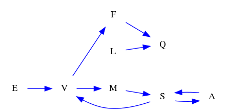
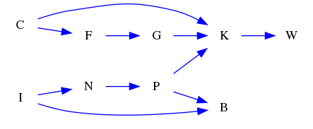
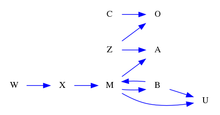

| Find All |How Many |Find One |Yes or No |Multiple Choice |Existence | total |
|:------:|:------:|:------:|:------:|:------:|:------:|:------:|
| 0 |0 |36 |36 |36 |36 | 144 |

|  N=4 | N=5 | N=6 | N=7 | N=8 | N=9 | total |
|:------:|:------:|:------:|:------:|:------:|:------:|:------:|
| 24 |24 |24 |24 |24 |24 | 144 |

|  Yes. | No. | judge_total |
|:------:|:------:|:------:|
| 43 |29 | 72 |

|  A | B | C | D | MC_total |
|:------:|:------:|:------:|:------:|:------:|
| 9 |5 |11 |11 | 36 |

## ID: 26966533
### Graph
- graph type: DG
- description: Given a directed graph with nodes W, K, N, R and directed edges K->W, K->R, R->K, K->N, R->W, R->N, N->W, N->R.

### Questions
- [FO] Find one cycle in this graph. 
- [YN] Is N<-W->K->N a cycle in this graph? 
- [MC] Which of the following is a cycle in this graph?\
A. W->N->K<-W\
B. R<-N->K->R\
C. K->R->K\
D. N->W->K<-N 
### Answers
- K->R->K
- No.
- C
## ID: 89692931
### Graph
- graph type: DG
- description: Given a directed graph with nodes L, H, Y, O and directed edges H->O, L->O, L->H, H->L, O->Y, Y->O, O->L, L->Y.

### Questions
- [FO] Find one cycle in this graph. 
- [YN] Is L->O->L a cycle in this graph? 
- [MC] Which of the following is a cycle in this graph?\
A. L<-H->O->L\
B. L->O->H<-Y<-L\
C. O<-H->L->O\
D. L->O->L 
### Answers
- L->O->L
- Yes.
- D
## ID: 65592199
### Graph
- graph type: DG
- description: Given a directed graph with nodes G, P, B, Q and directed edges G->P, B->P, Q->B, P->G, B->G, G->B, Q->G.

### Questions
- [FO] Find one cycle in this graph. 
- [YN] Is P<-G->Q->P a cycle in this graph? 
- [MC] Which of the following is a cycle in this graph?\
A. Q<-G<-P->B->Q\
B. P->G->Q->P\
C. G->P->G\
D. Q->P<-G<-B<-Q 
### Answers
- G->P->G
- No.
- C
## ID: 19372757
### Graph
- graph type: DG
- description: Given a directed graph with nodes U, T, R, M and directed edges T->R, T->U, M->U, R->U, R->T, M->R, M->T, U->M.

### Questions
- [FO] Find one cycle in this graph. 
- [YN] Is R<-U<-M<-R a cycle in this graph? 
- [MC] Which of the following is a cycle in this graph?\
A. U->M->U\
B. U<-T->M->R<-U\
C. U->T->R->U\
D. U<-R<-T<-M->U 
### Answers
- U->M->U
- No.
- A
## ID: 71371012
### Graph
- graph type: DG
- description: Given a directed graph with nodes H, K, G, A and directed edges A->K, K->A, A->H, H->A, H->K, G->A.

### Questions
- [FO] Find one cycle in this graph. 
- [YN] Is H->A->H a cycle in this graph? 
- [MC] Which of the following is a cycle in this graph?\
A. H->G<-A<-H\
B. H->A->K->G<-H\
C. H->A->H\
D. K<-A<-H<-K 
### Answers
- H->A->H
- Yes.
- C
## ID: 44014253
### Graph
- graph type: DG
- description: Given a directed graph with nodes G, E, L, J and directed edges L->G, J->G, E->G, G->L, G->E, L->J, J->L.

### Questions
- [FO] Find one cycle in this graph. 
- [YN] Is J<-L->G<-E->J a cycle in this graph? 
- [MC] Which of the following is a cycle in this graph?\
A. J->L<-G<-J\
B. J<-L->E->G->J\
C. G->L->J<-G\
D. G->L->G 
### Answers
- G->L->G
- No.
- D
## ID: 13849301
### Graph
- graph type: DG
- description: Given a directed graph with nodes A, U, Y, B, L and directed edges B->U, A->B, U->B, L->Y, U->L, A->U, U->A, B->Y.

### Questions
- [FO] Find one cycle in this graph. 
- [YN] Is A->L->Y->B<-A a cycle in this graph? 
- [MC] Which of the following is a cycle in this graph?\
A. A->U->A\
B. B<-A<-U->B\
C. B<-A->L->Y->B\
D. U->A->Y<-U 
### Answers
- A->U->A
- No.
- A
## ID: 06354313
### Graph
- graph type: DG
- description: Given a directed graph with nodes K, D, A, Z, Y and directed edges A->Y, Y->Z, Z->D, Y->A, Z->K.

### Questions
- [FO] Find one cycle in this graph. 
- [YN] Is D<-Y->K->D a cycle in this graph? 
- [MC] Which of the following is a cycle in this graph?\
A. Y<-Z->D<-K<-A<-Y\
B. Z<-K->A<-D->Z\
C. A->Y->A\
D. D<-K<-A->D 
### Answers
- A->Y->A
- No.
- C
## ID: 83054043
### Graph
- graph type: DG
- description: Given a directed graph with nodes T, A, X, E, C and directed edges T->X, E->C, X->C, A->E, T->E, E->A, E->X.

### Questions
- [FO] Find one cycle in this graph. 
- [YN] Is A->E->A a cycle in this graph? 
- [MC] Which of the following is a cycle in this graph?\
A. C->T<-A->E<-C\
B. A->C<-E<-A\
C. A->E->A\
D. T<-A<-C->X->E->T 
### Answers
- A->E->A
- Yes.
- C
## ID: 29646553
### Graph
- graph type: DG
- description: Given a directed graph with nodes E, G, U, V, S and directed edges S->G, V->G, S->E, G->S, U->V, S->U, S->V, V->U, E->G.

### Questions
- [FO] Find one cycle in this graph. 
- [YN] Is E->G->S->E a cycle in this graph? 
- [MC] Which of the following is a cycle in this graph?\
A. U->E<-S->G<-V->U\
B. E->U<-G->S->E\
C. E<-V<-U->G->E\
D. E->G->S->E 
### Answers
- E->G->S->E
- Yes.
- D
## ID: 91077341
### Graph
- graph type: DG
- description: Given a directed graph with nodes F, Q, T, R, K and directed edges F->Q, F->T, K->Q, T->Q, K->F, F->K, R->Q, Q->R, R->K, Q->T.

### Questions
- [FO] Find one cycle in this graph. 
- [YN] Is F->K->F a cycle in this graph? 
- [MC] Which of the following is a cycle in this graph?\
A. R<-K->Q->T->R\
B. F<-Q->T->R<-K->F\
C. K->F->T<-R->K\
D. F->K->F 
### Answers
- F->K->F
- Yes.
- D
## ID: 03177829
### Graph
- graph type: DG
- description: Given a directed graph with nodes G, A, Z, S, V and directed edges A->V, A->Z, G->Z, Z->S, V->A, Z->A, Z->G, G->A, S->A, S->V.

### Questions
- [FO] Find one cycle in this graph. 
- [YN] Is G->Z->G a cycle in this graph? 
- [MC] Which of the following is a cycle in this graph?\
A. G<-Z->S->G\
B. G->Z->G\
C. A->Z->G<-A\
D. V<-A<-Z<-S<-G->V 
### Answers
- G->Z->G
- Yes.
- B
## ID: 72362953
### Graph
- graph type: DG
- description: Given a directed graph with nodes P, I, Y, C, S, F and directed edges F->S, F->Y, P->Y, C->I, I->C, S->C, C->P.

### Questions
- [FO] Find one cycle in this graph. 
- [YN] Is F<-Y->P<-I<-C<-F a cycle in this graph? 
- [MC] Which of the following is a cycle in this graph?\
A. I->C->I\
B. S->C->P->F->I->S\
C. C->F->P->S->C\
D. I->C<-P->Y<-I 
### Answers
- I->C->I
- No.
- A
## ID: 45611867
### Graph
- graph type: DG
- description: Given a directed graph with nodes J, Z, V, C, H, Y and directed edges V->H, H->Y, C->Y, C->J, Y->J, H->C, Z->Y, Y->C, V->Y.

### Questions
- [FO] Find one cycle in this graph. 
- [YN] Is C->Y->C a cycle in this graph? 
- [MC] Which of the following is a cycle in this graph?\
A. C->Y->C\
B. Y->H->J->Y\
C. V<-Z->C<-H<-V\
D. J<-Z<-H<-C<-Y->J 
### Answers
- C->Y->C
- Yes.
- A
## ID: 29898382
### Graph
- graph type: DG
- description: Given a directed graph with nodes K, M, C, U, Y, W and directed edges K->W, K->U, C->K, U->C, Y->K, M->U, C->U, Y->C, W->C, K->C.

### Questions
- [FO] Find one cycle in this graph. 
- [YN] Is C->W->K->C a cycle in this graph? 
- [MC] Which of the following is a cycle in this graph?\
A. M<-K<-W<-C<-U<-M\
B. C<-M->Y<-K<-C\
C. Y<-C->U->Y\
D. K->C->K 
### Answers
- K->C->K
- No.
- D
## ID: 81725854
### Graph
- graph type: DG
- description: Given a directed graph with nodes T, E, H, K, Y, Q and directed edges H->E, Q->Y, K->Y, Y->E, E->Y, E->Q, E->T, H->Q.

### Questions
- [FO] Find one cycle in this graph. 
- [YN] Is Q->K<-E<-H->T->Q a cycle in this graph? 
- [MC] Which of the following is a cycle in this graph?\
A. Y<-T->H->E<-Q<-Y\
B. E->Y->E\
C. Q->K<-H->Q\
D. Y->K<-H<-Q->E<-Y 
### Answers
- E->Y->E
- No.
- B
## ID: 65068789
### Graph
- graph type: DG
- description: Given a directed graph with nodes I, Z, X, Y, M, W and directed edges X->Z, Z->Y, I->X, Y->I, M->W, Y->Z, Y->X, W->Z, I->W, I->Z.

### Questions
- [FO] Find one cycle in this graph. 
- [YN] Is X<-W->Y<-M->I<-X a cycle in this graph? 
- [MC] Which of the following is a cycle in this graph?\
A. I->Z->Y->I\
B. M<-Z<-W->M\
C. W<-M<-Z->Y<-I->W\
D. Y<-Z->X<-W<-Y 
### Answers
- I->Z->Y->I
- No.
- A
## ID: 49244508
### Graph
- graph type: DG
- description: Given a directed graph with nodes H, O, B, I, C, Z and directed edges Z->I, Z->O, O->H, I->O, C->H, H->C, C->B, C->O, C->I, I->H.

### Questions
- [FO] Find one cycle in this graph. 
- [YN] Is I->B->C<-H->Z->I a cycle in this graph? 
- [MC] Which of the following is a cycle in this graph?\
A. C->I->B<-C\
B. Z<-C<-O->Z\
C. B->Z<-I->B\
D. H->C->H 
### Answers
- H->C->H
- No.
- D
## ID: 08538710
### Graph
- graph type: DG
- description: Given a directed graph with nodes S, T, X, Q, M, N, U and directed edges X->M, S->T, U->M, T->X, T->U, M->T, M->Q, S->N.

### Questions
- [FO] Find one cycle in this graph. 
- [YN] Is Q<-S->U->Q a cycle in this graph? 
- [MC] Which of the following is a cycle in this graph?\
A. N->S->Q->T<-N\
B. X<-Q<-T<-X\
C. T->U->M->T\
D. N->M<-T->Q<-N 
### Answers
- T->U->M->T
- No.
- C
## ID: 97930445
### Graph
- graph type: DG
- description: Given a directed graph with nodes Q, C, E, X, H, Z, V and directed edges E->Q, V->Q, H->C, Q->C, Z->H, E->H, C->X, C->E, V->Z, E->Z.

### Questions
- [FO] Find one cycle in this graph. 
- [YN] Is C->X->E<-C a cycle in this graph? 
- [MC] Which of the following is a cycle in this graph?\
A. E<-X->H->C->E\
B. X->C<-H<-X\
C. E<-C<-H->Q<-V<-E\
D. Q->C->E->Q 
### Answers
- Q->C->E->Q
- No.
- D
## ID: 85884251
### Graph
- graph type: DG
- description: Given a directed graph with nodes R, O, K, Q, D, N, H and directed edges O->N, Q->K, K->D, D->Q, H->K, H->D, D->H, O->Q, H->O, D->R.

### Questions
- [FO] Find one cycle in this graph. 
- [YN] Is K->H<-N->R->K a cycle in this graph? 
- [MC] Which of the following is a cycle in this graph?\
A. O->Q->K->D->H->O\
B. K<-O<-D<-N->H->K\
C. D->Q<-O<-H<-D\
D. K<-N<-R<-H<-K 
### Answers
- O->Q->K->D->H->O
- No.
- A
## ID: 53341871
### Graph
- graph type: DG
- description: Given a directed graph with nodes O, G, B, K, R, S, E and directed edges G->E, B->O, K->G, E->R, S->R, S->G, O->G, O->B, S->B, R->O.

### Questions
- [FO] Find one cycle in this graph. 
- [YN] Is B->E->S<-O<-B a cycle in this graph? 
- [MC] Which of the following is a cycle in this graph?\
A. K<-B->G<-O<-K\
B. E<-S->G<-R->E\
C. O->B->O\
D. O->K->G<-O 
### Answers
- O->B->O
- No.
- C
## ID: 58761783
### Graph
- graph type: DG
- description: Given a directed graph with nodes B, R, T, I, G, O, U and directed edges B->O, B->R, B->G, I->U, U->O, O->B, R->I, B->T.

### Questions
- [FO] Find one cycle in this graph. 
- [YN] Is O->I->R<-O a cycle in this graph? 
- [MC] Which of the following is a cycle in this graph?\
A. U->T<-O->B->I->U\
B. T->O<-B<-R->U->T\
C. B->O->B\
D. B->R->U<-G->O<-B 
### Answers
- B->O->B
- No.
- C
## ID: 42160426
### Graph
- graph type: DG
- description: Given a directed graph with nodes T, K, R, F, Z, N, A and directed edges F->K, R->N, Z->N, K->T, F->N, Z->F, T->K, T->Z, N->A.

### Questions
- [FO] Find one cycle in this graph. 
- [YN] Is T->K->T a cycle in this graph? 
- [MC] Which of the following is a cycle in this graph?\
A. T->K->T\
B. R<-N<-Z->R\
C. R->A<-T->K->R\
D. T->N<-F<-T 
### Answers
- T->K->T
- Yes.
- A
## ID: 04719916
### Graph
- graph type: DG
- description: Given a directed graph with nodes N, M, S, H, I, O, B, P and directed edges B->H, M->N, O->M, M->P, I->S, H->B, H->N, B->N, I->N, M->I.

### Questions
- [FO] Find one cycle in this graph. 
- [YN] Is H->B->H a cycle in this graph? 
- [MC] Which of the following is a cycle in this graph?\
A. H->B->H\
B. H<-N->M->S->O->H\
C. O<-H<-P<-O\
D. N<-O->S<-N 
### Answers
- H->B->H
- Yes.
- A
## ID: 80893168
### Graph
- graph type: DG
- description: Given a directed graph with nodes E, I, K, C, G, B, S, X and directed edges K->G, E->I, G->X, X->G, C->X, X->B, B->E, S->C, S->I.

### Questions
- [FO] Find one cycle in this graph. 
- [YN] Is X<-I->G<-X a cycle in this graph? 
- [MC] Which of the following is a cycle in this graph?\
A. C->E<-B<-K<-S->C\
B. C<-B->S<-I<-G->C\
C. E<-G<-K->E\
D. G->X->G 
### Answers
- G->X->G
- No.
- D
## ID: 23727350
### Graph
- graph type: DG
- description: Given a directed graph with nodes M, R, Q, N, L, V, C, H and directed edges R->L, V->Q, L->H, Q->H, C->V, H->N, M->L, N->V, V->N.

### Questions
- [FO] Find one cycle in this graph. 
- [YN] Is Q->H->N->V->Q a cycle in this graph? 
- [MC] Which of the following is a cycle in this graph?\
A. H->M<-Q<-H\
B. Q->H->N->V->Q\
C. Q->C->M->H<-Q\
D. C->N->R<-M<-L->C 
### Answers
- Q->H->N->V->Q
- Yes.
- B
## ID: 31952020
### Graph
- graph type: DG
- description: Given a directed graph with nodes L, E, N, Y, S, W, G, D and directed edges Y->D, L->G, N->L, G->W, W->D, E->L, S->W, G->E, G->Y.

### Questions
- [FO] Find one cycle in this graph. 
- [YN] Is L<-E<-N<-W->L a cycle in this graph? 
- [MC] Which of the following is a cycle in this graph?\
A. W->L->N<-E->S<-W\
B. S->N<-L->W<-Y->S\
C. L->G->E->L\
D. L<-Y<-D<-E->W->L 
### Answers
- L->G->E->L
- No.
- C
## ID: 69005783
### Graph
- graph type: DG
- description: Given a directed graph with nodes A, N, D, C, M, B, X, U and directed edges N->C, N->X, A->U, C->M, X->D, A->B, U->N, B->X, U->A.

### Questions
- [FO] Find one cycle in this graph. 
- [YN] Is A->U->A a cycle in this graph? 
- [MC] Which of the following is a cycle in this graph?\
A. M<-D->U<-C->N->M\
B. A->U->A\
C. B->U<-D->X<-B\
D. N->M<-B->N 
### Answers
- A->U->A
- Yes.
- B
## ID: 46097789
### Graph
- graph type: DG
- description: Given a directed graph with nodes F, S, N, G, B, P, M, X and directed edges N->S, M->B, B->X, P->N, M->N, F->G, F->P, X->M.

### Questions
- [FO] Find one cycle in this graph. 
- [YN] Is B->X->M->B a cycle in this graph? 
- [MC] Which of the following is a cycle in this graph?\
A. F<-S->N<-F\
B. B->X->M->B\
C. X<-P->F->N<-M->X\
D. P->S<-G->N<-F->P 
### Answers
- B->X->M->B
- Yes.
- B
## ID: 59241851
### Graph
- graph type: DG
- description: Given a directed graph with nodes Y, U, Q, M, Z, I, A, K, F and directed edges M->U, I->M, Y->F, Z->Q, A->Q, U->I, F->M, K->A, F->A, Y->A.

### Questions
- [FO] Find one cycle in this graph. 
- [YN] Is K->F<-Q<-K a cycle in this graph? 
- [MC] Which of the following is a cycle in this graph?\
A. M<-K<-Q<-F<-Y<-M\
B. F->Y->M<-F\
C. Y<-M<-F->Z<-Y\
D. U->I->M->U 
### Answers
- U->I->M->U
- No.
- D
## ID: 36235995
### Graph
- graph type: DG
- description: Given a directed graph with nodes J, A, Q, M, S, N, I, F, O and directed edges N->A, M->I, O->S, S->O, N->I, J->N, A->Q, J->S, F->S.

### Questions
- [FO] Find one cycle in this graph. 
- [YN] Is S->O->S a cycle in this graph? 
- [MC] Which of the following is a cycle in this graph?\
A. A->I<-N<-O<-A\
B. I->S->M->I\
C. S->O->S\
D. F->O<-M->F 
### Answers
- S->O->S
- Yes.
- C
## ID: 38963867
### Graph
- graph type: DG
- description: Given a directed graph with nodes M, A, P, V, L, T, S, G, J and directed edges L->A, M->V, V->G, V->M, J->V, S->G, G->T, P->J, V->P, J->L.

### Questions
- [FO] Find one cycle in this graph. 
- [YN] Is A->P<-T->M->A a cycle in this graph? 
- [MC] Which of the following is a cycle in this graph?\
A. M->V->M\
B. P->M<-G->J<-V->P\
C. S<-T<-G<-S\
D. G<-T->P->L<-G 
### Answers
- M->V->M
- No.
- A
## ID: 22087121
### Graph
- graph type: DG
- description: Given a directed graph with nodes K, F, O, A, L, I, N, G, D and directed edges K->L, L->A, I->F, F->O, A->I, K->D, A->N, I->K, I->G.

### Questions
- [FO] Find one cycle in this graph. 
- [YN] Is K->L->A->I->K a cycle in this graph? 
- [MC] Which of the following is a cycle in this graph?\
A. D->N<-F<-L->G->D\
B. O->N->I->O\
C. K->L->A->I->K\
D. N->O->G->F<-A<-N 
### Answers
- K->L->A->I->K
- Yes.
- C
## ID: 81071857
### Graph
- graph type: DG
- description: Given a directed graph with nodes G, E, M, L, K, D, I, T, H and directed edges L->H, L->M, G->K, D->T, L->T, H->E, M->L, K->M, E->K, H->I.

### Questions
- [FO] Find one cycle in this graph. 
- [YN] Is G<-T->D<-G a cycle in this graph? 
- [MC] Which of the following is a cycle in this graph?\
A. G->T->E->I->G\
B. M<-K->T<-D<-G<-M\
C. I->T->K<-L->I\
D. E->K->M->L->H->E 
### Answers
- E->K->M->L->H->E
- No.
- D
## ID: 12392259
### Graph
- graph type: DG
- description: Given a directed graph with nodes E, J, W, H, K, Y, V, F, O and directed edges O->W, O->H, E->J, W->E, F->Y, K->F, E->W, F->V, V->E.

### Questions
- [FO] Find one cycle in this graph. 
- [YN] Is J<-K->Y->W<-J a cycle in this graph? 
- [MC] Which of the following is a cycle in this graph?\
A. E->H<-Y->K->O<-E\
B. V<-F<-O->K->E->V\
C. W->E<-Y<-V<-H<-W\
D. E->W->E 
### Answers
- E->W->E
- No.
- D
## ID: 05817091
### Graph
- graph type: DG
- description: Given a directed graph with nodes I, H, U, B and directed edges H->B, I->U, U->B, U->I, U->H, H->I, H->U, B->H, I->H.

### Questions
- [EX] Are there any cycles in this graph? 
### Answers
- Yes.
## ID: 80353769
### Graph
- graph type: DG
- description: Given a directed graph with nodes H, M, E, N and directed edges E->H, N->M, N->H, H->N, M->N, E->N, H->M, E->M, N->E.

### Questions
- [EX] Are there any cycles in this graph? 
### Answers
- Yes.
## ID: 72049614
### Graph
- graph type: DG
- description: Given a directed graph with nodes I, J, L, W and directed edges W->L, I->J, I->L, I->W, J->I, W->J.

### Questions
- [EX] Are there any cycles in this graph? 
### Answers
- Yes.
## ID: 50781508
### Graph
- graph type: DG
- description: Given a directed graph with nodes A, Q, W, K and directed edges Q->K, K->W, Q->A, W->Q, A->W, W->A, A->Q, A->K, W->K, Q->W.

### Questions
- [EX] Are there any cycles in this graph? 
### Answers
- Yes.
## ID: 48194637
### Graph
- graph type: DG
- description: Given a directed graph with nodes O, B, X, U and directed edges O->B, B->O, U->O, O->X, X->B, X->O, U->B, X->U.

### Questions
- [EX] Are there any cycles in this graph? 
### Answers
- Yes.
## ID: 47847438
### Graph
- graph type: DG
- description: Given a directed graph with nodes D, C, P, M and directed edges M->C, D->C, M->D, D->P, P->D, P->M, C->P.

### Questions
- [EX] Are there any cycles in this graph? 
### Answers
- Yes.
## ID: 39785262
### Graph
- graph type: DG
- description: Given a directed graph with nodes Q, C, I, T, V and directed edges I->T, V->T, T->C, C->Q.

### Questions
- [EX] Are there any cycles in this graph? 
### Answers
- No.
## ID: 38800118
### Graph
- graph type: DG
- description: Given a directed graph with nodes A, M, G, Q, O and directed edges Q->O, G->O, G->Q, Q->A, Q->G, A->M, O->A, O->Q, O->M, O->G.

### Questions
- [EX] Are there any cycles in this graph? 
### Answers
- Yes.
## ID: 19140211
### Graph
- graph type: DG
- description: Given a directed graph with nodes R, J, Q, N, B and directed edges Q->J, Q->N, J->R, R->J, J->N, N->B.

### Questions
- [EX] Are there any cycles in this graph? 
### Answers
- Yes.
## ID: 90645919
### Graph
- graph type: DG
- description: Given a directed graph with nodes X, O, B, V, J and directed edges O->J, B->V, X->J, O->B, V->B, O->X, X->B, O->V, X->V.

### Questions
- [EX] Are there any cycles in this graph? 
### Answers
- Yes.
## ID: 59151188
### Graph
- graph type: DG
- description: Given a directed graph with nodes N, F, X, P, W and directed edges X->W, X->P, N->F, P->W, F->X, W->F, P->X, W->N, W->X.

### Questions
- [EX] Are there any cycles in this graph? 
### Answers
- Yes.
## ID: 96605139
### Graph
- graph type: DG
- description: Given a directed graph with nodes T, S, L, G, P and directed edges P->G, L->G, T->S, G->L, P->T, T->P, L->T.

### Questions
- [EX] Are there any cycles in this graph? 
### Answers
- Yes.
## ID: 38658140
### Graph
- graph type: DG
- description: Given a directed graph with nodes N, W, S, J, H, K and directed edges N->W, K->H, K->W, N->J, S->K, K->S, W->H, S->N, H->S.

### Questions
- [EX] Are there any cycles in this graph? 
### Answers
- Yes.
## ID: 89744166
### Graph
- graph type: DG
- description: Given a directed graph with nodes S, W, A, O, R, C and directed edges C->A, W->O, C->W, O->A, W->R, C->S, S->A.

### Questions
- [EX] Are there any cycles in this graph? 
### Answers
- No.
## ID: 48995497
### Graph
- graph type: DG
- description: Given a directed graph with nodes M, J, Z, K, P, U and directed edges M->P, Z->K, P->U, J->U, K->P, J->Z, M->J, K->U, K->M.

### Questions
- [EX] Are there any cycles in this graph? 
### Answers
- Yes.
## ID: 09895730
### Graph
- graph type: DG
- description: Given a directed graph with nodes L, Q, Y, H, V, K and directed edges K->L, Y->H, H->Y, V->K, K->Y, L->K, Q->H.

### Questions
- [EX] Are there any cycles in this graph? 
### Answers
- Yes.
## ID: 81094430
### Graph
- graph type: DG
- description: Given a directed graph with nodes C, E, H, F, B, D and directed edges F->C, D->B, B->E, D->F, F->E, B->C, H->B, F->D, E->B, C->F.

### Questions
- [EX] Are there any cycles in this graph? 
### Answers
- Yes.
## ID: 53235789
### Graph
- graph type: DG
- description: Given a directed graph with nodes U, Q, V, F, Y, N and directed edges Y->V, F->V, Q->F, F->U, Y->F, Q->U, U->Q, Q->N.

### Questions
- [EX] Are there any cycles in this graph? 
### Answers
- Yes.
## ID: 83539283
### Graph
- graph type: DG
- description: Given a directed graph with nodes D, G, M, X, P, R, C and directed edges G->D, M->G, P->M, D->G, D->R, G->R, R->C, M->C, D->X.

### Questions
- [EX] Are there any cycles in this graph? 
### Answers
- Yes.
## ID: 93223981
### Graph
- graph type: DG
- description: Given a directed graph with nodes B, F, A, X, Q, S, H and directed edges Q->A, Q->S, B->H, H->F, A->H, A->B, F->Q, X->B, S->F.

### Questions
- [EX] Are there any cycles in this graph? 
### Answers
- Yes.
## ID: 57545562
### Graph
- graph type: DG
- description: Given a directed graph with nodes S, A, T, X, C, L, V and directed edges V->C, L->T, C->L, L->S, X->T, T->X, A->C, X->A, V->A, V->L.

### Questions
- [EX] Are there any cycles in this graph? 
### Answers
- Yes.
## ID: 52065827
### Graph
- graph type: DG
- description: Given a directed graph with nodes I, S, A, V, C, P, U and directed edges U->V, S->A, P->V, I->C, I->A, V->C, V->I, C->U, C->P.

### Questions
- [EX] Are there any cycles in this graph? 
### Answers
- Yes.
## ID: 47971984
### Graph
- graph type: DG
- description: Given a directed graph with nodes K, Q, R, S, Z, V, U and directed edges V->Z, R->S, S->Q, Z->U, Z->R, Z->K, K->S.

### Questions
- [EX] Are there any cycles in this graph? 
### Answers
- No.
## ID: 38019491
### Graph
- graph type: DG
- description: Given a directed graph with nodes O, A, X, D, Q, C, H and directed edges Q->C, C->X, O->D, D->O, X->A, D->C, H->Q, H->O, Q->H.

### Questions
- [EX] Are there any cycles in this graph? 
### Answers
- Yes.
## ID: 99417738
### Graph
- graph type: DG
- description: Given a directed graph with nodes G, Q, S, X, F, L, R, J and directed edges X->R, X->F, R->Q, R->L, L->R, S->J, S->G, J->R.

### Questions
- [EX] Are there any cycles in this graph? 
### Answers
- Yes.
## ID: 26326276
### Graph
- graph type: DG
- description: Given a directed graph with nodes X, M, F, O, E, Z, A, S and directed edges O->S, F->Z, A->E, O->E, E->X, X->F, E->A, X->M.

### Questions
- [EX] Are there any cycles in this graph? 
### Answers
- Yes.
## ID: 32165717
### Graph
- graph type: DG
- description: Given a directed graph with nodes E, V, Q, A, L, F, M, S and directed edges F->Q, M->S, S->A, V->M, A->S, E->V, V->F, L->Q, S->V.

### Questions
- [EX] Are there any cycles in this graph? 
### Answers
- Yes.
## ID: 06363654
### Graph
- graph type: DG
- description: Given a directed graph with nodes S, Z, X, Q, W, N, I, U and directed edges Z->U, Z->X, I->U, N->Q, W->S, S->N, U->W, Q->W.

### Questions
- [EX] Are there any cycles in this graph? 
### Answers
- Yes.
## ID: 76206601
### Graph
- graph type: DG
- description: Given a directed graph with nodes G, B, C, K, R, O, F, W and directed edges B->R, K->C, K->B, C->F, G->W, O->W, W->B, B->C, C->O.

### Questions
- [EX] Are there any cycles in this graph? 
### Answers
- Yes.
## ID: 12461654
### Graph
- graph type: DG
- description: Given a directed graph with nodes Q, J, F, N, L, K, P, R and directed edges L->J, P->L, N->Q, J->Q, Q->L, R->P, J->L, Q->N, K->L, F->K.

### Questions
- [EX] Are there any cycles in this graph? 
### Answers
- Yes.
## ID: 10940323
### Graph
- graph type: DG
- description: Given a directed graph with nodes V, N, X, C, U, J, T, Z, W and directed edges J->C, C->W, U->X, N->V, J->Z, W->U, C->V, Z->X, N->X, T->C.

### Questions
- [EX] Are there any cycles in this graph? 
### Answers
- No.
## ID: 41872637
### Graph
- graph type: DG
- description: Given a directed graph with nodes F, N, Z, B, L, K, C, J, Y and directed edges B->J, B->K, C->K, B->Z, L->Z, L->F, K->Y, J->Z, N->Z, N->K.

### Questions
- [EX] Are there any cycles in this graph? 
### Answers
- No.
## ID: 21349901
### Graph
- graph type: DG
- description: Given a directed graph with nodes M, W, O, F, U, P, A, Q, L and directed edges F->O, A->Q, L->P, O->M, P->W, F->W, A->O, W->P, O->U.

### Questions
- [EX] Are there any cycles in this graph? 
### Answers
- Yes.
## ID: 16959218
### Graph
- graph type: DG
- description: Given a directed graph with nodes K, N, C, I, W, F, P, B, G and directed edges C->F, C->K, N->P, K->W, P->K, P->B, G->K, F->G, I->B, I->N.

### Questions
- [EX] Are there any cycles in this graph? 
### Answers
- No.
## ID: 33809572
### Graph
- graph type: DG
- description: Given a directed graph with nodes I, O, F, Y, N, A, Q, W, U and directed edges O->Y, O->N, A->F, Q->U, F->I, N->U, A->I, W->I, W->Q, Q->I.

### Questions
- [EX] Are there any cycles in this graph? 
### Answers
- No.
## ID: 18293399
### Graph
- graph type: DG
- description: Given a directed graph with nodes X, M, A, Z, W, C, B, O, U and directed edges X->M, B->M, B->U, M->B, C->O, M->U, Z->O, W->X, Z->A, M->A.

### Questions
- [EX] Are there any cycles in this graph? 
### Answers
- Yes.
