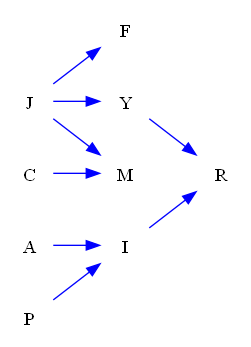

| Find All |How Many |Find One |Yes or No |Multiple Choice |Existence | total |
|:------:|:------:|:------:|:------:|:------:|:------:|:------:|
| 0 |0 |60 |30 |30 |0 | 120 |

|  N=4 | N=5 | N=6 | N=7 | N=8 | N=9 | total |
|:------:|:------:|:------:|:------:|:------:|:------:|:------:|
| 20 |20 |20 |20 |20 |20 | 120 |

|  Yes. | No. | judge_total |
|:------:|:------:|:------:|
| 14 |16 | 30 |

|  A | B | C | D | MC_total |
|:------:|:------:|:------:|:------:|:------:|
| 8 |5 |6 |11 | 30 |

## ID: 83640066
### Graph
- graph type: DAG
- description: Given a DAG (directed acyclic graph) with nodes Z, J, C, V and directed edges J->C, J->V, C->V, Z->J, Z->C.

### Questions
- [FO] Find one valid nodeset that can d-separate node Z and node V . 
- [FO] Find the minimal nodeset that can d-separate node Z and node V . 
- [YN] Are node Z and node V d-separated by nodeset set()? 
- [MC] Which of the following nodesets can d-separate node Z and node V?\
A. {'J'}\
B. {'J', 'C'}\
C. {'C'}\
D. set() 
### Answers
- [{'J', 'C'}]
- {'J', 'C'}
- No.
- B
## ID: 57227207
### Graph
- graph type: DAG
- description: Given a DAG (directed acyclic graph) with nodes C, Z, P, V and directed edges C->V, P->V, C->Z, Z->P, Z->V.

### Questions
- [FO] Find one valid nodeset that can d-separate node P and node C . 
- [FO] Find the minimal nodeset that can d-separate node P and node C . 
- [YN] Are node C and node P d-separated by nodeset set()? 
- [MC] Which of the following nodesets can d-separate node C and node P?\
A. {'Z', 'V'}\
B. {'V'}\
C. {'Z'}\
D. set() 
### Answers
- [{'Z'}]
- {'Z'}
- No.
- C
## ID: 87467573
### Graph
- graph type: DAG
- description: Given a DAG (directed acyclic graph) with nodes F, N, Z, C and directed edges Z->C, N->Z, F->Z.

### Questions
- [FO] Find one valid nodeset that can d-separate node C and node N . 
- [FO] Find the minimal nodeset that can d-separate node C and node N . 
- [YN] Are node F and node N d-separated by nodeset set()? 
- [MC] Which of the following nodesets can d-separate node N and node F?\
A. set()\
B. {'C'}\
C. {'Z'}\
D. {'Z', 'C'} 
### Answers
- [{'Z'}, {'F', 'Z'}]
- {'Z'}
- Yes.
- A
## ID: 95005213
### Graph
- graph type: DAG
- description: Given a DAG (directed acyclic graph) with nodes M, E, J, S and directed edges M->J, E->S, M->E, J->S, M->S.

### Questions
- [FO] Find one valid nodeset that can d-separate node E and node J . 
- [FO] Find the minimal nodeset that can d-separate node E and node J . 
- [YN] Are node J and node E d-separated by nodeset {'S', 'M'}? 
- [MC] Which of the following nodesets can d-separate node E and node J?\
A. {'S', 'M'}\
B. set()\
C. {'S'}\
D. {'M'} 
### Answers
- [{'M'}]
- {'M'}
- No.
- D
## ID: 17537353
### Graph
- graph type: DAG
- description: Given a DAG (directed acyclic graph) with nodes M, L, I, G and directed edges M->L, M->G, L->G, L->I, I->G.

### Questions
- [FO] Find one valid nodeset that can d-separate node I and node M . 
- [FO] Find the minimal nodeset that can d-separate node I and node M . 
- [YN] Are node I and node M d-separated by nodeset {'G', 'L'}? 
- [MC] Which of the following nodesets can d-separate node M and node I?\
A. {'G'}\
B. set()\
C. {'G', 'L'}\
D. {'L'} 
### Answers
- [{'L'}]
- {'L'}
- No.
- D
## ID: 93435805
### Graph
- graph type: DAG
- description: Given a DAG (directed acyclic graph) with nodes M, Y, T, Q, U and directed edges Y->Q, T->U, M->U, M->Q.

### Questions
- [FO] Find one valid nodeset that can d-separate node T and node M . 
- [FO] Find the minimal nodeset that can d-separate node T and node M . 
- [YN] Are node M and node Y d-separated by nodeset {'U', 'T'}? 
- [MC] Which of the following nodesets can d-separate node T and node M?\
A. {'U', 'Y', 'Q'}\
B. {'U', 'Q'}\
C. set()\
D. {'U'} 
### Answers
- [set(), {'Q'}, {'Y'}, {'Q', 'Y'}]
- set()
- Yes.
- C
## ID: 95388106
### Graph
- graph type: DAG
- description: Given a DAG (directed acyclic graph) with nodes O, F, U, A, V and directed edges F->V, O->F, O->U, F->U, U->A, O->A, U->V, F->A.

### Questions
- [FO] Find one valid nodeset that can d-separate node A and node V . 
- [FO] Find the minimal nodeset that can d-separate node A and node V . 
- [YN] Are node V and node O d-separated by nodeset {'F', 'U'}? 
- [MC] Which of the following nodesets can d-separate node V and node A?\
A. {'F'}\
B. {'F', 'U', 'O'}\
C. {'O'}\
D. {'F', 'O'} 
### Answers
- [{'F', 'U'}, {'F', 'U', 'O'}]
- {'F', 'U'}
- Yes.
- B
## ID: 08821198
### Graph
- graph type: DAG
- description: Given a DAG (directed acyclic graph) with nodes N, X, P, C, M and directed edges P->C, N->C, N->P, X->C, P->M, N->X, X->M.

### Questions
- [FO] Find one valid nodeset that can d-separate node C and node M . 
- [FO] Find the minimal nodeset that can d-separate node C and node M . 
- [YN] Are node X and node P d-separated by nodeset {'N'}? 
- [MC] Which of the following nodesets can d-separate node M and node N?\
A. {'P', 'C', 'X'}\
B. set()\
C. {'X'}\
D. {'C', 'X'} 
### Answers
- [{'P', 'X'}, {'P', 'X', 'N'}]
- {'P', 'X'}
- Yes.
- A
## ID: 03374785
### Graph
- graph type: DAG
- description: Given a DAG (directed acyclic graph) with nodes I, O, R, F, C and directed edges I->C, R->C, R->F, F->C, O->F, I->O, I->R, O->C.

### Questions
- [FO] Find one valid nodeset that can d-separate node F and node I . 
- [FO] Find the minimal nodeset that can d-separate node F and node I . 
- [YN] Are node F and node I d-separated by nodeset {'C', 'O'}? 
- [MC] Which of the following nodesets can d-separate node O and node R?\
A. {'F'}\
B. set()\
C. {'F', 'C'}\
D. {'I'} 
### Answers
- [{'R', 'O'}]
- {'R', 'O'}
- No.
- D
## ID: 21648824
### Graph
- graph type: DAG
- description: Given a DAG (directed acyclic graph) with nodes X, T, Z, K, O and directed edges X->O, Z->K, T->Z, X->T, X->Z.

### Questions
- [FO] Find one valid nodeset that can d-separate node O and node T . 
- [FO] Find the minimal nodeset that can d-separate node O and node T . 
- [YN] Are node Z and node O d-separated by nodeset set()? 
- [MC] Which of the following nodesets can d-separate node X and node K?\
A. {'O'}\
B. {'T'}\
C. {'Z', 'T'}\
D. {'T', 'O'} 
### Answers
- [{'X'}, {'Z', 'X'}, {'K', 'X'}, {'Z', 'K', 'X'}]
- {'X'}
- No.
- C
## ID: 48833954
### Graph
- graph type: DAG
- description: Given a DAG (directed acyclic graph) with nodes H, N, Q, U, X, E and directed edges H->Q, H->X, H->E, Q->U, H->U, Q->E, U->X, N->Q.

### Questions
- [FO] Find one valid nodeset that can d-separate node N and node E . 
- [FO] Find the minimal nodeset that can d-separate node N and node E . 
- [YN] Are node N and node E d-separated by nodeset {'H', 'Q'}? 
- [MC] Which of the following nodesets can d-separate node N and node E?\
A. set()\
B. {'H'}\
C. {'Q'}\
D. {'H', 'U', 'Q'} 
### Answers
- [{'H', 'Q'}, {'H', 'U', 'Q'}, {'H', 'X', 'Q'}, {'H', 'U', 'X', 'Q'}]
- {'H', 'Q'}
- Yes.
- D
## ID: 42655914
### Graph
- graph type: DAG
- description: Given a DAG (directed acyclic graph) with nodes B, C, U, W, J, N and directed edges U->N, C->N, B->U, U->J, W->N, J->N, B->W, B->J.

### Questions
- [FO] Find one valid nodeset that can d-separate node J and node W . 
- [FO] Find the minimal nodeset that can d-separate node J and node W . 
- [YN] Are node J and node W d-separated by nodeset {'B', 'U', 'C'}? 
- [MC] Which of the following nodesets can d-separate node C and node B?\
A. {'U', 'W', 'J', 'N'}\
B. {'U', 'N'}\
C. {'U', 'W', 'N'}\
D. {'N'} 
### Answers
- [{'B'}, {'B', 'U'}, {'B', 'C'}, {'B', 'U', 'C'}]
- {'B'}
- Yes.
- A
## ID: 57048334
### Graph
- graph type: DAG
- description: Given a DAG (directed acyclic graph) with nodes L, U, X, D, E, H and directed edges L->X, L->D, L->H, D->E, L->U, X->E, X->H, X->D, E->H.

### Questions
- [FO] Find one valid nodeset that can d-separate node D and node H . 
- [FO] Find the minimal nodeset that can d-separate node D and node H . 
- [YN] Are node U and node X d-separated by nodeset {'H', 'L', 'D'}? 
- [MC] Which of the following nodesets can d-separate node H and node U?\
A. {'D', 'E', 'X'}\
B. {'D', 'E'}\
C. set()\
D. {'E', 'L', 'X'} 
### Answers
- [{'E', 'L', 'X'}, {'U', 'E', 'L', 'X'}]
- {'E', 'L', 'X'}
- Yes.
- D
## ID: 83013848
### Graph
- graph type: DAG
- description: Given a DAG (directed acyclic graph) with nodes M, B, O, D, Z, L and directed edges D->Z, M->L, O->Z, O->D, B->O, M->O.

### Questions
- [FO] Find one valid nodeset that can d-separate node B and node Z . 
- [FO] Find the minimal nodeset that can d-separate node B and node Z . 
- [YN] Are node D and node B d-separated by nodeset {'M', 'L', 'O'}? 
- [MC] Which of the following nodesets can d-separate node M and node D?\
A. {'Z', 'L'}\
B. {'L'}\
C. set()\
D. {'O'} 
### Answers
- [{'O'}, {'D', 'O'}, {'M', 'O'}, {'L', 'O'}, {'D', 'M', 'O'}, {'D', 'L', 'O'}, {'M', 'L', 'O'}, {'D', 'M', 'L', 'O'}]
- {'O'}
- Yes.
- D
## ID: 90880097
### Graph
- graph type: DAG
- description: Given a DAG (directed acyclic graph) with nodes F, D, K, Y, L, G and directed edges K->G, L->G, D->Y, Y->G, K->L, F->G, D->K, F->Y, D->G, Y->L.

### Questions
- [FO] Find one valid nodeset that can d-separate node F and node D . 
- [FO] Find the minimal nodeset that can d-separate node F and node D . 
- [YN] Are node F and node K d-separated by nodeset {'Y'}? 
- [MC] Which of the following nodesets can d-separate node L and node D?\
A. {'F', 'Y', 'K'}\
B. {'F', 'G', 'Y'}\
C. set()\
D. {'F', 'Y'} 
### Answers
- [set(), {'K'}]
- set()
- No.
- A
## ID: 07851764
### Graph
- graph type: DAG
- description: Given a DAG (directed acyclic graph) with nodes K, P, N, S, W, B, E and directed edges K->E, S->B, S->E, P->E, N->E, K->W.

### Questions
- [FO] Find one valid nodeset that can d-separate node E and node B . 
- [FO] Find the minimal nodeset that can d-separate node E and node B . 
- [YN] Are node N and node P d-separated by nodeset {'S', 'W', 'K', 'B', 'E'}? 
- [MC] Which of the following nodesets can d-separate node B and node W?\
A. {'S', 'N'}\
B. {'P', 'E'}\
C. {'E', 'N'}\
D. {'E'} 
### Answers
- [{'S'}, {'S', 'W'}, {'S', 'K'}, {'S', 'P'}, {'S', 'N'}, {'S', 'W', 'K'}, {'S', 'P', 'W'}, {'S', 'W', 'N'}, {'S', 'P', 'K'}, {'S', 'K', 'N'}, {'S', 'P', 'N'}, {'S', 'P', 'W', 'K'}, {'S', 'W', 'K', 'N'}, {'S', 'P', 'W', 'N'}, {'S', 'P', 'K', 'N'}, {'S', 'W', 'K', 'P', 'N'}]
- {'S'}
- No.
- A
## ID: 37212262
### Graph
- graph type: DAG
- description: Given a DAG (directed acyclic graph) with nodes T, C, I, M, J, N, E and directed edges C->E, C->M, C->J, M->J, T->J, M->N, I->M.

### Questions
- [FO] Find one valid nodeset that can d-separate node N and node T . 
- [FO] Find the minimal nodeset that can d-separate node N and node T . 
- [YN] Are node T and node E d-separated by nodeset {'I', 'M', 'J', 'N'}? 
- [MC] Which of the following nodesets can d-separate node C and node N?\
A. {'I'}\
B. {'T'}\
C. {'M', 'E', 'J'}\
D. {'I', 'T'} 
### Answers
- [set(), {'E'}, {'M'}, {'I'}, {'C'}, {'M', 'E'}, {'I', 'E'}, {'E', 'C'}, {'M', 'J'}, {'I', 'M'}, {'M', 'C'}, {'I', 'C'}, {'M', 'E', 'J'}, {'I', 'M', 'E'}, {'M', 'E', 'C'}, {'I', 'E', 'C'}, {'I', 'M', 'J'}, {'M', 'J', 'C'}, {'I', 'M', 'C'}, {'I', 'M', 'E', 'J'}, {'M', 'E', 'J', 'C'}, {'I', 'M', 'E', 'C'}, {'I', 'M', 'J', 'C'}, {'E', 'J', 'M', 'I', 'C'}]
- set()
- No.
- C
## ID: 26112983
### Graph
- graph type: DAG
- description: Given a DAG (directed acyclic graph) with nodes V, M, T, Q, Y, P, E and directed edges M->Q, P->E, Y->E, V->M, V->E, T->Q.

### Questions
- [FO] Find one valid nodeset that can d-separate node V and node P . 
- [FO] Find the minimal nodeset that can d-separate node V and node P . 
- [YN] Are node P and node Q d-separated by nodeset {'E', 'T', 'V'}? 
- [MC] Which of the following nodesets can d-separate node Q and node Y?\
A. {'T', 'P', 'E'}\
B. {'M', 'P', 'V'}\
C. {'E'}\
D. {'E', 'T'} 
### Answers
- [set(), {'Q'}, {'Y'}, {'M'}, {'T'}, {'Q', 'Y'}, {'Q', 'M'}, {'Q', 'T'}, {'M', 'Y'}, {'T', 'Y'}, {'M', 'T'}, {'Q', 'M', 'Y'}, {'Q', 'T', 'Y'}, {'Q', 'M', 'T'}, {'M', 'T', 'Y'}, {'Q', 'M', 'T', 'Y'}]
- set()
- Yes.
- B
## ID: 69378012
### Graph
- graph type: DAG
- description: Given a DAG (directed acyclic graph) with nodes Z, L, I, D, B, O, Y and directed edges D->Y, I->Y, L->Y, L->O, Z->B, Z->D.

### Questions
- [FO] Find one valid nodeset that can d-separate node L and node Z . 
- [FO] Find the minimal nodeset that can d-separate node L and node Z . 
- [YN] Are node Z and node I d-separated by nodeset {'B', 'Y'}? 
- [MC] Which of the following nodesets can d-separate node B and node Y?\
A. {'O'}\
B. {'I', 'L'}\
C. {'I', 'L', 'O'}\
D. {'Z', 'D', 'L', 'O'} 
### Answers
- [set(), {'B'}, {'D'}, {'O'}, {'I'}, {'B', 'D'}, {'B', 'O'}, {'B', 'I'}, {'D', 'Y'}, {'D', 'O'}, {'D', 'I'}, {'I', 'O'}, {'B', 'D', 'Y'}, {'B', 'D', 'O'}, {'B', 'D', 'I'}, {'B', 'I', 'O'}, {'D', 'Y', 'O'}, {'D', 'I', 'Y'}, {'D', 'I', 'O'}, {'B', 'D', 'Y', 'O'}, {'B', 'D', 'I', 'Y'}, {'B', 'D', 'I', 'O'}, {'D', 'I', 'Y', 'O'}, {'B', 'D', 'Y', 'O', 'I'}]
- set()
- No.
- D
## ID: 94399700
### Graph
- graph type: DAG
- description: Given a DAG (directed acyclic graph) with nodes O, C, D, B, V, F, W and directed edges D->W, C->W, B->F, B->V, O->W, C->B, O->V.

### Questions
- [FO] Find one valid nodeset that can d-separate node D and node B . 
- [FO] Find the minimal nodeset that can d-separate node D and node B . 
- [YN] Are node F and node V d-separated by nodeset {'B', 'W', 'C', 'O'}? 
- [MC] Which of the following nodesets can d-separate node D and node O?\
A. {'F', 'W'}\
B. {'W', 'C'}\
C. {'B', 'V', 'C'}\
D. {'W', 'C', 'V'} 
### Answers
- [set(), {'F'}, {'V'}, {'O'}, {'C'}, {'W', 'C'}, {'F', 'V'}, {'F', 'O'}, {'F', 'C'}, {'V', 'O'}, {'V', 'C'}, {'C', 'O'}, {'F', 'W', 'C'}, {'W', 'C', 'O'}, {'F', 'V', 'O'}, {'F', 'V', 'C'}, {'F', 'C', 'O'}, {'V', 'C', 'O'}, {'F', 'W', 'C', 'O'}, {'O', 'W', 'C', 'V'}, {'F', 'V', 'C', 'O'}, {'W', 'F', 'V', 'O', 'C'}]
- set()
- Yes.
- C
## ID: 55821370
### Graph
- graph type: DAG
- description: Given a DAG (directed acyclic graph) with nodes J, K, C, Y, B, R, L, W and directed edges K->C, R->L, B->L, B->W, J->K, B->R, C->Y, K->B.

### Questions
- [FO] Find one valid nodeset that can d-separate node Y and node B . 
- [FO] Find the minimal nodeset that can d-separate node Y and node B . 
- [YN] Are node W and node K d-separated by nodeset {'B', 'C', 'Y', 'L'}? 
- [MC] Which of the following nodesets can d-separate node K and node Y?\
A. {'R'}\
B. {'R', 'L'}\
C. {'C', 'J', 'L'}\
D. {'R', 'W', 'J', 'L'} 
### Answers
- [{'K'}, {'C'}, {'W', 'K'}, {'W', 'C'}, {'R', 'K'}, {'J', 'K'}, {'L', 'K'}, {'C', 'K'}, {'R', 'C'}, {'J', 'C'}, {'C', 'L'}, {'R', 'W', 'K'}, {'W', 'J', 'K'}, {'L', 'W', 'K'}, {'W', 'C', 'K'}, {'R', 'W', 'C'}, {'W', 'J', 'C'}, {'W', 'C', 'L'}, {'R', 'J', 'K'}, {'L', 'R', 'K'}, {'R', 'C', 'K'}, {'L', 'J', 'K'}, {'C', 'J', 'K'}, {'L', 'C', 'K'}, {'R', 'J', 'C'}, {'R', 'C', 'L'}, {'C', 'J', 'L'}, {'R', 'W', 'J', 'K'}, {'L', 'R', 'W', 'K'}, {'R', 'W', 'C', 'K'}, {'L', 'W', 'J', 'K'}, {'C', 'W', 'J', 'K'}, {'L', 'W', 'C', 'K'}, {'R', 'W', 'J', 'C'}, {'R', 'W', 'C', 'L'}, {'C', 'W', 'J', 'L'}, {'L', 'R', 'J', 'K'}, {'C', 'R', 'J', 'K'}, {'L', 'R', 'C', 'K'}, {'C', 'L', 'J', 'K'}, {'C', 'R', 'J', 'L'}, {'W', 'K', 'R', 'J', 'L'}, {'W', 'K', 'R', 'J', 'C'}, {'W', 'K', 'R', 'L', 'C'}, {'W', 'K', 'J', 'L', 'C'}, {'W', 'R', 'J', 'L', 'C'}, {'K', 'R', 'J', 'L', 'C'}, {'W', 'K', 'R', 'J', 'L', 'C'}]
- {'K'}
- Yes.
- C
## ID: 17852028
### Graph
- graph type: DAG
- description: Given a DAG (directed acyclic graph) with nodes U, B, J, T, E, A, G, C and directed edges J->G, G->C, T->A, B->C, T->G, U->G, E->A, B->J, J->T, E->G.

### Questions
- [FO] Find one valid nodeset that can d-separate node U and node B . 
- [FO] Find the minimal nodeset that can d-separate node U and node B . 
- [YN] Are node B and node G d-separated by nodeset {'U', 'T', 'E', 'A'}? 
- [MC] Which of the following nodesets can d-separate node U and node E?\
A. {'B', 'J', 'C'}\
B. {'G', 'A', 'B', 'J', 'T', 'C'}\
C. {'G', 'T', 'J'}\
D. {'T'} 
### Answers
- [set(), {'A'}, {'E'}, {'J'}, {'T'}, {'G', 'J'}, {'E', 'A'}, {'A', 'J'}, {'T', 'A'}, {'E', 'J'}, {'E', 'T'}, {'T', 'J'}, {'G', 'A', 'J'}, {'G', 'E', 'J'}, {'G', 'T', 'J'}, {'G', 'J', 'C'}, {'E', 'A', 'J'}, {'T', 'E', 'A'}, {'T', 'A', 'J'}, {'T', 'E', 'J'}, {'G', 'E', 'A', 'J'}, {'G', 'T', 'A', 'J'}, {'C', 'G', 'A', 'J'}, {'T', 'G', 'E', 'J'}, {'G', 'E', 'J', 'C'}, {'G', 'T', 'J', 'C'}, {'T', 'E', 'A', 'J'}, {'G', 'A', 'E', 'J', 'T'}, {'G', 'A', 'E', 'J', 'C'}, {'G', 'A', 'T', 'J', 'C'}, {'G', 'E', 'J', 'T', 'C'}, {'G', 'A', 'E', 'J', 'T', 'C'}]
- set()
- No.
- D
## ID: 07908429
### Graph
- graph type: DAG
- description: Given a DAG (directed acyclic graph) with nodes K, Z, U, R, Q, N, W, O and directed edges R->N, K->R, W->O, K->O, Z->U, R->O, N->W, U->R, U->O, U->Q.

### Questions
- [FO] Find one valid nodeset that can d-separate node Z and node O . 
- [FO] Find the minimal nodeset that can d-separate node Z and node O . 
- [YN] Are node K and node Z d-separated by nodeset {'U'}? 
- [MC] Which of the following nodesets can d-separate node W and node Q?\
A. {'R', 'O'}\
B. {'Z', 'U', 'K', 'N'}\
C. {'O', 'R', 'K', 'N'}\
D. {'Z', 'R', 'O'} 
### Answers
- [{'U'}, {'U', 'Q'}, {'U', 'W'}, {'U', 'K'}, {'U', 'R'}, {'U', 'N'}, {'U', 'Q', 'W'}, {'U', 'Q', 'K'}, {'U', 'Q', 'R'}, {'U', 'Q', 'N'}, {'U', 'W', 'K'}, {'U', 'R', 'W'}, {'U', 'W', 'N'}, {'U', 'R', 'K'}, {'U', 'K', 'N'}, {'U', 'R', 'N'}, {'U', 'Q', 'W', 'K'}, {'U', 'Q', 'R', 'W'}, {'U', 'Q', 'W', 'N'}, {'U', 'Q', 'R', 'K'}, {'U', 'Q', 'K', 'N'}, {'U', 'Q', 'R', 'N'}, {'U', 'R', 'W', 'K'}, {'U', 'W', 'K', 'N'}, {'U', 'R', 'W', 'N'}, {'U', 'R', 'K', 'N'}, {'Q', 'W', 'K', 'R', 'U'}, {'Q', 'W', 'K', 'U', 'N'}, {'Q', 'W', 'R', 'U', 'N'}, {'Q', 'K', 'R', 'U', 'N'}, {'W', 'K', 'R', 'U', 'N'}, {'Q', 'W', 'K', 'R', 'U', 'N'}]
- {'U'}
- Yes.
- B
## ID: 40302845
### Graph
- graph type: DAG
- description: Given a DAG (directed acyclic graph) with nodes A, H, J, T, O, P, N, Q and directed edges O->Q, J->N, H->O, A->H, A->J, P->N, O->N, T->N, A->T.

### Questions
- [FO] Find one valid nodeset that can d-separate node T and node P . 
- [FO] Find the minimal nodeset that can d-separate node T and node P . 
- [YN] Are node P and node J d-separated by nodeset {'Q', 'N', 'A', 'H', 'O'}? 
- [MC] Which of the following nodesets can d-separate node O and node P?\
A. {'H', 'N'}\
B. {'H', 'A', 'J', 'N'}\
C. {'Q', 'A', 'J', 'H', 'N', 'T'}\
D. {'H', 'Q', 'T', 'J'} 
### Answers
- [set(), {'Q'}, {'A'}, {'J'}, {'O'}, {'H'}, {'Q', 'A'}, {'Q', 'J'}, {'Q', 'O'}, {'H', 'Q'}, {'A', 'J'}, {'A', 'O'}, {'H', 'A'}, {'J', 'O'}, {'H', 'J'}, {'H', 'O'}, {'Q', 'A', 'J'}, {'Q', 'A', 'O'}, {'H', 'Q', 'A'}, {'Q', 'J', 'O'}, {'H', 'Q', 'J'}, {'H', 'Q', 'O'}, {'A', 'J', 'O'}, {'H', 'A', 'J'}, {'H', 'A', 'O'}, {'H', 'J', 'O'}, {'Q', 'A', 'J', 'O'}, {'H', 'Q', 'A', 'J'}, {'H', 'Q', 'A', 'O'}, {'H', 'Q', 'J', 'O'}, {'H', 'A', 'J', 'O'}, {'Q', 'A', 'J', 'H', 'O'}]
- set()
- No.
- D
## ID: 25274121
### Graph
- graph type: DAG
- description: Given a DAG (directed acyclic graph) with nodes Q, O, U, M, W, V, D, G and directed edges U->M, O->G, Q->G, Q->U, U->G, Q->W, U->W, W->V, M->D.

### Questions
- [FO] Find one valid nodeset that can d-separate node Q and node O . 
- [FO] Find the minimal nodeset that can d-separate node Q and node O . 
- [YN] Are node D and node V d-separated by nodeset {'Q', 'O'}? 
- [MC] Which of the following nodesets can d-separate node Q and node V?\
A. {'D', 'W', 'O'}\
B. {'U', 'D', 'G', 'M'}\
C. {'U', 'D', 'G', 'O'}\
D. {'D', 'G', 'M'} 
### Answers
- [set(), {'W'}, {'D'}, {'V'}, {'U'}, {'M'}, {'D', 'W'}, {'W', 'V'}, {'U', 'W'}, {'M', 'W'}, {'D', 'V'}, {'U', 'D'}, {'D', 'M'}, {'U', 'V'}, {'M', 'V'}, {'U', 'M'}, {'D', 'W', 'V'}, {'U', 'D', 'W'}, {'D', 'M', 'W'}, {'U', 'W', 'V'}, {'M', 'W', 'V'}, {'U', 'M', 'W'}, {'U', 'D', 'V'}, {'D', 'M', 'V'}, {'U', 'D', 'M'}, {'U', 'M', 'V'}, {'U', 'D', 'W', 'V'}, {'D', 'M', 'W', 'V'}, {'U', 'D', 'M', 'W'}, {'U', 'M', 'W', 'V'}, {'U', 'D', 'M', 'V'}, {'W', 'D', 'V', 'U', 'M'}]
- set()
- No.
- A
## ID: 22129727
### Graph
- graph type: DAG
- description: Given a DAG (directed acyclic graph) with nodes R, C, N, U, W, G, K, Z, F and directed edges W->G, N->F, W->K, R->U, N->G, U->F, R->N, G->Z, C->Z, R->F.

### Questions
- [FO] Find one valid nodeset that can d-separate node K and node N . 
- [FO] Find the minimal nodeset that can d-separate node K and node N . 
- [YN] Are node U and node Z d-separated by nodeset {'F', 'W', 'C'}? 
- [MC] Which of the following nodesets can d-separate node C and node G?\
A. {'Z', 'W', 'K', 'R', 'U'}\
B. {'Z', 'N'}\
C. {'F', 'Z', 'U', 'N'}\
D. {'U', 'N'} 
### Answers
- [set(), {'W'}, {'F'}, {'R'}, {'U'}, {'C'}, {'Z', 'W'}, {'G', 'W'}, {'F', 'W'}, {'R', 'W'}, {'U', 'W'}, {'W', 'C'}, {'F', 'R'}, {'F', 'U'}, {'F', 'C'}, {'U', 'R'}, {'R', 'C'}, {'U', 'C'}, {'Z', 'G', 'W'}, {'F', 'Z', 'W'}, {'Z', 'R', 'W'}, {'Z', 'U', 'W'}, {'Z', 'W', 'C'}, {'F', 'G', 'W'}, {'R', 'G', 'W'}, {'U', 'G', 'W'}, {'G', 'W', 'C'}, {'F', 'R', 'W'}, {'F', 'U', 'W'}, {'F', 'W', 'C'}, {'U', 'R', 'W'}, {'R', 'W', 'C'}, {'U', 'W', 'C'}, {'F', 'U', 'R'}, {'F', 'R', 'C'}, {'F', 'U', 'C'}, {'U', 'R', 'C'}, {'F', 'Z', 'G', 'W'}, {'Z', 'R', 'G', 'W'}, {'Z', 'U', 'G', 'W'}, {'Z', 'G', 'W', 'C'}, {'F', 'Z', 'R', 'W'}, {'F', 'Z', 'U', 'W'}, {'F', 'Z', 'W', 'C'}, {'Z', 'U', 'R', 'W'}, {'Z', 'R', 'W', 'C'}, {'Z', 'U', 'W', 'C'}, {'F', 'R', 'G', 'W'}, {'F', 'U', 'G', 'W'}, {'F', 'G', 'W', 'C'}, {'U', 'R', 'G', 'W'}, {'R', 'G', 'W', 'C'}, {'U', 'G', 'W', 'C'}, {'F', 'U', 'R', 'W'}, {'F', 'R', 'W', 'C'}, {'F', 'U', 'W', 'C'}, {'U', 'R', 'W', 'C'}, {'F', 'U', 'R', 'C'}, {'Z', 'G', 'W', 'F', 'R'}, {'Z', 'G', 'W', 'F', 'U'}, {'Z', 'G', 'W', 'F', 'C'}, {'Z', 'G', 'W', 'R', 'U'}, {'Z', 'G', 'W', 'R', 'C'}, {'Z', 'G', 'W', 'U', 'C'}, {'Z', 'W', 'F', 'R', 'U'}, {'Z', 'W', 'F', 'R', 'C'}, {'Z', 'W', 'F', 'U', 'C'}, {'Z', 'W', 'R', 'U', 'C'}, {'G', 'W', 'F', 'R', 'U'}, {'G', 'W', 'F', 'R', 'C'}, {'G', 'W', 'F', 'U', 'C'}, {'G', 'W', 'R', 'U', 'C'}, {'W', 'F', 'R', 'U', 'C'}, {'Z', 'G', 'W', 'F', 'R', 'U'}, {'Z', 'G', 'W', 'F', 'R', 'C'}, {'Z', 'G', 'W', 'F', 'U', 'C'}, {'Z', 'G', 'W', 'R', 'U', 'C'}, {'Z', 'W', 'F', 'R', 'U', 'C'}, {'G', 'W', 'F', 'R', 'U', 'C'}, {'Z', 'G', 'W', 'F', 'R', 'U', 'C'}]
- set()
- No.
- D
## ID: 79721835
### Graph
- graph type: DAG
- description: Given a DAG (directed acyclic graph) with nodes J, C, A, F, P, M, Y, I, R and directed edges I->R, Y->R, C->M, J->F, J->Y, J->M, A->I, P->I.

### Questions
- [FO] Find one valid nodeset that can d-separate node I and node F . 
- [FO] Find the minimal nodeset that can d-separate node I and node F . 
- [YN] Are node M and node A d-separated by nodeset {'F', 'R', 'C'}? 
- [MC] Which of the following nodesets can d-separate node R and node F?\
A. {'I', 'M', 'P', 'A'}\
B. {'I', 'M', 'J'}\
C. {'P', 'A'}\
D. {'M', 'P', 'C'} 
### Answers
- [set(), {'A'}, {'P'}, {'Y'}, {'J'}, {'M'}, {'C'}, {'P', 'A'}, {'Y', 'A'}, {'A', 'J'}, {'M', 'A'}, {'A', 'C'}, {'R', 'Y'}, {'R', 'J'}, {'P', 'Y'}, {'P', 'J'}, {'M', 'P'}, {'P', 'C'}, {'Y', 'J'}, {'M', 'Y'}, {'Y', 'C'}, {'M', 'J'}, {'J', 'C'}, {'M', 'C'}, {'Y', 'R', 'A'}, {'R', 'A', 'J'}, {'Y', 'P', 'A'}, {'P', 'A', 'J'}, {'M', 'P', 'A'}, {'P', 'A', 'C'}, {'Y', 'A', 'J'}, {'Y', 'M', 'A'}, {'Y', 'A', 'C'}, {'M', 'A', 'J'}, {'C', 'A', 'J'}, {'M', 'A', 'C'}, {'R', 'P', 'Y'}, {'R', 'P', 'J'}, {'R', 'Y', 'J'}, {'R', 'M', 'Y'}, {'R', 'Y', 'C'}, {'R', 'M', 'J'}, {'R', 'J', 'C'}, {'P', 'Y', 'J'}, {'M', 'P', 'Y'}, {'P', 'Y', 'C'}, {'M', 'P', 'J'}, {'P', 'J', 'C'}, {'M', 'P', 'C'}, {'M', 'Y', 'J'}, {'C', 'Y', 'J'}, {'M', 'Y', 'C'}, {'M', 'J', 'C'}, {'Y', 'R', 'P', 'A'}, {'R', 'P', 'A', 'J'}, {'Y', 'R', 'A', 'J'}, {'Y', 'R', 'M', 'A'}, {'Y', 'R', 'A', 'C'}, {'R', 'M', 'A', 'J'}, {'C', 'R', 'A', 'J'}, {'Y', 'P', 'A', 'J'}, {'Y', 'M', 'P', 'A'}, {'Y', 'P', 'A', 'C'}, {'M', 'P', 'A', 'J'}, {'C', 'P', 'A', 'J'}, {'M', 'P', 'A', 'C'}, {'Y', 'M', 'A', 'J'}, {'Y', 'C', 'A', 'J'}, {'Y', 'M', 'A', 'C'}, {'C', 'M', 'A', 'J'}, {'R', 'P', 'Y', 'J'}, {'R', 'P', 'Y', 'M'}, {'R', 'P', 'Y', 'C'}, {'R', 'P', 'J', 'M'}, {'R', 'P', 'J', 'C'}, {'R', 'M', 'Y', 'J'}, {'C', 'R', 'Y', 'J'}, {'R', 'M', 'Y', 'C'}, {'R', 'M', 'J', 'C'}, {'M', 'P', 'Y', 'J'}, {'C', 'P', 'Y', 'J'}, {'M', 'P', 'Y', 'C'}, {'M', 'P', 'J', 'C'}, {'C', 'M', 'Y', 'J'}, {'A', 'R', 'P', 'Y', 'J'}, {'A', 'R', 'P', 'Y', 'M'}, {'A', 'R', 'P', 'Y', 'C'}, {'A', 'R', 'P', 'J', 'M'}, {'A', 'R', 'P', 'J', 'C'}, {'A', 'R', 'Y', 'J', 'M'}, {'A', 'R', 'Y', 'J', 'C'}, {'A', 'R', 'Y', 'M', 'C'}, {'A', 'R', 'J', 'M', 'C'}, {'A', 'P', 'Y', 'J', 'M'}, {'A', 'P', 'Y', 'J', 'C'}, {'A', 'P', 'Y', 'M', 'C'}, {'A', 'P', 'J', 'M', 'C'}, {'A', 'Y', 'J', 'M', 'C'}, {'R', 'P', 'Y', 'J', 'M'}, {'R', 'P', 'Y', 'J', 'C'}, {'R', 'P', 'Y', 'M', 'C'}, {'R', 'P', 'J', 'M', 'C'}, {'R', 'Y', 'J', 'M', 'C'}, {'P', 'Y', 'J', 'M', 'C'}, {'A', 'R', 'P', 'Y', 'J', 'M'}, {'A', 'R', 'P', 'Y', 'J', 'C'}, {'A', 'R', 'P', 'Y', 'M', 'C'}, {'A', 'R', 'P', 'J', 'M', 'C'}, {'A', 'R', 'Y', 'J', 'M', 'C'}, {'A', 'P', 'Y', 'J', 'M', 'C'}, {'R', 'P', 'Y', 'J', 'M', 'C'}, {'A', 'R', 'P', 'Y', 'J', 'M', 'C'}]
- set()
- No.
- B
## ID: 29647717
### Graph
- graph type: DAG
- description: Given a DAG (directed acyclic graph) with nodes E, F, O, T, R, W, S, P, X and directed edges E->X, S->X, E->F, E->R, O->W, T->X, S->P, O->R, O->P.

### Questions
- [FO] Find one valid nodeset that can d-separate node R and node X . 
- [FO] Find the minimal nodeset that can d-separate node R and node X . 
- [YN] Are node F and node S d-separated by nodeset {'W', 'X'}? 
- [MC] Which of the following nodesets can d-separate node E and node O?\
A. {'F', 'R', 'P', 'T'}\
B. {'F', 'R', 'W', 'P'}\
C. {'R', 'W', 'P', 'X'}\
D. {'F', 'T', 'X'} 
### Answers
- [{'E'}, {'S', 'E'}, {'W', 'E'}, {'F', 'E'}, {'E', 'O'}, {'E', 'T'}, {'S', 'W', 'E'}, {'F', 'S', 'E'}, {'S', 'P', 'E'}, {'S', 'E', 'O'}, {'S', 'E', 'T'}, {'F', 'W', 'E'}, {'W', 'E', 'O'}, {'T', 'W', 'E'}, {'F', 'E', 'O'}, {'F', 'E', 'T'}, {'P', 'E', 'O'}, {'E', 'T', 'O'}, {'F', 'S', 'W', 'E'}, {'S', 'P', 'W', 'E'}, {'S', 'W', 'E', 'O'}, {'S', 'T', 'W', 'E'}, {'F', 'S', 'P', 'E'}, {'F', 'S', 'E', 'O'}, {'F', 'S', 'E', 'T'}, {'S', 'P', 'E', 'O'}, {'S', 'T', 'P', 'E'}, {'S', 'E', 'T', 'O'}, {'F', 'W', 'E', 'O'}, {'F', 'T', 'W', 'E'}, {'P', 'W', 'E', 'O'}, {'T', 'W', 'E', 'O'}, {'F', 'P', 'E', 'O'}, {'F', 'E', 'T', 'O'}, {'T', 'P', 'E', 'O'}, {'S', 'W', 'F', 'P', 'E'}, {'S', 'W', 'F', 'E', 'O'}, {'S', 'W', 'F', 'E', 'T'}, {'S', 'W', 'P', 'E', 'O'}, {'S', 'W', 'P', 'E', 'T'}, {'S', 'W', 'E', 'O', 'T'}, {'S', 'F', 'P', 'E', 'O'}, {'S', 'F', 'P', 'E', 'T'}, {'S', 'F', 'E', 'O', 'T'}, {'S', 'P', 'E', 'O', 'T'}, {'W', 'F', 'P', 'E', 'O'}, {'W', 'F', 'E', 'O', 'T'}, {'W', 'P', 'E', 'O', 'T'}, {'F', 'P', 'E', 'O', 'T'}, {'S', 'W', 'F', 'P', 'E', 'O'}, {'S', 'W', 'F', 'P', 'E', 'T'}, {'S', 'W', 'F', 'E', 'O', 'T'}, {'S', 'W', 'P', 'E', 'O', 'T'}, {'S', 'F', 'P', 'E', 'O', 'T'}, {'W', 'F', 'P', 'E', 'O', 'T'}, {'S', 'W', 'F', 'P', 'E', 'O', 'T'}]
- {'E'}
- No.
- D
## ID: 12300569
### Graph
- graph type: DAG
- description: Given a DAG (directed acyclic graph) with nodes L, W, C, G, D, Q, Y, X, V and directed edges W->X, G->X, W->V, D->X, Y->X, L->C, Q->X, W->G, C->Y.

### Questions
- [FO] Find one valid nodeset that can d-separate node Q and node C . 
- [FO] Find the minimal nodeset that can d-separate node Q and node C . 
- [YN] Are node C and node V d-separated by nodeset {'Q', 'G', 'W', 'D', 'X', 'L'}? 
- [MC] Which of the following nodesets can d-separate node Q and node L?\
A. set()\
B. {'D', 'G', 'V', 'X'}\
C. {'D', 'G', 'W', 'X'}\
D. {'D', 'G', 'X'} 
### Answers
- [set(), {'G'}, {'W'}, {'D'}, {'V'}, {'Y'}, {'L'}, {'G', 'W'}, {'D', 'G'}, {'G', 'V'}, {'G', 'Y'}, {'G', 'L'}, {'D', 'W'}, {'W', 'V'}, {'W', 'Y'}, {'W', 'L'}, {'D', 'V'}, {'D', 'Y'}, {'D', 'L'}, {'V', 'Y'}, {'V', 'L'}, {'Y', 'X'}, {'Y', 'L'}, {'D', 'G', 'W'}, {'G', 'W', 'V'}, {'G', 'W', 'Y'}, {'G', 'W', 'L'}, {'D', 'G', 'V'}, {'D', 'G', 'Y'}, {'D', 'G', 'L'}, {'G', 'V', 'Y'}, {'G', 'V', 'L'}, {'G', 'Y', 'X'}, {'G', 'Y', 'L'}, {'D', 'W', 'V'}, {'D', 'W', 'Y'}, {'D', 'W', 'L'}, {'W', 'Y', 'V'}, {'W', 'L', 'V'}, {'W', 'Y', 'X'}, {'W', 'Y', 'L'}, {'D', 'V', 'Y'}, {'D', 'V', 'L'}, {'D', 'Y', 'X'}, {'D', 'Y', 'L'}, {'V', 'Y', 'X'}, {'V', 'Y', 'L'}, {'Y', 'L', 'X'}, {'D', 'G', 'W', 'V'}, {'D', 'G', 'W', 'Y'}, {'D', 'G', 'W', 'L'}, {'G', 'W', 'Y', 'V'}, {'G', 'W', 'L', 'V'}, {'G', 'W', 'Y', 'X'}, {'G', 'W', 'Y', 'L'}, {'D', 'G', 'V', 'Y'}, {'D', 'G', 'V', 'L'}, {'D', 'G', 'Y', 'X'}, {'D', 'G', 'Y', 'L'}, {'G', 'V', 'Y', 'X'}, {'G', 'V', 'Y', 'L'}, {'G', 'Y', 'L', 'X'}, {'D', 'W', 'Y', 'V'}, {'D', 'W', 'L', 'V'}, {'D', 'W', 'Y', 'X'}, {'D', 'W', 'Y', 'L'}, {'W', 'Y', 'X', 'V'}, {'W', 'Y', 'L', 'V'}, {'W', 'Y', 'L', 'X'}, {'D', 'V', 'Y', 'X'}, {'D', 'V', 'Y', 'L'}, {'D', 'Y', 'L', 'X'}, {'V', 'Y', 'L', 'X'}, {'G', 'W', 'D', 'V', 'Y'}, {'G', 'W', 'D', 'V', 'L'}, {'G', 'W', 'D', 'Y', 'X'}, {'G', 'W', 'D', 'Y', 'L'}, {'G', 'W', 'V', 'Y', 'X'}, {'G', 'W', 'V', 'Y', 'L'}, {'G', 'W', 'Y', 'X', 'L'}, {'G', 'D', 'V', 'Y', 'X'}, {'G', 'D', 'V', 'Y', 'L'}, {'G', 'D', 'Y', 'X', 'L'}, {'G', 'V', 'Y', 'X', 'L'}, {'W', 'D', 'V', 'Y', 'X'}, {'W', 'D', 'V', 'Y', 'L'}, {'W', 'D', 'Y', 'X', 'L'}, {'W', 'V', 'Y', 'X', 'L'}, {'D', 'V', 'Y', 'X', 'L'}, {'G', 'W', 'D', 'V', 'Y', 'X'}, {'G', 'W', 'D', 'V', 'Y', 'L'}, {'G', 'W', 'D', 'Y', 'X', 'L'}, {'G', 'W', 'V', 'Y', 'X', 'L'}, {'G', 'D', 'V', 'Y', 'X', 'L'}, {'W', 'D', 'V', 'Y', 'X', 'L'}, {'G', 'W', 'D', 'V', 'Y', 'X', 'L'}]
- set()
- Yes.
- A
## ID: 38836285
### Graph
- graph type: DAG
- description: Given a DAG (directed acyclic graph) with nodes K, G, V, D, P, M, W, N, S and directed edges K->M, V->W, P->N, V->S, K->N, V->D, P->W, G->N, D->S.

### Questions
- [FO] Find one valid nodeset that can d-separate node W and node K . 
- [FO] Find the minimal nodeset that can d-separate node W and node K . 
- [YN] Are node V and node P d-separated by nodeset {'S', 'G', 'M', 'D'}? 
- [MC] Which of the following nodesets can d-separate node D and node G?\
A. {'S', 'P', 'W'}\
B. {'M', 'W', 'N'}\
C. {'W', 'K', 'N'}\
D. {'S', 'W', 'N'} 
### Answers
- [set(), {'S'}, {'G'}, {'D'}, {'V'}, {'P'}, {'M'}, {'S', 'G'}, {'S', 'D'}, {'S', 'V'}, {'S', 'P'}, {'S', 'M'}, {'D', 'G'}, {'G', 'V'}, {'G', 'P'}, {'G', 'M'}, {'D', 'V'}, {'D', 'P'}, {'D', 'M'}, {'P', 'V'}, {'M', 'V'}, {'M', 'P'}, {'P', 'N'}, {'S', 'G', 'D'}, {'S', 'G', 'V'}, {'S', 'G', 'P'}, {'S', 'G', 'M'}, {'S', 'V', 'D'}, {'S', 'P', 'D'}, {'S', 'M', 'D'}, {'S', 'P', 'V'}, {'S', 'M', 'V'}, {'S', 'M', 'P'}, {'S', 'P', 'N'}, {'D', 'G', 'V'}, {'D', 'G', 'P'}, {'D', 'G', 'M'}, {'G', 'V', 'P'}, {'G', 'V', 'M'}, {'G', 'P', 'M'}, {'G', 'P', 'N'}, {'D', 'P', 'V'}, {'D', 'M', 'V'}, {'D', 'M', 'P'}, {'D', 'P', 'N'}, {'P', 'V', 'M'}, {'P', 'V', 'N'}, {'M', 'P', 'N'}, {'S', 'G', 'V', 'D'}, {'S', 'G', 'P', 'D'}, {'S', 'G', 'M', 'D'}, {'S', 'G', 'V', 'P'}, {'S', 'G', 'V', 'M'}, {'S', 'G', 'P', 'M'}, {'S', 'G', 'P', 'N'}, {'S', 'P', 'V', 'D'}, {'S', 'M', 'V', 'D'}, {'S', 'M', 'P', 'D'}, {'S', 'P', 'D', 'N'}, {'S', 'P', 'V', 'M'}, {'S', 'P', 'V', 'N'}, {'S', 'M', 'P', 'N'}, {'D', 'G', 'V', 'P'}, {'D', 'G', 'V', 'M'}, {'D', 'G', 'P', 'M'}, {'D', 'G', 'P', 'N'}, {'G', 'V', 'P', 'M'}, {'G', 'V', 'P', 'N'}, {'G', 'P', 'N', 'M'}, {'D', 'P', 'V', 'M'}, {'D', 'P', 'V', 'N'}, {'D', 'M', 'P', 'N'}, {'P', 'V', 'N', 'M'}, {'S', 'G', 'D', 'V', 'P'}, {'S', 'G', 'D', 'V', 'M'}, {'S', 'G', 'D', 'P', 'M'}, {'S', 'G', 'D', 'P', 'N'}, {'S', 'G', 'V', 'P', 'M'}, {'S', 'G', 'V', 'P', 'N'}, {'S', 'G', 'P', 'M', 'N'}, {'S', 'D', 'P', 'V', 'M'}, {'S', 'D', 'P', 'V', 'N'}, {'S', 'D', 'P', 'M', 'N'}, {'S', 'P', 'V', 'M', 'N'}, {'G', 'D', 'V', 'P', 'M'}, {'G', 'D', 'V', 'P', 'N'}, {'G', 'D', 'P', 'M', 'N'}, {'G', 'V', 'P', 'M', 'N'}, {'D', 'P', 'V', 'M', 'N'}, {'S', 'G', 'D', 'V', 'P', 'M'}, {'S', 'G', 'D', 'V', 'P', 'N'}, {'S', 'G', 'D', 'P', 'M', 'N'}, {'S', 'G', 'V', 'P', 'M', 'N'}, {'S', 'D', 'P', 'V', 'M', 'N'}, {'G', 'D', 'V', 'P', 'M', 'N'}, {'S', 'G', 'D', 'V', 'P', 'M', 'N'}]
- set()
- Yes.
- A
