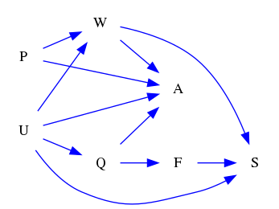
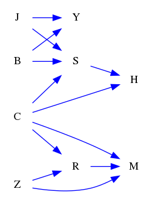
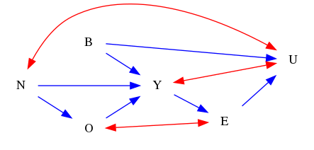

| Find All |How Many |Find One |Yes or No |Multiple Choice |Existence | total |
|:------:|:------:|:------:|:------:|:------:|:------:|:------:|
| 24 |24 |0 |24 |24 |24 | 120 |

|  N=4 | N=5 | N=6 | N=7 | N=8 | N=9 | total |
|:------:|:------:|:------:|:------:|:------:|:------:|:------:|
| 20 |20 |20 |20 |20 |20 | 120 |

|  Yes. | No. | judge_total |
|:------:|:------:|:------:|
| 19 |29 | 48 |

|  A | B | C | D | MC_total |
|:------:|:------:|:------:|:------:|:------:|
| 7 |7 |4 |6 | 24 |

## ID: 88823235
### Graph
- graph type: DAG
- description: Given a DAG (directed acyclic graph) with nodes W, V, E, J and directed edges W->V, W->J, V->J, W->E, V->E, E->J.

### Questions
- [FA] Find all directed paths from node V to node J. 
- [HM] How many directed paths are there from E to J? 
- [YN] Is V<-W->J<-E a directed path from V to E? 
- [MC] Which of the following is a directed path from W to E?\
A. W->J<-E\
B. W->J<-V->E\
C. W->V->J<-E\
D. W->E 
- [EX] Is there a directed path from V to W? 
### Answers
- V->J, V->E->J
- 1
- No.
- D
- No.
## ID: 67564179
### Graph
- graph type: DAG
- description: Given a DAG (directed acyclic graph) with nodes H, O, W, Y and directed edges O->Y, W->Y, O->W, H->O, H->Y.

### Questions
- [FA] Find all directed paths from node H to node O. 
- [HM] How many directed paths are there from W to O? 
- [YN] Is H->Y<-O a directed path from H to O? 
- [MC] Which of the following is a directed path from H to W?\
A. H->Y<-O->W\
B. H->O->W\
C. H->O->Y<-W\
D. H->Y<-W 
- [EX] Is there a directed path from W to H? 
### Answers
- H->O
- 0
- No.
- B
- No.
## ID: 41337709
### Graph
- graph type: DAG
- description: Given a DAG (directed acyclic graph) with nodes X, H, E, D, A and directed edges H->E, X->A, X->H, E->A, H->A, X->D, D->A, E->D.

### Questions
- [FA] Find all directed paths from node H to node A. 
- [HM] How many directed paths are there from E to H? 
- [YN] Is X->D<-E a directed path from X to E? 
- [MC] Which of the following is a directed path from X to E?\
A. X->H->E\
B. X->A<-D<-E\
C. X->H->A<-D<-E\
D. X->H->A<-E 
- [EX] Is there a directed path from A to H? 
### Answers
- H->A, H->E->A, H->E->D->A
- 0
- No.
- A
- No.
## ID: 25516600
### Graph
- graph type: DAG
- description: Given a DAG (directed acyclic graph) with nodes I, V, S, D, Y and directed edges S->D, I->S, S->Y, D->Y, V->Y, I->Y, V->S, I->D, I->V.

### Questions
- [FA] Find all directed paths from node I to node S. 
- [HM] How many directed paths are there from I to V? 
- [YN] Is I->V->S->D->Y a directed path from I to Y? 
- [MC] Which of the following is a directed path from S to D?\
A. S<-I->Y<-D\
B. S->D\
C. S<-V<-I->D\
D. S<-V<-I->Y<-D 
- [EX] Is there a directed path from D to V? 
### Answers
- I->S, I->V->S
- 1
- Yes.
- B
- No.
## ID: 48510845
### Graph
- graph type: DAG
- description: Given a DAG (directed acyclic graph) with nodes X, W, P, N, B, T and directed edges W->N, X->P, P->N, P->B, W->P, W->T, B->T, N->T.

### Questions
- [FA] Find all directed paths from node P to node T. 
- [HM] How many directed paths are there from W to B? 
- [YN] Is X->P->N a directed path from X to N? 
- [MC] Which of the following is a directed path from X to N?\
A. X->P<-W->N\
B. X->P->N\
C. X->P->B->T<-W->N\
D. X->P<-W->T<-N 
- [EX] Is there a directed path from X to N? 
### Answers
- P->B->T, P->N->T
- 1
- Yes.
- B
- Yes.
## ID: 91874812
### Graph
- graph type: DAG
- description: Given a DAG (directed acyclic graph) with nodes W, P, U, X, J, B and directed edges W->B, P->J, W->U, X->J, W->J, U->B, P->X, W->X, U->X, U->J, W->P, P->B.

### Questions
- [FA] Find all directed paths from node U to node X. 
- [HM] How many directed paths are there from U to B? 
- [YN] Is W->U->B a directed path from W to B? 
- [MC] Which of the following is a directed path from U to B?\
A. U->B\
B. U<-W->P->B\
C. U->J<-W->B\
D. U<-W->B 
- [EX] Is there a directed path from W to B? 
### Answers
- U->X
- 1
- Yes.
- A
- Yes.
## ID: 68756387
### Graph
- graph type: DAG
- description: Given a DAG (directed acyclic graph) with nodes A, V, F, X, G, C, H and directed edges C->H, X->H, A->C, A->V, F->H, X->G, A->X, V->C, F->X.

### Questions
- [FA] Find all directed paths from node V to node C. 
- [HM] How many directed paths are there from A to F? 
- [YN] Is V->C->H a directed path from V to H? 
- [MC] Which of the following is a directed path from V to H?\
A. V->C<-A->X<-F->H\
B. V->C->H\
C. V<-A->C->H\
D. V<-A->X->H 
- [EX] Is there a directed path from C to H? 
### Answers
- V->C
- 0
- Yes.
- B
- Yes.
## ID: 64045072
### Graph
- graph type: DAG
- description: Given a DAG (directed acyclic graph) with nodes P, U, Q, F, W, A, S and directed edges U->A, P->W, U->S, W->A, U->Q, F->S, Q->A, W->S, P->A, U->W, Q->F.

### Questions
- [FA] Find all directed paths from node U to node W. 
- [HM] How many directed paths are there from P to F? 
- [YN] Is Q<-U->W->A a directed path from Q to A? 
- [MC] Which of the following is a directed path from U to A?\
A. U->S<-F<-Q->A\
B. U->W->A\
C. U->Q->F->S<-W<-P->A\
D. U->W->S<-F<-Q->A 
- [EX] Is there a directed path from S to P? 
### Answers
- U->W
- 0
- No.
- B
- No.
## ID: 98075372
### Graph
- graph type: DAG
- description: Given a DAG (directed acyclic graph) with nodes W, X, H, Z, M, E, B, K and directed edges M->K, W->X, X->Z, X->M, W->B, X->E, X->H, M->B, Z->K.

### Questions
- [FA] Find all directed paths from node W to node M. 
- [HM] How many directed paths are there from Z to W? 
- [YN] Is W->X->E a directed path from W to E? 
- [MC] Which of the following is a directed path from W to Z?\
A. W->X->Z\
B. W->X->M->K<-Z\
C. W->B<-M->K<-Z\
D. W->B<-M<-X->Z 
- [EX] Is there a directed path from H to X? 
### Answers
- W->X->M
- 0
- Yes.
- A
- No.
## ID: 83287041
### Graph
- graph type: DAG
- description: Given a DAG (directed acyclic graph) with nodes V, N, G, Z, C, T, U, R and directed edges N->Z, Z->U, V->R, C->T, U->R, Z->T, G->T, N->U, C->U, V->G, V->U, N->T.

### Questions
- [FA] Find all directed paths from node U to node R. 
- [HM] How many directed paths are there from V to U? 
- [YN] Is G<-V->R<-U<-C->T a directed path from G to T? 
- [MC] Which of the following is a directed path from V to R?\
A. V->G->T<-C->U->R\
B. V->G->T<-Z<-N->U->R\
C. V->G->T<-N->Z->U->R\
D. V->U->R 
- [EX] Is there a directed path from C to T? 
### Answers
- U->R
- 1
- No.
- D
- Yes.
## ID: 40551991
### Graph
- graph type: DAG
- description: Given a DAG (directed acyclic graph) with nodes J, B, C, Z, Y, R, M, S, H and directed edges R->M, B->S, B->Y, C->R, C->S, S->H, C->M, C->H, Z->M, J->Y, Z->R, J->S.

### Questions
- [FA] Find all directed paths from node C to node R. 
- [HM] How many directed paths are there from Z to Y? 
- [YN] Is C->M a directed path from C to M? 
- [MC] Which of the following is a directed path from J to H?\
A. J->S<-C->H\
B. J->S->H\
C. J->Y<-B->S->H\
D. J->Y<-B->S<-C->H 
- [EX] Is there a directed path from J to C? 
### Answers
- C->R
- 0
- Yes.
- B
- No.
## ID: 63173785
### Graph
- graph type: DAG
- description: Given a DAG (directed acyclic graph) with nodes P, W, F, Y, L, U, D, K, S and directed edges W->K, D->S, P->Y, L->D, F->D, P->L, D->K, Y->D, P->D, Y->L, W->U, P->S.

### Questions
- [FA] Find all directed paths from node Y to node K. 
- [HM] How many directed paths are there from S to Y? 
- [YN] Is L<-Y<-P->D->K a directed path from L to K? 
- [MC] Which of the following is a directed path from Y to S?\
A. Y->D<-P->S\
B. Y<-P->D->S\
C. Y->L<-P->S\
D. Y->L->D->S 
- [EX] Is there a directed path from U to Y? 
### Answers
- Y->D->K, Y->L->D->K
- 0
- No.
- D
- No.
## ID: 74846378
### Graph
- graph type: ADMG
- description: Given an ADMG (acyclic directed mixed graph) with nodes B, F, C, K, directed edges B->C, B->K, F->K, C->K, F->C and bi-directed edges F<->C, C<->K.

### Questions
- [FA] Find all directed paths from node B to node C. 
- [HM] How many directed paths are there from C to F? 
- [YN] Is F->K<->C a directed path from F to C? 
- [MC] Which of the following is a directed path from B to C?\
A. B->K<-C\
B. B->K<-F<->C\
C. B->C\
D. B->K<-F->C 
- [EX] Is there a directed path from F to B? 
### Answers
- B->C
- 0
- No.
- C
- No.
## ID: 44013848
### Graph
- graph type: ADMG
- description: Given an ADMG (acyclic directed mixed graph) with nodes U, Q, A, C, directed edges Q->C, U->A, Q->A, U->Q, U->C and bi-directed edges Q<->C.

### Questions
- [FA] Find all directed paths from node U to node A. 
- [HM] How many directed paths are there from Q to C? 
- [YN] Is U->C<->Q->A a directed path from U to A? 
- [MC] Which of the following is a directed path from Q to A?\
A. Q<-U->A\
B. Q<->C<-U->A\
C. Q->A\
D. Q->C<-U->A 
- [EX] Is there a directed path from A to Q? 
### Answers
- U->A, U->Q->A
- 1
- No.
- C
- No.
## ID: 23929624
### Graph
- graph type: ADMG
- description: Given an ADMG (acyclic directed mixed graph) with nodes B, K, T, Z, D, directed edges B->D, T->Z, T->D, Z->D, K->T, B->K and bi-directed edges B<->T, Z<->D.

### Questions
- [FA] Find all directed paths from node B to node T. 
- [HM] How many directed paths are there from K to Z? 
- [YN] Is B->K->T->Z a directed path from B to Z? 
- [MC] Which of the following is a directed path from T to Z?\
A. T<-K<-B->D<->Z\
B. T->D<-Z\
C. T->Z\
D. T<->B->D<->Z 
- [EX] Is there a directed path from Z to D? 
### Answers
- B->K->T
- 1
- Yes.
- C
- Yes.
## ID: 60991070
### Graph
- graph type: ADMG
- description: Given an ADMG (acyclic directed mixed graph) with nodes U, A, Q, F, N, directed edges Q->F, A->N, U->N, F->N, Q->N, U->A, U->F and bi-directed edges Q<->N, A<->N, A<->Q.

### Questions
- [FA] Find all directed paths from node Q to node F. 
- [HM] How many directed paths are there from U to A? 
- [YN] Is Q->N<-U->F a directed path from Q to F? 
- [MC] Which of the following is a directed path from U to F?\
A. U->N<-A<->Q->F\
B. U->F\
C. U->N<->Q->F\
D. U->N<->A<->Q->F 
- [EX] Is there a directed path from Q to F? 
### Answers
- Q->F
- 1
- No.
- B
- Yes.
## ID: 39481900
### Graph
- graph type: ADMG
- description: Given an ADMG (acyclic directed mixed graph) with nodes B, N, O, Y, E, U, directed edges N->Y, N->O, B->U, Y->E, O->Y, B->Y, E->U and bi-directed edges N<->U, Y<->U, O<->E.

### Questions
- [FA] Find all directed paths from node O to node E. 
- [HM] How many directed paths are there from O to N? 
- [YN] Is N->Y a directed path from N to Y? 
- [MC] Which of the following is a directed path from Y to U?\
A. Y<-B->U\
B. Y<-N<->U\
C. Y->E->U\
D. Y->E<->O<-N<->U 
- [EX] Is there a directed path from N to E? 
### Answers
- O->Y->E
- 0
- Yes.
- C
- Yes.
## ID: 55051698
### Graph
- graph type: ADMG
- description: Given an ADMG (acyclic directed mixed graph) with nodes T, M, Y, K, P, G, directed edges M->G, M->K, M->Y, Y->G, M->P, P->G, T->M, Y->K, K->P, Y->P and bi-directed edges T<->P, K<->G, P<->G, M<->P.

### Questions
- [FA] Find all directed paths from node P to node G. 
- [HM] How many directed paths are there from P to K? 
- [YN] Is Y->G<->P<-M->K a directed path from Y to K? 
- [MC] Which of the following is a directed path from T to P?\
A. T->M->Y->P\
B. T<->P\
C. T->M->Y->G<-P\
D. T->M->Y->K<->G<->P 
- [EX] Is there a directed path from T to P? 
### Answers
- P->G
- 0
- No.
- A
- Yes.
## ID: 48460263
### Graph
- graph type: ADMG
- description: Given an ADMG (acyclic directed mixed graph) with nodes D, C, M, G, S, T, O, directed edges G->T, D->G, S->T, M->O, T->O, C->T, D->O, C->O, D->S, C->G, G->O and bi-directed edges S<->T, M<->O, T<->O, D<->G.

### Questions
- [FA] Find all directed paths from node D to node T. 
- [HM] How many directed paths are there from D to M? 
- [YN] Is M<->O a directed path from M to O? 
- [MC] Which of the following is a directed path from C to G?\
A. C->O<-T<->S<-D->G\
B. C->O<-T<-S<-D->G\
C. C->T->O<-D->G\
D. C->G 
- [EX] Is there a directed path from S to C? 
### Answers
- D->G->T, D->S->T
- 0
- No.
- D
- No.
## ID: 05204221
### Graph
- graph type: ADMG
- description: Given an ADMG (acyclic directed mixed graph) with nodes T, U, L, Y, M, C, O, directed edges U->M, L->C, Y->O, T->O, M->C, U->C, L->M, U->O, T->M, Y->C, U->Y and bi-directed edges T<->U, M<->O, L<->O, U<->C.

### Questions
- [FA] Find all directed paths from node T to node M. 
- [HM] How many directed paths are there from C to T? 
- [YN] Is T->M<->O<-Y<-U->C a directed path from T to C? 
- [MC] Which of the following is a directed path from L to M?\
A. L->C<-Y<-U->M\
B. L<->O<->M\
C. L->C<->U->Y->O<->M\
D. L->M 
- [EX] Is there a directed path from Y to C? 
### Answers
- T->M
- 0
- No.
- D
- Yes.
## ID: 13847528
### Graph
- graph type: ADMG
- description: Given an ADMG (acyclic directed mixed graph) with nodes B, U, G, V, T, D, M, E, directed edges V->E, U->D, B->G, V->T, U->V, M->E, T->D, T->M, V->M, G->T, D->M, U->M and bi-directed edges U<->E, V<->E, G<->M, G<->V, V<->T, M<->E.

### Questions
- [FA] Find all directed paths from node G to node M. 
- [HM] How many directed paths are there from D to V? 
- [YN] Is U->V->M->E a directed path from U to E? 
- [MC] Which of the following is a directed path from G to T?\
A. G->T\
B. G<->V->E<->M<-D<-T\
C. G<->M<-V<-U->D<-T\
D. G<->V->E<-M<-U->D<-T 
- [EX] Is there a directed path from M to V? 
### Answers
- G->T->M, G->T->D->M
- 0
- Yes.
- A
- No.
## ID: 73653812
### Graph
- graph type: ADMG
- description: Given an ADMG (acyclic directed mixed graph) with nodes E, K, Q, C, D, G, T, J, directed edges Q->D, C->J, K->Q, K->C, Q->T, G->T, G->J, E->J, E->T and bi-directed edges K<->C.

### Questions
- [FA] Find all directed paths from node E to node T. 
- [HM] How many directed paths are there from C to G? 
- [YN] Is G->J<-E->T a directed path from G to T? 
- [MC] Which of the following is a directed path from Q to T?\
A. Q->T\
B. Q<-K<->C->J<-G->T\
C. Q<-K->C->J<-G->T\
D. Q<-K<->C->J<-E->T 
- [EX] Is there a directed path from E to Q? 
### Answers
- E->T
- 0
- No.
- A
- No.
## ID: 04274496
### Graph
- graph type: ADMG
- description: Given an ADMG (acyclic directed mixed graph) with nodes J, F, N, O, K, I, V, Y, T, directed edges J->Y, O->K, J->V, J->N, V->Y, F->N, O->Y, V->T, O->T, N->O, I->V, J->I and bi-directed edges F<->N, J<->V, I<->Y, O<->I, N<->O.

### Questions
- [FA] Find all directed paths from node N to node Y. 
- [HM] How many directed paths are there from Y to I? 
- [YN] Is J<->V<-I<->Y<-O<->N a directed path from J to N? 
- [MC] Which of the following is a directed path from F to T?\
A. F<->N<->O->Y<-J->I->V->T\
B. F->N<-J->V<-I<->O->T\
C. F->N<-J->Y<-O->T\
D. F->N->O->T 
- [EX] Is there a directed path from Y to V? 
### Answers
- N->O->Y
- 0
- No.
- D
- No.
## ID: 80545388
### Graph
- graph type: ADMG
- description: Given an ADMG (acyclic directed mixed graph) with nodes R, D, K, S, M, W, Z, P, B, directed edges Z->B, K->Z, R->D, K->S, D->P, D->W, K->P, S->B, P->B, K->M, M->Z, W->Z and bi-directed edges R<->Z, R<->W, W<->Z, K<->B.

### Questions
- [FA] Find all directed paths from node R to node W. 
- [HM] How many directed paths are there from Z to R? 
- [YN] Is K->Z->B a directed path from K to B? 
- [MC] Which of the following is a directed path from K to Z?\
A. K->M->Z\
B. K<->B<-P<-D->W<->Z\
C. K->P<-D<-R<->Z\
D. K->P<-D->W<->R<->Z 
- [EX] Is there a directed path from W to P? 
### Answers
- R->D->W
- 0
- Yes.
- A
- No.
