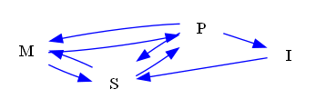

| Find All |How Many |Find One |Yes or No |Multiple Choice |Existence | total |
|:------:|:------:|:------:|:------:|:------:|:------:|:------:|
| 48 |48 |0 |48 |48 |0 | 192 |

|  N=4 | N=5 | N=6 | N=7 | N=8 | N=9 | total |
|:------:|:------:|:------:|:------:|:------:|:------:|:------:|
| 32 |32 |32 |32 |32 |32 | 192 |

|  Yes. | No. | judge_total |
|:------:|:------:|:------:|
| 19 |29 | 48 |

|  A | B | C | D | MC_total |
|:------:|:------:|:------:|:------:|:------:|
| 14 |15 |10 |9 | 48 |

## ID: 78650197
### Graph
- graph type: UG
- description: Given a undirected graph with nodes S, L, N, T and undirected edges S-T, L-N, S-L, S-N, L-T.

### Questions
- [FA] List all edges of this graph. 
- [HM] How many edges does this graph have? 
- [YN] Is N-T an edge of this graph? 
- [MC] Which of the following is NOT an edge of this graph?\
A. L-N\
B. S-T\
C. N-T\
D. S-N 
### Answers
- S-T, L-N, S-L, S-N, L-T
- 5
- No.
- C
## ID: 96889165
### Graph
- graph type: UG
- description: Given a undirected graph with nodes A, F, S, R and undirected edges A-F, A-S, F-R, F-S, A-R, S-R.

### Questions
- [FA] List all edges of this graph. 
- [HM] How many edges does this graph have? 
- [YN] Is S-R an edge of this graph? 
- [MC] Which of the following is an edge of this graph?\
A. R->F\
B. S-R\
C. A->F\
D. A->R 
### Answers
- A-F, A-S, F-R, F-S, A-R, S-R
- 6
- Yes.
- B
## ID: 76124016
### Graph
- graph type: UG
- description: Given a undirected graph with nodes J, H, X, A, O and undirected edges H-A, H-X, H-O, X-O, A-O, J-A, J-X, J-O, J-H, X-A.

### Questions
- [FA] List all edges of this graph. 
- [HM] How many edges does this graph have? 
- [YN] Is X->H an edge of this graph? 
- [MC] Which of the following is NOT an edge of this graph?\
A. J-H\
B. H-X\
C. H-O\
D. O->J 
### Answers
- H-A, H-X, H-O, X-O, A-O, J-A, J-X, J-O, J-H, X-A
- 10
- No.
- D
## ID: 48922181
### Graph
- graph type: UG
- description: Given a undirected graph with nodes B, Y, K, M, R and undirected edges Y-R, M-R, B-K, B-Y.

### Questions
- [FA] List all edges of this graph. 
- [HM] How many edges does this graph have? 
- [YN] Is Y-R an edge of this graph? 
- [MC] Which of the following is NOT an edge of this graph?\
A. Y-R\
B. B-K\
C. Y-K\
D. M-R 
### Answers
- Y-R, M-R, B-K, B-Y
- 4
- Yes.
- C
## ID: 98426227
### Graph
- graph type: UG
- description: Given a undirected graph with nodes S, E, F, J, K, H and undirected edges E-J, S-E, F-H, J-K, J-H, S-H, F-K, S-J, K-H.

### Questions
- [FA] List all edges of this graph. 
- [HM] How many edges does this graph have? 
- [YN] Is H-E an edge of this graph? 
- [MC] Which of the following is an edge of this graph?\
A. S-J\
B. H-E\
C. F-J\
D. F-S 
### Answers
- E-J, S-E, F-H, J-K, J-H, S-H, F-K, S-J, K-H
- 9
- No.
- A
## ID: 73562341
### Graph
- graph type: UG
- description: Given a undirected graph with nodes M, B, X, D, L, V and undirected edges M-V, B-L, M-L, X-V, B-V, D-V, X-L.

### Questions
- [FA] List all edges of this graph. 
- [HM] How many edges does this graph have? 
- [YN] Is X-D an edge of this graph? 
- [MC] Which of the following is an edge of this graph?\
A. X-B\
B. X-D\
C. M-L\
D. M-B 
### Answers
- M-V, B-L, M-L, X-V, B-V, D-V, X-L
- 7
- No.
- C
## ID: 24780269
### Graph
- graph type: UG
- description: Given a undirected graph with nodes F, P, W, L, D, A, O and undirected edges W-A, F-O, D-O, F-D, P-D, W-L, F-L.

### Questions
- [FA] List all edges of this graph. 
- [HM] How many edges does this graph have? 
- [YN] Is D-A an edge of this graph? 
- [MC] Which of the following is NOT an edge of this graph?\
A. P-A\
B. F-O\
C. P-D\
D. F-L 
### Answers
- W-A, F-O, D-O, F-D, P-D, W-L, F-L
- 7
- No.
- A
## ID: 44326368
### Graph
- graph type: UG
- description: Given a undirected graph with nodes Z, H, X, O, B, C, K and undirected edges X-C, B-K, Z-X, H-K, O-B, Z-H, X-O, Z-B.

### Questions
- [FA] List all edges of this graph. 
- [HM] How many edges does this graph have? 
- [YN] Is Z-H an edge of this graph? 
- [MC] Which of the following is an edge of this graph?\
A. X-O\
B. X-K\
C. H-O\
D. B-X 
### Answers
- X-C, B-K, Z-X, H-K, O-B, Z-H, X-O, Z-B
- 8
- Yes.
- A
## ID: 13250088
### Graph
- graph type: UG
- description: Given a undirected graph with nodes Z, O, C, G, P, I, A, T and undirected edges P-I, O-G, G-T, G-I, C-I, Z-G, G-P, O-I, C-A, O-P.

### Questions
- [FA] List all edges of this graph. 
- [HM] How many edges does this graph have? 
- [YN] Is C-A an edge of this graph? 
- [MC] Which of the following is NOT an edge of this graph?\
A. O-I\
B. P-Z\
C. G-T\
D. G-P 
### Answers
- P-I, O-G, G-T, G-I, C-I, Z-G, G-P, O-I, C-A, O-P
- 10
- Yes.
- B
## ID: 56940661
### Graph
- graph type: UG
- description: Given a undirected graph with nodes I, F, N, P, Z, U, R, T and undirected edges I-F, Z-U, F-P, N-P, F-T, F-R, F-N, U-R, Z-T, I-T.

### Questions
- [FA] List all edges of this graph. 
- [HM] How many edges does this graph have? 
- [YN] Is F-N an edge of this graph? 
- [MC] Which of the following is NOT an edge of this graph?\
A. N-P\
B. U-R\
C. Z-F\
D. F-T 
### Answers
- I-F, Z-U, F-P, N-P, F-T, F-R, F-N, U-R, Z-T, I-T
- 10
- Yes.
- C
## ID: 17335754
### Graph
- graph type: UG
- description: Given a undirected graph with nodes M, R, N, Y, I, B, Z, O, H and undirected edges M-Y, Z-O, N-I, M-R, M-Z, R-N, B-H, R-Y, Y-O, O-H.

### Questions
- [FA] List all edges of this graph. 
- [HM] How many edges does this graph have? 
- [YN] Is Z-B an edge of this graph? 
- [MC] Which of the following is NOT an edge of this graph?\
A. H-Y\
B. B-H\
C. R-Y\
D. M-Z 
### Answers
- M-Y, Z-O, N-I, M-R, M-Z, R-N, B-H, R-Y, Y-O, O-H
- 10
- No.
- A
## ID: 15777125
### Graph
- graph type: UG
- description: Given a undirected graph with nodes A, F, W, G, X, I, V, H, C and undirected edges A-V, W-G, A-X, G-C, I-H, X-I, V-H, F-X, F-G.

### Questions
- [FA] List all edges of this graph. 
- [HM] How many edges does this graph have? 
- [YN] Is A-V an edge of this graph? 
- [MC] Which of the following is NOT an edge of this graph?\
A. G-C\
B. A-X\
C. V-F\
D. I-H 
### Answers
- A-V, W-G, A-X, G-C, I-H, X-I, V-H, F-X, F-G
- 9
- Yes.
- C
## ID: 02289742
### Graph
- graph type: DG
- description: Given a directed graph with nodes Z, M, Q, R and directed edges Q->M, Q->R, R->Z.

### Questions
- [FA] List all edges of this graph. 
- [HM] How many edges does this graph have? 
- [YN] Is M->Q an edge of this graph? 
- [MC] Which of the following is NOT an edge of this graph?\
A. Q->R\
B. Q->M\
C. Q->Z\
D. R->Z 
### Answers
- Q->M, Q->R, R->Z
- 3
- No.
- C
## ID: 00917189
### Graph
- graph type: DG
- description: Given a directed graph with nodes M, S, I, P and directed edges M->S, P->M, S->M, P->S, S->P, P->I, M->P, I->S.

### Questions
- [FA] List all edges of this graph. 
- [HM] How many edges does this graph have? 
- [YN] Is S<->M an edge of this graph? 
- [MC] Which of the following is an edge of this graph?\
A. M<->P\
B. P->M\
C. S->I\
D. I->M 
### Answers
- M->S, P->M, S->M, P->S, S->P, P->I, M->P, I->S
- 8
- No.
- B
## ID: 01292479
### Graph
- graph type: DG
- description: Given a directed graph with nodes C, J, L, Y, B and directed edges J->B, L->J, B->L, J->Y, J->C, Y->B, C->B.

### Questions
- [FA] List all edges of this graph. 
- [HM] How many edges does this graph have? 
- [YN] Is C->L an edge of this graph? 
- [MC] Which of the following is an edge of this graph?\
A. Y->B\
B. Y->J\
C. L->B\
D. C->J 
### Answers
- J->B, L->J, B->L, J->Y, J->C, Y->B, C->B
- 7
- No.
- A
## ID: 24962829
### Graph
- graph type: DG
- description: Given a directed graph with nodes M, Y, W, D, N and directed edges N->M, M->W, M->Y, N->D, D->W.

### Questions
- [FA] List all edges of this graph. 
- [HM] How many edges does this graph have? 
- [YN] Is D->Y an edge of this graph? 
- [MC] Which of the following is an edge of this graph?\
A. M->W\
B. Y->D\
C. Y->W\
D. D->Y 
### Answers
- N->M, M->W, M->Y, N->D, D->W
- 5
- No.
- A
## ID: 44641358
### Graph
- graph type: DG
- description: Given a directed graph with nodes I, F, R, G, X, U and directed edges F->G, F->I, X->G, U->I, G->X, X->I, R->I, U->X, I->R.

### Questions
- [FA] List all edges of this graph. 
- [HM] How many edges does this graph have? 
- [YN] Is U->R an edge of this graph? 
- [MC] Which of the following is NOT an edge of this graph?\
A. G->I\
B. X->I\
C. U->I\
D. R->I 
### Answers
- F->G, F->I, X->G, U->I, G->X, X->I, R->I, U->X, I->R
- 9
- No.
- A
## ID: 94901280
### Graph
- graph type: DG
- description: Given a directed graph with nodes I, V, T, Q, M, N and directed edges T->I, N->M, V->N, M->T, V->Q, I->Q.

### Questions
- [FA] List all edges of this graph. 
- [HM] How many edges does this graph have? 
- [YN] Is I->T an edge of this graph? 
- [MC] Which of the following is an edge of this graph?\
A. T->Q\
B. T->I\
C. T->M\
D. I->T 
### Answers
- T->I, N->M, V->N, M->T, V->Q, I->Q
- 6
- No.
- B
## ID: 56609682
### Graph
- graph type: DG
- description: Given a directed graph with nodes B, P, V, E, A, T, I and directed edges A->P, P->E, T->E, V->I, P->T, E->B, E->A, V->B, P->B.

### Questions
- [FA] List all edges of this graph. 
- [HM] How many edges does this graph have? 
- [YN] Is E->B an edge of this graph? 
- [MC] Which of the following is an edge of this graph?\
A. B->T\
B. A->E\
C. E->P\
D. V->B 
### Answers
- A->P, P->E, T->E, V->I, P->T, E->B, E->A, V->B, P->B
- 9
- Yes.
- D
## ID: 32928282
### Graph
- graph type: DG
- description: Given a directed graph with nodes Q, B, S, R, Z, P, V and directed edges Q->B, R->V, P->Q, B->Q, R->S, P->S, Z->Q, S->Q, B->P.

### Questions
- [FA] List all edges of this graph. 
- [HM] How many edges does this graph have? 
- [YN] Is Q->P an edge of this graph? 
- [MC] Which of the following is NOT an edge of this graph?\
A. V->R\
B. R->S\
C. B->P\
D. R->V 
### Answers
- Q->B, R->V, P->Q, B->Q, R->S, P->S, Z->Q, S->Q, B->P
- 9
- No.
- A
## ID: 45685682
### Graph
- graph type: DG
- description: Given a directed graph with nodes Z, O, D, U, B, G, N, Y and directed edges Z->N, U->N, N->D, Z->B, O->G, O->D, N->B, Y->O, N->Z, U->G.

### Questions
- [FA] List all edges of this graph. 
- [HM] How many edges does this graph have? 
- [YN] Is U->G an edge of this graph? 
- [MC] Which of the following is NOT an edge of this graph?\
A. N->Z\
B. N->Y\
C. Y->O\
D. Z->N 
### Answers
- Z->N, U->N, N->D, Z->B, O->G, O->D, N->B, Y->O, N->Z, U->G
- 10
- Yes.
- B
## ID: 44118704
### Graph
- graph type: DG
- description: Given a directed graph with nodes N, P, I, V, Q, O, A, Y and directed edges Q->V, N->P, N->I, P->N, P->V, Q->Y, Y->A, N->O.

### Questions
- [FA] List all edges of this graph. 
- [HM] How many edges does this graph have? 
- [YN] Is Y->Q an edge of this graph? 
- [MC] Which of the following is an edge of this graph?\
A. Y->A\
B. I->A\
C. A->Q\
D. Y->Q 
### Answers
- Q->V, N->P, N->I, P->N, P->V, Q->Y, Y->A, N->O
- 8
- No.
- A
## ID: 82252279
### Graph
- graph type: DG
- description: Given a directed graph with nodes E, O, W, Q, R, D, M, V, A and directed edges M->E, V->D, D->A, M->Q, V->E, W->R, W->Q, O->M.

### Questions
- [FA] List all edges of this graph. 
- [HM] How many edges does this graph have? 
- [YN] Is E->Q an edge of this graph? 
- [MC] Which of the following is an edge of this graph?\
A. O->M\
B. E->M\
C. E->V\
D. A->R 
### Answers
- M->E, V->D, D->A, M->Q, V->E, W->R, W->Q, O->M
- 8
- No.
- A
## ID: 80913899
### Graph
- graph type: DG
- description: Given a directed graph with nodes Q, E, I, R, M, P, J, A, K and directed edges Q->P, R->K, R->E, E->I, E->M, Q->K, Q->J, I->P, A->J, E->A.

### Questions
- [FA] List all edges of this graph. 
- [HM] How many edges does this graph have? 
- [YN] Is P->I an edge of this graph? 
- [MC] Which of the following is an edge of this graph?\
A. E->R\
B. P->Q\
C. A->J\
D. P->A 
### Answers
- Q->P, R->K, R->E, E->I, E->M, Q->K, Q->J, I->P, A->J, E->A
- 10
- No.
- C
## ID: 56379123
### Graph
- graph type: DAG
- description: Given a DAG (directed acyclic graph) with nodes B, K, F, H and directed edges F->H, B->H, K->H, B->K.

### Questions
- [FA] List all edges of this graph. 
- [HM] How many edges does this graph have? 
- [YN] Is K->B an edge of this graph? 
- [MC] Which of the following is NOT an edge of this graph?\
A. B->H\
B. K->H\
C. B->K\
D. H->F 
### Answers
- F->H, B->H, K->H, B->K
- 4
- No.
- D
## ID: 05024668
### Graph
- graph type: DAG
- description: Given a DAG (directed acyclic graph) with nodes Q, Z, M, S and directed edges Q->Z, Q->M, M->S, Z->M, Z->S.

### Questions
- [FA] List all edges of this graph. 
- [HM] How many edges does this graph have? 
- [YN] Is S->Z an edge of this graph? 
- [MC] Which of the following is an edge of this graph?\
A. Z->Q\
B. Z->S\
C. M->Q\
D. Q->S 
### Answers
- Q->Z, Q->M, M->S, Z->M, Z->S
- 5
- No.
- B
## ID: 50572365
### Graph
- graph type: DAG
- description: Given a DAG (directed acyclic graph) with nodes I, F, V, H, S and directed edges I->V, V->H, F->V, I->S, F->S, H->S, V->S, I->H, I->F.

### Questions
- [FA] List all edges of this graph. 
- [HM] How many edges does this graph have? 
- [YN] Is H->S an edge of this graph? 
- [MC] Which of the following is NOT an edge of this graph?\
A. V->I\
B. I->S\
C. V->H\
D. I->F 
### Answers
- I->V, V->H, F->V, I->S, F->S, H->S, V->S, I->H, I->F
- 9
- Yes.
- A
## ID: 38720295
### Graph
- graph type: DAG
- description: Given a DAG (directed acyclic graph) with nodes B, W, Z, X, J and directed edges X->J, B->J, Z->J, Z->X, B->Z, W->X.

### Questions
- [FA] List all edges of this graph. 
- [HM] How many edges does this graph have? 
- [YN] Is X->J an edge of this graph? 
- [MC] Which of the following is NOT an edge of this graph?\
A. J->Z\
B. B->J\
C. B->Z\
D. Z->X 
### Answers
- X->J, B->J, Z->J, Z->X, B->Z, W->X
- 6
- Yes.
- A
## ID: 74794555
### Graph
- graph type: DAG
- description: Given a DAG (directed acyclic graph) with nodes W, T, E, C, V, Y and directed edges W->V, E->C, W->T, E->V, T->Y, W->E, C->V, V->Y.

### Questions
- [FA] List all edges of this graph. 
- [HM] How many edges does this graph have? 
- [YN] Is V->E an edge of this graph? 
- [MC] Which of the following is an edge of this graph?\
A. Y->W\
B. T->V\
C. E->T\
D. E->V 
### Answers
- W->V, E->C, W->T, E->V, T->Y, W->E, C->V, V->Y
- 8
- No.
- D
## ID: 66174891
### Graph
- graph type: DAG
- description: Given a DAG (directed acyclic graph) with nodes G, W, X, E, V, S and directed edges W->X, V->S, G->V, X->V, G->S, G->E, W->E, E->S.

### Questions
- [FA] List all edges of this graph. 
- [HM] How many edges does this graph have? 
- [YN] Is V->X an edge of this graph? 
- [MC] Which of the following is an edge of this graph?\
A. X->W\
B. E->S\
C. G->X\
D. S->G 
### Answers
- W->X, V->S, G->V, X->V, G->S, G->E, W->E, E->S
- 8
- No.
- B
## ID: 33787485
### Graph
- graph type: DAG
- description: Given a DAG (directed acyclic graph) with nodes Z, B, K, G, T, J, H and directed edges J->H, B->G, T->J, B->H, K->J, Z->T, T->H, G->H.

### Questions
- [FA] List all edges of this graph. 
- [HM] How many edges does this graph have? 
- [YN] Is B->G an edge of this graph? 
- [MC] Which of the following is an edge of this graph?\
A. K->T\
B. K->J\
C. J->K\
D. H->T 
### Answers
- J->H, B->G, T->J, B->H, K->J, Z->T, T->H, G->H
- 8
- Yes.
- B
## ID: 99049944
### Graph
- graph type: DAG
- description: Given a DAG (directed acyclic graph) with nodes J, B, A, W, P, F, O and directed edges A->O, B->P, B->W, J->O, B->F, W->F, A->F, P->O, A->P.

### Questions
- [FA] List all edges of this graph. 
- [HM] How many edges does this graph have? 
- [YN] Is P->F an edge of this graph? 
- [MC] Which of the following is an edge of this graph?\
A. P->O\
B. W->J\
C. W->B\
D. J->F 
### Answers
- A->O, B->P, B->W, J->O, B->F, W->F, A->F, P->O, A->P
- 9
- No.
- A
## ID: 34467709
### Graph
- graph type: DAG
- description: Given a DAG (directed acyclic graph) with nodes X, H, J, P, G, S, I, R and directed edges P->R, P->I, H->G, J->S, S->I, X->I, G->I, X->R, H->P, X->S.

### Questions
- [FA] List all edges of this graph. 
- [HM] How many edges does this graph have? 
- [YN] Is I->P an edge of this graph? 
- [MC] Which of the following is NOT an edge of this graph?\
A. J->S\
B. I->P\
C. X->I\
D. H->G 
### Answers
- P->R, P->I, H->G, J->S, S->I, X->I, G->I, X->R, H->P, X->S
- 10
- No.
- B
## ID: 20874401
### Graph
- graph type: DAG
- description: Given a DAG (directed acyclic graph) with nodes O, W, X, P, U, S, H, A and directed edges W->P, W->A, X->H, U->A, X->P, O->W, X->A, W->H, O->S.

### Questions
- [FA] List all edges of this graph. 
- [HM] How many edges does this graph have? 
- [YN] Is O->W an edge of this graph? 
- [MC] Which of the following is NOT an edge of this graph?\
A. W->P\
B. O->W\
C. U->A\
D. A->X 
### Answers
- W->P, W->A, X->H, U->A, X->P, O->W, X->A, W->H, O->S
- 9
- Yes.
- D
## ID: 41775230
### Graph
- graph type: DAG
- description: Given a DAG (directed acyclic graph) with nodes I, M, K, U, P, V, G, F, A and directed edges G->F, K->P, U->P, I->A, V->F, I->V, U->V, M->V, M->F.

### Questions
- [FA] List all edges of this graph. 
- [HM] How many edges does this graph have? 
- [YN] Is V->F an edge of this graph? 
- [MC] Which of the following is an edge of this graph?\
A. F->A\
B. G->A\
C. F->V\
D. I->A 
### Answers
- G->F, K->P, U->P, I->A, V->F, I->V, U->V, M->V, M->F
- 9
- Yes.
- D
## ID: 51192687
### Graph
- graph type: DAG
- description: Given a DAG (directed acyclic graph) with nodes E, V, U, J, B, L, F, Y, I and directed edges E->L, Y->I, B->I, J->F, J->L, E->Y, V->I, E->U.

### Questions
- [FA] List all edges of this graph. 
- [HM] How many edges does this graph have? 
- [YN] Is B->L an edge of this graph? 
- [MC] Which of the following is NOT an edge of this graph?\
A. E->Y\
B. Y->I\
C. U->Y\
D. B->I 
### Answers
- E->L, Y->I, B->I, J->F, J->L, E->Y, V->I, E->U
- 8
- No.
- C
## ID: 12521127
### Graph
- graph type: ADMG
- description: Given an ADMG (acyclic directed mixed graph) with nodes D, B, V, F, directed edges D->B, B->F, D->V, D->F, B->V and bi-directed edges B<->V, V<->F.

### Questions
- [FA] List all edges of this graph. 
- [HM] How many edges does this graph have? 
- [YN] Is V->B an edge of this graph? 
- [MC] Which of the following is an edge of this graph?\
A. B->D\
B. B<->D\
C. F->B\
D. D->V 
### Answers
- D->B, B->F, D->V, D->F, B->V, B<->V, V<->F
- 7
- No.
- D
## ID: 08369737
### Graph
- graph type: ADMG
- description: Given an ADMG (acyclic directed mixed graph) with nodes U, D, E, K, directed edges U->K, U->E, D->K, D->E, U->D and bi-directed edges U<->E, D<->K.

### Questions
- [FA] List all edges of this graph. 
- [HM] How many edges does this graph have? 
- [YN] Is K->U an edge of this graph? 
- [MC] Which of the following is an edge of this graph?\
A. K->D\
B. U<->E\
C. D->U\
D. U<->D 
### Answers
- U->K, U->E, D->K, D->E, U->D, U<->E, D<->K
- 7
- No.
- B
## ID: 51638327
### Graph
- graph type: ADMG
- description: Given an ADMG (acyclic directed mixed graph) with nodes S, Z, T, K, A, directed edges S->Z, Z->K, S->A, K->A, S->T, T->K, Z->A, S->K, Z->T and bi-directed edges S<->Z.

### Questions
- [FA] List all edges of this graph. 
- [HM] How many edges does this graph have? 
- [YN] Is T->K an edge of this graph? 
- [MC] Which of the following is NOT an edge of this graph?\
A. K->S\
B. Z->K\
C. S->K\
D. S->A 
### Answers
- S->Z, Z->K, S->A, K->A, S->T, T->K, Z->A, S->K, Z->T, S<->Z
- 10
- Yes.
- A
## ID: 88212456
### Graph
- graph type: ADMG
- description: Given an ADMG (acyclic directed mixed graph) with nodes G, L, E, A, O, directed edges G->E, G->L, L->A, G->A, E->O, L->O, E->A, G->O, A->O, L->E and bi-directed edges L<->A, G<->L.

### Questions
- [FA] List all edges of this graph. 
- [HM] How many edges does this graph have? 
- [YN] Is L->O an edge of this graph? 
- [MC] Which of the following is an edge of this graph?\
A. O->A\
B. L->A\
C. E->L\
D. L->G 
### Answers
- G->E, G->L, L->A, G->A, E->O, L->O, E->A, G->O, A->O, L->E, L<->A, G<->L
- 12
- Yes.
- B
## ID: 55085792
### Graph
- graph type: ADMG
- description: Given an ADMG (acyclic directed mixed graph) with nodes Z, T, D, B, C, F, directed edges B->C, Z->F, D->F, B->F, Z->C, D->C, Z->T, T->B, D->B, T->C and bi-directed edges Z<->D, T<->F, Z<->C.

### Questions
- [FA] List all edges of this graph. 
- [HM] How many edges does this graph have? 
- [YN] Is Z<->C an edge of this graph? 
- [MC] Which of the following is NOT an edge of this graph?\
A. Z->F\
B. B->Z\
C. T->B\
D. T<->F 
### Answers
- B->C, Z->F, D->F, B->F, Z->C, D->C, Z->T, T->B, D->B, T->C, Z<->D, T<->F, Z<->C
- 13
- Yes.
- B
## ID: 62247330
### Graph
- graph type: ADMG
- description: Given an ADMG (acyclic directed mixed graph) with nodes T, R, Z, B, Y, M, directed edges T->M, B->M, B->Y, Z->Y, Z->B, T->B, R->Z, T->Y, Y->M and bi-directed edges R<->Y, Y<->M.

### Questions
- [FA] List all edges of this graph. 
- [HM] How many edges does this graph have? 
- [YN] Is R->M an edge of this graph? 
- [MC] Which of the following is NOT an edge of this graph?\
A. T->M\
B. T->B\
C. B->Y\
D. T->R 
### Answers
- T->M, B->M, B->Y, Z->Y, Z->B, T->B, R->Z, T->Y, Y->M, R<->Y, Y<->M
- 11
- No.
- D
## ID: 21057148
### Graph
- graph type: ADMG
- description: Given an ADMG (acyclic directed mixed graph) with nodes J, F, H, X, I, C, B, directed edges X->C, F->B, J->X, X->B, H->C, H->I, F->C, J->F, F->X, H->X and bi-directed edges C<->B, F<->H, H<->C.

### Questions
- [FA] List all edges of this graph. 
- [HM] How many edges does this graph have? 
- [YN] Is X->J an edge of this graph? 
- [MC] Which of the following is NOT an edge of this graph?\
A. H->X\
B. C->I\
C. C<->B\
D. F->X 
### Answers
- X->C, F->B, J->X, X->B, H->C, H->I, F->C, J->F, F->X, H->X, C<->B, F<->H, H<->C
- 13
- No.
- B
## ID: 47084947
### Graph
- graph type: ADMG
- description: Given an ADMG (acyclic directed mixed graph) with nodes I, D, V, T, M, P, W, directed edges V->W, I->V, T->W, I->T, I->P, D->T, V->T, D->M, I->W, M->W and bi-directed edges V<->W, V<->P, T<->P, I<->V, D<->T.

### Questions
- [FA] List all edges of this graph. 
- [HM] How many edges does this graph have? 
- [YN] Is V<->P an edge of this graph? 
- [MC] Which of the following is NOT an edge of this graph?\
A. V->W\
B. P->V\
C. T->W\
D. I->V 
### Answers
- V->W, I->V, T->W, I->T, I->P, D->T, V->T, D->M, I->W, M->W, V<->W, V<->P, T<->P, I<->V, D<->T
- 15
- Yes.
- B
## ID: 68580926
### Graph
- graph type: ADMG
- description: Given an ADMG (acyclic directed mixed graph) with nodes S, D, O, J, I, L, C, Q, directed edges I->Q, O->Q, O->I, O->L, L->Q, D->J, S->Q, O->J, I->C and bi-directed edges O<->L, S<->J, S<->D.

### Questions
- [FA] List all edges of this graph. 
- [HM] How many edges does this graph have? 
- [YN] Is O->I an edge of this graph? 
- [MC] Which of the following is an edge of this graph?\
A. C->D\
B. J->C\
C. I->Q\
D. J->S 
### Answers
- I->Q, O->Q, O->I, O->L, L->Q, D->J, S->Q, O->J, I->C, O<->L, S<->J, S<->D
- 12
- Yes.
- C
## ID: 94731848
### Graph
- graph type: ADMG
- description: Given an ADMG (acyclic directed mixed graph) with nodes W, R, G, I, Z, K, F, X, directed edges G->X, F->X, Z->K, R->K, G->Z, R->X, W->X, I->K and bi-directed edges R<->F, I<->Z, R<->X.

### Questions
- [FA] List all edges of this graph. 
- [HM] How many edges does this graph have? 
- [YN] Is G->F an edge of this graph? 
- [MC] Which of the following is NOT an edge of this graph?\
A. R->K\
B. G->Z\
C. K->X\
D. R<->X 
### Answers
- G->X, F->X, Z->K, R->K, G->Z, R->X, W->X, I->K, R<->F, I<->Z, R<->X
- 11
- No.
- C
## ID: 99471424
### Graph
- graph type: ADMG
- description: Given an ADMG (acyclic directed mixed graph) with nodes L, M, C, B, U, E, G, X, R, directed edges C->X, L->E, G->X, X->R, C->E, M->B, M->E, C->R, U->X, U->G and bi-directed edges C<->E, M<->X, L<->E, L<->X, L<->U.

### Questions
- [FA] List all edges of this graph. 
- [HM] How many edges does this graph have? 
- [YN] Is C->E an edge of this graph? 
- [MC] Which of the following is an edge of this graph?\
A. R->U\
B. U->X\
C. B->M\
D. B->X 
### Answers
- C->X, L->E, G->X, X->R, C->E, M->B, M->E, C->R, U->X, U->G, C<->E, M<->X, L<->E, L<->X, L<->U
- 15
- Yes.
- B
## ID: 40790228
### Graph
- graph type: ADMG
- description: Given an ADMG (acyclic directed mixed graph) with nodes X, A, T, H, V, R, L, I, D, directed edges V->R, X->R, A->H, A->R, A->T, X->I, I->D, T->L, T->D and bi-directed edges T<->I.

### Questions
- [FA] List all edges of this graph. 
- [HM] How many edges does this graph have? 
- [YN] Is A->X an edge of this graph? 
- [MC] Which of the following is an edge of this graph?\
A. H->A\
B. R->L\
C. X->L\
D. X->R 
### Answers
- V->R, X->R, A->H, A->R, A->T, X->I, I->D, T->L, T->D, T<->I
- 10
- No.
- D
