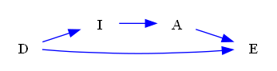

| Find All |How Many |Find One |Yes or No |Multiple Choice |Existence | total |
|:------:|:------:|:------:|:------:|:------:|:------:|:------:|
| 0 |0 |72 |24 |24 |24 | 144 |

|  N=4 | N=5 | N=6 | N=7 | N=8 | N=9 | total |
|:------:|:------:|:------:|:------:|:------:|:------:|:------:|
| 24 |24 |24 |24 |24 |24 | 144 |

|  Yes. | No. | judge_total |
|:------:|:------:|:------:|
| 23 |25 | 48 |

|  A | B | C | D | MC_total |
|:------:|:------:|:------:|:------:|:------:|
| 3 |8 |8 |5 | 24 |

## ID: 60232014
### Graph
- graph type: DAG
- description: Given a DAG (directed acyclic graph) with nodes X, E, Q, P and directed edges Q->P, X->E, X->P, E->Q.

### Questions
- [FO] Find one valid frontdoor adjustment set for treatment E and outcome P. 
- [FO] Find one minimal valid frontdoor adjustment set for treatment E and outcome P. 
- [FO] Find one maximal valid frontdoor adjustment set for treatment E and outcome P. 
- [YN] Is {'Q'} a valid frontdoor adjustment set for treatment E and outcome P? 
- [MC] Which of the following sets is a valid frontdoor adjustment set for treatment E and outcome P?\
A. set()\
B. {'X'}\
C. {'Q', 'X'}\
D. {'Q'} 
- [EX] Does there exist a valid frontdoor adjustment set for treatment E and outcome Q? 
### Answers
- [{'Q'}]
- {'Q'}
- {'Q'}
- Yes.
- D
- No.
## ID: 39963389
### Graph
- graph type: DAG
- description: Given a DAG (directed acyclic graph) with nodes D, I, A, E and directed edges D->E, A->E, I->A, D->I.

### Questions
- [FO] Find one valid frontdoor adjustment set for treatment I and outcome E. 
- [FO] Find one minimal valid frontdoor adjustment set for treatment I and outcome E. 
- [FO] Find one maximal valid frontdoor adjustment set for treatment I and outcome E. 
- [YN] Is {'A'} a valid frontdoor adjustment set for treatment I and outcome E? 
- [MC] Which of the following sets is a valid frontdoor adjustment set for treatment I and outcome E?\
A. {'D'}\
B. set()\
C. {'A', 'D'}\
D. {'A'} 
- [EX] Does there exist a valid frontdoor adjustment set for treatment I and outcome E? 
### Answers
- [{'A'}]
- {'A'}
- {'A'}
- Yes.
- D
- Yes.
## ID: 98590789
### Graph
- graph type: DAG
- description: Given a DAG (directed acyclic graph) with nodes U, S, I, K, Z and directed edges S->K, K->Z, U->S, I->Z.

### Questions
- [FO] Find one valid frontdoor adjustment set for treatment S and outcome Z. 
- [FO] Find one minimal valid frontdoor adjustment set for treatment S and outcome Z. 
- [FO] Find one maximal valid frontdoor adjustment set for treatment S and outcome Z. 
- [YN] Is {'K', 'I'} a valid frontdoor adjustment set for treatment S and outcome Z? 
- [MC] Which of the following sets is a valid frontdoor adjustment set for treatment S and outcome Z?\
A. {'U', 'I'}\
B. {'K', 'U'}\
C. {'K'}\
D. set() 
- [EX] Does there exist a valid frontdoor adjustment set for treatment K and outcome Z? 
### Answers
- [{'K'}, {'K', 'I'}]
- {'K'}
- {'K', 'I'}
- Yes.
- C
- No.
## ID: 93855978
### Graph
- graph type: DAG
- description: Given a DAG (directed acyclic graph) with nodes V, E, M, C, I and directed edges E->M, V->I, M->C, E->I, V->E, V->C.

### Questions
- [FO] Find one valid frontdoor adjustment set for treatment E and outcome C. 
- [FO] Find one minimal valid frontdoor adjustment set for treatment E and outcome C. 
- [FO] Find one maximal valid frontdoor adjustment set for treatment E and outcome C. 
- [YN] Is {'M', 'I'} a valid frontdoor adjustment set for treatment E and outcome C? 
- [MC] Which of the following sets is a valid frontdoor adjustment set for treatment E and outcome C?\
A. {'V', 'I'}\
B. {'V', 'M'}\
C. set()\
D. {'M'} 
- [EX] Does there exist a valid frontdoor adjustment set for treatment E and outcome C? 
### Answers
- [{'M'}]
- {'M'}
- {'M'}
- No.
- D
- Yes.
## ID: 67845896
### Graph
- graph type: DAG
- description: Given a DAG (directed acyclic graph) with nodes E, U, L, N, C, X and directed edges U->N, E->X, N->C, L->C, E->N, E->U, U->L, L->X.

### Questions
- [FO] Find one valid frontdoor adjustment set for treatment U and outcome X. 
- [FO] Find one minimal valid frontdoor adjustment set for treatment U and outcome X. 
- [FO] Find one maximal valid frontdoor adjustment set for treatment U and outcome X. 
- [YN] Is {'L'} a valid frontdoor adjustment set for treatment U and outcome X? 
- [MC] Which of the following sets is a valid frontdoor adjustment set for treatment U and outcome X?\
A. {'C'}\
B. {'L'}\
C. {'N'}\
D. {'C', 'E'} 
- [EX] Does there exist a valid frontdoor adjustment set for treatment U and outcome X? 
### Answers
- [{'L'}]
- {'L'}
- {'L'}
- Yes.
- B
- Yes.
## ID: 70034848
### Graph
- graph type: DAG
- description: Given a DAG (directed acyclic graph) with nodes H, V, R, E, F, P and directed edges H->R, R->E, E->F, R->P, V->P.

### Questions
- [FO] Find one valid frontdoor adjustment set for treatment R and outcome F. 
- [FO] Find one minimal valid frontdoor adjustment set for treatment R and outcome F. 
- [FO] Find one maximal valid frontdoor adjustment set for treatment R and outcome F. 
- [YN] Is {'V', 'E'} a valid frontdoor adjustment set for treatment R and outcome F? 
- [MC] Which of the following sets is a valid frontdoor adjustment set for treatment R and outcome F?\
A. {'H', 'E'}\
B. {'P', 'E'}\
C. {'H'}\
D. {'P', 'H'} 
- [EX] Does there exist a valid frontdoor adjustment set for treatment R and outcome E? 
### Answers
- [{'E'}, {'V', 'E'}, {'P', 'E'}, {'V', 'P', 'E'}]
- {'E'}
- {'V', 'P', 'E'}
- Yes.
- B
- No.
## ID: 19169990
### Graph
- graph type: DAG
- description: Given a DAG (directed acyclic graph) with nodes F, T, A, B, P, R, I and directed edges T->I, P->R, F->P, T->B, F->T, P->I, T->A, A->I, B->P, A->P.

### Questions
- [FO] Find one valid frontdoor adjustment set for treatment T and outcome P. 
- [FO] Find one minimal valid frontdoor adjustment set for treatment T and outcome P. 
- [FO] Find one maximal valid frontdoor adjustment set for treatment T and outcome P. 
- [YN] Is {'A', 'B'} a valid frontdoor adjustment set for treatment T and outcome R? 
- [MC] Which of the following sets is a valid frontdoor adjustment set for treatment T and outcome P?\
A. {'R', 'B', 'I'}\
B. {'A', 'B'}\
C. {'R', 'B', 'I', 'F'}\
D. {'A', 'R', 'B', 'I'} 
- [EX] Does there exist a valid frontdoor adjustment set for treatment T and outcome P? 
### Answers
- [{'A', 'B'}]
- {'A', 'B'}
- {'A', 'B'}
- Yes.
- B
- Yes.
## ID: 54340920
### Graph
- graph type: DAG
- description: Given a DAG (directed acyclic graph) with nodes O, J, K, W, M, X, I and directed edges O->I, O->M, J->W, M->I, J->K, W->X, J->I, J->M, W->I, K->X, O->J.

### Questions
- [FO] Find one valid frontdoor adjustment set for treatment J and outcome X. 
- [FO] Find one minimal valid frontdoor adjustment set for treatment J and outcome X. 
- [FO] Find one maximal valid frontdoor adjustment set for treatment J and outcome X. 
- [YN] Is {'K', 'W', 'X'} a valid frontdoor adjustment set for treatment J and outcome M? 
- [MC] Which of the following sets is a valid frontdoor adjustment set for treatment J and outcome X?\
A. {'O', 'W'}\
B. {'I'}\
C. {'K', 'W'}\
D. set() 
- [EX] Does there exist a valid frontdoor adjustment set for treatment J and outcome M? 
### Answers
- [{'K', 'W'}]
- {'K', 'W'}
- {'K', 'W'}
- No.
- C
- No.
## ID: 99838002
### Graph
- graph type: DAG
- description: Given a DAG (directed acyclic graph) with nodes Q, Y, O, B, N, J, K, T and directed edges O->B, O->K, B->N, Y->O, Q->J, Y->J, J->K, O->T.

### Questions
- [FO] Find one valid frontdoor adjustment set for treatment O and outcome N. 
- [FO] Find one minimal valid frontdoor adjustment set for treatment O and outcome N. 
- [FO] Find one maximal valid frontdoor adjustment set for treatment O and outcome N. 
- [YN] Is {'T', 'B', 'Q'} a valid frontdoor adjustment set for treatment O and outcome N? 
- [MC] Which of the following sets is a valid frontdoor adjustment set for treatment O and outcome N?\
A. {'J', 'B'}\
B. {'J', 'B', 'Y'}\
C. {'T', 'B', 'Y'}\
D. {'T', 'B', 'Q'} 
- [EX] Does there exist a valid frontdoor adjustment set for treatment B and outcome N? 
### Answers
- [{'B'}, {'B', 'Q'}, {'T', 'B'}, {'T', 'B', 'Q'}]
- {'B'}
- {'T', 'B', 'Q'}
- Yes.
- D
- No.
## ID: 33074606
### Graph
- graph type: DAG
- description: Given a DAG (directed acyclic graph) with nodes R, T, N, H, X, J, S, I and directed edges T->X, T->J, H->I, N->J, S->I, R->T, T->H, R->N, H->J.

### Questions
- [FO] Find one valid frontdoor adjustment set for treatment T and outcome I. 
- [FO] Find one minimal valid frontdoor adjustment set for treatment T and outcome I. 
- [FO] Find one maximal valid frontdoor adjustment set for treatment T and outcome I. 
- [YN] Is {'H', 'S', 'X'} a valid frontdoor adjustment set for treatment T and outcome I? 
- [MC] Which of the following sets is a valid frontdoor adjustment set for treatment T and outcome I?\
A. {'R', 'X'}\
B. {'J', 'N', 'R'}\
C. {'H', 'X'}\
D. {'J', 'N', 'S'} 
- [EX] Does there exist a valid frontdoor adjustment set for treatment T and outcome I? 
### Answers
- [{'H'}, {'H', 'S'}, {'H', 'X'}, {'H', 'S', 'X'}]
- {'H'}
- {'H', 'S', 'X'}
- Yes.
- C
- Yes.
## ID: 39622390
### Graph
- graph type: DAG
- description: Given a DAG (directed acyclic graph) with nodes B, F, U, N, Y, G, X, A, R and directed edges B->R, N->X, U->Y, F->R, X->A, B->F, B->U, B->G, U->N.

### Questions
- [FO] Find one valid frontdoor adjustment set for treatment U and outcome X. 
- [FO] Find one minimal valid frontdoor adjustment set for treatment U and outcome X. 
- [FO] Find one maximal valid frontdoor adjustment set for treatment U and outcome X. 
- [YN] Is {'N', 'G', 'Y'} a valid frontdoor adjustment set for treatment X and outcome A? 
- [MC] Which of the following sets is a valid frontdoor adjustment set for treatment N and outcome A?\
A. {'B', 'Y', 'R', 'U', 'F', 'X'}\
B. {'X', 'B', 'U', 'Y'}\
C. {'X'}\
D. {'B', 'Y', 'U', 'F', 'X'} 
- [EX] Does there exist a valid frontdoor adjustment set for treatment N and outcome X? 
### Answers
- [{'N'}, {'N', 'Y'}]
- {'N'}
- {'N', 'Y'}
- No.
- C
- No.
## ID: 30930220
### Graph
- graph type: DAG
- description: Given a DAG (directed acyclic graph) with nodes P, U, H, G, I, K, J, N, W and directed edges P->W, J->N, P->N, H->J, I->J, J->W, U->G, N->W, I->K, U->W, P->H.

### Questions
- [FO] Find one valid frontdoor adjustment set for treatment H and outcome N. 
- [FO] Find one minimal valid frontdoor adjustment set for treatment H and outcome N. 
- [FO] Find one maximal valid frontdoor adjustment set for treatment H and outcome N. 
- [YN] Is {'J', 'G'} a valid frontdoor adjustment set for treatment H and outcome N? 
- [MC] Which of the following sets is a valid frontdoor adjustment set for treatment H and outcome N?\
A. {'J'}\
B. {'W', 'U', 'I', 'P', 'G'}\
C. {'W', 'U', 'I', 'P', 'J'}\
D. {'J', 'U', 'W'} 
- [EX] Does there exist a valid frontdoor adjustment set for treatment H and outcome W? 
### Answers
- [{'J'}, {'J', 'U'}, {'J', 'I'}, {'J', 'G'}, {'J', 'U', 'I'}, {'J', 'U', 'G'}, {'J', 'I', 'G'}, {'J', 'U', 'I', 'G'}]
- {'J'}
- {'J', 'U', 'I', 'G'}
- Yes.
- A
- Yes.
## ID: 19817392
### Graph
- graph type: ADMG
- description: Given an ADMG (acyclic directed mixed graph) with nodes Y, A, K, W, directed edges K->W, Y->A, A->K and bi-directed edges Y<->W.

### Questions
- [FO] Find one valid frontdoor adjustment set for treatment A and outcome W. 
- [FO] Find one minimal valid frontdoor adjustment set for treatment A and outcome W. 
- [FO] Find one maximal valid frontdoor adjustment set for treatment A and outcome W. 
- [YN] Is {'A', 'Y'} a valid frontdoor adjustment set for treatment K and outcome W? 
- [MC] Which of the following sets is a valid frontdoor adjustment set for treatment A and outcome W?\
A. {'Y'}\
B. {'K'}\
C. set()\
D. {'K', 'Y'} 
- [EX] Does there exist a valid frontdoor adjustment set for treatment A and outcome W? 
### Answers
- [{'K'}]
- {'K'}
- {'K'}
- No.
- B
- Yes.
## ID: 74324194
### Graph
- graph type: ADMG
- description: Given an ADMG (acyclic directed mixed graph) with nodes T, Q, Z, R, directed edges T->Q, Z->R, Q->Z, T->R and bi-directed edges Q<->R.

### Questions
- [FO] Find one valid frontdoor adjustment set for treatment Q and outcome R. 
- [FO] Find one minimal valid frontdoor adjustment set for treatment Q and outcome R. 
- [FO] Find one maximal valid frontdoor adjustment set for treatment Q and outcome R. 
- [YN] Is {'T'} a valid frontdoor adjustment set for treatment Q and outcome R? 
- [MC] Which of the following sets is a valid frontdoor adjustment set for treatment Q and outcome R?\
A. {'T', 'Z'}\
B. set()\
C. {'T'}\
D. {'Z'} 
- [EX] Does there exist a valid frontdoor adjustment set for treatment Z and outcome R? 
### Answers
- [{'Z'}]
- {'Z'}
- {'Z'}
- No.
- D
- No.
## ID: 63443565
### Graph
- graph type: ADMG
- description: Given an ADMG (acyclic directed mixed graph) with nodes S, A, G, R, M, directed edges A->G, S->R, G->R, S->A, G->M and bi-directed edges A<->M, R<->M.

### Questions
- [FO] Find one valid frontdoor adjustment set for treatment A and outcome R. 
- [FO] Find one minimal valid frontdoor adjustment set for treatment A and outcome R. 
- [FO] Find one maximal valid frontdoor adjustment set for treatment A and outcome R. 
- [YN] Is {'M'} a valid frontdoor adjustment set for treatment A and outcome G? 
- [MC] Which of the following sets is a valid frontdoor adjustment set for treatment A and outcome R?\
A. {'S'}\
B. {'G'}\
C. {'M'}\
D. {'M', 'S', 'G'} 
- [EX] Does there exist a valid frontdoor adjustment set for treatment G and outcome M? 
### Answers
- [{'G'}]
- {'G'}
- {'G'}
- No.
- B
- No.
## ID: 28347361
### Graph
- graph type: ADMG
- description: Given an ADMG (acyclic directed mixed graph) with nodes K, M, D, Q, W, directed edges K->M, Q->W, M->Q, D->W and bi-directed edges M<->D.

### Questions
- [FO] Find one valid frontdoor adjustment set for treatment M and outcome W. 
- [FO] Find one minimal valid frontdoor adjustment set for treatment M and outcome W. 
- [FO] Find one maximal valid frontdoor adjustment set for treatment M and outcome W. 
- [YN] Is {'Q'} a valid frontdoor adjustment set for treatment M and outcome W? 
- [MC] Which of the following sets is a valid frontdoor adjustment set for treatment M and outcome W?\
A. {'Q', 'D'}\
B. {'Q'}\
C. {'K', 'Q', 'D'}\
D. {'K', 'Q'} 
- [EX] Does there exist a valid frontdoor adjustment set for treatment M and outcome Q? 
### Answers
- [{'Q'}]
- {'Q'}
- {'Q'}
- Yes.
- B
- No.
## ID: 74839970
### Graph
- graph type: ADMG
- description: Given an ADMG (acyclic directed mixed graph) with nodes O, B, Q, N, C, G, directed edges B->Q, O->Q, N->C, O->C, B->N, Q->G, O->B, O->G, B->G and bi-directed edges O<->C, O<->Q, B<->G, O<->G, N<->G, B<->Q.

### Questions
- [FO] Find one valid frontdoor adjustment set for treatment B and outcome C. 
- [FO] Find one minimal valid frontdoor adjustment set for treatment B and outcome C. 
- [FO] Find one maximal valid frontdoor adjustment set for treatment B and outcome C. 
- [YN] Is {'Q'} a valid frontdoor adjustment set for treatment B and outcome N? 
- [MC] Which of the following sets is a valid frontdoor adjustment set for treatment B and outcome C?\
A. {'N', 'Q'}\
B. {'Q', 'O', 'G'}\
C. {'N'}\
D. {'Q'} 
- [EX] Does there exist a valid frontdoor adjustment set for treatment N and outcome C? 
### Answers
- [{'N'}]
- {'N'}
- {'N'}
- No.
- C
- No.
## ID: 55831986
### Graph
- graph type: ADMG
- description: Given an ADMG (acyclic directed mixed graph) with nodes P, Y, A, D, T, B, directed edges P->A, Y->B, P->Y, T->B, A->D, A->T and bi-directed edges Y<->D.

### Questions
- [FO] Find one valid frontdoor adjustment set for treatment A and outcome B. 
- [FO] Find one minimal valid frontdoor adjustment set for treatment A and outcome B. 
- [FO] Find one maximal valid frontdoor adjustment set for treatment A and outcome B. 
- [YN] Is {'T', 'Y'} a valid frontdoor adjustment set for treatment A and outcome D? 
- [MC] Which of the following sets is a valid frontdoor adjustment set for treatment A and outcome B?\
A. {'T'}\
B. {'T', 'D', 'Y'}\
C. set()\
D. {'D', 'Y'} 
- [EX] Does there exist a valid frontdoor adjustment set for treatment A and outcome B? 
### Answers
- [{'T'}]
- {'T'}
- {'T'}
- No.
- A
- Yes.
## ID: 63543617
### Graph
- graph type: ADMG
- description: Given an ADMG (acyclic directed mixed graph) with nodes B, E, A, H, S, O, W, directed edges E->W, A->W, E->S, B->E, H->O, O->W, H->S, B->H, A->H and bi-directed edges S<->W, B<->A, S<->O, E<->W.

### Questions
- [FO] Find one valid frontdoor adjustment set for treatment H and outcome W. 
- [FO] Find one minimal valid frontdoor adjustment set for treatment H and outcome W. 
- [FO] Find one maximal valid frontdoor adjustment set for treatment H and outcome W. 
- [YN] Is {'O'} a valid frontdoor adjustment set for treatment H and outcome W? 
- [MC] Which of the following sets is a valid frontdoor adjustment set for treatment H and outcome W?\
A. {'A', 'B', 'S', 'E'}\
B. {'A', 'B', 'O'}\
C. {'O'}\
D. {'E'} 
- [EX] Does there exist a valid frontdoor adjustment set for treatment E and outcome S? 
### Answers
- [{'O'}]
- {'O'}
- {'O'}
- Yes.
- C
- No.
## ID: 55545932
### Graph
- graph type: ADMG
- description: Given an ADMG (acyclic directed mixed graph) with nodes J, K, M, P, Q, O, X, directed edges P->X, Q->O, M->X, J->O, K->P, P->O, K->X, M->Q, J->K, O->X and bi-directed edges M<->Q, O<->X, J<->M.

### Questions
- [FO] Find one valid frontdoor adjustment set for treatment K and outcome O. 
- [FO] Find one minimal valid frontdoor adjustment set for treatment K and outcome O. 
- [FO] Find one maximal valid frontdoor adjustment set for treatment K and outcome O. 
- [YN] Is {'P'} a valid frontdoor adjustment set for treatment K and outcome O? 
- [MC] Which of the following sets is a valid frontdoor adjustment set for treatment K and outcome O?\
A. {'P', 'M', 'X'}\
B. {'J', 'M', 'X'}\
C. {'P'}\
D. {'P', 'J', 'M', 'Q'} 
- [EX] Does there exist a valid frontdoor adjustment set for treatment K and outcome O? 
### Answers
- [{'P'}]
- {'P'}
- {'P'}
- Yes.
- C
- Yes.
## ID: 03460334
### Graph
- graph type: ADMG
- description: Given an ADMG (acyclic directed mixed graph) with nodes G, L, I, C, S, W, N, K, directed edges G->N, G->L, C->N, L->C, G->I, G->C, N->K, L->K, I->N, C->K, L->S, S->W and bi-directed edges S<->K, G<->W, G<->N, I<->C, I<->W, C<->W, N<->K.

### Questions
- [FO] Find one valid frontdoor adjustment set for treatment L and outcome W. 
- [FO] Find one minimal valid frontdoor adjustment set for treatment L and outcome W. 
- [FO] Find one maximal valid frontdoor adjustment set for treatment L and outcome W. 
- [YN] Is {'K', 'C', 'S', 'G'} a valid frontdoor adjustment set for treatment I and outcome N? 
- [MC] Which of the following sets is a valid frontdoor adjustment set for treatment L and outcome W?\
A. {'N', 'S', 'C', 'I', 'G'}\
B. {'K', 'N', 'S', 'I', 'G'}\
C. {'S'}\
D. {'K', 'N', 'S', 'C', 'I', 'G'} 
- [EX] Does there exist a valid frontdoor adjustment set for treatment L and outcome N? 
### Answers
- [{'S'}]
- {'S'}
- {'S'}
- No.
- C
- No.
## ID: 50153236
### Graph
- graph type: ADMG
- description: Given an ADMG (acyclic directed mixed graph) with nodes F, Q, T, V, B, G, S, I, directed edges F->S, Q->I, G->I, V->G, V->I, F->I, V->S, T->V, V->B, Q->T, G->S and bi-directed edges T<->B.

### Questions
- [FO] Find one valid frontdoor adjustment set for treatment T and outcome B. 
- [FO] Find one minimal valid frontdoor adjustment set for treatment T and outcome B. 
- [FO] Find one maximal valid frontdoor adjustment set for treatment T and outcome B. 
- [YN] Is {'B', 'Q'} a valid frontdoor adjustment set for treatment T and outcome I? 
- [MC] Which of the following sets is a valid frontdoor adjustment set for treatment T and outcome S?\
A. {'V', 'F'}\
B. {'F', 'B', 'I', 'Q'}\
C. {'V', 'B', 'I', 'G'}\
D. {'V', 'B', 'G'} 
- [EX] Does there exist a valid frontdoor adjustment set for treatment T and outcome I? 
### Answers
- [{'V'}, {'V', 'F'}]
- {'V'}
- {'V', 'F'}
- No.
- A
- Yes.
## ID: 72090191
### Graph
- graph type: ADMG
- description: Given an ADMG (acyclic directed mixed graph) with nodes O, C, K, V, L, X, F, A, B, directed edges O->C, K->B, A->B, O->X, C->B, V->A, V->X, C->K, C->F, K->L, L->F, F->B and bi-directed edges O<->A, O<->C, V<->B, L<->B.

### Questions
- [FO] Find one valid frontdoor adjustment set for treatment K and outcome F. 
- [FO] Find one minimal valid frontdoor adjustment set for treatment K and outcome F. 
- [FO] Find one maximal valid frontdoor adjustment set for treatment K and outcome F. 
- [YN] Is {'V', 'K'} a valid frontdoor adjustment set for treatment C and outcome F? 
- [MC] Which of the following sets is a valid frontdoor adjustment set for treatment C and outcome L?\
A. {'X'}\
B. {'V', 'K'}\
C. {'K', 'X'}\
D. {'K', 'A', 'X'} 
- [EX] Does there exist a valid frontdoor adjustment set for treatment A and outcome B? 
### Answers
- [{'L'}, {'V', 'L'}]
- {'L'}
- {'V', 'L'}
- No.
- B
- No.
## ID: 12565170
### Graph
- graph type: ADMG
- description: Given an ADMG (acyclic directed mixed graph) with nodes I, Q, D, C, X, N, O, E, P, directed edges Q->X, D->X, D->C, C->E, Q->D, Q->P, N->E, O->P, D->O, C->X, I->Q, D->N and bi-directed edges D<->P, Q<->P, D<->O, Q<->O, N<->P, O<->P.

### Questions
- [FO] Find one valid frontdoor adjustment set for treatment D and outcome E. 
- [FO] Find one minimal valid frontdoor adjustment set for treatment D and outcome E. 
- [FO] Find one maximal valid frontdoor adjustment set for treatment D and outcome E. 
- [YN] Is {'P', 'Q', 'O', 'X'} a valid frontdoor adjustment set for treatment D and outcome E? 
- [MC] Which of the following sets is a valid frontdoor adjustment set for treatment Q and outcome N?\
A. {'P', 'O', 'D'}\
B. {'D'}\
C. {'P', 'I', 'O'}\
D. {'D', 'C', 'I', 'P', 'E', 'X'} 
- [EX] Does there exist a valid frontdoor adjustment set for treatment Q and outcome E? 
### Answers
- [{'N', 'C'}]
- {'N', 'C'}
- {'N', 'C'}
- No.
- B
- Yes.
