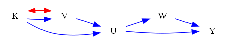
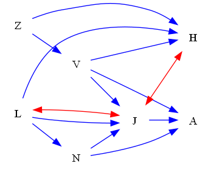
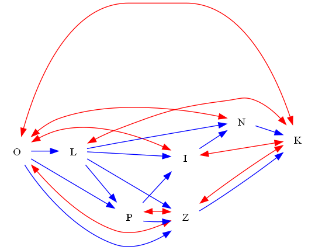
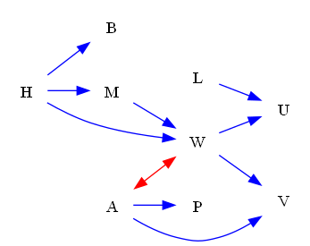
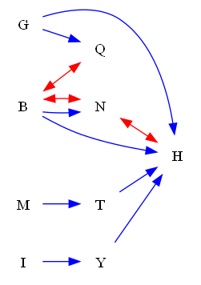

| Find All |How Many |Find One |Yes or No |Multiple Choice |Existence | total |
|:------:|:------:|:------:|:------:|:------:|:------:|:------:|
| 0 |0 |0 |120 |0 |0 | 120 |

|  N=4 | N=5 | N=6 | N=7 | N=8 | N=9 | total |
|:------:|:------:|:------:|:------:|:------:|:------:|:------:|
| 20 |20 |20 |20 |20 |20 | 120 |

|  Yes. | No. | judge_total |
|:------:|:------:|:------:|
| 52 |68 | 120 |

## ID: 64264724
### Graph
- graph type: ADMG
- description: Given an ADMG (acyclic directed mixed graph) with nodes O, Z, E, K, directed edges Z->K, O->K, O->Z, Z->E and bi-directed edges Z<->K.

### Questions
- [YN] Can the cause effect of treatment O on outcome K can be identified or not? 
### Answers
- Yes.
## ID: 90789451
### Graph
- graph type: ADMG
- description: Given an ADMG (acyclic directed mixed graph) with nodes W, K, P, S, directed edges W->K, W->S, W->P, K->P, K->S, P->S and bi-directed edges K<->P, W<->P, P<->S.

### Questions
- [YN] Can the cause effect of treatment W on outcome K can be identified or not? 
### Answers
- Yes.
## ID: 46831868
### Graph
- graph type: ADMG
- description: Given an ADMG (acyclic directed mixed graph) with nodes Q, Z, X, K, directed edges X->K, Q->Z, Z->X, Z->K, Q->X and bi-directed edges Q<->Z, Z<->X.

### Questions
- [YN] Can the cause effect of treatment X on outcome K can be identified or not? 
### Answers
- Yes.
## ID: 67380128
### Graph
- graph type: ADMG
- description: Given an ADMG (acyclic directed mixed graph) with nodes W, Z, B, M, directed edges Z->M, B->M, W->Z, W->M and bi-directed edges W<->Z, W<->B.

### Questions
- [YN] Can the cause effect of treatment B on outcome M can be identified or not? 
### Answers
- Yes.
## ID: 04686919
### Graph
- graph type: ADMG
- description: Given an ADMG (acyclic directed mixed graph) with nodes O, U, J, R, directed edges O->R, U->R, O->J, J->R and bi-directed edges O<->U, J<->R.

### Questions
- [YN] Can the cause effect of treatment O on outcome J can be identified or not? 
### Answers
- Yes.
## ID: 35062603
### Graph
- graph type: ADMG
- description: Given an ADMG (acyclic directed mixed graph) with nodes L, V, A, T, directed edges A->T, L->A, V->A, L->V and bi-directed edges L<->A.

### Questions
- [YN] Can the cause effect of treatment A on outcome T can be identified or not? 
### Answers
- Yes.
## ID: 09868769
### Graph
- graph type: ADMG
- description: Given an ADMG (acyclic directed mixed graph) with nodes A, V, L, G, directed edges L->G, A->G, A->V, V->G and bi-directed edges V<->L, V<->G.

### Questions
- [YN] Can the cause effect of treatment L on outcome G can be identified or not? 
### Answers
- No.
## ID: 29298739
### Graph
- graph type: ADMG
- description: Given an ADMG (acyclic directed mixed graph) with nodes G, U, X, A, directed edges G->U, U->X, G->A, X->A and bi-directed edges X<->A, G<->A.

### Questions
- [YN] Can the cause effect of treatment X on outcome A can be identified or not? 
### Answers
- No.
## ID: 52738423
### Graph
- graph type: ADMG
- description: Given an ADMG (acyclic directed mixed graph) with nodes B, O, V, L, directed edges O->L, V->L, B->L, O->V, B->O, B->V and bi-directed edges B<->V, O<->L, O<->V.

### Questions
- [YN] Can the cause effect of treatment B on outcome L can be identified or not? 
### Answers
- No.
## ID: 09578703
### Graph
- graph type: ADMG
- description: Given an ADMG (acyclic directed mixed graph) with nodes T, K, W, U, directed edges T->W, T->K, K->U, T->U, W->U, K->W and bi-directed edges K<->U, T<->W.

### Questions
- [YN] Can the cause effect of treatment K on outcome U can be identified or not? 
### Answers
- No.
## ID: 00499704
### Graph
- graph type: ADMG
- description: Given an ADMG (acyclic directed mixed graph) with nodes I, V, K, B, directed edges K->B, I->B, V->B, I->V, V->K, I->K and bi-directed edges K<->B.

### Questions
- [YN] Can the cause effect of treatment I on outcome V can be identified or not? 
### Answers
- Yes.
## ID: 13034776
### Graph
- graph type: ADMG
- description: Given an ADMG (acyclic directed mixed graph) with nodes C, A, G, I, directed edges G->I, C->I, C->G, A->I and bi-directed edges G<->I.

### Questions
- [YN] Can the cause effect of treatment A on outcome I can be identified or not? 
### Answers
- Yes.
## ID: 00508705
### Graph
- graph type: ADMG
- description: Given an ADMG (acyclic directed mixed graph) with nodes O, F, T, J, directed edges O->J, F->T, T->J and bi-directed edges F<->J, O<->J.

### Questions
- [YN] Can the cause effect of treatment O on outcome J can be identified or not? 
### Answers
- No.
## ID: 93098684
### Graph
- graph type: ADMG
- description: Given an ADMG (acyclic directed mixed graph) with nodes E, M, B, H, directed edges M->H, E->H, E->M, B->H, M->B and bi-directed edges E<->M.

### Questions
- [YN] Can the cause effect of treatment E on outcome M can be identified or not? 
### Answers
- No.
## ID: 07351353
### Graph
- graph type: ADMG
- description: Given an ADMG (acyclic directed mixed graph) with nodes T, N, B, R, directed edges N->R, N->B, T->N, B->R, T->B and bi-directed edges T<->B.

### Questions
- [YN] Can the cause effect of treatment T on outcome B can be identified or not? 
### Answers
- No.
## ID: 70121803
### Graph
- graph type: ADMG
- description: Given an ADMG (acyclic directed mixed graph) with nodes N, Y, H, J, directed edges N->J, N->Y, H->J, Y->H, Y->J, N->H and bi-directed edges N<->Y.

### Questions
- [YN] Can the cause effect of treatment Y on outcome J can be identified or not? 
### Answers
- Yes.
## ID: 13209863
### Graph
- graph type: ADMG
- description: Given an ADMG (acyclic directed mixed graph) with nodes C, X, S, F, directed edges C->F, X->S, S->F, C->X, X->F and bi-directed edges X<->S, C<->S, C<->X.

### Questions
- [YN] Can the cause effect of treatment S on outcome F can be identified or not? 
### Answers
- Yes.
## ID: 66427365
### Graph
- graph type: ADMG
- description: Given an ADMG (acyclic directed mixed graph) with nodes K, A, Q, B, directed edges K->A, K->Q, A->B, A->Q, K->B and bi-directed edges K<->Q, A<->Q, A<->B.

### Questions
- [YN] Can the cause effect of treatment A on outcome Q can be identified or not? 
### Answers
- No.
## ID: 78275487
### Graph
- graph type: ADMG
- description: Given an ADMG (acyclic directed mixed graph) with nodes M, X, W, O, directed edges X->O, M->W, W->O, X->W, M->X and bi-directed edges M<->W, X<->O, X<->W.

### Questions
- [YN] Can the cause effect of treatment M on outcome X can be identified or not? 
### Answers
- Yes.
## ID: 43028319
### Graph
- graph type: ADMG
- description: Given an ADMG (acyclic directed mixed graph) with nodes F, T, N, Q, directed edges T->N, N->Q, T->Q, F->Q, F->N, F->T and bi-directed edges F<->N.

### Questions
- [YN] Can the cause effect of treatment F on outcome N can be identified or not? 
### Answers
- No.
## ID: 07843120
### Graph
- graph type: ADMG
- description: Given an ADMG (acyclic directed mixed graph) with nodes K, V, U, W, Y, directed edges K->V, W->Y, V->U, K->U, U->Y, U->W and bi-directed edges K<->V.

### Questions
- [YN] Can the cause effect of treatment K on outcome Y can be identified or not? 
### Answers
- No.
## ID: 49499701
### Graph
- graph type: ADMG
- description: Given an ADMG (acyclic directed mixed graph) with nodes M, E, I, X, Z, directed edges I->Z, E->I, M->X, E->X, X->Z, E->Z and bi-directed edges X<->Z.

### Questions
- [YN] Can the cause effect of treatment E on outcome X can be identified or not? 
### Answers
- Yes.
## ID: 15780273
### Graph
- graph type: ADMG
- description: Given an ADMG (acyclic directed mixed graph) with nodes Q, T, R, Z, B, directed edges Q->Z, R->B, Q->R, Q->B, T->B, Q->T, T->Z, R->Z, Z->B, T->R and bi-directed edges T<->Z, R<->B, Q<->Z, Q<->R, Z<->B, R<->Z, T<->B.

### Questions
- [YN] Can the cause effect of treatment Q on outcome Z can be identified or not? 
### Answers
- No.
## ID: 58505123
### Graph
- graph type: ADMG
- description: Given an ADMG (acyclic directed mixed graph) with nodes D, J, X, K, C, directed edges D->X, X->C, X->K, D->K, K->C, D->C, D->J and bi-directed edges D<->C.

### Questions
- [YN] Can the cause effect of treatment D on outcome C can be identified or not? 
### Answers
- No.
## ID: 94660100
### Graph
- graph type: ADMG
- description: Given an ADMG (acyclic directed mixed graph) with nodes K, V, W, E, R, directed edges K->V, W->E, V->R, V->W, E->R, K->W, W->R, V->E, K->R, K->E and bi-directed edges K<->E, K<->V, K<->R.

### Questions
- [YN] Can the cause effect of treatment E on outcome R can be identified or not? 
### Answers
- No.
## ID: 22904428
### Graph
- graph type: ADMG
- description: Given an ADMG (acyclic directed mixed graph) with nodes H, I, O, X, R, directed edges H->O, H->X, O->X, I->X, X->R, I->O, O->R and bi-directed edges H<->R, H<->X, O<->R, X<->R.

### Questions
- [YN] Can the cause effect of treatment H on outcome X can be identified or not? 
### Answers
- No.
## ID: 80004519
### Graph
- graph type: ADMG
- description: Given an ADMG (acyclic directed mixed graph) with nodes Y, L, T, B, K, directed edges L->T, Y->K, Y->B, B->K, Y->T, T->B and bi-directed edges B<->K, L<->B.

### Questions
- [YN] Can the cause effect of treatment B on outcome K can be identified or not? 
### Answers
- No.
## ID: 83196888
### Graph
- graph type: ADMG
- description: Given an ADMG (acyclic directed mixed graph) with nodes C, K, E, R, N, directed edges K->N, C->K, R->N, C->R, C->N, E->R, K->R, K->E, E->N, C->E and bi-directed edges E<->R, K<->N, C<->K, E<->N, K<->R, C<->N, K<->E.

### Questions
- [YN] Can the cause effect of treatment K on outcome R can be identified or not? 
### Answers
- No.
## ID: 18198285
### Graph
- graph type: ADMG
- description: Given an ADMG (acyclic directed mixed graph) with nodes H, I, A, S, U, directed edges H->A, I->A, A->S, A->U, I->S, S->U, I->U and bi-directed edges I<->S, A<->S, H<->U, H<->I.

### Questions
- [YN] Can the cause effect of treatment H on outcome A can be identified or not? 
### Answers
- Yes.
## ID: 59972768
### Graph
- graph type: ADMG
- description: Given an ADMG (acyclic directed mixed graph) with nodes N, Q, S, K, L, directed edges S->K, Q->K, N->S, N->K, N->Q, K->L, N->L, Q->S, S->L, Q->L and bi-directed edges N<->S, N<->L, S<->L, N<->K, K<->L.

### Questions
- [YN] Can the cause effect of treatment Q on outcome K can be identified or not? 
### Answers
- Yes.
## ID: 12218312
### Graph
- graph type: ADMG
- description: Given an ADMG (acyclic directed mixed graph) with nodes S, R, J, K, U, directed edges S->K, R->U, S->R, S->U, R->J and bi-directed edges R<->J, S<->J.

### Questions
- [YN] Can the cause effect of treatment S on outcome U can be identified or not? 
### Answers
- Yes.
## ID: 54991092
### Graph
- graph type: ADMG
- description: Given an ADMG (acyclic directed mixed graph) with nodes A, T, X, K, I, directed edges X->I, A->I, T->X, A->K and bi-directed edges A<->X, A<->T.

### Questions
- [YN] Can the cause effect of treatment T on outcome I can be identified or not? 
### Answers
- No.
## ID: 21481666
### Graph
- graph type: ADMG
- description: Given an ADMG (acyclic directed mixed graph) with nodes A, Y, C, O, E, directed edges Y->C, A->E, C->E, O->E, Y->E, A->O and bi-directed edges A<->C, A<->Y.

### Questions
- [YN] Can the cause effect of treatment Y on outcome E can be identified or not? 
### Answers
- No.
## ID: 38358357
### Graph
- graph type: ADMG
- description: Given an ADMG (acyclic directed mixed graph) with nodes E, J, F, M, P, directed edges E->M, J->F, J->M, E->J, F->M, F->P, E->P, J->P, M->P and bi-directed edges E<->F, J<->P, E<->J, M<->P, E<->M.

### Questions
- [YN] Can the cause effect of treatment E on outcome J can be identified or not? 
### Answers
- No.
## ID: 59184294
### Graph
- graph type: ADMG
- description: Given an ADMG (acyclic directed mixed graph) with nodes V, F, B, Z, Y, directed edges V->F, V->Y, B->Z, F->B, F->Y and bi-directed edges Z<->Y, B<->Z, V<->Z.

### Questions
- [YN] Can the cause effect of treatment B on outcome Z can be identified or not? 
### Answers
- No.
## ID: 55786849
### Graph
- graph type: ADMG
- description: Given an ADMG (acyclic directed mixed graph) with nodes M, N, R, D, F, directed edges R->F, N->R, N->F, M->N, M->D, M->R, N->D, D->F, M->F and bi-directed edges R<->D, M<->D, D<->F, M<->R.

### Questions
- [YN] Can the cause effect of treatment N on outcome D can be identified or not? 
### Answers
- Yes.
## ID: 50478716
### Graph
- graph type: ADMG
- description: Given an ADMG (acyclic directed mixed graph) with nodes K, U, B, Z, A, directed edges U->Z, K->Z, K->A, K->B, K->U and bi-directed edges K<->U, B<->Z, U<->A.

### Questions
- [YN] Can the cause effect of treatment K on outcome Z can be identified or not? 
### Answers
- No.
## ID: 24479979
### Graph
- graph type: ADMG
- description: Given an ADMG (acyclic directed mixed graph) with nodes W, D, J, T, O, directed edges J->T, J->O, W->D, W->J, W->O, T->O, D->O, W->T, D->T, D->J and bi-directed edges J<->T, D<->T, D<->J, T<->O, W<->O.

### Questions
- [YN] Can the cause effect of treatment W on outcome D can be identified or not? 
### Answers
- Yes.
## ID: 63808831
### Graph
- graph type: ADMG
- description: Given an ADMG (acyclic directed mixed graph) with nodes P, W, S, C, J, directed edges S->C, W->S, P->J, P->W, C->J, S->J, W->C, P->C, P->S and bi-directed edges S<->C, P<->J, S<->J, W<->J.

### Questions
- [YN] Can the cause effect of treatment P on outcome C can be identified or not? 
### Answers
- Yes.
## ID: 62296425
### Graph
- graph type: ADMG
- description: Given an ADMG (acyclic directed mixed graph) with nodes N, J, X, V, T, directed edges N->X, X->V, N->J, J->V, J->T and bi-directed edges V<->T.

### Questions
- [YN] Can the cause effect of treatment N on outcome X can be identified or not? 
### Answers
- Yes.
## ID: 78005405
### Graph
- graph type: ADMG
- description: Given an ADMG (acyclic directed mixed graph) with nodes S, T, V, K, Q, J, directed edges S->K, V->K, K->Q, T->K, T->Q, V->J, T->J, T->V, K->J, S->T, S->Q and bi-directed edges Q<->J, T<->K.

### Questions
- [YN] Can the cause effect of treatment S on outcome V can be identified or not? 
### Answers
- Yes.
## ID: 54423588
### Graph
- graph type: ADMG
- description: Given an ADMG (acyclic directed mixed graph) with nodes T, Q, I, Y, H, F, directed edges I->F, Y->F, T->I, Q->I, H->F, T->Y, T->F, I->Y, Q->H, Y->H and bi-directed edges T<->F, Q<->F, I<->Y, Y<->H.

### Questions
- [YN] Can the cause effect of treatment T on outcome F can be identified or not? 
### Answers
- No.
## ID: 20593134
### Graph
- graph type: ADMG
- description: Given an ADMG (acyclic directed mixed graph) with nodes V, L, G, Y, R, A, directed edges V->G, R->A, Y->R, L->R, Y->A, V->A, G->A, L->Y, L->A, V->Y, L->G and bi-directed edges V<->Y, G<->R, V<->G, V<->A, V<->L, G<->Y.

### Questions
- [YN] Can the cause effect of treatment Y on outcome R can be identified or not? 
### Answers
- Yes.
## ID: 15884616
### Graph
- graph type: ADMG
- description: Given an ADMG (acyclic directed mixed graph) with nodes H, Y, R, K, Z, F, directed edges R->Z, K->Z, H->Y, Y->F, Y->Z, R->K, H->K, K->F, H->R, R->F, Y->R, Z->F and bi-directed edges K<->F, Y<->F.

### Questions
- [YN] Can the cause effect of treatment R on outcome K can be identified or not? 
### Answers
- Yes.
## ID: 50089551
### Graph
- graph type: ADMG
- description: Given an ADMG (acyclic directed mixed graph) with nodes I, F, V, Q, T, X, directed edges I->Q, I->V, V->Q, I->F, Q->T, I->X, F->T, F->Q and bi-directed edges I<->V, I<->T, I<->F.

### Questions
- [YN] Can the cause effect of treatment I on outcome T can be identified or not? 
### Answers
- No.
## ID: 69223008
### Graph
- graph type: ADMG
- description: Given an ADMG (acyclic directed mixed graph) with nodes F, H, D, P, B, L, directed edges P->L, H->B, D->B, F->H, F->L, F->D, H->L and bi-directed edges H<->D, F<->B, F<->D.

### Questions
- [YN] Can the cause effect of treatment H on outcome B can be identified or not? 
### Answers
- No.
## ID: 19448613
### Graph
- graph type: ADMG
- description: Given an ADMG (acyclic directed mixed graph) with nodes L, E, A, T, G, I, directed edges E->G, A->G, L->E, E->A, E->T, L->T, L->G, G->I and bi-directed edges L<->A, T<->G, E<->T, L<->E, G<->I.

### Questions
- [YN] Can the cause effect of treatment A on outcome I can be identified or not? 
### Answers
- Yes.
## ID: 91506171
### Graph
- graph type: ADMG
- description: Given an ADMG (acyclic directed mixed graph) with nodes Z, I, J, P, X, L, directed edges I->L, I->X, Z->J, P->L, J->L, X->L, J->X, P->X, I->J, Z->X, Z->P and bi-directed edges X<->L, I<->P.

### Questions
- [YN] Can the cause effect of treatment Z on outcome L can be identified or not? 
### Answers
- Yes.
## ID: 86149586
### Graph
- graph type: ADMG
- description: Given an ADMG (acyclic directed mixed graph) with nodes G, M, J, Z, L, Y, directed edges M->Z, G->Y, G->M, G->Z, G->L, Z->L, J->Z, M->L, J->L, G->J and bi-directed edges Z<->Y, Z<->L, G<->M, G<->L, J<->Z.

### Questions
- [YN] Can the cause effect of treatment G on outcome J can be identified or not? 
### Answers
- Yes.
## ID: 39568371
### Graph
- graph type: ADMG
- description: Given an ADMG (acyclic directed mixed graph) with nodes O, Q, E, I, X, F, directed edges Q->F, E->X, Q->X, O->X, E->F, E->I and bi-directed edges O<->E, I<->X, E<->F.

### Questions
- [YN] Can the cause effect of treatment E on outcome F can be identified or not? 
### Answers
- No.
## ID: 60088408
### Graph
- graph type: ADMG
- description: Given an ADMG (acyclic directed mixed graph) with nodes Z, O, U, R, A, W, directed edges U->R, Z->A, O->W, U->W, Z->W, U->A, R->W, Z->U and bi-directed edges O<->W, U<->A, R<->W, Z<->A.

### Questions
- [YN] Can the cause effect of treatment O on outcome W can be identified or not? 
### Answers
- No.
## ID: 63383211
### Graph
- graph type: ADMG
- description: Given an ADMG (acyclic directed mixed graph) with nodes U, T, K, Y, O, V, directed edges K->V, T->K, T->Y, O->V, K->O, U->Y, U->O, T->O and bi-directed edges U<->T, U<->V, U<->Y, Y<->V, K<->Y.

### Questions
- [YN] Can the cause effect of treatment U on outcome Y can be identified or not? 
### Answers
- No.
## ID: 70480175
### Graph
- graph type: ADMG
- description: Given an ADMG (acyclic directed mixed graph) with nodes M, R, Q, N, I, Z, directed edges Q->Z, R->I, R->Z, M->Z, M->N, I->Z, N->Z, M->Q, M->I, Q->I and bi-directed edges M<->Z, R<->I, I<->Z, M<->N.

### Questions
- [YN] Can the cause effect of treatment I on outcome Z can be identified or not? 
### Answers
- No.
## ID: 00708597
### Graph
- graph type: ADMG
- description: Given an ADMG (acyclic directed mixed graph) with nodes Z, Y, A, V, M, T, directed edges Y->T, Y->M, A->V, Z->A, V->T, Z->V, Y->A, Z->M, Z->T, Z->Y, M->T, A->T and bi-directed edges V<->T, A<->V, Y<->M, Z<->V, Z<->M, Y<->A, Y<->T.

### Questions
- [YN] Can the cause effect of treatment Y on outcome V can be identified or not? 
### Answers
- No.
## ID: 83121978
### Graph
- graph type: ADMG
- description: Given an ADMG (acyclic directed mixed graph) with nodes P, I, H, Q, G, B, directed edges Q->B, H->B, G->B, P->I, I->B and bi-directed edges P<->Q, P<->G, I<->B.

### Questions
- [YN] Can the cause effect of treatment P on outcome B can be identified or not? 
### Answers
- Yes.
## ID: 42000110
### Graph
- graph type: ADMG
- description: Given an ADMG (acyclic directed mixed graph) with nodes Q, N, E, A, J, I, directed edges N->I, J->I, E->I, Q->I, Q->E, A->J, N->A, Q->N, Q->A, E->J and bi-directed edges E<->J, N<->I, N<->A.

### Questions
- [YN] Can the cause effect of treatment N on outcome J can be identified or not? 
### Answers
- No.
## ID: 80431133
### Graph
- graph type: ADMG
- description: Given an ADMG (acyclic directed mixed graph) with nodes M, I, A, J, Z, U, directed edges I->A, M->I, J->U, I->Z, A->U, M->J, J->Z, A->Z, M->A and bi-directed edges I<->U, J<->U, M<->A.

### Questions
- [YN] Can the cause effect of treatment M on outcome A can be identified or not? 
### Answers
- No.
## ID: 69315750
### Graph
- graph type: ADMG
- description: Given an ADMG (acyclic directed mixed graph) with nodes B, Z, X, E, F, Q, directed edges B->F, Z->E, B->E, Z->Q, Z->F, E->Q, X->Q, B->Z, Z->X, F->Q, B->X, X->F and bi-directed edges Z<->Q, B<->F, X<->E, X<->F.

### Questions
- [YN] Can the cause effect of treatment B on outcome F can be identified or not? 
### Answers
- No.
## ID: 05583728
### Graph
- graph type: ADMG
- description: Given an ADMG (acyclic directed mixed graph) with nodes G, S, V, F, N, H, directed edges F->H, F->N, S->N, G->F, S->H, V->F, G->H, S->F, V->H, G->N and bi-directed edges S<->N, S<->F, G<->S, S<->V.

### Questions
- [YN] Can the cause effect of treatment S on outcome H can be identified or not? 
### Answers
- No.
## ID: 78543063
### Graph
- graph type: ADMG
- description: Given an ADMG (acyclic directed mixed graph) with nodes Q, U, K, M, I, X, directed edges U->X, Q->M, I->X, K->I, M->X, U->I, Q->K, Q->I and bi-directed edges Q<->K, Q<->M, M<->I.

### Questions
- [YN] Can the cause effect of treatment U on outcome I can be identified or not? 
### Answers
- Yes.
## ID: 84527348
### Graph
- graph type: ADMG
- description: Given an ADMG (acyclic directed mixed graph) with nodes M, C, W, X, A, G, K, directed edges C->W, M->W, G->K, X->A, A->G, X->K, C->A, W->G, M->G, A->K and bi-directed edges W<->A, W<->G, W<->X, A<->G, C<->X, C<->A, M<->K.

### Questions
- [YN] Can the cause effect of treatment M on outcome G can be identified or not? 
### Answers
- Yes.
## ID: 22542482
### Graph
- graph type: ADMG
- description: Given an ADMG (acyclic directed mixed graph) with nodes L, N, Z, V, J, H, A, directed edges L->J, L->N, Z->H, N->A, Z->V, N->J, V->J, V->A, L->H, J->A, V->H and bi-directed edges L<->J, J<->H.

### Questions
- [YN] Can the cause effect of treatment L on outcome A can be identified or not? 
### Answers
- No.
## ID: 29010234
### Graph
- graph type: ADMG
- description: Given an ADMG (acyclic directed mixed graph) with nodes Q, W, O, U, X, K, F, directed edges W->K, O->X, W->U, K->F, O->K, U->K, X->F, O->U, Q->O, Q->U, W->F and bi-directed edges W<->F, X<->F, W<->O, O<->F.

### Questions
- [YN] Can the cause effect of treatment X on outcome F can be identified or not? 
### Answers
- No.
## ID: 49566927
### Graph
- graph type: ADMG
- description: Given an ADMG (acyclic directed mixed graph) with nodes C, F, Y, N, P, Q, Z, directed edges F->Y, N->Z, F->Q, C->Q, N->P, P->Q and bi-directed edges Y<->Z, Y<->P.

### Questions
- [YN] Can the cause effect of treatment F on outcome Q can be identified or not? 
### Answers
- Yes.
## ID: 24141178
### Graph
- graph type: ADMG
- description: Given an ADMG (acyclic directed mixed graph) with nodes X, E, Z, I, M, J, C, directed edges E->C, X->J, Z->J, X->Z, J->C, I->J, Z->M, X->E, Z->I, X->C and bi-directed edges X<->C, Z<->I, M<->J.

### Questions
- [YN] Can the cause effect of treatment X on outcome C can be identified or not? 
### Answers
- No.
## ID: 68896615
### Graph
- graph type: ADMG
- description: Given an ADMG (acyclic directed mixed graph) with nodes M, G, L, B, P, C, F, directed edges L->B, B->F, M->P, L->C, B->C, M->L, L->F, G->F, G->L, L->P, M->G and bi-directed edges B<->P, M<->F, G<->P, L<->B.

### Questions
- [YN] Can the cause effect of treatment G on outcome C can be identified or not? 
### Answers
- Yes.
## ID: 55732722
### Graph
- graph type: ADMG
- description: Given an ADMG (acyclic directed mixed graph) with nodes O, L, P, I, Z, N, K, directed edges I->N, O->P, L->I, O->L, L->P, P->Z, L->Z, L->N, N->K, O->Z, Z->K, P->I and bi-directed edges P<->Z, O<->I, Z<->K, L<->K, I<->K, O<->Z, O<->K, O<->N.

### Questions
- [YN] Can the cause effect of treatment L on outcome N can be identified or not? 
### Answers
- Yes.
## ID: 44650772
### Graph
- graph type: ADMG
- description: Given an ADMG (acyclic directed mixed graph) with nodes J, T, S, A, O, D, C, directed edges S->C, A->D, T->D, J->C, D->C, A->C, J->D, T->S, S->D, T->C, J->S, J->O and bi-directed edges J<->A, S<->A, S<->D, A<->O, O<->D, J<->O, A<->D, D<->C.

### Questions
- [YN] Can the cause effect of treatment J on outcome C can be identified or not? 
### Answers
- No.
## ID: 77793079
### Graph
- graph type: ADMG
- description: Given an ADMG (acyclic directed mixed graph) with nodes Y, W, V, R, P, U, B, directed edges W->R, Y->W, U->B, P->B, W->U, P->U, Y->U, V->P, Y->P and bi-directed edges V<->B, Y<->B, R<->P, W<->U, P<->U.

### Questions
- [YN] Can the cause effect of treatment P on outcome B can be identified or not? 
### Answers
- No.
## ID: 68036300
### Graph
- graph type: ADMG
- description: Given an ADMG (acyclic directed mixed graph) with nodes W, C, T, G, M, R, N, directed edges W->N, R->N, W->R, C->T, C->M, G->N, W->G, T->R, M->N and bi-directed edges W<->N, T<->G.

### Questions
- [YN] Can the cause effect of treatment W on outcome N can be identified or not? 
### Answers
- No.
## ID: 44968718
### Graph
- graph type: ADMG
- description: Given an ADMG (acyclic directed mixed graph) with nodes F, N, W, K, L, C, E, directed edges K->L, K->C, F->E, C->E, W->L, N->C, K->E, L->E, W->K, F->W and bi-directed edges N<->K, K<->C, L<->E, F<->K, C<->E, F<->W.

### Questions
- [YN] Can the cause effect of treatment W on outcome C can be identified or not? 
### Answers
- No.
## ID: 74207532
### Graph
- graph type: ADMG
- description: Given an ADMG (acyclic directed mixed graph) with nodes S, P, I, M, F, A, C, directed edges M->F, I->C, S->M, I->F, M->C, F->A, I->M, P->M, S->A, S->P and bi-directed edges F<->A, S<->I, I<->C, I<->M, S<->C, P<->M, P<->A.

### Questions
- [YN] Can the cause effect of treatment S on outcome P can be identified or not? 
### Answers
- Yes.
## ID: 20973699
### Graph
- graph type: ADMG
- description: Given an ADMG (acyclic directed mixed graph) with nodes M, Z, T, G, O, W, P, directed edges M->W, Z->G, T->W, M->Z, O->W, Z->T, O->P, Z->P, M->O, Z->W and bi-directed edges O<->P, T<->G, M<->O.

### Questions
- [YN] Can the cause effect of treatment Z on outcome T can be identified or not? 
### Answers
- Yes.
## ID: 36141061
### Graph
- graph type: ADMG
- description: Given an ADMG (acyclic directed mixed graph) with nodes P, D, Y, I, R, B, M, directed edges D->R, D->Y, I->M, B->M, R->B, I->R, P->D, D->I, Y->I, D->B, I->B and bi-directed edges D<->M, D<->R, P<->I, D<->B, P<->R, I<->M, P<->M.

### Questions
- [YN] Can the cause effect of treatment P on outcome Y can be identified or not? 
### Answers
- Yes.
## ID: 19494032
### Graph
- graph type: ADMG
- description: Given an ADMG (acyclic directed mixed graph) with nodes B, G, E, S, R, F, W, directed edges B->W, S->F, G->R, G->F, R->F, B->E, B->G, R->W and bi-directed edges S<->W, G<->R, R<->F.

### Questions
- [YN] Can the cause effect of treatment G on outcome W can be identified or not? 
### Answers
- No.
## ID: 97710626
### Graph
- graph type: ADMG
- description: Given an ADMG (acyclic directed mixed graph) with nodes Y, V, C, R, Z, E, A, directed edges Y->E, V->C, Y->A, Z->E, V->A, Y->Z, R->E and bi-directed edges Y<->Z.

### Questions
- [YN] Can the cause effect of treatment Y on outcome E can be identified or not? 
### Answers
- No.
## ID: 39626111
### Graph
- graph type: ADMG
- description: Given an ADMG (acyclic directed mixed graph) with nodes Y, S, Q, Z, C, N, E, directed edges C->E, Y->Q, Y->Z, Q->Z, C->N, Y->C, N->E, Z->C, S->E and bi-directed edges Y<->Z, S<->Q.

### Questions
- [YN] Can the cause effect of treatment S on outcome E can be identified or not? 
### Answers
- Yes.
## ID: 07381887
### Graph
- graph type: ADMG
- description: Given an ADMG (acyclic directed mixed graph) with nodes G, P, R, Y, B, D, F, directed edges G->R, R->D, P->D, R->F, P->R, Y->D, G->F, G->P, P->B, Y->F, G->D, G->Y and bi-directed edges Y<->F.

### Questions
- [YN] Can the cause effect of treatment Y on outcome F can be identified or not? 
### Answers
- No.
## ID: 43666342
### Graph
- graph type: ADMG
- description: Given an ADMG (acyclic directed mixed graph) with nodes K, Z, Q, P, E, T, O, directed edges K->O, E->T, P->T, K->Z, Z->T, E->O, P->E, K->Q, P->O, Q->O, K->P and bi-directed edges K<->Q, Z<->E, K<->P, P<->O, Q<->O, Z<->T.

### Questions
- [YN] Can the cause effect of treatment K on outcome Q can be identified or not? 
### Answers
- No.
## ID: 34693806
### Graph
- graph type: ADMG
- description: Given an ADMG (acyclic directed mixed graph) with nodes X, J, B, A, S, R, T, directed edges B->S, S->R, S->T, J->B, X->S, A->T, R->T, J->R and bi-directed edges A<->T, B<->A.

### Questions
- [YN] Can the cause effect of treatment A on outcome T can be identified or not? 
### Answers
- No.
## ID: 91692778
### Graph
- graph type: ADMG
- description: Given an ADMG (acyclic directed mixed graph) with nodes F, M, H, Y, A, K, G, I, directed edges M->Y, Y->I, M->I, A->G, F->K, H->I, G->I, K->I and bi-directed edges F<->K, M<->I.

### Questions
- [YN] Can the cause effect of treatment M on outcome I can be identified or not? 
### Answers
- No.
## ID: 51923551
### Graph
- graph type: ADMG
- description: Given an ADMG (acyclic directed mixed graph) with nodes Q, E, D, T, H, U, F, P, directed edges D->H, T->F, H->F, T->U, Q->P, D->U, E->D, D->T, F->P, E->P and bi-directed edges Q<->D, E<->T, U<->F, Q<->U, Q<->T, T<->F, D<->P.

### Questions
- [YN] Can the cause effect of treatment T on outcome P can be identified or not? 
### Answers
- No.
## ID: 94711270
### Graph
- graph type: ADMG
- description: Given an ADMG (acyclic directed mixed graph) with nodes W, S, O, B, M, P, Z, Q, directed edges W->M, W->P, O->P, M->Z, S->P, B->P, P->Z, S->M, S->Z, W->Z, O->Q and bi-directed edges S<->O, W<->O, M<->Q, O<->Q, W<->P, O<->B.

### Questions
- [YN] Can the cause effect of treatment S on outcome Z can be identified or not? 
### Answers
- No.
## ID: 05358954
### Graph
- graph type: ADMG
- description: Given an ADMG (acyclic directed mixed graph) with nodes P, I, M, G, C, T, J, O, directed edges P->M, P->C, C->T, I->M, P->T, T->O, J->O, T->J, I->J, I->T, M->G and bi-directed edges G<->O.

### Questions
- [YN] Can the cause effect of treatment T on outcome J can be identified or not? 
### Answers
- Yes.
## ID: 19703714
### Graph
- graph type: ADMG
- description: Given an ADMG (acyclic directed mixed graph) with nodes B, J, S, Q, E, Y, O, F, directed edges S->Q, E->F, S->E, E->Y, B->Y, S->Y, J->E, J->S, Q->F, Y->O, S->O and bi-directed edges S<->Y, E<->O.

### Questions
- [YN] Can the cause effect of treatment S on outcome Y can be identified or not? 
### Answers
- No.
## ID: 41924175
### Graph
- graph type: ADMG
- description: Given an ADMG (acyclic directed mixed graph) with nodes X, P, V, S, L, B, T, K, directed edges S->K, P->S, P->K, L->B, P->T, X->B, B->T, V->S, T->K, V->T, X->T and bi-directed edges X<->T, S<->T, P<->L, L<->T.

### Questions
- [YN] Can the cause effect of treatment P on outcome K can be identified or not? 
### Answers
- No.
## ID: 89608435
### Graph
- graph type: ADMG
- description: Given an ADMG (acyclic directed mixed graph) with nodes V, C, L, P, S, E, U, Y, directed edges C->Y, C->L, C->U, V->U, E->Y, L->S, V->L, P->U, C->P, P->Y, V->Y, P->S and bi-directed edges C<->Y, P<->U, V<->L, S<->Y, P<->S, C<->L, V<->Y, C<->S.

### Questions
- [YN] Can the cause effect of treatment C on outcome P can be identified or not? 
### Answers
- Yes.
## ID: 34964431
### Graph
- graph type: ADMG
- description: Given an ADMG (acyclic directed mixed graph) with nodes G, O, Y, E, A, D, K, S, directed edges G->O, Y->A, G->E, G->Y, D->K, O->E, E->K, O->A, O->Y, O->S and bi-directed edges E<->D, Y<->E, G<->A, K<->S, G<->O, D<->K.

### Questions
- [YN] Can the cause effect of treatment O on outcome S can be identified or not? 
### Answers
- Yes.
## ID: 63366984
### Graph
- graph type: ADMG
- description: Given an ADMG (acyclic directed mixed graph) with nodes Z, S, P, B, E, R, V, U, directed edges Z->R, R->U, B->E, S->B, E->U, E->V, Z->S, Z->E, P->U and bi-directed edges Z<->U, S<->P, B<->R, P<->V, B<->E.

### Questions
- [YN] Can the cause effect of treatment B on outcome V can be identified or not? 
### Answers
- No.
## ID: 25285558
### Graph
- graph type: ADMG
- description: Given an ADMG (acyclic directed mixed graph) with nodes V, Z, I, H, U, B, Q, X, directed edges H->X, U->B, I->X, V->H, Z->B, H->B, Q->X, U->Q, H->Q, V->Q and bi-directed edges Z<->X, B<->X, H<->Q, Z<->H, I<->U, V<->B, I<->X.

### Questions
- [YN] Can the cause effect of treatment I on outcome X can be identified or not? 
### Answers
- No.
## ID: 60250267
### Graph
- graph type: ADMG
- description: Given an ADMG (acyclic directed mixed graph) with nodes J, M, D, U, T, W, B, Y, directed edges T->B, M->T, T->Y, D->T, W->Y, J->U, U->W, M->W and bi-directed edges J<->Y, D<->T.

### Questions
- [YN] Can the cause effect of treatment D on outcome Y can be identified or not? 
### Answers
- No.
## ID: 93574294
### Graph
- graph type: ADMG
- description: Given an ADMG (acyclic directed mixed graph) with nodes A, F, P, H, E, T, O, Y, directed edges F->E, P->T, T->Y, A->Y, A->F, F->P, F->O, P->O, E->Y, H->T, O->Y, A->E and bi-directed edges A<->T, A<->H, A<->E, F<->O, P<->Y, P<->O.

### Questions
- [YN] Can the cause effect of treatment F on outcome T can be identified or not? 
### Answers
- Yes.
## ID: 56978073
### Graph
- graph type: ADMG
- description: Given an ADMG (acyclic directed mixed graph) with nodes H, X, F, N, G, L, S, U, directed edges N->G, N->S, X->L, X->F, X->S, F->N, L->U, H->S and bi-directed edges F<->U, X<->G, N<->G, L<->S, H<->G.

### Questions
- [YN] Can the cause effect of treatment N on outcome G can be identified or not? 
### Answers
- No.
## ID: 51385691
### Graph
- graph type: ADMG
- description: Given an ADMG (acyclic directed mixed graph) with nodes D, V, B, W, P, Q, T, Y, directed edges W->Q, D->T, D->W, V->P, V->Y, V->W, B->T and bi-directed edges W<->P.

### Questions
- [YN] Can the cause effect of treatment W on outcome Q can be identified or not? 
### Answers
- Yes.
## ID: 42630663
### Graph
- graph type: ADMG
- description: Given an ADMG (acyclic directed mixed graph) with nodes O, R, U, G, W, N, I, L, directed edges W->I, O->L, R->U, R->N, I->L, W->N, O->W, G->N, G->L, G->W and bi-directed edges R<->W, R<->U, U<->N, O<->U, O<->W.

### Questions
- [YN] Can the cause effect of treatment O on outcome I can be identified or not? 
### Answers
- No.
## ID: 66693378
### Graph
- graph type: ADMG
- description: Given an ADMG (acyclic directed mixed graph) with nodes N, Q, D, M, J, W, B, U, directed edges M->B, N->D, Q->W, M->J, J->W, D->J, N->Q, W->U, N->M, J->U, D->W and bi-directed edges M<->U, Q<->B, W<->U, Q<->D.

### Questions
- [YN] Can the cause effect of treatment W on outcome U can be identified or not? 
### Answers
- No.
## ID: 75203808
### Graph
- graph type: ADMG
- description: Given an ADMG (acyclic directed mixed graph) with nodes B, R, G, F, H, K, Q, Y, directed edges R->K, K->Y, R->G, B->G, B->Q, H->Q, F->Y, R->H, G->H, R->Y and bi-directed edges F<->K, R<->H.

### Questions
- [YN] Can the cause effect of treatment R on outcome Q can be identified or not? 
### Answers
- No.
## ID: 03811839
### Graph
- graph type: ADMG
- description: Given an ADMG (acyclic directed mixed graph) with nodes U, N, B, L, D, Q, O, A, directed edges O->A, L->Q, U->A, N->Q, U->Q, U->D, U->L, B->O, L->A, U->N and bi-directed edges N<->L, B<->L, N<->D.

### Questions
- [YN] Can the cause effect of treatment U on outcome N can be identified or not? 
### Answers
- Yes.
## ID: 15545156
### Graph
- graph type: ADMG
- description: Given an ADMG (acyclic directed mixed graph) with nodes K, I, E, X, V, B, W, M, directed edges I->M, V->M, E->M, B->M, I->B, X->M, I->X, K->M, I->W and bi-directed edges E<->M, W<->M.

### Questions
- [YN] Can the cause effect of treatment E on outcome M can be identified or not? 
### Answers
- No.
## ID: 49056844
### Graph
- graph type: ADMG
- description: Given an ADMG (acyclic directed mixed graph) with nodes O, C, S, E, R, H, V, B, directed edges O->R, O->E, O->V, R->B, C->H, S->H, H->B and bi-directed edges S<->V, O<->H, R<->V.

### Questions
- [YN] Can the cause effect of treatment O on outcome E can be identified or not? 
### Answers
- Yes.
## ID: 20151306
### Graph
- graph type: ADMG
- description: Given an ADMG (acyclic directed mixed graph) with nodes S, K, Y, T, O, Q, H, X, I, directed edges H->I, K->T, O->Q, K->O, S->O, T->Q, K->Q, O->H, T->I, X->I, Q->H, Y->Q and bi-directed edges S<->Y, S<->Q, T<->Q, Y<->T, K<->H, Q<->H, S<->X, O<->Q.

### Questions
- [YN] Can the cause effect of treatment K on outcome T can be identified or not? 
### Answers
- Yes.
## ID: 81984938
### Graph
- graph type: ADMG
- description: Given an ADMG (acyclic directed mixed graph) with nodes J, S, B, P, M, O, V, K, G, directed edges B->K, P->G, S->M, P->V, O->K, K->G, J->P, S->P, P->O, B->G and bi-directed edges S<->P, S<->G.

### Questions
- [YN] Can the cause effect of treatment S on outcome K can be identified or not? 
### Answers
- No.
## ID: 33347418
### Graph
- graph type: ADMG
- description: Given an ADMG (acyclic directed mixed graph) with nodes R, N, U, Q, X, D, C, M, K, directed edges N->D, D->K, Q->M, R->C, R->M, N->Q, R->K, X->D, U->C, R->D and bi-directed edges R<->Q, R<->X, R<->U, N<->C, N<->Q.

### Questions
- [YN] Can the cause effect of treatment N on outcome M can be identified or not? 
### Answers
- No.
## ID: 71272631
### Graph
- graph type: ADMG
- description: Given an ADMG (acyclic directed mixed graph) with nodes J, A, Z, V, M, H, T, Y, F, directed edges Z->T, A->Z, M->F, Y->F, J->H, J->Z, V->Y, H->Y, M->T, V->T, J->M, A->F and bi-directed edges T<->F, M<->F, V<->H.

### Questions
- [YN] Can the cause effect of treatment J on outcome Z can be identified or not? 
### Answers
- Yes.
## ID: 76733162
### Graph
- graph type: ADMG
- description: Given an ADMG (acyclic directed mixed graph) with nodes T, V, X, L, D, C, F, Q, Y, directed edges D->F, T->F, F->Y, D->Q, V->Y, X->Y, X->C, D->Y, L->F and bi-directed edges L<->C, F<->Y, C<->F.

### Questions
- [YN] Can the cause effect of treatment F on outcome Y can be identified or not? 
### Answers
- No.
## ID: 77937065
### Graph
- graph type: ADMG
- description: Given an ADMG (acyclic directed mixed graph) with nodes Q, G, J, L, R, U, K, T, H, directed edges G->L, G->T, T->H, U->K, L->U, J->H, L->T, G->K, K->H, R->H, Q->U and bi-directed edges Q<->K, U<->T, Q<->T, L<->H, J<->H, R<->H, Q<->H.

### Questions
- [YN] Can the cause effect of treatment U on outcome H can be identified or not? 
### Answers
- No.
## ID: 76745188
### Graph
- graph type: ADMG
- description: Given an ADMG (acyclic directed mixed graph) with nodes Z, S, K, T, H, A, D, W, G, directed edges K->W, Z->S, H->G, D->G, T->D, A->G, Z->T, A->W, S->W, Z->A, T->A, S->H and bi-directed edges D<->G, Z<->A, K<->W, H<->W, H<->D.

### Questions
- [YN] Can the cause effect of treatment K on outcome W can be identified or not? 
### Answers
- No.
## ID: 41621215
### Graph
- graph type: ADMG
- description: Given an ADMG (acyclic directed mixed graph) with nodes F, H, Q, O, J, L, G, N, Z, directed edges H->O, Q->Z, O->J, H->Q, H->L, F->L, L->N, J->N, H->G, F->G, O->L and bi-directed edges F<->Z, F<->H.

### Questions
- [YN] Can the cause effect of treatment Q on outcome Z can be identified or not? 
### Answers
- Yes.
## ID: 99138573
### Graph
- graph type: ADMG
- description: Given an ADMG (acyclic directed mixed graph) with nodes H, A, B, M, L, P, W, U, V, directed edges W->V, A->P, W->U, A->V, H->W, L->U, H->M, H->B, M->W and bi-directed edges A<->W.

### Questions
- [YN] Can the cause effect of treatment W on outcome V can be identified or not? 
### Answers
- Yes.
## ID: 30282431
### Graph
- graph type: ADMG
- description: Given an ADMG (acyclic directed mixed graph) with nodes H, J, W, Y, F, A, D, L, K, directed edges W->A, L->K, Y->D, W->D, Y->F, W->F, H->W, J->A, J->L, H->L, J->F and bi-directed edges D<->L, F<->K, J<->F, W<->D.

### Questions
- [YN] Can the cause effect of treatment J on outcome F can be identified or not? 
### Answers
- No.
## ID: 46442304
### Graph
- graph type: ADMG
- description: Given an ADMG (acyclic directed mixed graph) with nodes K, U, L, S, M, H, A, V, R, directed edges L->H, L->R, U->L, M->H, K->A, L->V, S->H, K->U, U->R, L->M and bi-directed edges A<->R, K<->U, K<->H, U<->L, A<->V.

### Questions
- [YN] Can the cause effect of treatment U on outcome R can be identified or not? 
### Answers
- No.
## ID: 79459790
### Graph
- graph type: ADMG
- description: Given an ADMG (acyclic directed mixed graph) with nodes C, O, F, B, M, V, U, G, S, directed edges V->G, F->B, F->M, M->V, O->M, O->G, U->S, M->G, G->S, V->U, F->S, C->S and bi-directed edges C<->G, B<->M, O<->F, V<->S, B<->U, O<->B, C<->V.

### Questions
- [YN] Can the cause effect of treatment O on outcome S can be identified or not? 
### Answers
- Yes.
## ID: 42851087
### Graph
- graph type: ADMG
- description: Given an ADMG (acyclic directed mixed graph) with nodes V, K, B, C, S, E, D, F, X, directed edges V->F, B->X, C->S, K->F, B->F, C->D, C->X, C->E, B->D, K->E, K->X, B->S and bi-directed edges V<->S, K<->E, B<->E.

### Questions
- [YN] Can the cause effect of treatment B on outcome X can be identified or not? 
### Answers
- Yes.
## ID: 11676768
### Graph
- graph type: ADMG
- description: Given an ADMG (acyclic directed mixed graph) with nodes N, G, A, P, J, U, Q, L, M, directed edges A->L, N->Q, G->P, G->J, A->J, P->M, G->A, J->L, P->L, A->U, Q->M, G->Q and bi-directed edges N<->U, A<->U, U<->M, J<->U.

### Questions
- [YN] Can the cause effect of treatment G on outcome P can be identified or not? 
### Answers
- Yes.
## ID: 44817638
### Graph
- graph type: ADMG
- description: Given an ADMG (acyclic directed mixed graph) with nodes C, V, M, D, B, O, Z, Q, I, directed edges M->D, M->B, V->O, M->I, B->O, V->B, D->Z, Q->I, C->M, Z->Q, D->O, B->Z and bi-directed edges O<->I, C<->Q, M<->B, D<->Z.

### Questions
- [YN] Can the cause effect of treatment C on outcome O can be identified or not? 
### Answers
- Yes.
## ID: 98693153
### Graph
- graph type: ADMG
- description: Given an ADMG (acyclic directed mixed graph) with nodes W, O, H, T, L, Z, B, C, G, directed edges O->B, H->B, T->L, T->Z, W->L, T->C, C->G, B->C and bi-directed edges W<->H.

### Questions
- [YN] Can the cause effect of treatment T on outcome L can be identified or not? 
### Answers
- Yes.
## ID: 77729877
### Graph
- graph type: ADMG
- description: Given an ADMG (acyclic directed mixed graph) with nodes G, B, I, M, N, T, Y, H, Q, directed edges T->H, I->Y, G->H, B->N, B->H, M->T, G->Q, Y->H and bi-directed edges N<->H, B<->N, B<->Q.

### Questions
- [YN] Can the cause effect of treatment G on outcome Q can be identified or not? 
### Answers
- Yes.
## ID: 04221652
### Graph
- graph type: ADMG
- description: Given an ADMG (acyclic directed mixed graph) with nodes B, L, V, E, X, N, P, W, S, directed edges E->P, L->W, W->S, N->S, B->P, B->S, E->W, V->N, E->S, L->X, B->N and bi-directed edges N<->S, B<->N.

### Questions
- [YN] Can the cause effect of treatment N on outcome S can be identified or not? 
### Answers
- No.
## ID: 92763565
### Graph
- graph type: ADMG
- description: Given an ADMG (acyclic directed mixed graph) with nodes H, Q, J, U, I, B, S, C, V, directed edges J->B, I->S, J->I, B->C, H->S, B->V, U->B, I->V, Q->S, H->Q and bi-directed edges J<->I, Q<->B, I<->V, Q<->U, Q<->C, J<->C, Q<->V.

### Questions
- [YN] Can the cause effect of treatment J on outcome S can be identified or not? 
### Answers
- No.
## ID: 47204204
### Graph
- graph type: ADMG
- description: Given an ADMG (acyclic directed mixed graph) with nodes T, I, J, U, W, M, K, F, Z, directed edges U->Z, J->Z, I->K, T->J, W->F, T->K, T->I, T->W, U->M and bi-directed edges T<->I, M<->K, U<->K, U<->F.

### Questions
- [YN] Can the cause effect of treatment T on outcome I can be identified or not? 
### Answers
- No.
