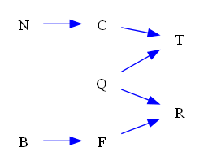

| Find All |How Many |Find One |Yes or No |Multiple Choice |Existence | total |
|:------:|:------:|:------:|:------:|:------:|:------:|:------:|
| 0 |0 |48 |48 |48 |0 | 144 |

|  N=4 | N=5 | N=6 | N=7 | N=8 | N=9 | total |
|:------:|:------:|:------:|:------:|:------:|:------:|:------:|
| 24 |24 |24 |24 |24 |24 | 144 |

|  Yes. | No. | judge_total |
|:------:|:------:|:------:|
| 24 |24 | 48 |

|  A | B | C | D | MC_total |
|:------:|:------:|:------:|:------:|:------:|
| 14 |9 |11 |14 | 48 |

## ID: 11883690
### Graph
- graph type: DAG
- description: Given a DAG (directed acyclic graph) with nodes F, A, S, K and directed edges F->A, A->S, F->K, F->S, A->K, S->K.

### Questions
- [FO] What is the markov blanket of node K? 
- [YN] Is {'A', 'S', 'K'} the markov blanket of node F? 
- [MC] Which of the following is the markov blanket of node K?\
A. {'A', 'F', 'S'}\
B. {'A'}\
C. {'A', 'F'}\
D. {'F'} 
### Answers
- {'A', 'F', 'S'}
- Yes.
- A
## ID: 89774331
### Graph
- graph type: DAG
- description: Given a DAG (directed acyclic graph) with nodes I, K, S, J and directed edges K->J, K->S, I->J, S->J, I->S.

### Questions
- [FO] What is the markov blanket of node K? 
- [YN] Is {'J', 'I', 'K'} the markov blanket of node S? 
- [MC] Which of the following is the markov blanket of node S?\
A. {'J', 'I', 'K'}\
B. {'I'}\
C. {'K'}\
D. {'I', 'J'} 
### Answers
- {'J', 'I', 'S'}
- Yes.
- A
## ID: 17802319
### Graph
- graph type: DAG
- description: Given a DAG (directed acyclic graph) with nodes J, R, Z, X and directed edges R->X, R->Z, J->Z, Z->X, J->R, J->X.

### Questions
- [FO] What is the markov blanket of node Z? 
- [YN] Is {'X', 'J', 'R'} the markov blanket of node Z? 
- [MC] Which of the following is the markov blanket of node X?\
A. {'R', 'J'}\
B. {'R', 'Z', 'J'}\
C. {'Z', 'J'}\
D. {'J'} 
### Answers
- {'X', 'J', 'R'}
- Yes.
- B
## ID: 83980168
### Graph
- graph type: DAG
- description: Given a DAG (directed acyclic graph) with nodes C, U, T, Z and directed edges C->Z, C->U, C->T.

### Questions
- [FO] What is the markov blanket of node T? 
- [YN] Is {'C'} the markov blanket of node Z? 
- [MC] Which of the following is the markov blanket of node Z?\
A. {'T', 'U', 'C'}\
B. {'U'}\
C. {'T', 'U'}\
D. {'C'} 
### Answers
- {'C'}
- Yes.
- D
## ID: 82456619
### Graph
- graph type: DAG
- description: Given a DAG (directed acyclic graph) with nodes H, U, I, O and directed edges H->U, H->O, I->O, U->I.

### Questions
- [FO] What is the markov blanket of node U? 
- [YN] Is {'U', 'I', 'O'} the markov blanket of node H? 
- [MC] Which of the following is the markov blanket of node I?\
A. {'U', 'H'}\
B. {'U'}\
C. {'O'}\
D. {'U', 'H', 'O'} 
### Answers
- {'I', 'H'}
- Yes.
- D
## ID: 18908510
### Graph
- graph type: DAG
- description: Given a DAG (directed acyclic graph) with nodes I, V, P, H and directed edges V->H, P->H, I->H, I->P.

### Questions
- [FO] What is the markov blanket of node P? 
- [YN] Is {'I', 'H', 'P'} the markov blanket of node V? 
- [MC] Which of the following is the markov blanket of node P?\
A. {'V', 'I', 'H'}\
B. {'I', 'H'}\
C. {'V'}\
D. {'I'} 
### Answers
- {'V', 'I', 'H'}
- Yes.
- A
## ID: 21705565
### Graph
- graph type: DAG
- description: Given a DAG (directed acyclic graph) with nodes F, G, J, A and directed edges J->A, F->J, F->G, G->A, G->J, F->A.

### Questions
- [FO] What is the markov blanket of node J? 
- [YN] Is {'A', 'F', 'J'} the markov blanket of node G? 
- [MC] Which of the following is the markov blanket of node A?\
A. {'F', 'J', 'G'}\
B. {'J'}\
C. {'F'}\
D. {'F', 'J'} 
### Answers
- {'A', 'F', 'G'}
- Yes.
- A
## ID: 86633571
### Graph
- graph type: DAG
- description: Given a DAG (directed acyclic graph) with nodes T, F, I, M and directed edges T->F, T->I, F->M.

### Questions
- [FO] What is the markov blanket of node T? 
- [YN] Is {'T'} the markov blanket of node I? 
- [MC] Which of the following is the markov blanket of node M?\
A. {'T'}\
B. {'T', 'F', 'I'}\
C. {'F'}\
D. {'F', 'I'} 
### Answers
- {'F', 'I'}
- Yes.
- C
## ID: 33021589
### Graph
- graph type: DAG
- description: Given a DAG (directed acyclic graph) with nodes I, W, Y, E, K and directed edges I->K, Y->K, W->K, I->W, I->Y, Y->E.

### Questions
- [FO] What is the markov blanket of node W? 
- [YN] Is {'Y', 'I', 'W'} the markov blanket of node K? 
- [MC] Which of the following is the markov blanket of node I?\
A. {'W', 'Y', 'K'}\
B. {'E', 'W'}\
C. {'E', 'W', 'K', 'Y'}\
D. {'W'} 
### Answers
- {'Y', 'I', 'K'}
- Yes.
- A
## ID: 47486391
### Graph
- graph type: DAG
- description: Given a DAG (directed acyclic graph) with nodes W, A, M, B, I and directed edges M->I, A->M, M->B, W->A, B->I, A->I, W->I, W->M, A->B, W->B.

### Questions
- [FO] What is the markov blanket of node W? 
- [YN] Is {'A', 'I', 'B'} the markov blanket of node M? 
- [MC] Which of the following is the markov blanket of node I?\
A. {'A', 'W', 'M'}\
B. {'W'}\
C. {'A', 'W', 'M', 'B'}\
D. {'A', 'W'} 
### Answers
- {'A', 'M', 'B', 'I'}
- No.
- C
## ID: 78766089
### Graph
- graph type: DAG
- description: Given a DAG (directed acyclic graph) with nodes N, K, Y, J, W and directed edges N->Y, K->Y, K->J, N->W, Y->W, J->W, K->W, N->K, N->J, Y->J.

### Questions
- [FO] What is the markov blanket of node J? 
- [YN] Is {'J', 'N', 'K'} the markov blanket of node Y? 
- [MC] Which of the following is the markov blanket of node J?\
A. {'W', 'N', 'K', 'Y'}\
B. {'W', 'K'}\
C. {'W'}\
D. {'W', 'N', 'K'} 
### Answers
- {'W', 'N', 'K', 'Y'}
- No.
- A
## ID: 34574183
### Graph
- graph type: DAG
- description: Given a DAG (directed acyclic graph) with nodes E, Q, F, V, T and directed edges E->T, Q->V, E->V, Q->T, E->F, V->T, F->V, Q->F.

### Questions
- [FO] What is the markov blanket of node T? 
- [YN] Is {'T', 'F', 'V', 'Q'} the markov blanket of node E? 
- [MC] Which of the following is the markov blanket of node V?\
A. {'T'}\
B. {'F'}\
C. {'E'}\
D. {'T', 'F', 'E', 'Q'} 
### Answers
- {'E', 'Q', 'V'}
- Yes.
- D
## ID: 34406022
### Graph
- graph type: DAG
- description: Given a DAG (directed acyclic graph) with nodes I, Y, B, R, X and directed edges I->X, Y->R, I->R, I->Y, R->X, Y->X, B->R, I->B, B->X, Y->B.

### Questions
- [FO] What is the markov blanket of node I? 
- [YN] Is {'Y', 'I', 'B'} the markov blanket of node X? 
- [MC] Which of the following is the markov blanket of node X?\
A. {'I', 'B'}\
B. {'R', 'B'}\
C. {'I'}\
D. {'R', 'Y', 'I', 'B'} 
### Answers
- {'B', 'R', 'X', 'Y'}
- No.
- D
## ID: 84338160
### Graph
- graph type: DAG
- description: Given a DAG (directed acyclic graph) with nodes Y, R, D, V, F and directed edges D->F, Y->D, Y->R, V->F, D->V, Y->V, R->F.

### Questions
- [FO] What is the markov blanket of node V? 
- [YN] Is {'F', 'V', 'Y', 'D'} the markov blanket of node R? 
- [MC] Which of the following is the markov blanket of node D?\
A. {'Y', 'F', 'V'}\
B. {'F', 'V', 'R', 'Y'}\
C. {'F'}\
D. {'R', 'F', 'V'} 
### Answers
- {'F', 'R', 'Y', 'D'}
- Yes.
- B
## ID: 99968158
### Graph
- graph type: DAG
- description: Given a DAG (directed acyclic graph) with nodes K, Y, P, E, F and directed edges E->F, Y->P, K->Y, P->E, Y->E.

### Questions
- [FO] What is the markov blanket of node F? 
- [YN] Is {'Y'} the markov blanket of node K? 
- [MC] Which of the following is the markov blanket of node K?\
A. {'E', 'F', 'P'}\
B. {'Y', 'E'}\
C. {'E', 'F', 'Y', 'P'}\
D. {'Y'} 
### Answers
- {'E'}
- Yes.
- D
## ID: 51877773
### Graph
- graph type: DAG
- description: Given a DAG (directed acyclic graph) with nodes O, B, X, P, Z and directed edges X->Z, B->P, O->Z, B->Z.

### Questions
- [FO] What is the markov blanket of node Z? 
- [YN] Is {'X', 'Z', 'B', 'P'} the markov blanket of node O? 
- [MC] Which of the following is the markov blanket of node B?\
A. {'O'}\
B. {'P'}\
C. {'Z', 'P'}\
D. {'X', 'O', 'Z', 'P'} 
### Answers
- {'X', 'B', 'O'}
- No.
- D
## ID: 53541933
### Graph
- graph type: DAG
- description: Given a DAG (directed acyclic graph) with nodes S, L, Q, O, X, A and directed edges L->O, L->Q, O->A, S->A, S->O, O->X, S->Q, Q->X, S->L.

### Questions
- [FO] What is the markov blanket of node A? 
- [YN] Is {'X', 'A', 'L', 'S', 'Q'} the markov blanket of node O? 
- [MC] Which of the following is the markov blanket of node X?\
A. {'A', 'L', 'S', 'O', 'Q'}\
B. {'A', 'Q'}\
C. {'L'}\
D. {'Q', 'O'} 
### Answers
- {'S', 'O'}
- Yes.
- D
## ID: 73670900
### Graph
- graph type: DAG
- description: Given a DAG (directed acyclic graph) with nodes F, H, A, D, C, S and directed edges H->D, D->C, A->C, H->S, F->H, H->A, A->S, D->S, F->D.

### Questions
- [FO] What is the markov blanket of node C? 
- [YN] Is {'A', 'D', 'H', 'S'} the markov blanket of node C? 
- [MC] Which of the following is the markov blanket of node A?\
A. {'D', 'S', 'C'}\
B. {'S'}\
C. {'F', 'D', 'H', 'S', 'C'}\
D. {'C', 'D', 'H', 'S'} 
### Answers
- {'A', 'D'}
- No.
- D
## ID: 53895338
### Graph
- graph type: DAG
- description: Given a DAG (directed acyclic graph) with nodes V, A, Z, I, H, R and directed edges A->I, H->R, V->A, V->H, I->R, V->R, Z->H.

### Questions
- [FO] What is the markov blanket of node H? 
- [YN] Is {'I', 'H', 'V'} the markov blanket of node R? 
- [MC] Which of the following is the markov blanket of node V?\
A. {'Z', 'I', 'H', 'A'}\
B. {'R'}\
C. {'A', 'R', 'Z', 'I', 'H'}\
D. {'R', 'A', 'Z'} 
### Answers
- {'V', 'R', 'Z', 'I'}
- Yes.
- C
## ID: 16664458
### Graph
- graph type: DAG
- description: Given a DAG (directed acyclic graph) with nodes S, K, A, H, P, E and directed edges P->E, A->P, K->P, H->P, K->E, S->A, S->K, A->E.

### Questions
- [FO] What is the markov blanket of node S? 
- [YN] Is {'A', 'H', 'P', 'K', 'E'} the markov blanket of node S? 
- [MC] Which of the following is the markov blanket of node H?\
A. {'S'}\
B. {'S', 'P'}\
C. {'A', 'K', 'P'}\
D. {'A', 'S', 'E', 'P'} 
### Answers
- {'A', 'K'}
- No.
- C
## ID: 31191527
### Graph
- graph type: DAG
- description: Given a DAG (directed acyclic graph) with nodes K, U, P, W, V, Q and directed edges U->W, U->V, U->P, P->Q, U->Q, K->W, W->Q, P->W.

### Questions
- [FO] What is the markov blanket of node P? 
- [YN] Is {'Q', 'W', 'K', 'V'} the markov blanket of node P? 
- [MC] Which of the following is the markov blanket of node U?\
A. {'W', 'P', 'K'}\
B. {'W', 'V', 'P', 'K', 'Q'}\
C. {'Q', 'W', 'P', 'V'}\
D. {'W', 'P', 'K', 'V'} 
### Answers
- {'U', 'W', 'K', 'Q'}
- No.
- B
## ID: 20284848
### Graph
- graph type: DAG
- description: Given a DAG (directed acyclic graph) with nodes N, Z, H, L, U, O and directed edges N->O, Z->H, N->U, N->Z, H->O, U->O, L->U, N->L, L->O.

### Questions
- [FO] What is the markov blanket of node N? 
- [YN] Is {'Z', 'N', 'O'} the markov blanket of node L? 
- [MC] Which of the following is the markov blanket of node H?\
A. {'L', 'N'}\
B. {'N'}\
C. {'L', 'Z', 'O'}\
D. {'U', 'O', 'Z', 'L', 'N'} 
### Answers
- {'L', 'H', 'U', 'O', 'Z'}
- No.
- D
## ID: 73718963
### Graph
- graph type: DAG
- description: Given a DAG (directed acyclic graph) with nodes X, F, G, L, P, D and directed edges X->G, F->L, G->D, L->D, X->P, X->L, F->P, F->D.

### Questions
- [FO] What is the markov blanket of node D? 
- [YN] Is {'L', 'F', 'G'} the markov blanket of node D? 
- [MC] Which of the following is the markov blanket of node L?\
A. {'X', 'F', 'D', 'G'}\
B. {'G', 'D', 'P'}\
C. {'X', 'G', 'D', 'P'}\
D. {'X', 'G'} 
### Answers
- {'L', 'F', 'G'}
- Yes.
- A
## ID: 06482027
### Graph
- graph type: DAG
- description: Given a DAG (directed acyclic graph) with nodes Z, Q, P, J, G, D and directed edges Q->P, Z->Q, G->D, Q->D, Z->G, Z->J, Z->P, Q->J.

### Questions
- [FO] What is the markov blanket of node J? 
- [YN] Is {'Z', 'D', 'Q'} the markov blanket of node P? 
- [MC] Which of the following is the markov blanket of node P?\
A. {'G'}\
B. {'G', 'D', 'Z', 'Q'}\
C. {'Z', 'Q'}\
D. {'Z', 'J'} 
### Answers
- {'Z', 'Q'}
- No.
- C
## ID: 99060047
### Graph
- graph type: DAG
- description: Given a DAG (directed acyclic graph) with nodes C, G, L, W, K, Y, J and directed edges G->W, W->Y, L->W, G->K, Y->J, G->J, C->J, C->L, C->Y.

### Questions
- [FO] What is the markov blanket of node Y? 
- [YN] Is {'L', 'Y', 'G'} the markov blanket of node C? 
- [MC] Which of the following is the markov blanket of node K?\
A. {'W', 'J', 'G', 'C', 'Y'}\
B. {'G'}\
C. {'C'}\
D. {'L', 'J', 'Y'} 
### Answers
- {'W', 'J', 'C', 'G'}
- No.
- B
## ID: 04719956
### Graph
- graph type: DAG
- description: Given a DAG (directed acyclic graph) with nodes P, K, N, J, S, H, G and directed edges H->G, P->N, K->S, J->S, N->J, N->H, N->G.

### Questions
- [FO] What is the markov blanket of node S? 
- [YN] Is {'H', 'N'} the markov blanket of node G? 
- [MC] Which of the following is the markov blanket of node J?\
A. {'N', 'S', 'K'}\
B. {'N', 'S', 'P'}\
C. {'H', 'N', 'P', 'S', 'G'}\
D. {'N', 'H', 'S', 'K'} 
### Answers
- {'J', 'K'}
- Yes.
- A
## ID: 39989152
### Graph
- graph type: DAG
- description: Given a DAG (directed acyclic graph) with nodes X, V, B, J, Q, K, U and directed edges V->Q, X->K, J->Q, X->Q, B->J, X->V, V->U, J->U, J->K.

### Questions
- [FO] What is the markov blanket of node V? 
- [YN] Is {'U', 'Q', 'V'} the markov blanket of node X? 
- [MC] Which of the following is the markov blanket of node V?\
A. {'B', 'J', 'Q'}\
B. {'X', 'Q', 'B'}\
C. {'U', 'B', 'K', 'Q'}\
D. {'X', 'U', 'J', 'Q'} 
### Answers
- {'X', 'U', 'J', 'Q'}
- No.
- D
## ID: 65255135
### Graph
- graph type: DAG
- description: Given a DAG (directed acyclic graph) with nodes B, V, U, J, Q, Y, I and directed edges J->Q, V->U, Y->I, V->Q, Q->Y, B->V.

### Questions
- [FO] What is the markov blanket of node I? 
- [YN] Is {'Y'} the markov blanket of node I? 
- [MC] Which of the following is the markov blanket of node B?\
A. {'V'}\
B. {'J', 'Q'}\
C. {'U', 'J', 'V'}\
D. {'U', 'Q', 'V'} 
### Answers
- {'Y'}
- Yes.
- A
## ID: 73343110
### Graph
- graph type: DAG
- description: Given a DAG (directed acyclic graph) with nodes T, J, C, K, H, E, O and directed edges T->C, K->O, J->O, E->O, J->H, K->E, C->E, C->K, J->K, T->K.

### Questions
- [FO] What is the markov blanket of node J? 
- [YN] Is {'T', 'E', 'C'} the markov blanket of node K? 
- [MC] Which of the following is the markov blanket of node K?\
A. {'T', 'J', 'C', 'E', 'O'}\
B. {'E', 'T', 'H', 'C'}\
C. {'E', 'J', 'H'}\
D. {'T', 'J', 'H', 'O', 'E'} 
### Answers
- {'T', 'H', 'C', 'K', 'O', 'E'}
- No.
- A
## ID: 32592752
### Graph
- graph type: DAG
- description: Given a DAG (directed acyclic graph) with nodes T, V, H, O, X, W, B and directed edges T->W, T->V, O->W, V->O, W->B, H->W, V->X, T->X, H->B, T->H.

### Questions
- [FO] What is the markov blanket of node B? 
- [YN] Is {'X', 'W', 'V', 'O'} the markov blanket of node H? 
- [MC] Which of the following is the markov blanket of node O?\
A. {'W', 'H', 'V'}\
B. {'W'}\
C. {'T', 'W', 'V', 'H'}\
D. {'T', 'H', 'V'} 
### Answers
- {'W', 'H'}
- No.
- C
## ID: 16401097
### Graph
- graph type: DAG
- description: Given a DAG (directed acyclic graph) with nodes Q, N, C, B, T, F, R and directed edges Q->R, F->R, B->F, N->C, Q->T, C->T.

### Questions
- [FO] What is the markov blanket of node R? 
- [YN] Is {'F', 'Q'} the markov blanket of node R? 
- [MC] Which of the following is the markov blanket of node Q?\
A. {'R', 'C'}\
B. {'F', 'C'}\
C. {'T', 'F', 'C', 'R'}\
D. {'N', 'B', 'C'} 
### Answers
- {'F', 'Q'}
- Yes.
- C
## ID: 22704706
### Graph
- graph type: DAG
- description: Given a DAG (directed acyclic graph) with nodes K, W, N, M, Q, Y, G and directed edges W->N, Y->G, K->N, M->G, Q->G, K->Q, W->Q, M->Y.

### Questions
- [FO] What is the markov blanket of node M? 
- [YN] Is {'N', 'K', 'Q'} the markov blanket of node W? 
- [MC] Which of the following is the markov blanket of node G?\
A. {'W', 'N', 'K', 'Y', 'Q'}\
B. {'M', 'N', 'Q'}\
C. {'Y', 'M', 'Q'}\
D. {'Y', 'Q', 'M', 'K'} 
### Answers
- {'Y', 'Q', 'G'}
- Yes.
- C
## ID: 30923400
### Graph
- graph type: DAG
- description: Given a DAG (directed acyclic graph) with nodes A, O, P, G, U, C, S, I and directed edges C->S, P->C, O->C, G->I, O->U, A->S, O->I.

### Questions
- [FO] What is the markov blanket of node A? 
- [YN] Is {'I', 'S', 'O'} the markov blanket of node C? 
- [MC] Which of the following is the markov blanket of node G?\
A. {'A', 'S', 'C', 'U', 'O'}\
B. {'I', 'O'}\
C. {'U', 'O'}\
D. {'A', 'I', 'P', 'C', 'O'} 
### Answers
- {'S', 'C'}
- No.
- B
## ID: 97886117
### Graph
- graph type: DAG
- description: Given a DAG (directed acyclic graph) with nodes I, P, K, S, D, F, E, Q and directed edges K->Q, P->F, I->F, K->E, E->Q, P->S, K->F, K->D, D->E, S->E.

### Questions
- [FO] What is the markov blanket of node I? 
- [YN] Is {'F', 'P', 'K'} the markov blanket of node I? 
- [MC] Which of the following is the markov blanket of node K?\
A. {'F', 'E', 'I', 'P'}\
B. {'E', 'D'}\
C. {'D', 'Q'}\
D. {'F', 'D', 'I', 'S', 'P', 'E', 'Q'} 
### Answers
- {'F', 'P', 'K'}
- Yes.
- D
## ID: 90267949
### Graph
- graph type: DAG
- description: Given a DAG (directed acyclic graph) with nodes X, I, N, J, C, S, Y, W and directed edges N->Y, I->J, X->N, C->W, I->C, N->C, X->C, I->S, C->Y, S->W.

### Questions
- [FO] What is the markov blanket of node X? 
- [YN] Is {'W', 'N', 'S', 'X', 'C'} the markov blanket of node I? 
- [MC] Which of the following is the markov blanket of node I?\
A. {'Y', 'W', 'N', 'C'}\
B. {'W', 'N', 'S'}\
C. {'X', 'J', 'C', 'N', 'S'}\
D. {'W', 'N', 'S', 'C', 'Y'} 
### Answers
- {'C', 'I', 'N'}
- No.
- C
## ID: 46582375
### Graph
- graph type: DAG
- description: Given a DAG (directed acyclic graph) with nodes P, C, M, V, Y, G, K, A and directed edges V->K, P->Y, C->A, M->V, K->A, M->Y, Y->A, V->G, M->G, P->C.

### Questions
- [FO] What is the markov blanket of node P? 
- [YN] Is {'A', 'M', 'G', 'C', 'Y'} the markov blanket of node K? 
- [MC] Which of the following is the markov blanket of node C?\
A. {'A', 'M', 'V', 'P', 'Y'}\
B. {'M', 'K', 'P'}\
C. {'A', 'Y', 'K', 'P'}\
D. {'A', 'V', 'G', 'P', 'Y'} 
### Answers
- {'Y', 'M', 'C'}
- No.
- C
## ID: 48825255
### Graph
- graph type: DAG
- description: Given a DAG (directed acyclic graph) with nodes O, T, V, U, Y, K, Q, X and directed edges V->K, T->X, O->Q, Y->K, O->T, O->U, U->K, V->Y, K->X.

### Questions
- [FO] What is the markov blanket of node O? 
- [YN] Is {'V', 'O', 'Y', 'K'} the markov blanket of node U? 
- [MC] Which of the following is the markov blanket of node Y?\
A. {'U', 'V', 'K'}\
B. {'X', 'Q'}\
C. {'K', 'O'}\
D. {'X'} 
### Answers
- {'T', 'U', 'Q'}
- Yes.
- A
## ID: 28362836
### Graph
- graph type: DAG
- description: Given a DAG (directed acyclic graph) with nodes X, C, H, P, R, M, Q, F and directed edges X->P, R->M, C->F, X->C, X->R, P->F, H->Q, Q->F, P->M.

### Questions
- [FO] What is the markov blanket of node F? 
- [YN] Is {'F', 'C', 'H', 'P'} the markov blanket of node Q? 
- [MC] Which of the following is the markov blanket of node M?\
A. {'R', 'H', 'P', 'C'}\
B. {'R', 'P'}\
C. {'C'}\
D. {'Q', 'P'} 
### Answers
- {'Q', 'P', 'C'}
- Yes.
- B
## ID: 04482730
### Graph
- graph type: DAG
- description: Given a DAG (directed acyclic graph) with nodes U, W, E, L, K, B, D, T and directed edges E->D, L->B, W->K, W->E, U->W, B->D, K->T, W->D, W->T, U->E.

### Questions
- [FO] What is the markov blanket of node D? 
- [YN] Is {'W', 'B', 'D', 'K', 'E'} the markov blanket of node U? 
- [MC] Which of the following is the markov blanket of node E?\
A. {'U', 'W', 'B', 'D'}\
B. {'T', 'W', 'B', 'L', 'D'}\
C. {'U'}\
D. {'L', 'D', 'T', 'B'} 
### Answers
- {'E', 'W', 'B'}
- No.
- A
## ID: 73224967
### Graph
- graph type: DAG
- description: Given a DAG (directed acyclic graph) with nodes S, Y, Z, W, G, X, H, N and directed edges Y->W, H->N, Y->N, Z->H, X->H, S->H, Y->G, Z->W.

### Questions
- [FO] What is the markov blanket of node H? 
- [YN] Is {'H', 'N', 'G', 'X', 'Z'} the markov blanket of node S? 
- [MC] Which of the following is the markov blanket of node G?\
A. {'Y'}\
B. {'Y', 'W'}\
C. {'N'}\
D. {'Z', 'N', 'S'} 
### Answers
- {'X', 'Y', 'Z', 'N', 'S'}
- No.
- A
## ID: 78249331
### Graph
- graph type: DAG
- description: Given a DAG (directed acyclic graph) with nodes J, G, Q, X, F, R, P, W, Z and directed edges J->F, R->P, Q->P, R->W, Q->X, Q->Z, J->G, X->Z, G->X.

### Questions
- [FO] What is the markov blanket of node W? 
- [YN] Is {'X', 'W', 'J', 'G'} the markov blanket of node F? 
- [MC] Which of the following is the markov blanket of node G?\
A. {'W', 'J', 'P', 'Q'}\
B. {'X', 'Q', 'J'}\
C. {'R', 'F', 'W'}\
D. {'F', 'R', 'X', 'Z', 'Q'} 
### Answers
- {'R'}
- No.
- B
## ID: 28239510
### Graph
- graph type: DAG
- description: Given a DAG (directed acyclic graph) with nodes Y, E, A, P, B, L, S, K, X and directed edges Y->X, E->B, Y->P, A->S, K->X, Y->L, Y->A, B->L, A->L, P->X.

### Questions
- [FO] What is the markov blanket of node B? 
- [YN] Is {'E', 'Y', 'K'} the markov blanket of node P? 
- [MC] Which of the following is the markov blanket of node X?\
A. {'E', 'S'}\
B. {'Y', 'P', 'K'}\
C. {'E'}\
D. {'A', 'B', 'K', 'P', 'Y'} 
### Answers
- {'A', 'Y', 'E', 'L'}
- No.
- B
## ID: 23776789
### Graph
- graph type: DAG
- description: Given a DAG (directed acyclic graph) with nodes F, D, Y, M, K, E, Z, I, U and directed edges K->I, F->Y, M->E, Z->I, F->E, D->K, F->I, K->U, Y->M, D->U.

### Questions
- [FO] What is the markov blanket of node E? 
- [YN] Is {'Y', 'U', 'K'} the markov blanket of node E? 
- [MC] Which of the following is the markov blanket of node F?\
A. {'E', 'I', 'M', 'K'}\
B. {'M', 'Z', 'Y', 'E', 'I', 'K'}\
C. {'Y', 'I', 'E'}\
D. {'Z', 'M'} 
### Answers
- {'F', 'M'}
- No.
- B
## ID: 19709357
### Graph
- graph type: DAG
- description: Given a DAG (directed acyclic graph) with nodes K, U, D, J, V, A, C, Q, P and directed edges K->V, D->Q, J->V, U->C, V->P, D->P, D->A, U->D.

### Questions
- [FO] What is the markov blanket of node D? 
- [YN] Is {'A', 'J', 'D', 'K', 'P'} the markov blanket of node U? 
- [MC] Which of the following is the markov blanket of node K?\
A. {'D', 'P'}\
B. {'Q'}\
C. {'A', 'J', 'P', 'U', 'C'}\
D. {'J', 'V'} 
### Answers
- {'A', 'U', 'V', 'P', 'Q'}
- No.
- D
## ID: 39290304
### Graph
- graph type: DAG
- description: Given a DAG (directed acyclic graph) with nodes C, D, V, B, A, I, G, K, W and directed edges B->I, B->W, I->W, V->A, V->W, D->G, D->I, C->B, A->K.

### Questions
- [FO] What is the markov blanket of node A? 
- [YN] Is {'W', 'B', 'V', 'I', 'G'} the markov blanket of node A? 
- [MC] Which of the following is the markov blanket of node D?\
A. {'A', 'I', 'W', 'G'}\
B. {'A', 'B', 'I', 'G', 'C'}\
C. {'A', 'I', 'K', 'C'}\
D. {'I', 'B', 'G'} 
### Answers
- {'K', 'V'}
- No.
- D
## ID: 78448682
### Graph
- graph type: DAG
- description: Given a DAG (directed acyclic graph) with nodes R, M, G, O, N, P, C, Y, Z and directed edges R->N, C->Y, R->P, G->Y, M->O, Y->Z, N->Z, M->Y.

### Questions
- [FO] What is the markov blanket of node N? 
- [YN] Is {'Y', 'M', 'G'} the markov blanket of node C? 
- [MC] Which of the following is the markov blanket of node P?\
A. {'Y', 'Z'}\
B. {'Y', 'N', 'Z', 'C'}\
C. {'Z', 'N', 'C', 'O'}\
D. {'R'} 
### Answers
- {'R', 'Z', 'Y'}
- Yes.
- D
## ID: 18154652
### Graph
- graph type: DAG
- description: Given a DAG (directed acyclic graph) with nodes G, F, N, S, L, K, Q, Z, D and directed edges L->D, K->Z, Z->D, K->D, G->Q, F->L, Q->Z, G->N, S->L.

### Questions
- [FO] What is the markov blanket of node D? 
- [YN] Is {'Z', 'D', 'Q', 'L'} the markov blanket of node K? 
- [MC] Which of the following is the markov blanket of node G?\
A. {'F', 'S'}\
B. {'L', 'N'}\
C. {'N', 'Q'}\
D. {'F', 'N', 'S', 'K', 'Q'} 
### Answers
- {'L', 'Z', 'K'}
- Yes.
- C
## ID: 82474582
### Graph
- graph type: DAG
- description: Given a DAG (directed acyclic graph) with nodes U, H, D, Q, E, Z, T, B, C and directed edges Q->E, U->Z, Q->T, H->T, D->E, E->B, U->H, U->C, D->Q.

### Questions
- [FO] What is the markov blanket of node Q? 
- [YN] Is {'T', 'D', 'Z'} the markov blanket of node C? 
- [MC] Which of the following is the markov blanket of node B?\
A. {'E'}\
B. {'D', 'H', 'U', 'E', 'Q'}\
C. {'E', 'D', 'H'}\
D. {'T', 'Q'} 
### Answers
- {'T', 'E', 'D', 'H'}
- No.
- A
