| Find All |How Many |Find One |Yes or No |Multiple Choice |Existence | total |
|:------:|:------:|:------:|:------:|:------:|:------:|:------:|
| 0 |0 |60 |60 |0 |0 | 120 |

|  N=4 | N=5 | N=6 | N=7 | N=8 | N=9 | total |
|:------:|:------:|:------:|:------:|:------:|:------:|:------:|
| 20 |20 |20 |20 |20 |20 | 120 |

|  Yes. | No. | judge_total |
|:------:|:------:|:------:|
| 24 |36 | 60 |

## ID: 92725873
### Graph
- graph type: DAG
- description: Given a DAG (directed acyclic graph) with nodes T, M, G, V and directed edges M->G, G->V, T->V, M->V, T->M.

### Questions
- [FO] Find another graph that belongs to the same Markov Equivalent Class of the given graph. 
- [YN] Given another DAG with nodes T, M, G, V and directed edges M->G, V->G, V->T, M->V, M->T, do these two graphs belong to the same markov equivalent class? 

### Answers
- DAG with nodes T, M, G, V and directed edges M->G, G->V, T->V, M->V, M->T.

- No.
## ID: 52227115
### Graph
- graph type: DAG
- description: Given a DAG (directed acyclic graph) with nodes Z, P, E, M and directed edges P->M, E->M, Z->P, Z->M, Z->E.

### Questions
- [FO] Find another graph that belongs to the same Markov Equivalent Class of the given graph. 
- [YN] Given another DAG with nodes Z, P, E, M and directed edges P->M, M->E, P->Z, Z->M, Z->E, do these two graphs belong to the same markov equivalent class? 

### Answers
- DAG with nodes Z, P, E, M and directed edges P->M, E->M, P->Z, Z->M, Z->E.

- No.
## ID: 58993410
### Graph
- graph type: DAG
- description: Given a DAG (directed acyclic graph) with nodes W, A, V, S and directed edges A->S, W->A, W->V, V->S.

### Questions
- [FO] Find another graph that belongs to the same Markov Equivalent Class of the given graph. 
- [YN] Given another DAG with nodes W, A, V, S and directed edges A->S, A->W, W->V, V->S, do these two graphs belong to the same Markov Equivalent Class? 

### Answers
- DAG with nodes W, A, V, S and directed edges A->S, W->A, V->W, V->S.

- Yes.
## ID: 11937179
### Graph
- graph type: DAG
- description: Given a DAG (directed acyclic graph) with nodes I, D, B, E and directed edges I->E, D->E, I->D, B->E, I->B.

### Questions
- [FO] Find another graph that belongs to the same Markov Equivalent Class of the given graph. 
- [YN] Given another DAG with nodes I, D, B, E and directed edges I->E, E->D, I->D, B->E, I->B, do these two graphs belong to the same markov equivalent class? 

### Answers
- DAG with nodes I, D, B, E and directed edges I->E, D->E, I->D, B->E, B->I.

- No.
## ID: 81958767
### Graph
- graph type: DAG
- description: Given a DAG (directed acyclic graph) with nodes Z, F, D, S and directed edges F->D, Z->F, F->S.

### Questions
- [FO] Find another graph that belongs to the same Markov Equivalent Class of the given graph. 
- [YN] Given another DAG with nodes Z, F, D, S and directed edges D->F, Z->F, S->F, do these two graphs belong to the same markov equivalent class? 

### Answers
- DAG with nodes Z, F, D, S and directed edges D->F, F->Z, F->S.

- No.
## ID: 18666668
### Graph
- graph type: DAG
- description: Given a DAG (directed acyclic graph) with nodes Y, A, R, X and directed edges A->R, A->X, Y->X, R->X.

### Questions
- [FO] Find another graph that belongs to the same Markov Equivalent Class of the given graph. 
- [YN] Given another DAG with nodes Y, A, R, X and directed edges A->R, A->X, Y->X, X->R, do these two graphs belong to the same markov equivalent class? 

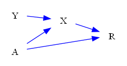
### Answers
- DAG with nodes Y, A, R, X and directed edges R->A, A->X, Y->X, R->X.

- No.
## ID: 62577395
### Graph
- graph type: DAG
- description: Given a DAG (directed acyclic graph) with nodes B, H, M, D and directed edges H->M, B->M, B->D, B->H, M->D.

### Questions
- [FO] Find another graph that belongs to the same Markov Equivalent Class of the given graph. 
- [YN] Given another DAG with nodes B, H, M, D and directed edges H->M, M->B, B->D, H->B, M->D, do these two graphs belong to the same Markov Equivalent Class? 

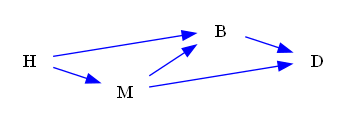
### Answers
- DAG with nodes B, H, M, D and directed edges M->H, M->B, B->D, B->H, M->D.

- Yes.
## ID: 60303049
### Graph
- graph type: DAG
- description: Given a DAG (directed acyclic graph) with nodes N, Y, I, M and directed edges I->M, N->I, N->Y, Y->M.

### Questions
- [FO] Find another graph that belongs to the same Markov Equivalent Class of the given graph. 
- [YN] Given another DAG with nodes N, Y, I, M and directed edges I->M, N->I, N->Y, M->Y, do these two graphs belong to the same markov equivalent class? 

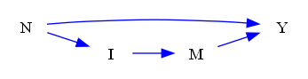
### Answers
- DAG with nodes N, Y, I, M and directed edges I->M, N->I, Y->N, Y->M.

- No.
## ID: 08012256
### Graph
- graph type: DAG
- description: Given a DAG (directed acyclic graph) with nodes Y, V, A, J and directed edges A->J, Y->V, Y->A, Y->J, V->J.

### Questions
- [FO] Find another graph that belongs to the same Markov Equivalent Class of the given graph. 
- [YN] Given another DAG with nodes Y, V, A, J and directed edges J->A, Y->V, Y->A, Y->J, V->J, do these two graphs belong to the same markov equivalent class? 

### Answers
- DAG with nodes Y, V, A, J and directed edges A->J, V->Y, Y->A, Y->J, V->J.

- No.
## ID: 77282325
### Graph
- graph type: DAG
- description: Given a DAG (directed acyclic graph) with nodes X, E, O, V and directed edges O->V, E->V, X->E, E->O, X->O.

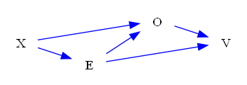
### Questions
- [FO] Find another graph that belongs to the same Markov Equivalent Class of the given graph. 
- [YN] Given another DAG with nodes X, E, O, V and directed edges O->V, E->V, E->X, E->O, X->O, do these two graphs belong to the same Markov Equivalent Class? 

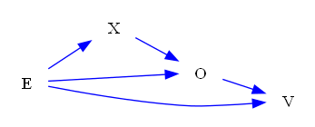
### Answers
- DAG with nodes X, E, O, V and directed edges O->V, E->V, E->X, E->O, O->X.

- Yes.
## ID: 69843588
### Graph
- graph type: DAG
- description: Given a DAG (directed acyclic graph) with nodes K, T, G, N, U and directed edges T->G, K->T, N->U, G->N, T->N, K->N, G->U, K->G, K->U.

### Questions
- [FO] Find another graph that belongs to the same Markov Equivalent Class of the given graph. 
- [YN] Given another DAG with nodes K, T, G, N, U and directed edges G->T, K->T, N->U, G->N, N->T, K->N, G->U, G->K, K->U, do these two graphs belong to the same Markov Equivalent Class? 

### Answers
- DAG with nodes K, T, G, N, U and directed edges G->T, T->K, N->U, G->N, T->N, K->N, G->U, G->K, K->U.

- Yes.
## ID: 76035520
### Graph
- graph type: DAG
- description: Given a DAG (directed acyclic graph) with nodes A, C, B, E, T and directed edges E->T, A->T, C->T, A->B, C->E, A->E, B->E, B->T.

### Questions
- [FO] Find another graph that belongs to the same Markov Equivalent Class of the given graph. 
- [YN] Given another DAG with nodes A, C, B, E, T and directed edges T->E, A->T, C->T, A->B, C->E, A->E, B->E, B->T, do these two graphs belong to the same Markov Equivalent Class? 

### Answers
- DAG with nodes A, C, B, E, T and directed edges T->E, A->T, C->T, B->A, C->E, A->E, B->E, B->T.

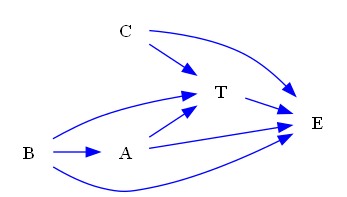
- Yes.
## ID: 92313616
### Graph
- graph type: DAG
- description: Given a DAG (directed acyclic graph) with nodes J, V, R, P, X and directed edges J->R, V->R, R->P, R->X, P->X, V->X, J->X, J->V.

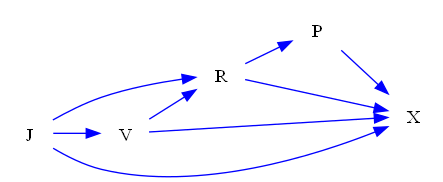
### Questions
- [FO] Find another graph that belongs to the same Markov Equivalent Class of the given graph. 
- [YN] Given another DAG with nodes J, V, R, P, X and directed edges J->R, V->R, R->P, X->R, X->P, V->X, J->X, J->V, do these two graphs belong to the same markov equivalent class? 

### Answers
- DAG with nodes J, V, R, P, X and directed edges J->R, V->R, R->P, R->X, P->X, V->X, J->X, V->J.

- No.
## ID: 52787493
### Graph
- graph type: DAG
- description: Given a DAG (directed acyclic graph) with nodes T, K, W, M, Q and directed edges K->M, T->W, M->Q, W->Q, W->M, T->K, T->M, K->Q.

### Questions
- [FO] Find another graph that belongs to the same Markov Equivalent Class of the given graph. 
- [YN] Given another DAG with nodes T, K, W, M, Q and directed edges K->M, T->W, M->Q, Q->W, M->W, T->K, T->M, K->Q, do these two graphs belong to the same markov equivalent class? 

### Answers
- DAG with nodes T, K, W, M, Q and directed edges K->M, W->T, M->Q, W->Q, W->M, T->K, T->M, K->Q.

- No.
## ID: 33460468
### Graph
- graph type: DAG
- description: Given a DAG (directed acyclic graph) with nodes K, P, V, T, S and directed edges T->S, K->V, K->P, P->S, K->S, V->S, P->V, P->T, K->T.

### Questions
- [FO] Find another graph that belongs to the same Markov Equivalent Class of the given graph. 
- [YN] Given another DAG with nodes K, P, V, T, S and directed edges T->S, K->V, P->K, P->S, K->S, V->S, P->V, P->T, T->K, do these two graphs belong to the same Markov Equivalent Class? 

### Answers
- DAG with nodes K, P, V, T, S and directed edges T->S, K->V, P->K, P->S, K->S, V->S, P->V, P->T, K->T.

- Yes.
## ID: 82357429
### Graph
- graph type: DAG
- description: Given a DAG (directed acyclic graph) with nodes M, J, W, K, D and directed edges M->K, W->D, J->K, J->W, M->D, M->J.

### Questions
- [FO] Find another graph that belongs to the same Markov Equivalent Class of the given graph. 
- [YN] Given another DAG with nodes M, J, W, K, D and directed edges M->K, W->D, K->J, J->W, M->D, M->J, do these two graphs belong to the same Markov Equivalent Class? 

### Answers
- DAG with nodes M, J, W, K, D and directed edges M->K, W->D, J->K, W->J, M->D, J->M.

- Yes.
## ID: 40283542
### Graph
- graph type: DAG
- description: Given a DAG (directed acyclic graph) with nodes I, Y, J, F, U and directed edges I->U, I->F, Y->J, J->U, I->Y, F->U.

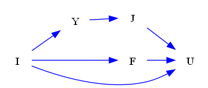
### Questions
- [FO] Find another graph that belongs to the same Markov Equivalent Class of the given graph. 
- [YN] Given another DAG with nodes I, Y, J, F, U and directed edges I->U, I->F, Y->J, J->U, Y->I, F->U, do these two graphs belong to the same Markov Equivalent Class? 

### Answers
- DAG with nodes I, Y, J, F, U and directed edges I->U, I->F, Y->J, J->U, Y->I, F->U.

- Yes.
## ID: 78219314
### Graph
- graph type: DAG
- description: Given a DAG (directed acyclic graph) with nodes Z, P, B, K, N and directed edges Z->N, P->N, P->B, B->K.

### Questions
- [FO] Find another graph that belongs to the same Markov Equivalent Class of the given graph. 
- [YN] Given another DAG with nodes Z, P, B, K, N and directed edges N->Z, N->P, B->P, B->K, do these two graphs belong to the same markov equivalent class? 

### Answers
- DAG with nodes Z, P, B, K, N and directed edges Z->N, P->N, B->P, B->K.

- No.
## ID: 06674568
### Graph
- graph type: DAG
- description: Given a DAG (directed acyclic graph) with nodes Y, W, X, Z, R and directed edges W->R, Z->R, Y->R, Y->W, Y->Z, X->R, W->X, Y->X.

### Questions
- [FO] Find another graph that belongs to the same Markov Equivalent Class of the given graph. 
- [YN] Given another DAG with nodes Y, W, X, Z, R and directed edges W->R, R->Z, Y->R, Y->W, Y->Z, X->R, X->W, Y->X, do these two graphs belong to the same markov equivalent class? 

### Answers
- DAG with nodes Y, W, X, Z, R and directed edges W->R, Z->R, Y->R, Y->W, Y->Z, X->R, X->W, Y->X.

- No.
## ID: 07040975
### Graph
- graph type: DAG
- description: Given a DAG (directed acyclic graph) with nodes X, C, B, E, V and directed edges X->B, C->B, B->V, X->V, C->E, C->V, X->E, E->V, X->C.

### Questions
- [FO] Find another graph that belongs to the same Markov Equivalent Class of the given graph. 
- [YN] Given another DAG with nodes X, C, B, E, V and directed edges X->B, C->B, V->B, X->V, E->C, C->V, X->E, E->V, X->C, do these two graphs belong to the same markov equivalent class? 

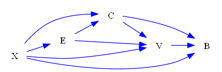
### Answers
- DAG with nodes X, C, B, E, V and directed edges X->B, C->B, B->V, X->V, E->C, C->V, E->X, E->V, X->C.

- No.
## ID: 06128309
### Graph
- graph type: DAG
- description: Given a DAG (directed acyclic graph) with nodes K, F, V, G, E, O and directed edges V->G, G->O, F->O, V->E, K->G, F->E, K->F, E->O, F->V.

### Questions
- [FO] Find another graph that belongs to the same Markov Equivalent Class of the given graph. 
- [YN] Given another DAG with nodes K, F, V, G, E, O and directed edges G->V, G->O, F->O, V->E, G->K, F->E, K->F, O->E, F->V, do these two graphs belong to the same markov equivalent class? 

### Answers
- DAG with nodes K, F, V, G, E, O and directed edges V->G, G->O, F->O, E->V, K->G, F->E, F->K, E->O, F->V.

- No.
## ID: 93187497
### Graph
- graph type: DAG
- description: Given a DAG (directed acyclic graph) with nodes W, E, U, A, J, P and directed edges U->P, E->A, A->J, U->J, W->E, E->U, J->P, W->A, E->P.

### Questions
- [FO] Find another graph that belongs to the same Markov Equivalent Class of the given graph. 
- [YN] Given another DAG with nodes W, E, U, A, J, P and directed edges U->P, A->E, A->J, U->J, W->E, E->U, J->P, W->A, E->P, do these two graphs belong to the same Markov Equivalent Class? 

### Answers
- DAG with nodes W, E, U, A, J, P and directed edges U->P, A->E, A->J, U->J, W->E, E->U, J->P, W->A, E->P.

- Yes.
## ID: 49562540
### Graph
- graph type: DAG
- description: Given a DAG (directed acyclic graph) with nodes K, I, S, A, E, Y and directed edges K->A, K->I, S->E, K->Y, S->A, I->A.

### Questions
- [FO] Find another graph that belongs to the same Markov Equivalent Class of the given graph. 
- [YN] Given another DAG with nodes K, I, S, A, E, Y and directed edges K->A, K->I, S->E, K->Y, S->A, A->I, do these two graphs belong to the same markov equivalent class? 

### Answers
- DAG with nodes K, I, S, A, E, Y and directed edges K->A, I->K, E->S, K->Y, S->A, I->A.

- No.
## ID: 24843396
### Graph
- graph type: DAG
- description: Given a DAG (directed acyclic graph) with nodes T, S, N, C, Y, R and directed edges T->N, Y->R, T->S, C->R, C->Y, T->Y, S->Y.

### Questions
- [FO] Find another graph that belongs to the same Markov Equivalent Class of the given graph. 
- [YN] Given another DAG with nodes T, S, N, C, Y, R and directed edges T->N, Y->R, T->S, R->C, Y->C, T->Y, S->Y, do these two graphs belong to the same markov equivalent class? 

### Answers
- DAG with nodes T, S, N, C, Y, R and directed edges T->N, Y->R, S->T, C->R, C->Y, T->Y, S->Y.

- No.
## ID: 95222165
### Graph
- graph type: DAG
- description: Given a DAG (directed acyclic graph) with nodes V, I, S, U, E, T and directed edges V->S, I->S, S->E, V->I, I->T, V->T, S->U, I->E, S->T, U->E.

### Questions
- [FO] Find another graph that belongs to the same Markov Equivalent Class of the given graph. 
- [YN] Given another DAG with nodes V, I, S, U, E, T and directed edges S->V, S->I, S->E, I->V, I->T, V->T, S->U, I->E, S->T, U->E, do these two graphs belong to the same Markov Equivalent Class? 

### Answers
- DAG with nodes V, I, S, U, E, T and directed edges V->S, I->S, S->E, I->V, I->T, V->T, S->U, I->E, S->T, U->E.

- Yes.
## ID: 91174631
### Graph
- graph type: DAG
- description: Given a DAG (directed acyclic graph) with nodes W, P, D, R, X, U and directed edges R->X, W->R, D->U, X->U, P->R, W->D, W->P, R->U, W->X, P->U.

### Questions
- [FO] Find another graph that belongs to the same Markov Equivalent Class of the given graph. 
- [YN] Given another DAG with nodes W, P, D, R, X, U and directed edges R->X, R->W, D->U, U->X, R->P, W->D, W->P, R->U, W->X, P->U, do these two graphs belong to the same markov equivalent class? 

### Answers
- DAG with nodes W, P, D, R, X, U and directed edges X->R, W->R, D->U, X->U, R->P, W->D, W->P, R->U, X->W, P->U.

- No.
## ID: 28969527
### Graph
- graph type: DAG
- description: Given a DAG (directed acyclic graph) with nodes U, Y, E, F, T, N and directed edges E->F, U->T, Y->E, T->N, E->T, F->N, Y->F, Y->T, E->N, F->T.

### Questions
- [FO] Find another graph that belongs to the same Markov Equivalent Class of the given graph. 
- [YN] Given another DAG with nodes U, Y, E, F, T, N and directed edges F->E, U->T, E->Y, T->N, E->T, F->N, F->Y, Y->T, E->N, F->T, do these two graphs belong to the same Markov Equivalent Class? 

### Answers
- DAG with nodes U, Y, E, F, T, N and directed edges E->F, U->T, E->Y, T->N, E->T, F->N, Y->F, Y->T, E->N, F->T.

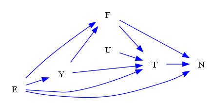
- Yes.
## ID: 50089635
### Graph
- graph type: DAG
- description: Given a DAG (directed acyclic graph) with nodes I, K, L, F, A, S and directed edges K->F, L->A, K->S, I->L, I->K, F->A, L->S, A->S, I->F.

### Questions
- [FO] Find another graph that belongs to the same Markov Equivalent Class of the given graph. 
- [YN] Given another DAG with nodes I, K, L, F, A, S and directed edges F->K, L->A, K->S, L->I, I->K, F->A, L->S, A->S, I->F, do these two graphs belong to the same Markov Equivalent Class? 

### Answers
- DAG with nodes I, K, L, F, A, S and directed edges K->F, L->A, K->S, I->L, K->I, F->A, L->S, A->S, I->F.

- Yes.
## ID: 33539531
### Graph
- graph type: DAG
- description: Given a DAG (directed acyclic graph) with nodes B, G, Q, T, S, N and directed edges S->N, Q->S, T->N, B->T, G->T.

### Questions
- [FO] Find another graph that belongs to the same Markov Equivalent Class of the given graph. 
- [YN] Given another DAG with nodes B, G, Q, T, S, N and directed edges S->N, S->Q, T->N, B->T, G->T, do these two graphs belong to the same Markov Equivalent Class? 

### Answers
- DAG with nodes B, G, Q, T, S, N and directed edges S->N, S->Q, T->N, B->T, G->T.

- Yes.
## ID: 33195505
### Graph
- graph type: DAG
- description: Given a DAG (directed acyclic graph) with nodes U, N, Z, R, X, M and directed edges R->M, N->X, U->R, N->M, X->M, N->R, U->Z, U->N.

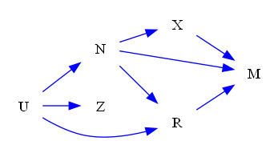
### Questions
- [FO] Find another graph that belongs to the same Markov Equivalent Class of the given graph. 
- [YN] Given another DAG with nodes U, N, Z, R, X, M and directed edges R->M, N->X, U->R, N->M, X->M, N->R, Z->U, U->N, do these two graphs belong to the same Markov Equivalent Class? 

### Answers
- DAG with nodes U, N, Z, R, X, M and directed edges R->M, N->X, U->R, N->M, X->M, R->N, Z->U, U->N.

- Yes.
## ID: 55397096
### Graph
- graph type: DAG
- description: Given a DAG (directed acyclic graph) with nodes W, H, Z, M, E, X, F and directed edges Z->X, W->E, W->M, Z->M, E->X, M->X, H->Z, M->F, Z->E, H->E.

### Questions
- [FO] Find another graph that belongs to the same Markov Equivalent Class of the given graph. 
- [YN] Given another DAG with nodes W, H, Z, M, E, X, F and directed edges Z->X, W->E, W->M, Z->M, E->X, M->X, Z->H, M->F, E->Z, E->H, do these two graphs belong to the same markov equivalent class? 

### Answers
- DAG with nodes W, H, Z, M, E, X, F and directed edges Z->X, W->E, W->M, Z->M, E->X, M->X, Z->H, M->F, Z->E, H->E.

- No.
## ID: 67010155
### Graph
- graph type: DAG
- description: Given a DAG (directed acyclic graph) with nodes A, G, O, W, U, P, K and directed edges A->U, U->K, A->K, A->G, O->W, O->K, W->U, O->U, P->K, W->K.

### Questions
- [FO] Find another graph that belongs to the same Markov Equivalent Class of the given graph. 
- [YN] Given another DAG with nodes A, G, O, W, U, P, K and directed edges A->U, K->U, K->A, A->G, W->O, K->O, W->U, U->O, P->K, W->K, do these two graphs belong to the same markov equivalent class? 

### Answers
- DAG with nodes A, G, O, W, U, P, K and directed edges A->U, U->K, A->K, A->G, W->O, O->K, W->U, O->U, P->K, W->K.

- No.
## ID: 30031140
### Graph
- graph type: DAG
- description: Given a DAG (directed acyclic graph) with nodes B, X, K, W, J, E, L and directed edges J->L, W->L, X->J, B->E, B->K, K->L, B->J.

### Questions
- [FO] Find another graph that belongs to the same Markov Equivalent Class of the given graph. 
- [YN] Given another DAG with nodes B, X, K, W, J, E, L and directed edges J->L, W->L, X->J, B->E, K->B, K->L, B->J, do these two graphs belong to the same Markov Equivalent Class? 

### Answers
- DAG with nodes B, X, K, W, J, E, L and directed edges J->L, W->L, X->J, E->B, B->K, K->L, B->J.

- Yes.
## ID: 99128874
### Graph
- graph type: DAG
- description: Given a DAG (directed acyclic graph) with nodes B, U, A, W, R, Z, M and directed edges Z->M, U->W, U->A, U->R, W->Z, A->M, B->U, B->W.

### Questions
- [FO] Find another graph that belongs to the same Markov Equivalent Class of the given graph. 
- [YN] Given another DAG with nodes B, U, A, W, R, Z, M and directed edges Z->M, W->U, U->A, R->U, W->Z, A->M, B->U, B->W, do these two graphs belong to the same markov equivalent class? 

### Answers
- DAG with nodes B, U, A, W, R, Z, M and directed edges Z->M, W->U, U->A, U->R, W->Z, A->M, B->U, B->W.

- No.
## ID: 63984972
### Graph
- graph type: DAG
- description: Given a DAG (directed acyclic graph) with nodes J, N, P, Z, S, C, X and directed edges J->S, J->X, P->X, Z->S, Z->X, N->Z, N->S, N->P, N->C, S->X.

### Questions
- [FO] Find another graph that belongs to the same Markov Equivalent Class of the given graph. 
- [YN] Given another DAG with nodes J, N, P, Z, S, C, X and directed edges J->S, J->X, P->X, Z->S, Z->X, N->Z, N->S, P->N, N->C, S->X, do these two graphs belong to the same Markov Equivalent Class? 

### Answers
- DAG with nodes J, N, P, Z, S, C, X and directed edges J->S, J->X, P->X, Z->S, Z->X, N->Z, N->S, P->N, N->C, S->X.

- Yes.
## ID: 75527074
### Graph
- graph type: DAG
- description: Given a DAG (directed acyclic graph) with nodes I, B, C, P, D, H, U and directed edges I->H, B->H, P->U, I->D, P->D, B->U, I->C, H->U, I->U, C->H.

### Questions
- [FO] Find another graph that belongs to the same Markov Equivalent Class of the given graph. 
- [YN] Given another DAG with nodes I, B, C, P, D, H, U and directed edges I->H, B->H, P->U, I->D, D->P, B->U, I->C, H->U, I->U, C->H, do these two graphs belong to the same markov equivalent class? 

### Answers
- DAG with nodes I, B, C, P, D, H, U and directed edges I->H, B->H, P->U, I->D, P->D, B->U, C->I, H->U, I->U, C->H.

- No.
## ID: 08636384
### Graph
- graph type: DAG
- description: Given a DAG (directed acyclic graph) with nodes J, Z, Y, T, D, A, K and directed edges J->K, Z->A, T->K, J->Y, D->A, T->D.

### Questions
- [FO] Find another graph that belongs to the same Markov Equivalent Class of the given graph. 
- [YN] Given another DAG with nodes J, Z, Y, T, D, A, K and directed edges J->K, Z->A, T->K, J->Y, D->A, D->T, do these two graphs belong to the same Markov Equivalent Class? 

### Answers
- DAG with nodes J, Z, Y, T, D, A, K and directed edges J->K, Z->A, T->K, Y->J, D->A, T->D.

- Yes.
## ID: 25977350
### Graph
- graph type: DAG
- description: Given a DAG (directed acyclic graph) with nodes B, C, W, E, H, A, V and directed edges B->E, H->V, C->H, B->V, B->W, C->A, B->H, W->E, C->E, C->V.

### Questions
- [FO] Find another graph that belongs to the same Markov Equivalent Class of the given graph. 
- [YN] Given another DAG with nodes B, C, W, E, H, A, V and directed edges B->E, H->V, C->H, B->V, W->B, C->A, B->H, W->E, C->E, C->V, do these two graphs belong to the same Markov Equivalent Class? 

### Answers
- DAG with nodes B, C, W, E, H, A, V and directed edges B->E, V->H, C->H, B->V, W->B, C->A, B->H, W->E, C->E, C->V.

- Yes.
## ID: 99642376
### Graph
- graph type: DAG
- description: Given a DAG (directed acyclic graph) with nodes P, Q, O, Z, R, J, V and directed edges O->V, P->J, Z->R, R->V, Q->V, P->Q, Q->R, O->Z, P->V.

### Questions
- [FO] Find another graph that belongs to the same Markov Equivalent Class of the given graph. 
- [YN] Given another DAG with nodes P, Q, O, Z, R, J, V and directed edges O->V, J->P, Z->R, R->V, Q->V, P->Q, Q->R, Z->O, P->V, do these two graphs belong to the same Markov Equivalent Class? 

### Answers
- DAG with nodes P, Q, O, Z, R, J, V and directed edges O->V, J->P, Z->R, R->V, Q->V, P->Q, Q->R, O->Z, P->V.

- Yes.
## ID: 76561920
### Graph
- graph type: DAG
- description: Given a DAG (directed acyclic graph) with nodes I, Q, V, Z, H, U, K and directed edges I->Z, I->U, U->K, I->H, V->H, V->Z, I->Q.

### Questions
- [FO] Find another graph that belongs to the same Markov Equivalent Class of the given graph. 
- [YN] Given another DAG with nodes I, Q, V, Z, H, U, K and directed edges I->Z, U->I, U->K, I->H, V->H, V->Z, I->Q, do these two graphs belong to the same Markov Equivalent Class? 

### Answers
- DAG with nodes I, Q, V, Z, H, U, K and directed edges I->Z, U->I, U->K, I->H, V->H, V->Z, I->Q.

- Yes.
## ID: 87781436
### Graph
- graph type: DAG
- description: Given a DAG (directed acyclic graph) with nodes A, X, F, U, E, H, W, K and directed edges U->E, E->H, H->K, U->H, X->U, X->K, F->K, A->U, X->W.

### Questions
- [FO] Find another graph that belongs to the same Markov Equivalent Class of the given graph. 
- [YN] Given another DAG with nodes A, X, F, U, E, H, W, K and directed edges E->U, E->H, K->H, H->U, X->U, K->X, F->K, A->U, X->W, do these two graphs belong to the same markov equivalent class? 

### Answers
- DAG with nodes A, X, F, U, E, H, W, K and directed edges U->E, H->E, H->K, U->H, X->U, X->K, F->K, A->U, X->W.

- No.
## ID: 97520043
### Graph
- graph type: DAG
- description: Given a DAG (directed acyclic graph) with nodes K, M, I, U, F, Z, J, A and directed edges Z->J, U->A, F->J, K->M, I->U, K->I, U->Z, J->A, I->J.

### Questions
- [FO] Find another graph that belongs to the same Markov Equivalent Class of the given graph. 
- [YN] Given another DAG with nodes K, M, I, U, F, Z, J, A and directed edges J->Z, A->U, F->J, K->M, I->U, K->I, Z->U, J->A, I->J, do these two graphs belong to the same markov equivalent class? 

### Answers
- DAG with nodes K, M, I, U, F, Z, J, A and directed edges Z->J, U->A, F->J, K->M, U->I, I->K, U->Z, J->A, I->J.

- No.
## ID: 93278983
### Graph
- graph type: DAG
- description: Given a DAG (directed acyclic graph) with nodes S, U, F, L, I, X, E, O and directed edges X->E, S->X, U->O, U->E, U->I, L->O, F->E.

### Questions
- [FO] Find another graph that belongs to the same Markov Equivalent Class of the given graph. 
- [YN] Given another DAG with nodes S, U, F, L, I, X, E, O and directed edges X->E, X->S, U->O, U->E, I->U, L->O, F->E, do these two graphs belong to the same Markov Equivalent Class? 

### Answers
- DAG with nodes S, U, F, L, I, X, E, O and directed edges X->E, X->S, U->O, U->E, U->I, L->O, F->E.

- Yes.
## ID: 65634528
### Graph
- graph type: DAG
- description: Given a DAG (directed acyclic graph) with nodes B, S, W, X, P, T, I, K and directed edges W->I, W->K, S->K, X->P, S->T, S->P, B->P.

### Questions
- [FO] Find another graph that belongs to the same Markov Equivalent Class of the given graph. 
- [YN] Given another DAG with nodes B, S, W, X, P, T, I, K and directed edges W->I, W->K, S->K, X->P, T->S, S->P, B->P, do these two graphs belong to the same Markov Equivalent Class? 

### Answers
- DAG with nodes B, S, W, X, P, T, I, K and directed edges W->I, W->K, S->K, X->P, T->S, S->P, B->P.

- Yes.
## ID: 43114200
### Graph
- graph type: DAG
- description: Given a DAG (directed acyclic graph) with nodes L, S, H, P, T, R, U, V and directed edges H->T, S->H, S->P, H->V, H->U, T->R, L->R.

### Questions
- [FO] Find another graph that belongs to the same Markov Equivalent Class of the given graph. 
- [YN] Given another DAG with nodes L, S, H, P, T, R, U, V and directed edges H->T, S->H, P->S, H->V, H->U, R->T, R->L, do these two graphs belong to the same markov equivalent class? 

### Answers
- DAG with nodes L, S, H, P, T, R, U, V and directed edges T->H, H->S, S->P, H->V, H->U, T->R, L->R.

- No.
## ID: 69736044
### Graph
- graph type: DAG
- description: Given a DAG (directed acyclic graph) with nodes J, D, S, B, K, L, F, C and directed edges D->B, J->C, L->F, L->C, D->F, S->L, D->K.

### Questions
- [FO] Find another graph that belongs to the same Markov Equivalent Class of the given graph. 
- [YN] Given another DAG with nodes J, D, S, B, K, L, F, C and directed edges D->B, C->J, L->F, L->C, D->F, S->L, K->D, do these two graphs belong to the same markov equivalent class? 

### Answers
- DAG with nodes J, D, S, B, K, L, F, C and directed edges D->B, J->C, L->F, L->C, D->F, L->S, K->D.

- No.
## ID: 67439800
### Graph
- graph type: DAG
- description: Given a DAG (directed acyclic graph) with nodes I, S, Z, P, H, N, B, Q and directed edges S->Z, N->Q, I->S, I->P, P->H, N->B, S->Q.

### Questions
- [FO] Find another graph that belongs to the same Markov Equivalent Class of the given graph. 
- [YN] Given another DAG with nodes I, S, Z, P, H, N, B, Q and directed edges S->Z, Q->N, I->S, I->P, P->H, B->N, S->Q, do these two graphs belong to the same markov equivalent class? 

### Answers
- DAG with nodes I, S, Z, P, H, N, B, Q and directed edges S->Z, N->Q, I->S, P->I, P->H, N->B, S->Q.

- No.
## ID: 70704031
### Graph
- graph type: DAG
- description: Given a DAG (directed acyclic graph) with nodes J, P, W, Z, L, H, T, K and directed edges J->W, P->K, P->Z, W->T, P->T, L->K, L->T, P->H.

### Questions
- [FO] Find another graph that belongs to the same Markov Equivalent Class of the given graph. 
- [YN] Given another DAG with nodes J, P, W, Z, L, H, T, K and directed edges J->W, K->P, P->Z, W->T, P->T, K->L, L->T, P->H, do these two graphs belong to the same markov equivalent class? 

### Answers
- DAG with nodes J, P, W, Z, L, H, T, K and directed edges W->J, P->K, P->Z, W->T, P->T, L->K, L->T, P->H.

- No.
## ID: 54479398
### Graph
- graph type: DAG
- description: Given a DAG (directed acyclic graph) with nodes W, Q, G, C, H, Z, U, P and directed edges W->G, H->U, G->P, Q->P, C->U, C->H, H->Z, W->C, W->H, Q->U.

### Questions
- [FO] Find another graph that belongs to the same Markov Equivalent Class of the given graph. 
- [YN] Given another DAG with nodes W, Q, G, C, H, Z, U, P and directed edges G->W, H->U, G->P, Q->P, C->U, C->H, H->Z, C->W, W->H, Q->U, do these two graphs belong to the same markov equivalent class? 

### Answers
- DAG with nodes W, Q, G, C, H, Z, U, P and directed edges G->W, H->U, G->P, Q->P, C->U, C->H, H->Z, W->C, W->H, Q->U.

- No.
## ID: 17814991
### Graph
- graph type: DAG
- description: Given a DAG (directed acyclic graph) with nodes M, S, O, W, I, P, G, Y and directed edges S->W, M->P, S->G, P->Y, M->O, O->G, M->Y, W->Y, S->Y, I->Y.

### Questions
- [FO] Find another graph that belongs to the same Markov Equivalent Class of the given graph. 
- [YN] Given another DAG with nodes M, S, O, W, I, P, G, Y and directed edges S->W, M->P, S->G, Y->P, M->O, G->O, M->Y, W->Y, S->Y, I->Y, do these two graphs belong to the same markov equivalent class? 

### Answers
- DAG with nodes M, S, O, W, I, P, G, Y and directed edges S->W, P->M, S->G, P->Y, M->O, O->G, M->Y, W->Y, S->Y, I->Y.

- No.
## ID: 66675323
### Graph
- graph type: DAG
- description: Given a DAG (directed acyclic graph) with nodes C, L, N, E, O, D, S, F, P and directed edges L->N, C->F, C->E, D->F, S->F, N->E, E->P, O->P.

### Questions
- [FO] Find another graph that belongs to the same Markov Equivalent Class of the given graph. 
- [YN] Given another DAG with nodes C, L, N, E, O, D, S, F, P and directed edges L->N, C->F, E->C, D->F, S->F, N->E, E->P, O->P, do these two graphs belong to the same markov equivalent class? 

### Answers
- DAG with nodes C, L, N, E, O, D, S, F, P and directed edges N->L, C->F, C->E, D->F, S->F, N->E, E->P, O->P.

- No.
## ID: 13192965
### Graph
- graph type: DAG
- description: Given a DAG (directed acyclic graph) with nodes P, M, Q, L, C, Z, W, Y, V and directed edges L->Y, C->Y, L->W, Z->W, C->Z, M->Z, Q->W, P->V, Q->Z, P->L.

### Questions
- [FO] Find another graph that belongs to the same Markov Equivalent Class of the given graph. 
- [YN] Given another DAG with nodes P, M, Q, L, C, Z, W, Y, V and directed edges L->Y, C->Y, W->L, Z->W, C->Z, M->Z, Q->W, P->V, Q->Z, P->L, do these two graphs belong to the same markov equivalent class? 

### Answers
- DAG with nodes P, M, Q, L, C, Z, W, Y, V and directed edges L->Y, C->Y, L->W, Z->W, C->Z, M->Z, Q->W, V->P, Q->Z, P->L.

- No.
## ID: 35147223
### Graph
- graph type: DAG
- description: Given a DAG (directed acyclic graph) with nodes X, Y, Q, N, F, C, E, Z, V and directed edges F->C, Q->V, N->V, X->Z, E->V, X->Y, N->F, Q->E, F->Z, Y->C.

### Questions
- [FO] Find another graph that belongs to the same Markov Equivalent Class of the given graph. 
- [YN] Given another DAG with nodes X, Y, Q, N, F, C, E, Z, V and directed edges F->C, V->Q, N->V, X->Z, V->E, X->Y, N->F, Q->E, Z->F, Y->C, do these two graphs belong to the same markov equivalent class? 

### Answers
- DAG with nodes X, Y, Q, N, F, C, E, Z, V and directed edges F->C, Q->V, N->V, X->Z, E->V, X->Y, F->N, Q->E, F->Z, Y->C.

- No.
## ID: 91377248
### Graph
- graph type: DAG
- description: Given a DAG (directed acyclic graph) with nodes T, O, Q, V, Z, A, N, G, U and directed edges N->U, Z->U, T->G, T->U, Q->N, V->A, A->N, V->U, O->U.

### Questions
- [FO] Find another graph that belongs to the same Markov Equivalent Class of the given graph. 
- [YN] Given another DAG with nodes T, O, Q, V, Z, A, N, G, U and directed edges U->N, Z->U, T->G, T->U, N->Q, V->A, A->N, V->U, U->O, do these two graphs belong to the same markov equivalent class? 

### Answers
- DAG with nodes T, O, Q, V, Z, A, N, G, U and directed edges N->U, Z->U, G->T, T->U, Q->N, V->A, A->N, V->U, O->U.

- No.
## ID: 18742945
### Graph
- graph type: DAG
- description: Given a DAG (directed acyclic graph) with nodes P, C, E, O, B, I, J, W, Y and directed edges E->O, O->I, C->W, E->J, E->B, I->W, J->Y, P->O, O->W.

### Questions
- [FO] Find another graph that belongs to the same Markov Equivalent Class of the given graph. 
- [YN] Given another DAG with nodes P, C, E, O, B, I, J, W, Y and directed edges E->O, O->I, W->C, E->J, E->B, I->W, J->Y, P->O, O->W, do these two graphs belong to the same markov equivalent class? 

### Answers
- DAG with nodes P, C, E, O, B, I, J, W, Y and directed edges E->O, O->I, C->W, E->J, B->E, I->W, J->Y, P->O, O->W.

- No.
## ID: 89326660
### Graph
- graph type: DAG
- description: Given a DAG (directed acyclic graph) with nodes D, P, K, I, J, W, Y, Z, R and directed edges D->Y, I->R, K->Y, P->Z, P->Y, K->I, W->Y, J->Z.

### Questions
- [FO] Find another graph that belongs to the same Markov Equivalent Class of the given graph. 
- [YN] Given another DAG with nodes D, P, K, I, J, W, Y, Z, R and directed edges D->Y, I->R, K->Y, P->Z, P->Y, K->I, W->Y, Z->J, do these two graphs belong to the same markov equivalent class? 

### Answers
- DAG with nodes D, P, K, I, J, W, Y, Z, R and directed edges D->Y, R->I, K->Y, P->Z, P->Y, I->K, W->Y, J->Z.

- No.
## ID: 60043667
### Graph
- graph type: DAG
- description: Given a DAG (directed acyclic graph) with nodes C, X, M, K, O, Z, G, Q, D and directed edges C->Z, X->G, K->D, O->Q, X->M, K->G, M->Z, M->O, C->G.

### Questions
- [FO] Find another graph that belongs to the same Markov Equivalent Class of the given graph. 
- [YN] Given another DAG with nodes C, X, M, K, O, Z, G, Q, D and directed edges C->Z, X->G, D->K, O->Q, M->X, K->G, M->Z, M->O, C->G, do these two graphs belong to the same Markov Equivalent Class? 

### Answers
- DAG with nodes C, X, M, K, O, Z, G, Q, D and directed edges C->Z, X->G, K->D, O->Q, M->X, K->G, M->Z, O->M, C->G.

- Yes.
## ID: 49388619
### Graph
- graph type: DAG
- description: Given a DAG (directed acyclic graph) with nodes X, H, E, P, J, G, T, R, Y and directed edges H->P, P->J, R->Y, X->E, E->G, X->R, X->H, H->E, E->J, P->T.

### Questions
- [FO] Find another graph that belongs to the same Markov Equivalent Class of the given graph. 
- [YN] Given another DAG with nodes X, H, E, P, J, G, T, R, Y and directed edges P->H, P->J, R->Y, X->E, E->G, X->R, H->X, H->E, E->J, T->P, do these two graphs belong to the same Markov Equivalent Class? 

### Answers
- DAG with nodes X, H, E, P, J, G, T, R, Y and directed edges H->P, P->J, R->Y, X->E, E->G, X->R, H->X, H->E, E->J, P->T.

- Yes.
## ID: 35865895
### Graph
- graph type: DAG
- description: Given a DAG (directed acyclic graph) with nodes J, Z, K, E, D, B, W, S, O and directed edges Z->O, B->O, J->E, K->D, Z->E, S->O, E->S, Z->K, D->W.

### Questions
- [FO] Find another graph that belongs to the same Markov Equivalent Class of the given graph. 
- [YN] Given another DAG with nodes J, Z, K, E, D, B, W, S, O and directed edges Z->O, O->B, J->E, K->D, Z->E, S->O, E->S, Z->K, W->D, do these two graphs belong to the same markov equivalent class? 

### Answers
- DAG with nodes J, Z, K, E, D, B, W, S, O and directed edges Z->O, B->O, J->E, K->D, Z->E, S->O, E->S, K->Z, D->W.

- No.
## ID: 96842428
### Graph
- graph type: DAG
- description: Given a DAG (directed acyclic graph) with nodes K, O, C, E, Z, H, V, X, Q and directed edges C->H, O->Q, O->C, E->V, E->Z, E->Q, K->V, K->X, Z->V.

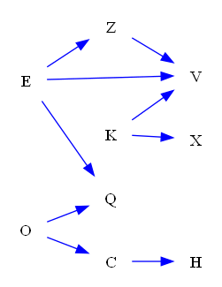
### Questions
- [FO] Find another graph that belongs to the same Markov Equivalent Class of the given graph. 
- [YN] Given another DAG with nodes K, O, C, E, Z, H, V, X, Q and directed edges C->H, O->Q, O->C, E->V, E->Z, E->Q, V->K, K->X, Z->V, do these two graphs belong to the same markov equivalent class? 

### Answers
- DAG with nodes K, O, C, E, Z, H, V, X, Q and directed edges C->H, O->Q, O->C, E->V, E->Z, E->Q, K->V, X->K, Z->V.

- No.
