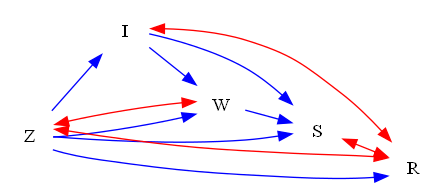
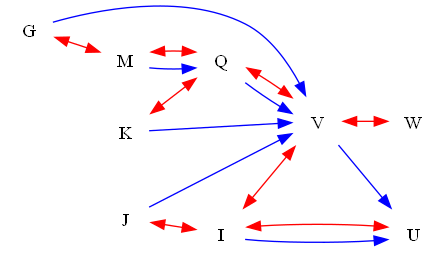

| Find All |How Many |Find One |Yes or No |Multiple Choice |Existence | total |
|:------:|:------:|:------:|:------:|:------:|:------:|:------:|
| 48 |48 |0 |48 |48 |0 | 192 |

|  N=4 | N=5 | N=6 | N=7 | N=8 | N=9 | total |
|:------:|:------:|:------:|:------:|:------:|:------:|:------:|
| 32 |32 |32 |32 |32 |32 | 192 |

|  Yes. | No. | judge_total |
|:------:|:------:|:------:|
| 24 |24 | 48 |

|  A | B | C | D | MC_total |
|:------:|:------:|:------:|:------:|:------:|
| 14 |9 |8 |17 | 48 |

## ID: 64396473
### Graph
- graph type: ADMG
- description: Given an ADMG (acyclic directed mixed graph) with nodes X, J, M, S, directed edges J->S, X->J, M->S, J->M, X->S and bi-directed edges X<->J, M<->S.

### Questions
- [FA] Find the maximal root set of this graph. 
- [HM] How many nodes are there in the maximal root set of this graph? 
- [YN] Is {'S'} the maximal root set of this graph? 
- [MC] Which of the following options is the maximal root set of this graph?\
A. {'M', 'X'}\
B. {'S'}\
C. {'M', 'S'}\
D. {'J', 'M'} 
### Answers
- {'S'}
- 1
- Yes.
- B
## ID: 00009099
### Graph
- graph type: ADMG
- description: Given an ADMG (acyclic directed mixed graph) with nodes V, C, H, Z, directed edges V->Z, C->H, C->Z, V->C, V->H and bi-directed edges H<->Z, C<->Z.

### Questions
- [FA] Find the maximal root set of this graph. 
- [HM] How many nodes are there in the maximal root set of this graph? 
- [YN] Is {'V'} the maximal root set of this graph? 
- [MC] Which of the following options is the maximal root set of this graph?\
A. {'V'}\
B. {'C', 'Z'}\
C. {'H', 'Z'}\
D. {'H', 'V'} 
### Answers
- {'H', 'Z'}
- 2
- No.
- C
## ID: 41933347
### Graph
- graph type: ADMG
- description: Given an ADMG (acyclic directed mixed graph) with nodes V, R, E, P, W, directed edges P->W, V->P, E->W, V->E, R->P, V->W, E->P, R->W, V->R, R->E and bi-directed edges V<->P, R<->P, V<->E.

### Questions
- [FA] Find the maximal root set of this graph. 
- [HM] How many nodes are there in the maximal root set of this graph? 
- [YN] Is {'W'} the maximal root set of this graph? 
- [MC] Which of the following options is the maximal root set of this graph?\
A. {'P'}\
B. {'E', 'V', 'P'}\
C. {'W'}\
D. {'E', 'W'} 
### Answers
- {'W'}
- 1
- Yes.
- C
## ID: 72577397
### Graph
- graph type: ADMG
- description: Given an ADMG (acyclic directed mixed graph) with nodes C, Q, P, D, Y, directed edges P->D, P->Y, Q->P, C->D, Q->D, C->Q, D->Y and bi-directed edges P<->D, Q<->P.

### Questions
- [FA] Find the maximal root set of this graph. 
- [HM] How many nodes are there in the maximal root set of this graph? 
- [YN] Is {'Y'} the maximal root set of this graph? 
- [MC] Which of the following options is the maximal root set of this graph?\
A. {'Q'}\
B. {'Y', 'D'}\
C. {'Y'}\
D. {'Y', 'C', 'P'} 
### Answers
- {'Y'}
- 1
- Yes.
- C
## ID: 14472391
### Graph
- graph type: ADMG
- description: Given an ADMG (acyclic directed mixed graph) with nodes E, S, F, M, N, B, directed edges N->B, E->F, S->F, F->M, E->B, M->N, F->N, S->B, E->S and bi-directed edges F<->B, S<->F, F<->N, F<->M.

### Questions
- [FA] Find the maximal root set of this graph. 
- [HM] How many nodes are there in the maximal root set of this graph? 
- [YN] Is {'B'} the maximal root set of this graph? 
- [MC] Which of the following options is the maximal root set of this graph?\
A. {'B'}\
B. {'M', 'S', 'B', 'F'}\
C. {'F'}\
D. {'M', 'B', 'F'} 
### Answers
- {'B'}
- 1
- Yes.
- A
## ID: 63351262
### Graph
- graph type: ADMG
- description: Given an ADMG (acyclic directed mixed graph) with nodes F, O, L, H, M, D, directed edges O->L, M->D, F->L, L->H, F->D, F->O, O->D, L->M and bi-directed edges O<->L.

### Questions
- [FA] Find the maximal root set of this graph. 
- [HM] How many nodes are there in the maximal root set of this graph? 
- [YN] Is {'M', 'O'} the maximal root set of this graph? 
- [MC] Which of the following options is the maximal root set of this graph?\
A. {'M', 'H', 'L'}\
B. {'O', 'D'}\
C. {'H', 'D'}\
D. {'M', 'F', 'D'} 
### Answers
- {'H', 'D'}
- 2
- No.
- C
## ID: 58968183
### Graph
- graph type: ADMG
- description: Given an ADMG (acyclic directed mixed graph) with nodes V, O, R, F, A, T, S, directed edges R->F, V->T, O->A, F->T, V->A, R->A, O->F, A->S, O->S, F->S, R->S and bi-directed edges F<->T, R<->A.

### Questions
- [FA] Find the maximal root set of this graph. 
- [HM] How many nodes are there in the maximal root set of this graph? 
- [YN] Is {'O', 'F'} the maximal root set of this graph? 
- [MC] Which of the following options is the maximal root set of this graph?\
A. {'O'}\
B. {'S', 'T'}\
C. {'R', 'V'}\
D. {'R', 'S', 'A'} 
### Answers
- {'S', 'T'}
- 2
- No.
- B
## ID: 61323173
### Graph
- graph type: ADMG
- description: Given an ADMG (acyclic directed mixed graph) with nodes F, Z, C, T, W, Y, R, directed edges Z->W, Z->R, C->W, Z->Y, F->T, W->R, Z->T, C->T, W->Y, T->R and bi-directed edges T<->Y, F<->W, F<->Z.

### Questions
- [FA] Find the maximal root set of this graph. 
- [HM] How many nodes are there in the maximal root set of this graph? 
- [YN] Is {'F', 'Z'} the maximal root set of this graph? 
- [MC] Which of the following options is the maximal root set of this graph?\
A. {'W', 'T', 'Z', 'C'}\
B. {'R', 'Y', 'C', 'Z'}\
C. {'W', 'Y', 'R'}\
D. {'Y', 'R'} 
### Answers
- {'Y', 'R'}
- 2
- No.
- D
## ID: 28975523
### Graph
- graph type: ADMG
- description: Given an ADMG (acyclic directed mixed graph) with nodes E, P, W, M, U, S, F, H, directed edges P->M, M->F, E->S, S->F, P->H, E->P, W->F, P->W, E->W, W->M, E->F, W->U and bi-directed edges M<->F, E<->M, M<->S, P<->W, W<->H.

### Questions
- [FA] Find the maximal root set of this graph. 
- [HM] How many nodes are there in the maximal root set of this graph? 
- [YN] Is {'H', 'F', 'U'} the maximal root set of this graph? 
- [MC] Which of the following options is the maximal root set of this graph?\
A. {'E', 'U', 'H', 'P'}\
B. {'W', 'S'}\
C. {'E', 'W', 'P'}\
D. {'H', 'F', 'U'} 
### Answers
- {'H', 'F', 'U'}
- 3
- Yes.
- D
## ID: 95505846
### Graph
- graph type: ADMG
- description: Given an ADMG (acyclic directed mixed graph) with nodes Z, K, U, R, P, D, I, A, directed edges U->D, Z->D, K->D, R->D, U->P, R->A, U->R, D->I and bi-directed edges P<->D, I<->A, P<->I.

### Questions
- [FA] Find the maximal root set of this graph. 
- [HM] How many nodes are there in the maximal root set of this graph? 
- [YN] Is {'K', 'P', 'A'} the maximal root set of this graph? 
- [MC] Which of the following options is the maximal root set of this graph?\
A. {'I', 'P', 'A'}\
B. {'Z', 'U', 'D'}\
C. {'P', 'K', 'Z'}\
D. {'K', 'U', 'Z'} 
### Answers
- {'I', 'P', 'A'}
- 3
- No.
- A
## ID: 18540733
### Graph
- graph type: ADMG
- description: Given an ADMG (acyclic directed mixed graph) with nodes B, Z, G, X, J, U, Y, W, O, directed edges Z->Y, X->U, B->U, Y->O, Y->W, G->U, G->W, W->O, G->J, B->G, B->Z, U->W and bi-directed edges G<->Y, Z<->X, X<->U, Z<->W, G<->U, G<->J.

### Questions
- [FA] Find the maximal root set of this graph. 
- [HM] How many nodes are there in the maximal root set of this graph? 
- [YN] Is {'Z'} the maximal root set of this graph? 
- [MC] Which of the following options is the maximal root set of this graph?\
A. {'O', 'X', 'G'}\
B. {'J', 'B'}\
C. {'Y', 'X'}\
D. {'J', 'O'} 
### Answers
- {'J', 'O'}
- 2
- No.
- D
## ID: 60829384
### Graph
- graph type: ADMG
- description: Given an ADMG (acyclic directed mixed graph) with nodes X, M, B, G, D, I, N, O, H, directed edges N->O, B->H, M->D, X->N, G->N, D->H, G->H, I->N, X->M, X->B, G->D, G->O and bi-directed edges I<->O.

### Questions
- [FA] Find the maximal root set of this graph. 
- [HM] How many nodes are there in the maximal root set of this graph? 
- [YN] Is {'I', 'H', 'B', 'D'} the maximal root set of this graph? 
- [MC] Which of the following options is the maximal root set of this graph?\
A. {'H', 'O'}\
B. {'I', 'D', 'G'}\
C. {'O', 'B', 'X', 'G'}\
D. {'N', 'G'} 
### Answers
- {'H', 'O'}
- 2
- No.
- A
## ID: 25143055
### Graph
- graph type: C-component
- description: Given an ADMG (acyclic directed mixed graph) with nodes B, U, Q, L, directed edges B->U, B->Q, U->Q, U->L, Q->L and bi-directed edges U<->Q, B<->U, U<->L.

### Questions
- [FA] Find the maximal root set of this graph. 
- [HM] How many nodes are there in the maximal root set of this graph? 
- [YN] Is {'L', 'B'} the maximal root set of this graph? 
- [MC] Which of the following options is the maximal root set of this graph?\
A. {'U', 'Q'}\
B. {'B', 'Q'}\
C. {'L', 'Q'}\
D. {'L'} 
### Answers
- {'L'}
- 1
- No.
- D
## ID: 07623335
### Graph
- graph type: C-component
- description: Given an ADMG (acyclic directed mixed graph) with nodes G, A, D, H, directed edges G->D, G->A, A->H, A->D, G->H and bi-directed edges G<->A, G<->D, G<->H.

### Questions
- [FA] Find the maximal root set of this graph. 
- [HM] How many nodes are there in the maximal root set of this graph? 
- [YN] Is {'H', 'D'} the maximal root set of this graph? 
- [MC] Which of the following options is the maximal root set of this graph?\
A. {'H', 'D'}\
B. {'G'}\
C. {'D', 'A'}\
D. {'D', 'G'} 
### Answers
- {'H', 'D'}
- 2
- Yes.
- A
## ID: 73890351
### Graph
- graph type: C-component
- description: Given an ADMG (acyclic directed mixed graph) with nodes Z, I, W, S, R, directed edges I->S, I->W, Z->W, Z->S, Z->I, Z->R, W->S and bi-directed edges Z<->R, I<->R, Z<->W, S<->R.

### Questions
- [FA] Find the maximal root set of this graph. 
- [HM] How many nodes are there in the maximal root set of this graph? 
- [YN] Is {'W', 'Z'} the maximal root set of this graph? 
- [MC] Which of the following options is the maximal root set of this graph?\
A. {'W'}\
B. {'W', 'I', 'S'}\
C. {'S'}\
D. {'R', 'S'} 
### Answers
- {'R', 'S'}
- 2
- No.
- D
## ID: 73259886
### Graph
- graph type: C-component
- description: Given an ADMG (acyclic directed mixed graph) with nodes B, R, U, M, J, directed edges U->M, B->J, B->M, R->J, R->M, M->J, R->U, B->R, B->U and bi-directed edges U<->J, M<->J, R<->J, B<->J.

### Questions
- [FA] Find the maximal root set of this graph. 
- [HM] How many nodes are there in the maximal root set of this graph? 
- [YN] Is {'J'} the maximal root set of this graph? 
- [MC] Which of the following options is the maximal root set of this graph?\
A. {'J'}\
B. {'J', 'R'}\
C. {'M', 'B', 'U'}\
D. {'R', 'B'} 
### Answers
- {'J'}
- 1
- Yes.
- A
## ID: 03161930
### Graph
- graph type: C-component
- description: Given an ADMG (acyclic directed mixed graph) with nodes B, O, T, D, V, G, directed edges T->G, D->G, O->T, O->D, T->V, O->G, B->G, D->V, B->O, T->D, B->T, B->V and bi-directed edges B<->D, B<->G, O<->G, V<->G, B<->T.

### Questions
- [FA] Find the maximal root set of this graph. 
- [HM] How many nodes are there in the maximal root set of this graph? 
- [YN] Is {'V', 'G'} the maximal root set of this graph? 
- [MC] Which of the following options is the maximal root set of this graph?\
A. {'T', 'D', 'G'}\
B. {'V', 'G'}\
C. {'O', 'V', 'D', 'G'}\
D. {'O', 'V'} 
### Answers
- {'V', 'G'}
- 2
- Yes.
- B
## ID: 38623659
### Graph
- graph type: C-component
- description: Given an ADMG (acyclic directed mixed graph) with nodes Q, G, J, D, O, T, directed edges J->O, D->T, Q->T, J->D, O->T, D->O, Q->J, Q->G, Q->O and bi-directed edges G<->O, O<->T, J<->O, Q<->J, G<->D.

### Questions
- [FA] Find the maximal root set of this graph. 
- [HM] How many nodes are there in the maximal root set of this graph? 
- [YN] Is {'T', 'G'} the maximal root set of this graph? 
- [MC] Which of the following options is the maximal root set of this graph?\
A. {'T', 'G'}\
B. {'O', 'T', 'Q', 'G'}\
C. {'Q'}\
D. {'J', 'O', 'Q', 'D'} 
### Answers
- {'T', 'G'}
- 2
- Yes.
- A
## ID: 48830718
### Graph
- graph type: C-component
- description: Given an ADMG (acyclic directed mixed graph) with nodes I, Z, J, T, H, O, A, directed edges O->A, I->T, Z->J, H->O, J->A, I->H, T->A, Z->O, Z->T and bi-directed edges I<->T, I<->Z, I<->J, J<->A, Z<->O, I<->H.

### Questions
- [FA] Find the maximal root set of this graph. 
- [HM] How many nodes are there in the maximal root set of this graph? 
- [YN] Is {'A'} the maximal root set of this graph? 
- [MC] Which of the following options is the maximal root set of this graph?\
A. {'O', 'T'}\
B. {'J'}\
C. {'H'}\
D. {'A'} 
### Answers
- {'A'}
- 1
- Yes.
- D
## ID: 22320576
### Graph
- graph type: C-component
- description: Given an ADMG (acyclic directed mixed graph) with nodes Y, H, I, F, G, L, K, directed edges H->L, F->G, I->L, Y->K, Y->I, H->I, H->F, H->K and bi-directed edges H<->G, H<->I, H<->L, Y<->L, F<->L, F<->K.

### Questions
- [FA] Find the maximal root set of this graph. 
- [HM] How many nodes are there in the maximal root set of this graph? 
- [YN] Is {'L', 'K', 'G'} the maximal root set of this graph? 
- [MC] Which of the following options is the maximal root set of this graph?\
A. {'F', 'G'}\
B. {'L', 'K', 'G'}\
C. {'I', 'L', 'F'}\
D. {'I', 'Y', 'L'} 
### Answers
- {'L', 'K', 'G'}
- 3
- Yes.
- B
## ID: 56394544
### Graph
- graph type: C-component
- description: Given an ADMG (acyclic directed mixed graph) with nodes P, N, E, R, U, Z, O, W, directed edges Z->O, R->O, O->W, U->O, R->W, N->R, Z->W, E->W, P->E, P->U and bi-directed edges R<->U, P<->U, E<->U, U<->O, O<->W, N<->O, U<->Z.

### Questions
- [FA] Find the maximal root set of this graph. 
- [HM] How many nodes are there in the maximal root set of this graph? 
- [YN] Is {'W'} the maximal root set of this graph? 
- [MC] Which of the following options is the maximal root set of this graph?\
A. {'W', 'U', 'N', 'P'}\
B. {'W'}\
C. {'E', 'W', 'N', 'U'}\
D. {'W', 'R', 'N', 'Z'} 
### Answers
- {'W'}
- 1
- Yes.
- B
## ID: 47110741
### Graph
- graph type: C-component
- description: Given an ADMG (acyclic directed mixed graph) with nodes I, A, Q, S, P, M, E, O, directed edges S->E, Q->P, Q->M, I->M, I->O, P->E, I->E, A->S and bi-directed edges I<->Q, I<->S, I<->A, S<->P, A<->M, A<->O, I<->E.

### Questions
- [FA] Find the maximal root set of this graph. 
- [HM] How many nodes are there in the maximal root set of this graph? 
- [YN] Is {'M', 'O', 'E'} the maximal root set of this graph? 
- [MC] Which of the following options is the maximal root set of this graph?\
A. {'M', 'O', 'E'}\
B. {'E', 'I', 'P'}\
C. {'M', 'S', 'Q'}\
D. {'E', 'I', 'Q', 'A'} 
### Answers
- {'M', 'O', 'E'}
- 3
- Yes.
- A
## ID: 07390395
### Graph
- graph type: C-component
- description: Given an ADMG (acyclic directed mixed graph) with nodes X, V, T, K, P, W, B, J, N, directed edges T->W, V->W, B->N, V->J, V->B, X->J, J->N, X->K, T->J, P->N, X->W and bi-directed edges V<->W, T<->W, V<->J, T<->B, V<->K, X<->J, K<->P, P<->N.

### Questions
- [FA] Find the maximal root set of this graph. 
- [HM] How many nodes are there in the maximal root set of this graph? 
- [YN] Is {'W', 'N', 'K'} the maximal root set of this graph? 
- [MC] Which of the following options is the maximal root set of this graph?\
A. {'W', 'N', 'K'}\
B. {'K'}\
C. {'B', 'N'}\
D. {'V', 'B', 'P'} 
### Answers
- {'W', 'N', 'K'}
- 3
- Yes.
- A
## ID: 97024754
### Graph
- graph type: C-component
- description: Given an ADMG (acyclic directed mixed graph) with nodes S, R, W, M, T, H, I, Q, E, directed edges W->M, H->E, W->E, H->I, M->H, T->Q, R->H, M->I, S->R, W->T, T->E and bi-directed edges H<->I, T<->I, W<->T, W<->E, R<->T, I<->Q, R<->M, S<->I.

### Questions
- [FA] Find the maximal root set of this graph. 
- [HM] How many nodes are there in the maximal root set of this graph? 
- [YN] Is {'H', 'R', 'Q', 'I'} the maximal root set of this graph? 
- [MC] Which of the following options is the maximal root set of this graph?\
A. {'E', 'I', 'Q'}\
B. {'E', 'M'}\
C. {'R', 'S'}\
D. {'W', 'H', 'Q', 'M'} 
### Answers
- {'E', 'I', 'Q'}
- 3
- No.
- A
## ID: 80001259
### Graph
- graph type: C-forest
- description: Given an ADMG (acyclic directed mixed graph) with nodes V, A, N, R, directed edges A->N, V->R and bi-directed edges V<->R, V<->N, V<->A.

### Questions
- [FA] Find the maximal root set of this graph. 
- [HM] How many nodes are there in the maximal root set of this graph? 
- [YN] Is {'N'} the maximal root set of this graph? 
- [MC] Which of the following options is the maximal root set of this graph?\
A. {'V', 'A'}\
B. {'R', 'A'}\
C. {'N'}\
D. {'R', 'N'} 
### Answers
- {'R', 'N'}
- 2
- No.
- D
## ID: 73785223
### Graph
- graph type: C-forest
- description: Given an ADMG (acyclic directed mixed graph) with nodes J, H, G, X, directed edges H->G, J->X and bi-directed edges J<->X, J<->G, H<->X.

### Questions
- [FA] Find the maximal root set of this graph. 
- [HM] How many nodes are there in the maximal root set of this graph? 
- [YN] Is {'J', 'G'} the maximal root set of this graph? 
- [MC] Which of the following options is the maximal root set of this graph?\
A. {'H', 'X'}\
B. {'X'}\
C. {'X', 'G'}\
D. {'H'} 
### Answers
- {'X', 'G'}
- 2
- No.
- C
## ID: 60128424
### Graph
- graph type: C-forest
- description: Given an ADMG (acyclic directed mixed graph) with nodes X, Q, A, O, R, directed edges A->O, Q->R, X->O and bi-directed edges X<->A, X<->O, A<->R, Q<->O.

### Questions
- [FA] Find the maximal root set of this graph. 
- [HM] How many nodes are there in the maximal root set of this graph? 
- [YN] Is {'O', 'X', 'Q'} the maximal root set of this graph? 
- [MC] Which of the following options is the maximal root set of this graph?\
A. {'R', 'X', 'A'}\
B. {'X', 'Q', 'A'}\
C. {'O'}\
D. {'O', 'R'} 
### Answers
- {'O', 'R'}
- 2
- No.
- D
## ID: 81784013
### Graph
- graph type: C-forest
- description: Given an ADMG (acyclic directed mixed graph) with nodes D, W, B, R, Y, directed edges W->R, D->R and bi-directed edges W<->Y, D<->W, W<->R, W<->B.

### Questions
- [FA] Find the maximal root set of this graph. 
- [HM] How many nodes are there in the maximal root set of this graph? 
- [YN] Is {'Y', 'R', 'B'} the maximal root set of this graph? 
- [MC] Which of the following options is the maximal root set of this graph?\
A. {'W', 'Y', 'B'}\
B. {'Y', 'R', 'B'}\
C. {'B'}\
D. {'W', 'R', 'B'} 
### Answers
- {'Y', 'R', 'B'}
- 3
- Yes.
- B
## ID: 87345423
### Graph
- graph type: C-forest
- description: Given an ADMG (acyclic directed mixed graph) with nodes E, P, X, U, J, Y, directed edges P->U, E->J and bi-directed edges X<->U, U<->Y, P<->U, X<->J, E<->J.

### Questions
- [FA] Find the maximal root set of this graph. 
- [HM] How many nodes are there in the maximal root set of this graph? 
- [YN] Is {'J', 'Y'} the maximal root set of this graph? 
- [MC] Which of the following options is the maximal root set of this graph?\
A. {'J', 'U', 'E'}\
B. {'E', 'J', 'P'}\
C. {'Y', 'U', 'P'}\
D. {'J', 'U', 'Y', 'X'} 
### Answers
- {'J', 'U', 'Y', 'X'}
- 4
- No.
- D
## ID: 09627277
### Graph
- graph type: C-forest
- description: Given an ADMG (acyclic directed mixed graph) with nodes L, B, S, U, V, X, directed edges S->V, B->U, L->X and bi-directed edges B<->S, L<->S, L<->V, U<->V, B<->X.

### Questions
- [FA] Find the maximal root set of this graph. 
- [HM] How many nodes are there in the maximal root set of this graph? 
- [YN] Is {'V', 'B', 'X'} the maximal root set of this graph? 
- [MC] Which of the following options is the maximal root set of this graph?\
A. {'X', 'V', 'U'}\
B. {'U', 'V', 'B', 'X'}\
C. {'L', 'B', 'X'}\
D. {'L', 'B'} 
### Answers
- {'X', 'V', 'U'}
- 3
- No.
- A
## ID: 78016231
### Graph
- graph type: C-forest
- description: Given an ADMG (acyclic directed mixed graph) with nodes X, T, G, F, S, N, H, directed edges G->N, T->F, X->G and bi-directed edges T<->H, T<->S, N<->H, G<->H, F<->S, X<->S.

### Questions
- [FA] Find the maximal root set of this graph. 
- [HM] How many nodes are there in the maximal root set of this graph? 
- [YN] Is {'H', 'X', 'S', 'F'} the maximal root set of this graph? 
- [MC] Which of the following options is the maximal root set of this graph?\
A. {'H', 'N', 'S', 'F'}\
B. {'G'}\
C. {'X', 'F'}\
D. {'F', 'T', 'X'} 
### Answers
- {'H', 'N', 'S', 'F'}
- 4
- No.
- A
## ID: 13517825
### Graph
- graph type: C-forest
- description: Given an ADMG (acyclic directed mixed graph) with nodes F, S, I, O, Q, E, T, directed edges I->Q, S->T, F->O and bi-directed edges F<->E, F<->Q, F<->S, O<->Q, F<->I, Q<->T.

### Questions
- [FA] Find the maximal root set of this graph. 
- [HM] How many nodes are there in the maximal root set of this graph? 
- [YN] Is {'Q'} the maximal root set of this graph? 
- [MC] Which of the following options is the maximal root set of this graph?\
A. {'I', 'O', 'F'}\
B. {'E', 'I', 'O', 'T'}\
C. {'Q'}\
D. {'E', 'O', 'T', 'Q'} 
### Answers
- {'E', 'O', 'T', 'Q'}
- 4
- No.
- D
## ID: 67132688
### Graph
- graph type: C-forest
- description: Given an ADMG (acyclic directed mixed graph) with nodes R, W, Q, G, T, O, N, D, directed edges G->T, Q->T, W->N, R->Q and bi-directed edges O<->D, Q<->D, G<->O, R<->D, G<->T, O<->N, W<->N.

### Questions
- [FA] Find the maximal root set of this graph. 
- [HM] How many nodes are there in the maximal root set of this graph? 
- [YN] Is {'N', 'O', 'T', 'D'} the maximal root set of this graph? 
- [MC] Which of the following options is the maximal root set of this graph?\
A. {'N', 'O', 'T', 'D'}\
B. {'N', 'O', 'T'}\
C. {'T', 'Q', 'G'}\
D. {'O', 'D', 'G'} 
### Answers
- {'N', 'O', 'T', 'D'}
- 4
- Yes.
- A
## ID: 11048955
### Graph
- graph type: C-forest
- description: Given an ADMG (acyclic directed mixed graph) with nodes P, Y, F, C, W, R, I, Q, directed edges C->R, F->C, Y->I, P->I and bi-directed edges R<->Q, F<->Q, P<->Q, F<->I, W<->I, C<->I, Y<->C.

### Questions
- [FA] Find the maximal root set of this graph. 
- [HM] How many nodes are there in the maximal root set of this graph? 
- [YN] Is {'Y', 'P'} the maximal root set of this graph? 
- [MC] Which of the following options is the maximal root set of this graph?\
A. {'I', 'Y', 'R'}\
B. {'W', 'I', 'R', 'Q'}\
C. {'I', 'Y'}\
D. {'Y', 'Q'} 
### Answers
- {'W', 'I', 'R', 'Q'}
- 4
- No.
- B
## ID: 39070931
### Graph
- graph type: C-forest
- description: Given an ADMG (acyclic directed mixed graph) with nodes G, K, J, I, M, Q, V, U, W, directed edges V->U, Q->V, M->Q, I->U, J->V, K->V, G->V and bi-directed edges I<->V, Q<->V, M<->Q, I<->U, G<->M, K<->Q, V<->W, J<->I.

### Questions
- [FA] Find the maximal root set of this graph. 
- [HM] How many nodes are there in the maximal root set of this graph? 
- [YN] Is {'J', 'I', 'G'} the maximal root set of this graph? 
- [MC] Which of the following options is the maximal root set of this graph?\
A. {'W', 'U'}\
B. {'I', 'V'}\
C. {'M', 'V', 'U'}\
D. {'Q', 'G'} 
### Answers
- {'W', 'U'}
- 2
- No.
- A
## ID: 69657559
### Graph
- graph type: C-forest
- description: Given an ADMG (acyclic directed mixed graph) with nodes W, K, T, C, S, O, U, H, F, directed edges O->F, S->F, C->U, T->H, K->S, W->T and bi-directed edges W<->S, K<->S, W<->F, K<->U, K<->O, W<->T, U<->H, C<->U.

### Questions
- [FA] Find the maximal root set of this graph. 
- [HM] How many nodes are there in the maximal root set of this graph? 
- [YN] Is {'H', 'F', 'U'} the maximal root set of this graph? 
- [MC] Which of the following options is the maximal root set of this graph?\
A. {'U', 'T', 'K'}\
B. {'T', 'H', 'C'}\
C. {'H'}\
D. {'H', 'F', 'U'} 
### Answers
- {'H', 'F', 'U'}
- 3
- Yes.
- D
## ID: 47864749
### Graph
- graph type: C-tree
- description: Given an ADMG (acyclic directed mixed graph) with nodes M, V, F, Z, directed edges F->Z, V->Z, M->F and bi-directed edges F<->Z, M<->Z, V<->Z.

### Questions
- [FA] Find the maximal root set of this graph. 
- [HM] How many nodes are there in the maximal root set of this graph? 
- [YN] Is {'M'} the maximal root set of this graph? 
- [MC] Which of the following options is the maximal root set of this graph?\
A. {'V', 'F'}\
B. {'F', 'Z'}\
C. {'Z'}\
D. {'M'} 
### Answers
- {'Z'}
- 1
- No.
- C
## ID: 23920314
### Graph
- graph type: C-tree
- description: Given an ADMG (acyclic directed mixed graph) with nodes Z, C, W, L, directed edges W->L, C->W, Z->W and bi-directed edges C<->L, Z<->C, W<->L.

### Questions
- [FA] Find the maximal root set of this graph. 
- [HM] How many nodes are there in the maximal root set of this graph? 
- [YN] Is {'L'} the maximal root set of this graph? 
- [MC] Which of the following options is the maximal root set of this graph?\
A. {'Z'}\
B. {'W'}\
C. {'L'}\
D. {'W', 'L'} 
### Answers
- {'L'}
- 1
- Yes.
- C
## ID: 96406824
### Graph
- graph type: C-tree
- description: Given an ADMG (acyclic directed mixed graph) with nodes M, D, I, N, X, directed edges N->X, I->N, D->X, M->N and bi-directed edges I<->N, M<->N, I<->X, D<->N.

### Questions
- [FA] Find the maximal root set of this graph. 
- [HM] How many nodes are there in the maximal root set of this graph? 
- [YN] Is {'X'} the maximal root set of this graph? 
- [MC] Which of the following options is the maximal root set of this graph?\
A. {'N'}\
B. {'I'}\
C. {'N', 'X'}\
D. {'X'} 
### Answers
- {'X'}
- 1
- Yes.
- D
## ID: 77221693
### Graph
- graph type: C-tree
- description: Given an ADMG (acyclic directed mixed graph) with nodes X, Q, W, I, T, directed edges I->T, W->I, Q->W, X->I and bi-directed edges Q<->W, X<->Q, Q<->T, W<->I.

### Questions
- [FA] Find the maximal root set of this graph. 
- [HM] How many nodes are there in the maximal root set of this graph? 
- [YN] Is {'T'} the maximal root set of this graph? 
- [MC] Which of the following options is the maximal root set of this graph?\
A. {'I', 'X'}\
B. {'I'}\
C. {'W', 'Q'}\
D. {'T'} 
### Answers
- {'T'}
- 1
- Yes.
- D
## ID: 89333386
### Graph
- graph type: C-tree
- description: Given an ADMG (acyclic directed mixed graph) with nodes I, O, T, G, X, C, directed edges X->C, G->C, T->X, O->G, I->X and bi-directed edges O<->T, O<->G, I<->G, I<->C, I<->X.

### Questions
- [FA] Find the maximal root set of this graph. 
- [HM] How many nodes are there in the maximal root set of this graph? 
- [YN] Is {'O', 'C'} the maximal root set of this graph? 
- [MC] Which of the following options is the maximal root set of this graph?\
A. {'T', 'G'}\
B. {'C', 'I', 'T', 'G'}\
C. {'O'}\
D. {'C'} 
### Answers
- {'C'}
- 1
- No.
- D
## ID: 61492159
### Graph
- graph type: C-tree
- description: Given an ADMG (acyclic directed mixed graph) with nodes I, A, D, R, C, E, directed edges C->E, R->C, D->E, A->R, I->A and bi-directed edges I<->R, R<->E, I<->D, A<->D, R<->C.

### Questions
- [FA] Find the maximal root set of this graph. 
- [HM] How many nodes are there in the maximal root set of this graph? 
- [YN] Is {'E'} the maximal root set of this graph? 
- [MC] Which of the following options is the maximal root set of this graph?\
A. {'E', 'I', 'R', 'C'}\
B. {'I', 'R', 'D', 'A'}\
C. {'D'}\
D. {'E'} 
### Answers
- {'E'}
- 1
- Yes.
- D
## ID: 37647426
### Graph
- graph type: C-tree
- description: Given an ADMG (acyclic directed mixed graph) with nodes L, Q, N, F, I, G, S, directed edges G->S, I->G, F->I, N->S, Q->F, L->G and bi-directed edges L<->S, L<->F, L<->G, L<->N, F<->I, Q<->N.

### Questions
- [FA] Find the maximal root set of this graph. 
- [HM] How many nodes are there in the maximal root set of this graph? 
- [YN] Is {'L', 'S', 'Q', 'G'} the maximal root set of this graph? 
- [MC] Which of the following options is the maximal root set of this graph?\
A. {'S', 'F'}\
B. {'L', 'F'}\
C. {'I', 'N', 'S', 'G'}\
D. {'S'} 
### Answers
- {'S'}
- 1
- No.
- D
## ID: 78728614
### Graph
- graph type: C-tree
- description: Given an ADMG (acyclic directed mixed graph) with nodes B, S, K, I, J, Q, U, directed edges Q->U, J->U, I->J, K->Q, S->K, B->I and bi-directed edges B<->K, K<->U, K<->I, S<->I, I<->J, S<->Q.

### Questions
- [FA] Find the maximal root set of this graph. 
- [HM] How many nodes are there in the maximal root set of this graph? 
- [YN] Is {'S'} the maximal root set of this graph? 
- [MC] Which of the following options is the maximal root set of this graph?\
A. {'I'}\
B. {'J'}\
C. {'U'}\
D. {'B', 'K'} 
### Answers
- {'U'}
- 1
- No.
- C
## ID: 58239773
### Graph
- graph type: C-tree
- description: Given an ADMG (acyclic directed mixed graph) with nodes F, S, O, V, P, E, A, I, directed edges A->I, E->A, P->A, V->P, O->E, S->I, F->S and bi-directed edges E<->I, V<->E, P<->E, O<->V, S<->E, E<->A, F<->S.

### Questions
- [FA] Find the maximal root set of this graph. 
- [HM] How many nodes are there in the maximal root set of this graph? 
- [YN] Is {'V', 'P'} the maximal root set of this graph? 
- [MC] Which of the following options is the maximal root set of this graph?\
A. {'P'}\
B. {'I'}\
C. {'E'}\
D. {'I', 'F', 'A'} 
### Answers
- {'I'}
- 1
- No.
- B
## ID: 68721346
### Graph
- graph type: C-tree
- description: Given an ADMG (acyclic directed mixed graph) with nodes I, L, Y, E, U, V, R, G, directed edges R->G, V->R, U->V, E->V, Y->V, L->R, I->L and bi-directed edges L<->R, R<->G, V<->R, E<->V, I<->L, Y<->G, I<->U.

### Questions
- [FA] Find the maximal root set of this graph. 
- [HM] How many nodes are there in the maximal root set of this graph? 
- [YN] Is {'G'} the maximal root set of this graph? 
- [MC] Which of the following options is the maximal root set of this graph?\
A. {'G'}\
B. {'E', 'Y', 'L', 'V'}\
C. {'U'}\
D. {'Y', 'G'} 
### Answers
- {'G'}
- 1
- Yes.
- A
## ID: 32670753
### Graph
- graph type: C-tree
- description: Given an ADMG (acyclic directed mixed graph) with nodes M, W, I, Z, D, R, A, T, C, directed edges T->C, A->T, R->T, D->R, Z->D, I->C, W->Z, M->C and bi-directed edges I<->D, I<->A, I<->Z, R<->A, R<->C, W<->Z, M<->Z, Z<->T.

### Questions
- [FA] Find the maximal root set of this graph. 
- [HM] How many nodes are there in the maximal root set of this graph? 
- [YN] Is {'C'} the maximal root set of this graph? 
- [MC] Which of the following options is the maximal root set of this graph?\
A. {'M', 'Z'}\
B. {'R', 'T', 'D', 'A'}\
C. {'M', 'T', 'D', 'A'}\
D. {'C'} 
### Answers
- {'C'}
- 1
- Yes.
- D
## ID: 19951938
### Graph
- graph type: C-tree
- description: Given an ADMG (acyclic directed mixed graph) with nodes T, J, I, M, Y, R, H, B, S, directed edges B->S, H->S, R->H, Y->R, M->S, I->Y, J->I, T->M and bi-directed edges M<->B, T<->M, H<->B, J<->M, J<->I, Y<->H, I<->R, I<->S.

### Questions
- [FA] Find the maximal root set of this graph. 
- [HM] How many nodes are there in the maximal root set of this graph? 
- [YN] Is {'S'} the maximal root set of this graph? 
- [MC] Which of the following options is the maximal root set of this graph?\
A. {'R'}\
B. {'S'}\
C. {'H'}\
D. {'J'} 
### Answers
- {'S'}
- 1
- Yes.
- B
