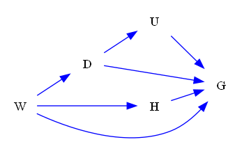
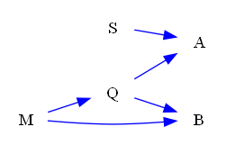
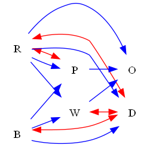

| Find All |How Many |Find One |Yes or No |Multiple Choice |Existence | total |
|:------:|:------:|:------:|:------:|:------:|:------:|:------:|
| 48 |48 |0 |48 |48 |0 | 192 |

|  N=4 | N=5 | N=6 | N=7 | N=8 | N=9 | total |
|:------:|:------:|:------:|:------:|:------:|:------:|:------:|
| 32 |32 |32 |32 |32 |32 | 192 |

|  Yes. | No. | judge_total |
|:------:|:------:|:------:|
| 26 |22 | 48 |

|  A | B | C | D | MC_total |
|:------:|:------:|:------:|:------:|:------:|
| 9 |14 |14 |11 | 48 |

## ID: 27348883
### Graph
- graph type: UG
- description: Given a undirected graph with nodes R, V, C, J and undirected edges R-V, C-J, V-J.

### Questions
- [FA] List all nodes of this graph. 
- [HM] How many nodes does this graph have? 
- [YN] Is V a node of this graph? 
- [MC] Which of the following is a node of this graph?\
A. T\
B. M\
C. A\
D. C 
### Answers
- R, V, C, J
- 4
- Yes.
- D
## ID: 57263747
### Graph
- graph type: UG
- description: Given a undirected graph with nodes B, K, O, Q and undirected edges K-Q, K-O, B-O, B-Q, O-Q, B-K.

### Questions
- [FA] List all nodes of this graph. 
- [HM] How many nodes does this graph have? 
- [YN] Is K a node of this graph? 
- [MC] Which of the following is NOT a node of this graph?\
A. Q\
B. O\
C. H\
D. B 
### Answers
- B, K, O, Q
- 4
- Yes.
- C
## ID: 92328182
### Graph
- graph type: UG
- description: Given a undirected graph with nodes Q, P, N, I, K and undirected edges Q-K, N-K, Q-N, P-N, Q-P, P-K, P-I.

### Questions
- [FA] List all nodes of this graph. 
- [HM] How many nodes does this graph have? 
- [YN] Is U a node of this graph? 
- [MC] Which of the following is a node of this graph?\
A. E\
B. Z\
C. Q\
D. H 
### Answers
- Q, P, N, I, K
- 5
- No.
- C
## ID: 68740459
### Graph
- graph type: UG
- description: Given a undirected graph with nodes F, U, A, S, E and undirected edges F-E, U-A, U-E, A-S.

### Questions
- [FA] List all nodes of this graph. 
- [HM] How many nodes does this graph have? 
- [YN] Is E a node of this graph? 
- [MC] Which of the following is a node of this graph?\
A. S\
B. C\
C. V\
D. N 
### Answers
- F, U, A, S, E
- 5
- Yes.
- A
## ID: 65631630
### Graph
- graph type: UG
- description: Given a undirected graph with nodes D, I, A, R, B, O and undirected edges I-R, I-O, D-I, A-O, R-B, I-A, B-O, D-A, A-B.

### Questions
- [FA] List all nodes of this graph. 
- [HM] How many nodes does this graph have? 
- [YN] Is O a node of this graph? 
- [MC] Which of the following is NOT a node of this graph?\
A. R\
B. G\
C. D\
D. B 
### Answers
- D, I, A, R, B, O
- 6
- Yes.
- B
## ID: 98523671
### Graph
- graph type: UG
- description: Given a undirected graph with nodes I, Q, L, O, S, U and undirected edges L-O, O-U, I-Q, L-S, I-S, Q-S, S-U, I-L, O-S.

### Questions
- [FA] List all nodes of this graph. 
- [HM] How many nodes does this graph have? 
- [YN] Is X a node of this graph? 
- [MC] Which of the following is NOT a node of this graph?\
A. M\
B. U\
C. S\
D. I 
### Answers
- I, Q, L, O, S, U
- 6
- No.
- A
## ID: 65879154
### Graph
- graph type: UG
- description: Given a undirected graph with nodes E, Y, D, J, H, L, Q and undirected edges Y-J, D-Q, Y-L, E-J, D-L, L-Q, E-Y, Y-H, Y-D, E-L.

### Questions
- [FA] List all nodes of this graph. 
- [HM] How many nodes does this graph have? 
- [YN] Is J a node of this graph? 
- [MC] Which of the following is a node of this graph?\
A. M\
B. F\
C. K\
D. J 
### Answers
- E, Y, D, J, H, L, Q
- 7
- Yes.
- D
## ID: 21590532
### Graph
- graph type: UG
- description: Given a undirected graph with nodes Y, Z, A, E, K, P, L and undirected edges Z-E, A-E, E-P, A-P, K-P, A-L, Z-P, Y-K, Y-Z.

### Questions
- [FA] List all nodes of this graph. 
- [HM] How many nodes does this graph have? 
- [YN] Is J a node of this graph? 
- [MC] Which of the following is a node of this graph?\
A. P\
B. V\
C. M\
D. F 
### Answers
- Y, Z, A, E, K, P, L
- 7
- No.
- A
## ID: 73485432
### Graph
- graph type: UG
- description: Given a undirected graph with nodes I, B, O, W, G, L, K, N and undirected edges W-K, I-K, K-N, B-G, I-G, O-N, I-L, I-O, G-K, B-K.

### Questions
- [FA] List all nodes of this graph. 
- [HM] How many nodes does this graph have? 
- [YN] Is Q a node of this graph? 
- [MC] Which of the following is a node of this graph?\
A. U\
B. N\
C. Q\
D. H 
### Answers
- I, B, O, W, G, L, K, N
- 8
- No.
- B
## ID: 70378099
### Graph
- graph type: UG
- description: Given a undirected graph with nodes D, F, E, H, C, I, S, L and undirected edges D-I, F-S, D-C, D-L, E-H, S-L, C-I, E-C.

### Questions
- [FA] List all nodes of this graph. 
- [HM] How many nodes does this graph have? 
- [YN] Is O a node of this graph? 
- [MC] Which of the following is NOT a node of this graph?\
A. H\
B. I\
C. T\
D. E 
### Answers
- D, F, E, H, C, I, S, L
- 8
- No.
- C
## ID: 23943851
### Graph
- graph type: UG
- description: Given a undirected graph with nodes O, S, A, G, P, J, L, C, Z and undirected edges A-L, A-J, G-L, J-Z, J-C, G-J, G-P, O-Z, S-G, C-Z.

### Questions
- [FA] List all nodes of this graph. 
- [HM] How many nodes does this graph have? 
- [YN] Is P a node of this graph? 
- [MC] Which of the following is NOT a node of this graph?\
A. V\
B. A\
C. C\
D. L 
### Answers
- O, S, A, G, P, J, L, C, Z
- 9
- Yes.
- A
## ID: 06589492
### Graph
- graph type: UG
- description: Given a undirected graph with nodes I, A, L, J, E, G, X, Z, U and undirected edges I-Z, E-U, L-X, I-A, I-X, J-X, A-E, G-U, A-G, G-Z.

### Questions
- [FA] List all nodes of this graph. 
- [HM] How many nodes does this graph have? 
- [YN] Is F a node of this graph? 
- [MC] Which of the following is NOT a node of this graph?\
A. L\
B. E\
C. P\
D. A 
### Answers
- I, A, L, J, E, G, X, Z, U
- 9
- No.
- C
## ID: 32813952
### Graph
- graph type: DG
- description: Given a directed graph with nodes U, H, T, A and directed edges H->U, H->T, A->H, T->U.

### Questions
- [FA] List all nodes of this graph. 
- [HM] How many nodes does this graph have? 
- [YN] Is H a node of this graph? 
- [MC] Which of the following is a node of this graph?\
A. K\
B. V\
C. T\
D. R 
### Answers
- U, H, T, A
- 4
- Yes.
- C
## ID: 82801201
### Graph
- graph type: DG
- description: Given a directed graph with nodes N, F, Z, R and directed edges N->F, R->F, Z->F, F->N, F->Z.

### Questions
- [FA] List all nodes of this graph. 
- [HM] How many nodes does this graph have? 
- [YN] Is Z a node of this graph? 
- [MC] Which of the following is a node of this graph?\
A. P\
B. O\
C. Y\
D. Z 
### Answers
- N, F, Z, R
- 4
- Yes.
- D
## ID: 86248649
### Graph
- graph type: DG
- description: Given a directed graph with nodes Q, Y, D, G, U and directed edges U->G, Y->D, U->D, G->D, D->U, Q->G, G->Y, Q->D.

### Questions
- [FA] List all nodes of this graph. 
- [HM] How many nodes does this graph have? 
- [YN] Is U a node of this graph? 
- [MC] Which of the following is a node of this graph?\
A. J\
B. E\
C. Y\
D. K 
### Answers
- Q, Y, D, G, U
- 5
- Yes.
- C
## ID: 12640930
### Graph
- graph type: DG
- description: Given a directed graph with nodes O, W, G, U, H and directed edges O->H, H->W, G->U, W->G, O->W, H->U.

### Questions
- [FA] List all nodes of this graph. 
- [HM] How many nodes does this graph have? 
- [YN] Is R a node of this graph? 
- [MC] Which of the following is NOT a node of this graph?\
A. G\
B. S\
C. W\
D. H 
### Answers
- O, W, G, U, H
- 5
- No.
- B
## ID: 90643600
### Graph
- graph type: DG
- description: Given a directed graph with nodes W, D, Q, A, T, F and directed edges Q->T, A->W, D->F, F->W, D->Q, T->W, F->Q, T->F, D->W.

### Questions
- [FA] List all nodes of this graph. 
- [HM] How many nodes does this graph have? 
- [YN] Is T a node of this graph? 
- [MC] Which of the following is NOT a node of this graph?\
A. D\
B. V\
C. F\
D. T 
### Answers
- W, D, Q, A, T, F
- 6
- Yes.
- B
## ID: 67933685
### Graph
- graph type: DG
- description: Given a directed graph with nodes H, T, I, P, W, Q and directed edges T->Q, T->I, H->T, Q->T, I->P, W->T, T->W, H->P.

### Questions
- [FA] List all nodes of this graph. 
- [HM] How many nodes does this graph have? 
- [YN] Is W a node of this graph? 
- [MC] Which of the following is a node of this graph?\
A. O\
B. H\
C. C\
D. S 
### Answers
- H, T, I, P, W, Q
- 6
- Yes.
- B
## ID: 89590055
### Graph
- graph type: DG
- description: Given a directed graph with nodes T, Z, R, S, V, Y, L and directed edges R->S, V->L, T->Y, Y->T, S->Z, R->L, Y->L, S->L, S->V, L->R.

### Questions
- [FA] List all nodes of this graph. 
- [HM] How many nodes does this graph have? 
- [YN] Is A a node of this graph? 
- [MC] Which of the following is NOT a node of this graph?\
A. Z\
B. F\
C. L\
D. R 
### Answers
- T, Z, R, S, V, Y, L
- 7
- No.
- B
## ID: 39040773
### Graph
- graph type: DG
- description: Given a directed graph with nodes M, L, E, D, W, J, N and directed edges J->W, E->N, N->L, E->J, L->E, M->D, D->L, J->D.

### Questions
- [FA] List all nodes of this graph. 
- [HM] How many nodes does this graph have? 
- [YN] Is A a node of this graph? 
- [MC] Which of the following is a node of this graph?\
A. J\
B. K\
C. R\
D. C 
### Answers
- M, L, E, D, W, J, N
- 7
- No.
- A
## ID: 89322752
### Graph
- graph type: DG
- description: Given a directed graph with nodes P, E, W, I, M, Y, V, F and directed edges W->E, I->M, Y->I, Y->F, I->V, P->I, F->E, Y->M.

### Questions
- [FA] List all nodes of this graph. 
- [HM] How many nodes does this graph have? 
- [YN] Is E a node of this graph? 
- [MC] Which of the following is a node of this graph?\
A. J\
B. C\
C. U\
D. W 
### Answers
- P, E, W, I, M, Y, V, F
- 8
- Yes.
- D
## ID: 64623283
### Graph
- graph type: DG
- description: Given a directed graph with nodes O, C, A, G, Y, B, M, N and directed edges O->Y, B->G, C->O, Y->G, G->O, N->M, A->O, M->Y, G->Y.

### Questions
- [FA] List all nodes of this graph. 
- [HM] How many nodes does this graph have? 
- [YN] Is C a node of this graph? 
- [MC] Which of the following is NOT a node of this graph?\
A. Y\
B. B\
C. L\
D. N 
### Answers
- O, C, A, G, Y, B, M, N
- 8
- Yes.
- C
## ID: 78901111
### Graph
- graph type: DG
- description: Given a directed graph with nodes H, T, W, M, V, P, G, Z, K and directed edges V->G, K->W, K->V, Z->M, V->W, W->M, P->H, T->P, H->M, K->Z.

### Questions
- [FA] List all nodes of this graph. 
- [HM] How many nodes does this graph have? 
- [YN] Is L a node of this graph? 
- [MC] Which of the following is NOT a node of this graph?\
A. P\
B. T\
C. D\
D. Z 
### Answers
- H, T, W, M, V, P, G, Z, K
- 9
- No.
- C
## ID: 56538598
### Graph
- graph type: DG
- description: Given a directed graph with nodes W, L, I, O, Q, N, K, S, Y and directed edges K->O, I->S, L->Y, S->Q, O->Y, O->N, N->S, I->W, I->Q, L->W.

### Questions
- [FA] List all nodes of this graph. 
- [HM] How many nodes does this graph have? 
- [YN] Is N a node of this graph? 
- [MC] Which of the following is NOT a node of this graph?\
A. L\
B. F\
C. I\
D. Y 
### Answers
- W, L, I, O, Q, N, K, S, Y
- 9
- Yes.
- B
## ID: 88021975
### Graph
- graph type: DAG
- description: Given a DAG (directed acyclic graph) with nodes D, W, X, K and directed edges W->K, D->W, D->K, D->X.

### Questions
- [FA] List all nodes of this graph. 
- [HM] How many nodes does this graph have? 
- [YN] Is D a node of this graph? 
- [MC] Which of the following is a node of this graph?\
A. X\
B. M\
C. E\
D. N 
### Answers
- D, W, X, K
- 4
- Yes.
- A
## ID: 17386942
### Graph
- graph type: DAG
- description: Given a DAG (directed acyclic graph) with nodes F, I, W, J and directed edges F->I, I->J, W->J, I->W.

### Questions
- [FA] List all nodes of this graph. 
- [HM] How many nodes does this graph have? 
- [YN] Is F a node of this graph? 
- [MC] Which of the following is NOT a node of this graph?\
A. W\
B. I\
C. J\
D. U 
### Answers
- F, I, W, J
- 4
- Yes.
- D
## ID: 50555363
### Graph
- graph type: DAG
- description: Given a DAG (directed acyclic graph) with nodes W, D, H, U, G and directed edges D->U, H->G, W->D, W->H, U->G, D->G, W->G.

### Questions
- [FA] List all nodes of this graph. 
- [HM] How many nodes does this graph have? 
- [YN] Is H a node of this graph? 
- [MC] Which of the following is a node of this graph?\
A. R\
B. E\
C. D\
D. B 
### Answers
- W, D, H, U, G
- 5
- Yes.
- C
## ID: 88515843
### Graph
- graph type: DAG
- description: Given a DAG (directed acyclic graph) with nodes S, M, Q, A, B and directed edges M->Q, S->A, Q->A, M->B, Q->B.

### Questions
- [FA] List all nodes of this graph. 
- [HM] How many nodes does this graph have? 
- [YN] Is N a node of this graph? 
- [MC] Which of the following is NOT a node of this graph?\
A. A\
B. P\
C. M\
D. S 
### Answers
- S, M, Q, A, B
- 5
- No.
- B
## ID: 85246778
### Graph
- graph type: DAG
- description: Given a DAG (directed acyclic graph) with nodes R, U, P, O, A, M and directed edges U->M, R->O, O->A, P->A, R->P, U->A.

### Questions
- [FA] List all nodes of this graph. 
- [HM] How many nodes does this graph have? 
- [YN] Is A a node of this graph? 
- [MC] Which of the following is a node of this graph?\
A. E\
B. M\
C. J\
D. X 
### Answers
- R, U, P, O, A, M
- 6
- Yes.
- B
## ID: 96138079
### Graph
- graph type: DAG
- description: Given a DAG (directed acyclic graph) with nodes R, X, Z, W, Y, S and directed edges W->S, Y->S, R->Z, Z->W, X->Y, R->W.

### Questions
- [FA] List all nodes of this graph. 
- [HM] How many nodes does this graph have? 
- [YN] Is R a node of this graph? 
- [MC] Which of the following is a node of this graph?\
A. F\
B. J\
C. S\
D. V 
### Answers
- R, X, Z, W, Y, S
- 6
- Yes.
- C
## ID: 68191119
### Graph
- graph type: DAG
- description: Given a DAG (directed acyclic graph) with nodes I, B, P, H, O, Z, Q and directed edges B->Z, H->O, B->Q, I->B, P->Q, B->P, O->Z, I->Q, P->O.

### Questions
- [FA] List all nodes of this graph. 
- [HM] How many nodes does this graph have? 
- [YN] Is O a node of this graph? 
- [MC] Which of the following is NOT a node of this graph?\
A. Q\
B. D\
C. Z\
D. H 
### Answers
- I, B, P, H, O, Z, Q
- 7
- Yes.
- B
## ID: 40797432
### Graph
- graph type: DAG
- description: Given a DAG (directed acyclic graph) with nodes J, R, G, D, B, U, O and directed edges R->B, D->U, U->O, R->O, R->D, J->B, G->O.

### Questions
- [FA] List all nodes of this graph. 
- [HM] How many nodes does this graph have? 
- [YN] Is S a node of this graph? 
- [MC] Which of the following is NOT a node of this graph?\
A. O\
B. T\
C. G\
D. B 
### Answers
- J, R, G, D, B, U, O
- 7
- No.
- B
## ID: 87067195
### Graph
- graph type: DAG
- description: Given a DAG (directed acyclic graph) with nodes A, S, K, X, D, G, J, Q and directed edges A->D, D->Q, G->J, S->Q, X->J, K->Q, A->S, S->J.

### Questions
- [FA] List all nodes of this graph. 
- [HM] How many nodes does this graph have? 
- [YN] Is S a node of this graph? 
- [MC] Which of the following is NOT a node of this graph?\
A. A\
B. G\
C. J\
D. E 
### Answers
- A, S, K, X, D, G, J, Q
- 8
- Yes.
- D
## ID: 99720664
### Graph
- graph type: DAG
- description: Given a DAG (directed acyclic graph) with nodes F, B, W, S, U, Z, X, D and directed edges Z->X, B->S, B->X, U->X, W->D, U->Z, S->U, F->B, F->Z, X->D.

### Questions
- [FA] List all nodes of this graph. 
- [HM] How many nodes does this graph have? 
- [YN] Is D a node of this graph? 
- [MC] Which of the following is NOT a node of this graph?\
A. F\
B. S\
C. H\
D. X 
### Answers
- F, B, W, S, U, Z, X, D
- 8
- Yes.
- C
## ID: 29604715
### Graph
- graph type: DAG
- description: Given a DAG (directed acyclic graph) with nodes P, L, C, A, K, W, N, M, F and directed edges L->K, W->N, K->N, P->M, A->F, C->A, W->M, C->W, N->M, L->N.

### Questions
- [FA] List all nodes of this graph. 
- [HM] How many nodes does this graph have? 
- [YN] Is L a node of this graph? 
- [MC] Which of the following is NOT a node of this graph?\
A. L\
B. M\
C. H\
D. A 
### Answers
- P, L, C, A, K, W, N, M, F
- 9
- Yes.
- C
## ID: 77809396
### Graph
- graph type: DAG
- description: Given a DAG (directed acyclic graph) with nodes N, P, C, H, V, D, M, L, R and directed edges H->R, C->D, N->M, N->L, C->R, N->P, P->M, D->R, D->M, N->V.

### Questions
- [FA] List all nodes of this graph. 
- [HM] How many nodes does this graph have? 
- [YN] Is J a node of this graph? 
- [MC] Which of the following is a node of this graph?\
A. T\
B. E\
C. Z\
D. M 
### Answers
- N, P, C, H, V, D, M, L, R
- 9
- No.
- D
## ID: 30212680
### Graph
- graph type: ADMG
- description: Given an ADMG (acyclic directed mixed graph) with nodes R, W, X, J, directed edges W->X, X->J, R->X, R->W and bi-directed edges W<->J.

### Questions
- [FA] List all nodes of this graph. 
- [HM] How many nodes does this graph have? 
- [YN] Is L a node of this graph? 
- [MC] Which of the following is NOT a node of this graph?\
A. J\
B. W\
C. X\
D. S 
### Answers
- R, W, X, J
- 4
- No.
- D
## ID: 87896042
### Graph
- graph type: ADMG
- description: Given an ADMG (acyclic directed mixed graph) with nodes K, T, L, U, directed edges K->L, T->U, K->U, T->L and bi-directed edges T<->U.

### Questions
- [FA] List all nodes of this graph. 
- [HM] How many nodes does this graph have? 
- [YN] Is K a node of this graph? 
- [MC] Which of the following is a node of this graph?\
A. C\
B. A\
C. D\
D. K 
### Answers
- K, T, L, U
- 4
- Yes.
- D
## ID: 06868902
### Graph
- graph type: ADMG
- description: Given an ADMG (acyclic directed mixed graph) with nodes N, M, Q, I, S, directed edges I->S, M->Q, M->I, Q->I, Q->S, N->Q, N->M, N->I and bi-directed edges N<->M.

### Questions
- [FA] List all nodes of this graph. 
- [HM] How many nodes does this graph have? 
- [YN] Is L a node of this graph? 
- [MC] Which of the following is a node of this graph?\
A. M\
B. D\
C. T\
D. K 
### Answers
- N, M, Q, I, S
- 5
- No.
- A
## ID: 21685761
### Graph
- graph type: ADMG
- description: Given an ADMG (acyclic directed mixed graph) with nodes T, W, U, K, D, directed edges W->D, W->K, T->U, T->W, W->U, K->D, U->K and bi-directed edges T<->W, T<->D.

### Questions
- [FA] List all nodes of this graph. 
- [HM] How many nodes does this graph have? 
- [YN] Is M a node of this graph? 
- [MC] Which of the following is a node of this graph?\
A. Z\
B. D\
C. E\
D. B 
### Answers
- T, W, U, K, D
- 5
- No.
- B
## ID: 17535896
### Graph
- graph type: ADMG
- description: Given an ADMG (acyclic directed mixed graph) with nodes B, R, W, P, O, D, directed edges B->W, R->W, B->D, R->P, W->O, R->D, R->O, P->O, B->P and bi-directed edges B<->D, R<->D, R<->P, W<->D.

### Questions
- [FA] List all nodes of this graph. 
- [HM] How many nodes does this graph have? 
- [YN] Is G a node of this graph? 
- [MC] Which of the following is NOT a node of this graph?\
A. P\
B. O\
C. R\
D. J 
### Answers
- B, R, W, P, O, D
- 6
- No.
- D
## ID: 86860086
### Graph
- graph type: ADMG
- description: Given an ADMG (acyclic directed mixed graph) with nodes L, O, Q, V, Z, I, directed edges Z->I, O->Q, L->O, Q->V, Q->Z, L->Z, L->I, O->Z, L->Q and bi-directed edges V<->Z, L<->Z, Q<->V.

### Questions
- [FA] List all nodes of this graph. 
- [HM] How many nodes does this graph have? 
- [YN] Is L a node of this graph? 
- [MC] Which of the following is a node of this graph?\
A. M\
B. E\
C. T\
D. V 
### Answers
- L, O, Q, V, Z, I
- 6
- Yes.
- D
## ID: 47106625
### Graph
- graph type: ADMG
- description: Given an ADMG (acyclic directed mixed graph) with nodes D, I, X, L, K, B, C, directed edges I->L, L->K, I->X, D->X, X->L, D->L, X->B, B->C and bi-directed edges I<->C, B<->C, D<->K, L<->B.

### Questions
- [FA] List all nodes of this graph. 
- [HM] How many nodes does this graph have? 
- [YN] Is S a node of this graph? 
- [MC] Which of the following is a node of this graph?\
A. L\
B. Q\
C. N\
D. T 
### Answers
- D, I, X, L, K, B, C
- 7
- No.
- A
## ID: 59629526
### Graph
- graph type: ADMG
- description: Given an ADMG (acyclic directed mixed graph) with nodes X, B, R, A, F, C, N, directed edges B->A, F->C, B->F, X->A, R->C, X->B, X->N, X->F and bi-directed edges C<->N, X<->C, A<->N.

### Questions
- [FA] List all nodes of this graph. 
- [HM] How many nodes does this graph have? 
- [YN] Is F a node of this graph? 
- [MC] Which of the following is NOT a node of this graph?\
A. N\
B. H\
C. A\
D. B 
### Answers
- X, B, R, A, F, C, N
- 7
- Yes.
- B
## ID: 60482619
### Graph
- graph type: ADMG
- description: Given an ADMG (acyclic directed mixed graph) with nodes M, R, B, G, F, Z, O, D, directed edges R->O, R->G, R->F, F->D, Z->D, R->Z, M->B, O->D, B->F, Z->O and bi-directed edges B<->D.

### Questions
- [FA] List all nodes of this graph. 
- [HM] How many nodes does this graph have? 
- [YN] Is X a node of this graph? 
- [MC] Which of the following is NOT a node of this graph?\
A. D\
B. F\
C. Y\
D. Z 
### Answers
- M, R, B, G, F, Z, O, D
- 8
- No.
- C
## ID: 63979776
### Graph
- graph type: ADMG
- description: Given an ADMG (acyclic directed mixed graph) with nodes K, O, A, N, B, Q, H, M, directed edges N->Q, N->H, O->N, K->O, K->M, Q->M, O->H, A->M, B->Q and bi-directed edges K<->O.

### Questions
- [FA] List all nodes of this graph. 
- [HM] How many nodes does this graph have? 
- [YN] Is F a node of this graph? 
- [MC] Which of the following is NOT a node of this graph?\
A. Q\
B. K\
C. L\
D. A 
### Answers
- K, O, A, N, B, Q, H, M
- 8
- No.
- C
## ID: 55259051
### Graph
- graph type: ADMG
- description: Given an ADMG (acyclic directed mixed graph) with nodes V, U, N, L, E, O, B, C, X, directed edges N->C, O->C, U->L, L->B, N->E, V->U, O->X, V->L, E->B, V->C and bi-directed edges O<->B, L<->B, L<->C, N<->L.

### Questions
- [FA] List all nodes of this graph. 
- [HM] How many nodes does this graph have? 
- [YN] Is F a node of this graph? 
- [MC] Which of the following is a node of this graph?\
A. N\
B. Y\
C. H\
D. P 
### Answers
- V, U, N, L, E, O, B, C, X
- 9
- No.
- A
## ID: 61283495
### Graph
- graph type: ADMG
- description: Given an ADMG (acyclic directed mixed graph) with nodes W, U, E, L, M, H, G, Z, Q, directed edges Z->Q, U->Z, E->Z, W->G, W->H, H->Z, E->Q, U->L, L->M and bi-directed edges L<->M, U<->Q, L<->H.

### Questions
- [FA] List all nodes of this graph. 
- [HM] How many nodes does this graph have? 
- [YN] Is I a node of this graph? 
- [MC] Which of the following is NOT a node of this graph?\
A. E\
B. I\
C. G\
D. Q 
### Answers
- W, U, E, L, M, H, G, Z, Q
- 9
- No.
- B
