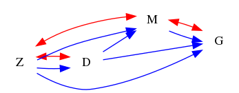
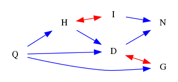

| Find All |How Many |Find One |Yes or No |Multiple Choice |Existence | total |
|:------:|:------:|:------:|:------:|:------:|:------:|:------:|
| 24 |24 |72 |24 |24 |0 | 168 |

|  N=4 | N=5 | N=6 | N=7 | N=8 | N=9 | total |
|:------:|:------:|:------:|:------:|:------:|:------:|:------:|
| 28 |28 |28 |28 |28 |28 | 168 |

|  Yes. | No. | judge_total |
|:------:|:------:|:------:|
| 14 |10 | 24 |

|  A | B | C | D | MC_total |
|:------:|:------:|:------:|:------:|:------:|
| 7 |7 |7 |3 | 24 |

## ID: 87202888
### Graph
- graph type: DAG
- description: Given a DAG (directed acyclic graph) with nodes M, H, L, Q and directed edges M->H, H->L, H->Q, L->Q, M->L, M->Q.

### Questions
- [FA] Find all paths from L to H. 
- [HM] How many paths are there from L to Q. 
- [FO] Find one path from M to L. 
- [FO] Find the shortest paths from M to L. 
- [FO] Find the longest paths from M to L. 
- [YN] Is H<-M a path from H to M? 
- [MC] Which of the following is a path from H to Q?\
A. H<-L->Q\
B. H<->L<-M->Q\
C. H<-M<-L<->Q\
D. H->L<-M->Q 
### Answers
- ['L<-H', 'L->Q<-H', 'L<-M->H', 'L->Q<-M->H', 'L<-M->Q<-H']
- 5
- ['M->L', 'M->Q<-L', 'M->H->L', 'M->Q<-H->L', 'M->H->Q<-L']
- M->L
- M->Q<-H->L
- Yes.
- D
## ID: 30190816
### Graph
- graph type: DAG
- description: Given a DAG (directed acyclic graph) with nodes K, M, B, D and directed edges K->M, K->B, B->D, M->B, M->D, K->D.

### Questions
- [FA] Find all paths from M to B. 
- [HM] How many paths are there from B to M. 
- [FO] Find one path from K to B. 
- [FO] Find the shortest paths from K to B. 
- [FO] Find the longest paths from K to B. 
- [YN] Is M<-D->K<-B a path from M to B? 
- [MC] Which of the following is a path from B to K?\
A. B<-M<-K\
B. B->D<-M<->K\
C. B<-M<-D->K\
D. B<-D->M->K 
### Answers
- ['M->B', 'M<-K->B', 'M->D<-B', 'M<-K->D<-B', 'M->D<-K->B']
- 5
- ['K->B', 'K->M->B', 'K->D<-B', 'K->M->D<-B', 'K->D<-M->B']
- K->B
- K->M->D<-B
- No.
- A
## ID: 22411272
### Graph
- graph type: DAG
- description: Given a DAG (directed acyclic graph) with nodes P, G, K, T, O and directed edges K->T, P->K, G->K, G->O, P->G.

### Questions
- [FA] Find all paths from T to P. 
- [HM] How many paths are there from P to T. 
- [FO] Find one path from P to G. 
- [FO] Find the shortest paths from P to G. 
- [FO] Find the longest paths from P to G. 
- [YN] Is T<-K a path from T to K? 
- [MC] Which of the following is a path from K to O?\
A. K<-G->O\
B. K->G<->O\
C. K<-T<-G<-P<-O\
D. K->T->G<-P<->O 
### Answers
- ['T<-K<-P', 'T<-K<-G<-P']
- 2
- ['P->G', 'P->K<-G']
- P->G
- P->K<-G
- Yes.
- A
## ID: 78311555
### Graph
- graph type: DAG
- description: Given a DAG (directed acyclic graph) with nodes C, F, S, T, U and directed edges C->F, F->T, F->S, T->U, C->U, C->T, F->U.

### Questions
- [FA] Find all paths from F to T. 
- [HM] How many paths are there from C to T. 
- [FO] Find one path from C to T. 
- [FO] Find the shortest paths from C to T. 
- [FO] Find the longest paths from C to T. 
- [YN] Is C<-U<->T<->F a path from C to F? 
- [MC] Which of the following is a path from C to F?\
A. C<->T->F\
B. C->T->U<-F\
C. C->U->F\
D. C->T->F 
### Answers
- ['F->T', 'F->U<-T', 'F<-C->T', 'F->U<-C->T', 'F<-C->U<-T']
- 5
- ['C->T', 'C->U<-T', 'C->F->T', 'C->U<-F->T', 'C->F->U<-T']
- C->T
- C->U<-F->T
- No.
- B
## ID: 84174438
### Graph
- graph type: DAG
- description: Given a DAG (directed acyclic graph) with nodes B, O, J, N, Q, H and directed edges N->Q, B->J, O->J, N->H, B->H, B->O.

### Questions
- [FA] Find all paths from Q to H. 
- [HM] How many paths are there from N to Q. 
- [FO] Find one path from O to H. 
- [FO] Find the shortest paths from O to H. 
- [FO] Find the longest paths from O to H. 
- [YN] Is B->H<-N<-J<->Q a path from B to Q? 
- [MC] Which of the following is a path from Q to B?\
A. Q->O->B\
B. Q<-J<->N<->B\
C. Q<-N->H<-B\
D. Q->J<->O->N->B 
### Answers
- ['Q<-N->H']
- 1
- ['O<-B->H', 'O->J<-B->H']
- O<-B->H
- O->J<-B->H
- No.
- C
## ID: 09461851
### Graph
- graph type: DAG
- description: Given a DAG (directed acyclic graph) with nodes I, H, N, T, P, Y and directed edges H->N, I->H, I->P, N->Y, N->P, I->N, N->T.

### Questions
- [FA] Find all paths from I to N. 
- [HM] How many paths are there from N to T. 
- [FO] Find one path from H to T. 
- [FO] Find the shortest paths from H to T. 
- [FO] Find the longest paths from H to T. 
- [YN] Is N->T a path from N to T? 
- [MC] Which of the following is a path from Y to H?\
A. Y<-N->P<-I->H\
B. Y<->N<->H\
C. Y->T->N<->H\
D. Y<-N->H 
### Answers
- ['I->N', 'I->H->N', 'I->P<-N']
- 1
- ['H->N->T', 'H<-I->N->T', 'H<-I->P<-N->T']
- H->N->T
- H<-I->P<-N->T
- Yes.
- A
## ID: 38464784
### Graph
- graph type: DAG
- description: Given a DAG (directed acyclic graph) with nodes D, R, Q, W, O, I, G and directed edges Q->O, O->G, W->I, D->R, Q->W, W->G, R->O, R->I.

### Questions
- [FA] Find all paths from D to I. 
- [HM] How many paths are there from Q to D. 
- [FO] Find one path from Q to I. 
- [FO] Find the shortest paths from Q to I. 
- [FO] Find the longest paths from Q to I. 
- [YN] Is O->G<-W->I<-R a path from O to R? 
- [MC] Which of the following is a path from R to G?\
A. R<->D<-O->G\
B. R->I<-W<-Q->O->G\
C. R<-I<-Q<-O<-G\
D. R->I<-G 
### Answers
- ['D->R->I', 'D->R->O<-Q->W->I', 'D->R->O->G<-W->I']
- 4
- ['Q->W->I', 'Q->O<-R->I', 'Q->O->G<-W->I', 'Q->W->G<-O<-R->I']
- Q->W->I
- Q->W->G<-O<-R->I
- Yes.
- B
## ID: 07330327
### Graph
- graph type: DAG
- description: Given a DAG (directed acyclic graph) with nodes E, Z, I, W, T, P, J and directed edges E->Z, E->P, T->J, E->I, E->J, P->J, I->P, E->T, Z->W.

### Questions
- [FA] Find all paths from Z to J. 
- [HM] How many paths are there from J to P. 
- [FO] Find one path from P to I. 
- [FO] Find the shortest paths from P to I. 
- [FO] Find the longest paths from P to I. 
- [YN] Is I<-E->Z a path from I to Z? 
- [MC] Which of the following is a path from I to E?\
A. I<-T<-E\
B. I->P->J<-T<-E\
C. I<->W->E\
D. I<-Z->E 
### Answers
- ['Z<-E->J', 'Z<-E->P->J', 'Z<-E->T->J', 'Z<-E->I->P->J']
- 5
- ['P<-I', 'P<-E->I', 'P->J<-E->I', 'P->J<-T<-E->I']
- P<-I
- P->J<-T<-E->I
- Yes.
- B
## ID: 66990225
### Graph
- graph type: DAG
- description: Given a DAG (directed acyclic graph) with nodes S, D, X, F, N, R, Y, I and directed edges D->N, X->F, N->Y, F->I, D->F, D->R, F->R, F->N, S->F.

### Questions
- [FA] Find all paths from D to F. 
- [HM] How many paths are there from Y to S. 
- [FO] Find one path from D to R. 
- [FO] Find the shortest paths from D to R. 
- [FO] Find the longest paths from D to R. 
- [YN] Is Y<-N<-F->I a path from Y to I? 
- [MC] Which of the following is a path from F to N?\
A. F<-S<->X<->N\
B. F->Y<-N\
C. F->R<-D->N\
D. F->I<-R<->D<->N 
### Answers
- ['D->F', 'D->N<-F', 'D->R<-F']
- 3
- ['D->R', 'D->F->R', 'D->N<-F->R']
- D->R
- D->N<-F->R
- Yes.
- C
## ID: 97481750
### Graph
- graph type: DAG
- description: Given a DAG (directed acyclic graph) with nodes G, T, V, M, X, N, E, P and directed edges T->P, N->E, G->V, X->E, G->T, G->P, V->N, M->P, M->N.

### Questions
- [FA] Find all paths from N to P. 
- [HM] How many paths are there from N to P. 
- [FO] Find one path from G to E. 
- [FO] Find the shortest paths from G to E. 
- [FO] Find the longest paths from G to E. 
- [YN] Is M->V->G a path from M to G? 
- [MC] Which of the following is a path from X to G?\
A. X->E<-N<-M->P<-T<-G\
B. X<->P<->M->G\
C. X<-V->T->G\
D. X<->P<->M<-G 
### Answers
- ['N<-M->P', 'N<-V<-G->P', 'N<-V<-G->T->P']
- 3
- ['G->V->N->E', 'G->P<-M->N->E', 'G->T->P<-M->N->E']
- G->V->N->E
- G->T->P<-M->N->E
- No.
- A
## ID: 22897623
### Graph
- graph type: DAG
- description: Given a DAG (directed acyclic graph) with nodes H, B, I, M, A, K, Z, C, Y and directed edges B->C, A->K, B->I, B->Y, K->Y, B->K, I->Z, K->C, M->A, H->Y, M->Y.

### Questions
- [FA] Find all paths from Y to Z. 
- [HM] How many paths are there from I to A. 
- [FO] Find one path from B to Z. 
- [FO] Find the shortest paths from B to Z. 
- [FO] Find the longest paths from B to Z. 
- [YN] Is K<->H<->A<-I a path from K to I? 
- [MC] Which of the following is a path from M to A?\
A. M->Y<-B->C<-K<-A\
B. M<-K<->A\
C. M<->I<-A\
D. M->K<-I->A 
### Answers
- ['Y<-B->I->Z', 'Y<-K<-B->I->Z', 'Y<-K->C<-B->I->Z', 'Y<-M->A->K<-B->I->Z', 'Y<-M->A->K->C<-B->I->Z']
- 6
- ['B->I->Z']
- B->I->Z
- B->I->Z
- No.
- A
## ID: 40102907
### Graph
- graph type: DAG
- description: Given a DAG (directed acyclic graph) with nodes R, T, L, K, Z, S, F, V, I and directed edges T->F, T->L, L->V, Z->S, Z->I, T->K, S->V, R->Z, S->I.

### Questions
- [FA] Find all paths from S to Z. 
- [HM] How many paths are there from I to F. 
- [FO] Find one path from F to I. 
- [FO] Find the shortest paths from F to I. 
- [FO] Find the longest paths from F to I. 
- [YN] Is T->L->V<-S<-Z->I a path from T to I? 
- [MC] Which of the following is a path from V to S?\
A. V<->L<-K->S\
B. V->F<->S\
C. V<->I<->T->S\
D. V<-S 
### Answers
- ['S<-Z', 'S->I<-Z']
- 2
- ['F<-T->L->V<-S->I', 'F<-T->L->V<-S<-Z->I']
- F<-T->L->V<-S->I
- F<-T->L->V<-S<-Z->I
- Yes.
- D
## ID: 20569823
### Graph
- graph type: ADMG
- description: Given an ADMG (acyclic directed mixed graph) with nodes K, B, R, E, directed edges K->R, B->R, K->E, K->B and bi-directed edges B<->E.

### Questions
- [FA] Find all paths from B to E. 
- [HM] How many paths are there from B to K. 
- [FO] Find one path from B to E. 
- [FO] Find the shortest paths from B to E. 
- [FO] Find the longest paths from B to E. 
- [YN] Is R<->E<-K a path from R to K? 
- [MC] Which of the following is a path from R to K?\
A. R<->B->E<-K\
B. R->E<->B<-K\
C. R<-B<-K\
D. R->B->K 
### Answers
- ['B<->E', 'B<-K->E', 'B->R<-K->E']
- 3
- ['B<->E', 'B<-K->E', 'B->R<-K->E']
- B<->E
- B->R<-K->E
- No.
- C
## ID: 48119117
### Graph
- graph type: ADMG
- description: Given an ADMG (acyclic directed mixed graph) with nodes Z, D, M, G, directed edges D->G, D->M, M->G, Z->D, Z->G, Z->M and bi-directed edges M<->G, Z<->M, Z<->D.

### Questions
- [FA] Find all paths from D to Z. 
- [HM] How many paths are there from M to Z. 
- [FO] Find one path from Z to M. 
- [FO] Find the shortest paths from Z to M. 
- [FO] Find the longest paths from Z to M. 
- [YN] Is G<-D->Z a path from G to Z? 
- [MC] Which of the following is a path from Z to M?\
A. Z<->G<->D<-M\
B. Z<->G<-M\
C. Z->D->G<-M\
D. Z<-D<->G<-M 
### Answers
- ['D<-Z', 'D<->Z', 'D->G<-Z', 'D->M<-Z', 'D->M<->Z', 'D->G<-M<-Z', 'D->G<-M<->Z', 'D->G<->M<-Z', 'D->G<->M<->Z', 'D->M->G<-Z', 'D->M<->G<-Z']
- 11
- ['Z->M', 'Z<->M', 'Z->G<-M', 'Z->G<->M', 'Z->D->M', 'Z<->D->M', 'Z->G<-D->M', 'Z->D->G<-M', 'Z->D->G<->M', 'Z<->D->G<-M', 'Z<->D->G<->M']
- Z->M
- Z<->D->G<->M
- No.
- C
## ID: 60155994
### Graph
- graph type: ADMG
- description: Given an ADMG (acyclic directed mixed graph) with nodes I, N, W, E, B, directed edges N->B, W->E, I->N, I->E, N->W, W->B, N->E, I->B and bi-directed edges I<->E.

### Questions
- [FA] Find all paths from B to N. 
- [HM] How many paths are there from I to B. 
- [FO] Find one path from N to B. 
- [FO] Find the shortest paths from N to B. 
- [FO] Find the longest paths from N to B. 
- [YN] Is E<-I->N->B<-W a path from E to W? 
- [MC] Which of the following is a path from W to E?\
A. W->N<-B->I<-E\
B. W->B<-I->N->E\
C. W->I->E\
D. W<-I->N<-E 
### Answers
- ['B<-N', 'B<-I->N', 'B<-W<-N', 'B<-I->E<-N', 'B<-I<->E<-N', 'B<-W->E<-N', 'B<-I->E<-W<-N', 'B<-I<->E<-W<-N', 'B<-W->E<-I->N', 'B<-W->E<->I->N']
- 12
- ['N->B', 'N<-I->B', 'N->W->B', 'N->E<-I->B', 'N->E<->I->B', 'N->E<-W->B', 'N<-I->E<-W->B', 'N<-I<->E<-W->B', 'N->W->E<-I->B', 'N->W->E<->I->B']
- N->B
- N<-I<->E<-W->B
- Yes.
- B
## ID: 57939882
### Graph
- graph type: ADMG
- description: Given an ADMG (acyclic directed mixed graph) with nodes K, Q, I, L, D, directed edges Q->I, K->D, I->L, Q->D, K->L, Q->L, I->D and bi-directed edges I<->L, Q<->I, K<->Q.

### Questions
- [FA] Find all paths from I to Q. 
- [HM] How many paths are there from I to L. 
- [FO] Find one path from D to L. 
- [FO] Find the shortest paths from D to L. 
- [FO] Find the longest paths from D to L. 
- [YN] Is I<-Q<-L<->D a path from I to D? 
- [MC] Which of the following is a path from I to K?\
A. I<->D<-K\
B. I->D<-Q<->K\
C. I<->D<->K\
D. I<-L<->Q->D<->K 
### Answers
- ['I<-Q', 'I<->Q', 'I->L<-Q', 'I<->L<-Q', 'I->D<-Q', 'I->L<-K<->Q', 'I<->L<-K<->Q', 'I->D<-K<->Q', 'I->L<-K->D<-Q', 'I<->L<-K->D<-Q', 'I->D<-K->L<-Q']
- 12
- ['D<-Q->L', 'D<-I->L', 'D<-I<->L', 'D<-K->L', 'D<-Q->I->L', 'D<-Q->I<->L', 'D<-Q<->I->L', 'D<-Q<->I<->L', 'D<-Q<->K->L', 'D<-I<-Q->L', 'D<-I<->Q->L', 'D<-K<->Q->L', 'D<-I<-Q<->K->L', 'D<-I<->Q<->K->L', 'D<-K<->Q->I->L', 'D<-K<->Q->I<->L', 'D<-K<->Q<->I->L', 'D<-K<->Q<->I<->L']
- D<-Q->L
- D<-K<->Q<->I<->L
- No.
- B
## ID: 44298261
### Graph
- graph type: ADMG
- description: Given an ADMG (acyclic directed mixed graph) with nodes Q, H, I, D, N, G, directed edges H->D, D->N, Q->D, I->N, Q->G, Q->H and bi-directed edges H<->I, D<->G.

### Questions
- [FA] Find all paths from D to G. 
- [HM] How many paths are there from I to Q. 
- [FO] Find one path from I to N. 
- [FO] Find the shortest paths from I to N. 
- [FO] Find the longest paths from I to N. 
- [YN] Is N<-I a path from N to I? 
- [MC] Which of the following is a path from N to D?\
A. N<-Q<->I<->H<-D\
B. N->Q->G<->I<->D\
C. N<-I<->H<-Q->D\
D. N<-Q<-D 
### Answers
- ['D<->G', 'D<-Q->G', 'D<-H<-Q->G', 'D->N<-I<->H<-Q->G']
- 6
- ['I->N', 'I<->H->D->N', 'I<->H<-Q->D->N', 'I<->H<-Q->G<->D->N']
- I->N
- I<->H<-Q->G<->D->N
- Yes.
- C
## ID: 61577952
### Graph
- graph type: ADMG
- description: Given an ADMG (acyclic directed mixed graph) with nodes S, U, O, D, N, V, directed edges S->D, S->V, N->V, S->O, U->N, S->N, D->V, U->O, D->N and bi-directed edges O<->V, N<->V.

### Questions
- [FA] Find all paths from V to D. 
- [HM] How many paths are there from D to S. 
- [FO] Find one path from D to S. 
- [FO] Find the shortest paths from D to S. 
- [FO] Find the longest paths from D to S. 
- [YN] Is D<-S->V a path from D to V? 
- [MC] Which of the following is a path from O to V?\
A. O<-U<->D<-V\
B. O<-U->N->V\
C. O<-D->U<->S<->V\
D. O<->S<->V 
### Answers
- ['V<-D', 'V<-S->D', 'V<-N<-D', 'V<->N<-D', 'V<->O<-S->D', 'V<-S->N<-D', 'V<-N<-S->D', 'V<->N<-S->D', 'V<->O<-S->N<-D', 'V<->O<-U->N<-D', 'V<->O<-U->N<-S->D', 'V<-S->O<-U->N<-D', 'V<-N<-U->O<-S->D', 'V<->N<-U->O<-S->D']
- 15
- ['D<-S', 'D->V<-S', 'D->N<-S', 'D->V<->O<-S', 'D->V<-N<-S', 'D->V<->N<-S', 'D->N->V<-S', 'D->N<->V<-S', 'D->N<-U->O<-S', 'D->N->V<->O<-S', 'D->N<->V<->O<-S', 'D->V<->O<-U->N<-S', 'D->V<-N<-U->O<-S', 'D->V<->N<-U->O<-S', 'D->N<-U->O<->V<-S']
- D<-S
- D->V<->O<-U->N<-S
- Yes.
- B
## ID: 71424828
### Graph
- graph type: ADMG
- description: Given an ADMG (acyclic directed mixed graph) with nodes P, N, Z, T, H, K, S, directed edges N->K, Z->T, H->K, H->S, N->H, P->Z, Z->K and bi-directed edges T<->K, N<->K, N<->T.

### Questions
- [FA] Find all paths from K to S. 
- [HM] How many paths are there from T to P. 
- [FO] Find one path from N to K. 
- [FO] Find the shortest paths from N to K. 
- [FO] Find the longest paths from N to K. 
- [YN] Is N->H->T a path from N to T? 
- [MC] Which of the following is a path from N to P?\
A. N<-K->T<->P\
B. N->Z<->S->T->P\
C. N<-S<->T<->Z->P\
D. N->K<->T<-Z<-P 
### Answers
- ['K<-H->S', 'K<-N->H->S', 'K<->N->H->S', 'K<->T<->N->H->S', 'K<-Z->T<->N->H->S']
- 5
- ['N->K', 'N<->K', 'N->H->K', 'N<->T<->K', 'N<->T<-Z->K']
- N->K
- N<->T<-Z->K
- No.
- D
## ID: 88111889
### Graph
- graph type: ADMG
- description: Given an ADMG (acyclic directed mixed graph) with nodes Z, F, V, O, Y, W, U, directed edges Y->U, V->W, Y->W, O->Y, Z->V, V->U, V->Y, V->O, F->Y, W->U and bi-directed edges O<->Y, V<->Y, V<->O, F<->W, V<->W.

### Questions
- [FA] Find all paths from W to O. 
- [HM] How many paths are there from Y to W. 
- [FO] Find one path from Z to V. 
- [FO] Find the shortest paths from Z to V. 
- [FO] Find the longest paths from Z to V. 
- [YN] Is Y<->V<->W<->F a path from Y to F? 
- [MC] Which of the following is a path from U to Z?\
A. U<->Y<->F->Z\
B. U->F<->W<->O->Z\
C. U<-W<-Y<->O<->V<-Z\
D. U->Y<-O->W->Z 
### Answers
- ['W<-Y<-O', 'W<-Y<->O', 'W<-V->O', 'W<-V<->O', 'W<->V->O', 'W<->V<->O', 'W<-Y<-V->O', 'W<-Y<-V<->O', 'W<-Y<->V->O', 'W<-Y<->V<->O', 'W->U<-Y<-O', 'W->U<-Y<->O', 'W->U<-V->O', 'W->U<-V<->O', 'W<-V->Y<-O', 'W<-V->Y<->O', 'W<-V<->Y<-O', 'W<-V<->Y<->O', 'W<->V->Y<-O', 'W<->V->Y<->O', 'W<->V<->Y<-O', 'W<->V<->Y<->O', 'W<->F->Y<-O', 'W<->F->Y<->O', 'W<-Y->U<-V->O', 'W<-Y->U<-V<->O', 'W->U<-Y<-V->O', 'W->U<-Y<-V<->O', 'W->U<-Y<->V->O', 'W->U<-Y<->V<->O', 'W->U<-V->Y<-O', 'W->U<-V->Y<->O', 'W->U<-V<->Y<-O', 'W->U<-V<->Y<->O', 'W<-V->U<-Y<-O', 'W<-V->U<-Y<->O', 'W<->V->U<-Y<-O', 'W<->V->U<-Y<->O', 'W<->F->Y<-V->O', 'W<->F->Y<-V<->O', 'W<->F->Y<->V->O', 'W<->F->Y<->V<->O', 'W<->F->Y->U<-V->O', 'W<->F->Y->U<-V<->O']
- 23
- ['Z->V']
- Z->V
- Z->V
- Yes.
- C
## ID: 90406830
### Graph
- graph type: ADMG
- description: Given an ADMG (acyclic directed mixed graph) with nodes E, R, Q, V, S, U, K, T, directed edges E->V, Q->U, S->U, Q->V, R->K, E->K, S->T, V->S, E->U and bi-directed edges R<->S, Q<->K, S<->K, Q<->T.

### Questions
- [FA] Find all paths from E to S. 
- [HM] How many paths are there from T to Q. 
- [FO] Find one path from K to S. 
- [FO] Find the shortest paths from K to S. 
- [FO] Find the longest paths from K to S. 
- [YN] Is V<-Q->U<-E->K<->S a path from V to S? 
- [MC] Which of the following is a path from U to S?\
A. U<-E<-K<->S\
B. U<-V<->K->S\
C. U<-E->K<->Q<->T<-S\
D. U->T<-R<->K->S 
### Answers
- ['E->V->S', 'E->U<-S', 'E->K<->S', 'E->K<-R<->S', 'E->V<-Q->U<-S', 'E->V<-Q<->K<->S', 'E->V<-Q<->T<-S', 'E->U<-Q<->K<->S', 'E->U<-Q->V->S', 'E->U<-Q<->T<-S', 'E->K<->Q->U<-S', 'E->K<->Q->V->S', 'E->K<->Q<->T<-S', 'E->V<-Q<->K<-R<->S', 'E->U<-Q<->K<-R<->S']
- 13
- ['K<->S', 'K<-R<->S', 'K<->Q->U<-S', 'K<->Q->V->S', 'K<->Q<->T<-S', 'K<-E->V->S', 'K<-E->U<-S', 'K<->Q->U<-E->V->S', 'K<->Q->V<-E->U<-S', 'K<-E->V<-Q->U<-S', 'K<-E->V<-Q<->T<-S', 'K<-E->U<-Q->V->S', 'K<-E->U<-Q<->T<-S']
- K<->S
- K<->Q->U<-E->V->S
- Yes.
- C
## ID: 48562725
### Graph
- graph type: ADMG
- description: Given an ADMG (acyclic directed mixed graph) with nodes Y, F, Q, W, S, M, A, C, directed edges F->C, Q->W, Y->F, Y->M, S->A, Q->S, Y->W, Y->C, W->C, M->C and bi-directed edges W<->S.

### Questions
- [FA] Find all paths from W to S. 
- [HM] How many paths are there from Y to F. 
- [FO] Find one path from F to C. 
- [FO] Find the shortest paths from F to C. 
- [FO] Find the longest paths from F to C. 
- [YN] Is F->C a path from F to C? 
- [MC] Which of the following is a path from M to C?\
A. M<-F<-Q<-C\
B. M->C\
C. M<-F<-Y<-S->C\
D. M<->A<->Y<->W->C 
### Answers
- ['W<->S', 'W<-Q->S']
- 4
- ['F->C', 'F<-Y->C', 'F<-Y->M->C', 'F<-Y->W->C']
- F->C
- F<-Y->M->C
- Yes.
- B
## ID: 32213785
### Graph
- graph type: ADMG
- description: Given an ADMG (acyclic directed mixed graph) with nodes L, Z, A, C, O, E, K, Q, X, directed edges O->X, Z->A, A->K, L->E, Q->X, O->K, A->C, L->Q, L->K and bi-directed edges O<->Q, A<->C, L<->X, C<->E.

### Questions
- [FA] Find all paths from Z to K. 
- [HM] How many paths are there from C to E. 
- [FO] Find one path from C to L. 
- [FO] Find the shortest paths from C to L. 
- [FO] Find the longest paths from C to L. 
- [YN] Is O->K<-A<->C<->E a path from O to E? 
- [MC] Which of the following is a path from A to O?\
A. A->C<->E<-L<->X<-O\
B. A<->C->K<->Z<-O\
C. A->Z<->O\
D. A->C->Z<-O 
### Answers
- ['Z->A->K', 'Z->A->C<->E<-L->K', 'Z->A<->C<->E<-L->K', 'Z->A->C<->E<-L->Q<->O->K', 'Z->A->C<->E<-L<->X<-O->K', 'Z->A<->C<->E<-L->Q<->O->K', 'Z->A<->C<->E<-L<->X<-O->K', 'Z->A->C<->E<-L->Q->X<-O->K', 'Z->A->C<->E<-L<->X<-Q<->O->K', 'Z->A<->C<->E<-L->Q->X<-O->K', 'Z->A<->C<->E<-L<->X<-Q<->O->K']
- 11
- ['C<->E<-L', 'C<-A->K<-L', 'C<->A->K<-L', 'C<-A->K<-O<->Q<-L', 'C<-A->K<-O->X<->L', 'C<->A->K<-O<->Q<-L', 'C<->A->K<-O->X<->L', 'C<-A->K<-O<->Q->X<->L', 'C<-A->K<-O->X<-Q<-L', 'C<->A->K<-O<->Q->X<->L', 'C<->A->K<-O->X<-Q<-L']
- C<->E<-L
- C<->A->K<-O<->Q->X<->L
- Yes.
- A
## ID: 86722896
### Graph
- graph type: ADMG
- description: Given an ADMG (acyclic directed mixed graph) with nodes Y, Z, M, G, U, P, A, W, T, directed edges Z->W, G->T, Y->Z, U->T, A->W, Y->T, P->W, G->W, M->T and bi-directed edges G<->U, Z<->W, Y<->Z.

### Questions
- [FA] Find all paths from P to A. 
- [HM] How many paths are there from M to W. 
- [FO] Find one path from Z to U. 
- [FO] Find the shortest paths from Z to U. 
- [FO] Find the longest paths from Z to U. 
- [YN] Is U<->W->Z->T<->P a path from U to P? 
- [MC] Which of the following is a path from Y to G?\
A. Y->Z<->W<-G\
B. Y->M->W<-P->G\
C. Y<-P<->Z<->M->G\
D. Y<-M->G 
### Answers
- ['P->W<-A']
- 6
- ['Z<-Y->T<-U', 'Z<->Y->T<-U', 'Z->W<-G<->U', 'Z<->W<-G<->U', 'Z<-Y->T<-G<->U', 'Z<->Y->T<-G<->U', 'Z->W<-G->T<-U', 'Z<->W<-G->T<-U']
- Z<-Y->T<-U
- Z<->Y->T<-G<->U
- No.
- A
