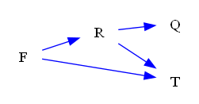
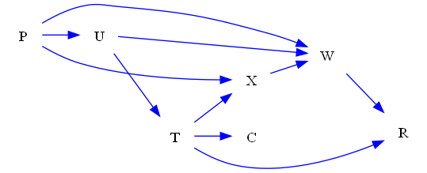
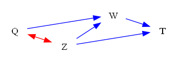
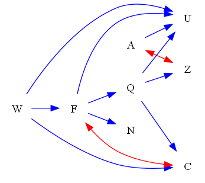

| Find All |How Many |Find One |Yes or No |Multiple Choice |Existence | total |
|:------:|:------:|:------:|:------:|:------:|:------:|:------:|
| 0 |0 |48 |48 |48 |0 | 144 |

|  N=4 | N=5 | N=6 | N=7 | N=8 | N=9 | total |
|:------:|:------:|:------:|:------:|:------:|:------:|:------:|
| 24 |24 |24 |24 |24 |24 | 144 |

|  Yes. | No. | judge_total |
|:------:|:------:|:------:|
| 23 |25 | 48 |

|  A | B | C | D | MC_total |
|:------:|:------:|:------:|:------:|:------:|
| 11 |11 |16 |10 | 48 |

## ID: 67203576
### Graph
- graph type: DAG
- description: Given a DAG (directed acyclic graph) with nodes K, A, H, C and directed edges A->C, A->H, K->C.

### Questions
- [FO] Find one valid topological ordering of the graph. 
- [YN] Is H, K, C, A a valid topological ordering of this graph? 
- [MC] Which of the following is a valid topological ordering of this graph?\
A. K, A, H, C\
B. C, A, K, H\
C. A, C, K, H\
D. H, K, A, C 
### Answers
- K, A, H, C
- No.
- A
## ID: 79415184
### Graph
- graph type: DAG
- description: Given a DAG (directed acyclic graph) with nodes Y, R, G, C and directed edges R->C, R->G, Y->G, Y->C, Y->R, G->C.

### Questions
- [FO] Find one valid topological ordering of the graph. 
- [YN] Is R, G, C, Y a valid topological ordering of this graph? 
- [MC] Which of the following is a valid topological ordering of this graph?\
A. G, C, Y, R\
B. C, Y, G, R\
C. Y, R, G, C\
D. C, G, Y, R 
### Answers
- Y, R, G, C
- No.
- C
## ID: 77994686
### Graph
- graph type: DAG
- description: Given a DAG (directed acyclic graph) with nodes T, L, H, V and directed edges L->H, T->L, T->V, L->V, T->H, H->V.

### Questions
- [FO] Find one valid topological ordering of the graph. 
- [YN] Is V, L, T, H a valid topological ordering of this graph? 
- [MC] Which of the following is a valid topological ordering of this graph?\
A. V, T, H, L\
B. T, H, V, L\
C. T, L, H, V\
D. V, L, H, T 
### Answers
- T, L, H, V
- No.
- C
## ID: 35781219
### Graph
- graph type: DAG
- description: Given a DAG (directed acyclic graph) with nodes F, R, Q, T and directed edges F->T, F->R, R->Q, R->T.

### Questions
- [FO] Find one valid topological ordering of the graph. 
- [YN] Is F, R, Q, T a valid topological ordering of this graph? 
- [MC] Which of the following is a valid topological ordering of this graph?\
A. R, Q, T, F\
B. F, R, Q, T\
C. F, T, R, Q\
D. F, Q, T, R 
### Answers
- F, R, Q, T
- Yes.
- B
## ID: 92696000
### Graph
- graph type: DAG
- description: Given a DAG (directed acyclic graph) with nodes Q, S, W, L, G and directed edges Q->G, S->W, S->G, L->G, W->L, S->L, Q->S, Q->W, Q->L, W->G.

### Questions
- [FO] Find one valid topological ordering of the graph. 
- [YN] Is Q, S, W, L, G a valid topological ordering of this graph? 
- [MC] Which of the following is a valid topological ordering of this graph?\
A. S, Q, W, L, G\
B. G, L, Q, W, S\
C. Q, S, W, L, G\
D. L, G, S, W, Q 
### Answers
- Q, S, W, L, G
- Yes.
- C
## ID: 23194276
### Graph
- graph type: DAG
- description: Given a DAG (directed acyclic graph) with nodes M, S, A, W, G and directed edges W->G, S->A, M->S, M->A, S->G, M->W.

### Questions
- [FO] Find one valid topological ordering of the graph. 
- [YN] Is M, S, W, A, G a valid topological ordering of this graph? 
- [MC] Which of the following is a valid topological ordering of this graph?\
A. W, S, G, A, M\
B. A, G, S, W, M\
C. M, S, W, A, G\
D. M, S, G, A, W 
### Answers
- M, S, W, A, G
- Yes.
- C
## ID: 78350804
### Graph
- graph type: DAG
- description: Given a DAG (directed acyclic graph) with nodes N, B, I, W, J and directed edges B->J, W->J, N->I, B->I.

### Questions
- [FO] Find one valid topological ordering of the graph. 
- [YN] Is W, J, B, I, N a valid topological ordering of this graph? 
- [MC] Which of the following is a valid topological ordering of this graph?\
A. N, I, B, J, W\
B. J, N, B, W, I\
C. N, B, W, I, J\
D. W, N, J, B, I 
### Answers
- N, B, W, I, J
- No.
- C
## ID: 77708841
### Graph
- graph type: DAG
- description: Given a DAG (directed acyclic graph) with nodes P, X, F, V, I and directed edges P->X, F->I, P->I, X->I, P->F, F->V, X->V.

### Questions
- [FO] Find one valid topological ordering of the graph. 
- [YN] Is P, X, F, V, I a valid topological ordering of this graph? 
- [MC] Which of the following is a valid topological ordering of this graph?\
A. P, X, F, V, I\
B. F, I, V, P, X\
C. P, I, V, F, X\
D. P, V, I, X, F 
### Answers
- P, X, F, V, I
- Yes.
- A
## ID: 69899267
### Graph
- graph type: DAG
- description: Given a DAG (directed acyclic graph) with nodes G, F, D, J, N, B and directed edges D->N, J->B, F->N, F->J, J->N, G->F.

### Questions
- [FO] Find one valid topological ordering of the graph. 
- [YN] Is G, D, F, J, N, B a valid topological ordering of this graph? 
- [MC] Which of the following is a valid topological ordering of this graph?\
A. N, J, F, G, B, D\
B. G, D, F, J, N, B\
C. F, N, B, J, G, D\
D. J, D, F, B, G, N 
### Answers
- G, D, F, J, N, B
- Yes.
- B
## ID: 09099709
### Graph
- graph type: DAG
- description: Given a DAG (directed acyclic graph) with nodes X, Z, D, P, B, G and directed edges P->B, X->D, X->B, P->G, X->P, X->Z, Z->D, Z->B.

### Questions
- [FO] Find one valid topological ordering of the graph. 
- [YN] Is X, B, P, D, G, Z a valid topological ordering of this graph? 
- [MC] Which of the following is a valid topological ordering of this graph?\
A. X, D, Z, G, B, P\
B. X, G, P, B, Z, D\
C. B, G, X, Z, P, D\
D. X, Z, P, D, G, B 
### Answers
- X, Z, P, D, G, B
- No.
- D
## ID: 09098355
### Graph
- graph type: DAG
- description: Given a DAG (directed acyclic graph) with nodes V, W, Z, D, O, U and directed edges W->Z, V->U, V->Z, W->O, D->O, V->W.

### Questions
- [FO] Find one valid topological ordering of the graph. 
- [YN] Is V, D, U, W, Z, O a valid topological ordering of this graph? 
- [MC] Which of the following is a valid topological ordering of this graph?\
A. V, D, U, W, Z, O\
B. O, W, D, U, Z, V\
C. W, V, O, D, Z, U\
D. V, O, Z, W, U, D 
### Answers
- V, D, U, W, Z, O
- Yes.
- A
## ID: 29191600
### Graph
- graph type: DAG
- description: Given a DAG (directed acyclic graph) with nodes B, T, G, M, J, C and directed edges B->C, G->C, B->G, B->T, G->M, G->J.

### Questions
- [FO] Find one valid topological ordering of the graph. 
- [YN] Is B, G, T, C, J, M a valid topological ordering of this graph? 
- [MC] Which of the following is a valid topological ordering of this graph?\
A. T, G, C, B, J, M\
B. G, M, C, J, T, B\
C. B, G, T, C, J, M\
D. C, M, G, T, J, B 
### Answers
- B, G, T, C, J, M
- Yes.
- C
## ID: 57327748
### Graph
- graph type: DAG
- description: Given a DAG (directed acyclic graph) with nodes X, P, O, M, C, V, A and directed edges P->A, X->P, C->V, X->C, M->C, O->A, P->C, V->A, X->V.

### Questions
- [FO] Find one valid topological ordering of the graph. 
- [YN] Is C, A, P, O, X, V, M a valid topological ordering of this graph? 
- [MC] Which of the following is a valid topological ordering of this graph?\
A. M, O, V, A, P, X, C\
B. X, O, M, P, C, V, A\
C. V, X, O, P, A, M, C\
D. P, V, A, M, O, X, C 
### Answers
- X, O, M, P, C, V, A
- No.
- B
## ID: 29123335
### Graph
- graph type: DAG
- description: Given a DAG (directed acyclic graph) with nodes Z, R, M, X, W, D, V and directed edges Z->X, Z->R, D->V, W->V, M->D, R->D, Z->W, M->V, R->V, W->D.

### Questions
- [FO] Find one valid topological ordering of the graph. 
- [YN] Is D, V, R, X, M, W, Z a valid topological ordering of this graph? 
- [MC] Which of the following is a valid topological ordering of this graph?\
A. M, W, Z, X, D, R, V\
B. Z, M, X, R, W, D, V\
C. W, D, Z, M, V, X, R\
D. D, R, M, Z, V, W, X 
### Answers
- Z, M, X, R, W, D, V
- No.
- B
## ID: 30305408
### Graph
- graph type: DAG
- description: Given a DAG (directed acyclic graph) with nodes P, U, T, X, C, W, R and directed edges T->X, T->R, P->W, T->C, P->X, X->W, U->T, W->R, P->U, U->W.

### Questions
- [FO] Find one valid topological ordering of the graph. 
- [YN] Is T, C, W, X, U, R, P a valid topological ordering of this graph? 
- [MC] Which of the following is a valid topological ordering of this graph?\
A. C, P, T, R, W, U, X\
B. R, W, X, U, T, P, C\
C. X, C, T, U, P, R, W\
D. P, U, T, X, C, W, R 
### Answers
- P, U, T, X, C, W, R
- No.
- D
## ID: 13559844
### Graph
- graph type: DAG
- description: Given a DAG (directed acyclic graph) with nodes Y, M, R, J, O, B, H and directed edges Y->H, Y->J, J->B, M->R, B->H, M->J, M->O, R->H, R->J, O->H.

### Questions
- [FO] Find one valid topological ordering of the graph. 
- [YN] Is B, J, H, Y, M, O, R a valid topological ordering of this graph? 
- [MC] Which of the following is a valid topological ordering of this graph?\
A. B, Y, R, O, H, M, J\
B. Y, M, O, R, J, B, H\
C. M, Y, O, B, R, H, J\
D. H, B, J, O, Y, M, R 
### Answers
- Y, M, O, R, J, B, H
- No.
- B
## ID: 43867804
### Graph
- graph type: DAG
- description: Given a DAG (directed acyclic graph) with nodes B, O, J, W, Q, T, N, V and directed edges O->J, O->V, O->W, J->Q, J->V, J->W, J->T, B->V, Q->N.

### Questions
- [FO] Find one valid topological ordering of the graph. 
- [YN] Is T, J, B, Q, O, N, W, V a valid topological ordering of this graph? 
- [MC] Which of the following is a valid topological ordering of this graph?\
A. T, J, V, W, O, B, Q, N\
B. Q, T, B, O, J, N, W, V\
C. W, J, Q, V, B, O, N, T\
D. B, O, J, V, T, W, Q, N 
### Answers
- B, O, J, V, T, W, Q, N
- No.
- D
## ID: 10999836
### Graph
- graph type: DAG
- description: Given a DAG (directed acyclic graph) with nodes Q, U, S, N, M, L, K, G and directed edges M->L, Q->S, N->M, M->K, U->L, S->M, S->L, M->G, Q->L, U->S.

### Questions
- [FO] Find one valid topological ordering of the graph. 
- [YN] Is Q, U, N, S, M, L, K, G a valid topological ordering of this graph? 
- [MC] Which of the following is a valid topological ordering of this graph?\
A. K, G, U, N, L, Q, M, S\
B. K, L, G, M, U, Q, S, N\
C. G, N, U, Q, M, S, K, L\
D. Q, U, N, S, M, L, K, G 
### Answers
- Q, U, N, S, M, L, K, G
- Yes.
- D
## ID: 95307070
### Graph
- graph type: DAG
- description: Given a DAG (directed acyclic graph) with nodes R, D, Y, K, E, A, V, X and directed edges E->A, V->X, R->K, E->X, D->V, R->X, D->E, D->X, Y->A, D->K.

### Questions
- [FO] Find one valid topological ordering of the graph. 
- [YN] Is V, A, E, Y, K, D, X, R a valid topological ordering of this graph? 
- [MC] Which of the following is a valid topological ordering of this graph?\
A. R, D, Y, K, V, E, X, A\
B. K, V, D, X, R, Y, A, E\
C. X, Y, K, A, D, E, R, V\
D. R, K, V, D, E, X, Y, A 
### Answers
- R, D, Y, K, V, E, X, A
- No.
- A
## ID: 23468311
### Graph
- graph type: DAG
- description: Given a DAG (directed acyclic graph) with nodes E, S, B, Z, N, F, T, K and directed edges E->B, B->N, S->F, S->N, Z->K, E->T, E->Z.

### Questions
- [FO] Find one valid topological ordering of the graph. 
- [YN] Is E, S, Z, T, B, F, K, N a valid topological ordering of this graph? 
- [MC] Which of the following is a valid topological ordering of this graph?\
A. E, S, Z, T, B, F, K, N\
B. Z, E, N, B, F, S, T, K\
C. Z, K, N, S, F, B, E, T\
D. T, N, Z, B, K, S, E, F 
### Answers
- E, S, Z, T, B, F, K, N
- Yes.
- A
## ID: 60830804
### Graph
- graph type: DAG
- description: Given a DAG (directed acyclic graph) with nodes P, I, K, T, E, B, D, A, X and directed edges T->D, P->A, E->D, K->X, I->T, T->B, P->D, K->D.

### Questions
- [FO] Find one valid topological ordering of the graph. 
- [YN] Is P, I, K, E, A, T, X, D, B a valid topological ordering of this graph? 
- [MC] Which of the following is a valid topological ordering of this graph?\
A. P, I, K, E, A, T, X, D, B\
B. E, B, D, A, X, K, T, I, P\
C. X, T, E, D, I, K, A, B, P\
D. X, I, P, D, K, B, A, T, E 
### Answers
- P, I, K, E, A, T, X, D, B
- Yes.
- A
## ID: 65272298
### Graph
- graph type: DAG
- description: Given a DAG (directed acyclic graph) with nodes H, I, T, Z, Y, A, M, N, R and directed edges H->I, Z->Y, Z->A, A->R, I->T, H->N, I->N, M->N, Y->M, A->N.

### Questions
- [FO] Find one valid topological ordering of the graph. 
- [YN] Is H, M, N, T, I, A, Y, Z, R a valid topological ordering of this graph? 
- [MC] Which of the following is a valid topological ordering of this graph?\
A. Y, A, R, Z, I, H, T, M, N\
B. T, Z, N, Y, M, A, R, H, I\
C. T, R, A, Z, H, I, M, N, Y\
D. H, Z, I, A, Y, T, R, M, N 
### Answers
- H, Z, I, A, Y, T, R, M, N
- No.
- D
## ID: 56342175
### Graph
- graph type: DAG
- description: Given a DAG (directed acyclic graph) with nodes E, P, S, I, H, X, O, Q, G and directed edges E->I, S->Q, H->X, S->O, E->O, H->G, P->G, X->O, X->Q.

### Questions
- [FO] Find one valid topological ordering of the graph. 
- [YN] Is E, P, S, H, I, X, G, O, Q a valid topological ordering of this graph? 
- [MC] Which of the following is a valid topological ordering of this graph?\
A. S, O, G, X, H, E, Q, P, I\
B. X, O, H, Q, G, P, I, E, S\
C. E, P, S, H, I, X, G, O, Q\
D. O, Q, S, P, I, X, E, H, G 
### Answers
- E, P, S, H, I, X, G, O, Q
- Yes.
- C
## ID: 85486114
### Graph
- graph type: DAG
- description: Given a DAG (directed acyclic graph) with nodes Q, E, R, U, C, B, J, Y, G and directed edges J->Y, Q->Y, E->U, U->B, U->C, B->G, U->G, Q->B, R->U.

### Questions
- [FO] Find one valid topological ordering of the graph. 
- [YN] Is E, R, Q, B, G, Y, U, C, J a valid topological ordering of this graph? 
- [MC] Which of the following is a valid topological ordering of this graph?\
A. C, G, Y, B, J, U, E, Q, R\
B. Y, E, R, J, U, B, C, G, Q\
C. C, U, Y, R, B, E, G, J, Q\
D. Q, E, R, J, U, Y, C, B, G 
### Answers
- Q, E, R, J, U, Y, C, B, G
- No.
- D
## ID: 37762453
### Graph
- graph type: ADMG
- description: Given an ADMG (acyclic directed mixed graph) with nodes N, V, Z, M, directed edges N->M, V->M, V->Z, N->Z and bi-directed edges V<->M, V<->Z.

### Questions
- [FO] Find one valid topological ordering of the graph. 
- [YN] Is M, N, V, Z a valid topological ordering of this graph? 
- [MC] Which of the following is a valid topological ordering of this graph?\
A. N, M, Z, V\
B. N, V, Z, M\
C. M, V, N, Z\
D. Z, N, M, V 
### Answers
- N, V, Z, M
- No.
- B
## ID: 95148546
### Graph
- graph type: ADMG
- description: Given an ADMG (acyclic directed mixed graph) with nodes D, Z, V, M, directed edges V->M, Z->V, D->Z and bi-directed edges D<->Z.

### Questions
- [FO] Find one valid topological ordering of the graph. 
- [YN] Is M, Z, D, V a valid topological ordering of this graph? 
- [MC] Which of the following is a valid topological ordering of this graph?\
A. M, D, V, Z\
B. Z, D, V, M\
C. D, Z, V, M\
D. V, Z, D, M 
### Answers
- D, Z, V, M
- No.
- C
## ID: 86199279
### Graph
- graph type: ADMG
- description: Given an ADMG (acyclic directed mixed graph) with nodes H, T, V, R, directed edges V->R, T->V, H->T and bi-directed edges T<->R.

### Questions
- [FO] Find one valid topological ordering of the graph. 
- [YN] Is H, V, R, T a valid topological ordering of this graph? 
- [MC] Which of the following is a valid topological ordering of this graph?\
A. H, T, R, V\
B. V, R, H, T\
C. H, T, V, R\
D. V, H, R, T 
### Answers
- H, T, V, R
- No.
- C
## ID: 00922815
### Graph
- graph type: ADMG
- description: Given an ADMG (acyclic directed mixed graph) with nodes Q, Z, W, T, directed edges Z->W, W->T, Q->W, Z->T and bi-directed edges Q<->Z.

### Questions
- [FO] Find one valid topological ordering of the graph. 
- [YN] Is Q, T, Z, W a valid topological ordering of this graph? 
- [MC] Which of the following is a valid topological ordering of this graph?\
A. T, Q, Z, W\
B. Q, W, Z, T\
C. Q, Z, W, T\
D. Q, T, Z, W 
### Answers
- Q, Z, W, T
- No.
- C
## ID: 74841652
### Graph
- graph type: ADMG
- description: Given an ADMG (acyclic directed mixed graph) with nodes J, N, K, T, W, directed edges J->K, K->T, J->T, N->W, T->W, N->K, K->W, J->W, N->T and bi-directed edges N<->T, T<->W, N<->K.

### Questions
- [FO] Find one valid topological ordering of the graph. 
- [YN] Is T, N, W, J, K a valid topological ordering of this graph? 
- [MC] Which of the following is a valid topological ordering of this graph?\
A. J, N, K, T, W\
B. T, N, W, K, J\
C. J, T, K, N, W\
D. W, T, K, N, J 
### Answers
- J, N, K, T, W
- No.
- A
## ID: 30067285
### Graph
- graph type: ADMG
- description: Given an ADMG (acyclic directed mixed graph) with nodes Q, R, U, Z, O, directed edges U->O, U->Z, Q->Z, R->O, R->U, R->Z, Q->O, Z->O, Q->U, Q->R and bi-directed edges Q<->Z.

### Questions
- [FO] Find one valid topological ordering of the graph. 
- [YN] Is Q, R, U, Z, O a valid topological ordering of this graph? 
- [MC] Which of the following is a valid topological ordering of this graph?\
A. Z, O, U, Q, R\
B. Q, R, Z, U, O\
C. Q, R, U, Z, O\
D. Z, Q, O, U, R 
### Answers
- Q, R, U, Z, O
- Yes.
- C
## ID: 87532740
### Graph
- graph type: ADMG
- description: Given an ADMG (acyclic directed mixed graph) with nodes P, V, D, A, R, directed edges V->D, P->V, A->R, D->R and bi-directed edges V<->A, P<->A.

### Questions
- [FO] Find one valid topological ordering of the graph. 
- [YN] Is P, R, D, A, V a valid topological ordering of this graph? 
- [MC] Which of the following is a valid topological ordering of this graph?\
A. P, D, A, R, V\
B. D, A, V, P, R\
C. A, P, D, V, R\
D. P, A, V, D, R 
### Answers
- P, A, V, D, R
- No.
- D
## ID: 13818639
### Graph
- graph type: ADMG
- description: Given an ADMG (acyclic directed mixed graph) with nodes L, W, A, Q, I, directed edges W->Q, L->A, W->I, W->A, L->Q and bi-directed edges L<->W, L<->A.

### Questions
- [FO] Find one valid topological ordering of the graph. 
- [YN] Is L, W, A, I, Q a valid topological ordering of this graph? 
- [MC] Which of the following is a valid topological ordering of this graph?\
A. I, Q, W, A, L\
B. L, W, A, I, Q\
C. W, A, L, I, Q\
D. Q, L, I, A, W 
### Answers
- L, W, A, I, Q
- Yes.
- B
## ID: 40878413
### Graph
- graph type: ADMG
- description: Given an ADMG (acyclic directed mixed graph) with nodes O, B, Z, E, P, W, directed edges B->W, B->P, E->W, B->E, O->P, E->P, Z->P, Z->W and bi-directed edges O<->Z.

### Questions
- [FO] Find one valid topological ordering of the graph. 
- [YN] Is O, B, Z, E, P, W a valid topological ordering of this graph? 
- [MC] Which of the following is a valid topological ordering of this graph?\
A. O, B, Z, E, P, W\
B. E, W, B, Z, O, P\
C. Z, O, P, B, E, W\
D. P, O, E, Z, B, W 
### Answers
- O, B, Z, E, P, W
- Yes.
- A
## ID: 13855579
### Graph
- graph type: ADMG
- description: Given an ADMG (acyclic directed mixed graph) with nodes H, D, F, K, Q, U, directed edges D->F, K->U, D->U, H->D, H->K, H->Q, Q->U, H->U and bi-directed edges F<->Q, D<->Q.

### Questions
- [FO] Find one valid topological ordering of the graph. 
- [YN] Is H, K, D, Q, F, U a valid topological ordering of this graph? 
- [MC] Which of the following is a valid topological ordering of this graph?\
A. U, Q, F, H, K, D\
B. U, H, K, Q, F, D\
C. H, K, D, Q, F, U\
D. H, Q, K, U, D, F 
### Answers
- H, K, D, Q, F, U
- Yes.
- C
## ID: 48627953
### Graph
- graph type: ADMG
- description: Given an ADMG (acyclic directed mixed graph) with nodes P, Z, K, X, N, O, directed edges Z->K, X->O, P->X, P->Z, K->O, Z->N, P->O and bi-directed edges N<->O, X<->O, K<->O.

### Questions
- [FO] Find one valid topological ordering of the graph. 
- [YN] Is P, X, Z, N, K, O a valid topological ordering of this graph? 
- [MC] Which of the following is a valid topological ordering of this graph?\
A. P, X, Z, N, K, O\
B. K, X, O, Z, N, P\
C. P, N, Z, X, O, K\
D. X, P, K, Z, N, O 
### Answers
- P, X, Z, N, K, O
- Yes.
- A
## ID: 94905365
### Graph
- graph type: ADMG
- description: Given an ADMG (acyclic directed mixed graph) with nodes D, E, T, Y, G, N, directed edges T->Y, T->N, Y->N, E->Y, D->G, G->N, D->E, D->T and bi-directed edges Y<->N, D<->T, D<->Y, T<->Y.

### Questions
- [FO] Find one valid topological ordering of the graph. 
- [YN] Is D, G, E, T, Y, N a valid topological ordering of this graph? 
- [MC] Which of the following is a valid topological ordering of this graph?\
A. N, Y, D, E, T, G\
B. D, E, T, N, G, Y\
C. D, G, E, T, Y, N\
D. G, N, Y, D, T, E 
### Answers
- D, G, E, T, Y, N
- Yes.
- C
## ID: 79413425
### Graph
- graph type: ADMG
- description: Given an ADMG (acyclic directed mixed graph) with nodes J, V, H, Z, P, I, O, directed edges J->Z, Z->I, Z->O, I->O, H->I, J->H, V->Z, J->I, J->P and bi-directed edges J<->H, V<->O, I<->O, Z<->I.

### Questions
- [FO] Find one valid topological ordering of the graph. 
- [YN] Is J, V, P, H, Z, I, O a valid topological ordering of this graph? 
- [MC] Which of the following is a valid topological ordering of this graph?\
A. J, V, P, H, Z, I, O\
B. O, H, P, Z, J, V, I\
C. O, V, I, P, H, Z, J\
D. O, H, V, J, P, I, Z 
### Answers
- J, V, P, H, Z, I, O
- Yes.
- A
## ID: 70677397
### Graph
- graph type: ADMG
- description: Given an ADMG (acyclic directed mixed graph) with nodes S, I, V, X, Z, E, K, directed edges V->K, I->V, I->K, S->I, X->Z, X->E, V->Z, S->V, V->X and bi-directed edges S<->I, I<->X, I<->Z.

### Questions
- [FO] Find one valid topological ordering of the graph. 
- [YN] Is S, I, V, X, K, Z, E a valid topological ordering of this graph? 
- [MC] Which of the following is a valid topological ordering of this graph?\
A. E, V, X, I, K, Z, S\
B. S, I, V, X, K, Z, E\
C. Z, I, S, E, X, V, K\
D. Z, X, E, I, S, V, K 
### Answers
- S, I, V, X, K, Z, E
- Yes.
- B
## ID: 81497578
### Graph
- graph type: ADMG
- description: Given an ADMG (acyclic directed mixed graph) with nodes U, G, B, O, D, J, Y, directed edges O->Y, D->Y, G->J, U->J, B->O, O->J and bi-directed edges G<->B.

### Questions
- [FO] Find one valid topological ordering of the graph. 
- [YN] Is O, D, J, Y, U, B, G a valid topological ordering of this graph? 
- [MC] Which of the following is a valid topological ordering of this graph?\
A. B, G, J, D, Y, U, O\
B. U, G, B, D, O, Y, J\
C. D, B, J, Y, O, U, G\
D. G, B, Y, O, D, J, U 
### Answers
- U, G, B, D, O, Y, J
- No.
- B
## ID: 69983211
### Graph
- graph type: ADMG
- description: Given an ADMG (acyclic directed mixed graph) with nodes K, J, G, M, Q, I, O, directed edges J->M, J->O, M->I, K->J, K->M, K->Q, G->O, K->O, I->O, M->Q and bi-directed edges G<->O, J<->Q, K<->Q, G<->M.

### Questions
- [FO] Find one valid topological ordering of the graph. 
- [YN] Is J, G, M, K, I, Q, O a valid topological ordering of this graph? 
- [MC] Which of the following is a valid topological ordering of this graph?\
A. I, K, M, G, Q, O, J\
B. K, G, J, M, I, Q, O\
C. J, G, I, O, K, Q, M\
D. I, J, Q, G, O, K, M 
### Answers
- K, G, J, M, I, Q, O
- No.
- B
## ID: 41758314
### Graph
- graph type: ADMG
- description: Given an ADMG (acyclic directed mixed graph) with nodes A, W, F, Q, Z, U, N, C, directed edges Q->C, W->F, Q->U, F->U, A->U, W->U, F->N, F->Q, Q->Z, W->C and bi-directed edges F<->C, A<->Z.

### Questions
- [FO] Find one valid topological ordering of the graph. 
- [YN] Is A, W, F, N, Q, Z, C, U a valid topological ordering of this graph? 
- [MC] Which of the following is a valid topological ordering of this graph?\
A. W, Z, A, U, N, F, C, Q\
B. Z, F, W, Q, U, N, A, C\
C. F, Q, C, A, U, Z, W, N\
D. A, W, F, N, Q, Z, C, U 
### Answers
- A, W, F, N, Q, Z, C, U
- Yes.
- D
## ID: 69188810
### Graph
- graph type: ADMG
- description: Given an ADMG (acyclic directed mixed graph) with nodes Q, I, B, N, X, S, C, W, directed edges I->B, B->S, Q->I, B->C, N->X, I->W, X->C, I->S and bi-directed edges X<->W, B<->X, N<->S.

### Questions
- [FO] Find one valid topological ordering of the graph. 
- [YN] Is S, X, B, N, W, I, C, Q a valid topological ordering of this graph? 
- [MC] Which of the following is a valid topological ordering of this graph?\
A. W, I, B, N, C, Q, S, X\
B. S, N, Q, I, B, C, X, W\
C. Q, N, I, X, W, B, S, C\
D. C, N, Q, S, B, I, X, W 
### Answers
- Q, N, I, X, W, B, S, C
- No.
- C
## ID: 25130216
### Graph
- graph type: ADMG
- description: Given an ADMG (acyclic directed mixed graph) with nodes K, X, U, S, Z, W, F, T, directed edges K->S, U->Z, W->F, K->X, W->T, X->W, K->U, K->T, Z->T and bi-directed edges X<->S, K<->X, U<->Z, Z<->T.

### Questions
- [FO] Find one valid topological ordering of the graph. 
- [YN] Is K, X, U, S, W, Z, F, T a valid topological ordering of this graph? 
- [MC] Which of the following is a valid topological ordering of this graph?\
A. K, X, U, S, W, Z, F, T\
B. T, Z, U, K, S, X, F, W\
C. Z, U, W, K, T, X, F, S\
D. Z, K, W, T, U, F, S, X 
### Answers
- K, X, U, S, W, Z, F, T
- Yes.
- A
## ID: 06509324
### Graph
- graph type: ADMG
- description: Given an ADMG (acyclic directed mixed graph) with nodes J, N, M, Y, U, Q, E, K, directed edges N->U, E->K, N->Y, J->N, Y->Q, U->K, N->M and bi-directed edges M<->U, J<->K.

### Questions
- [FO] Find one valid topological ordering of the graph. 
- [YN] Is E, Q, J, N, K, U, Y, M a valid topological ordering of this graph? 
- [MC] Which of the following is a valid topological ordering of this graph?\
A. N, K, U, J, E, M, Q, Y\
B. J, E, N, U, Y, M, K, Q\
C. K, Y, U, Q, N, M, J, E\
D. Y, Q, M, K, U, J, E, N 
### Answers
- J, E, N, U, Y, M, K, Q
- No.
- B
## ID: 20576488
### Graph
- graph type: ADMG
- description: Given an ADMG (acyclic directed mixed graph) with nodes I, Q, Y, Z, J, V, M, K, U, directed edges Y->K, V->K, Y->Z, M->K, Q->K, I->J, Q->U, Z->V, I->Y, Q->J and bi-directed edges Q<->V.

### Questions
- [FO] Find one valid topological ordering of the graph. 
- [YN] Is J, K, Q, I, M, Y, Z, U, V a valid topological ordering of this graph? 
- [MC] Which of the following is a valid topological ordering of this graph?\
A. K, M, Y, U, J, Z, V, I, Q\
B. J, M, U, V, Y, Z, Q, I, K\
C. Q, V, K, M, U, Z, J, I, Y\
D. I, Q, M, Y, U, J, Z, V, K 
### Answers
- I, Q, M, Y, U, J, Z, V, K
- No.
- D
## ID: 54126567
### Graph
- graph type: ADMG
- description: Given an ADMG (acyclic directed mixed graph) with nodes S, G, R, I, Q, P, W, T, A, directed edges Q->T, G->A, G->I, S->W, S->R, I->P, T->A, G->W, P->T, S->T and bi-directed edges I<->T, S<->G, Q<->T, R<->W, Q<->A.

### Questions
- [FO] Find one valid topological ordering of the graph. 
- [YN] Is S, R, I, W, G, A, P, T, Q a valid topological ordering of this graph? 
- [MC] Which of the following is a valid topological ordering of this graph?\
A. I, T, G, A, P, Q, R, S, W\
B. T, P, G, S, W, R, Q, A, I\
C. T, R, S, A, I, P, Q, G, W\
D. S, G, Q, R, I, W, P, T, A 
### Answers
- S, G, Q, R, I, W, P, T, A
- No.
- D
## ID: 26934085
### Graph
- graph type: ADMG
- description: Given an ADMG (acyclic directed mixed graph) with nodes U, M, I, A, V, H, Z, E, P, directed edges U->H, A->P, E->P, U->A, V->H, Z->P, A->E, I->H, M->A and bi-directed edges A<->Z, U<->I.

### Questions
- [FO] Find one valid topological ordering of the graph. 
- [YN] Is U, M, I, V, Z, A, H, E, P a valid topological ordering of this graph? 
- [MC] Which of the following is a valid topological ordering of this graph?\
A. E, U, A, Z, I, P, M, V, H\
B. U, M, E, I, Z, P, V, H, A\
C. U, M, I, V, Z, A, H, E, P\
D. A, H, V, M, U, E, I, P, Z 
### Answers
- U, M, I, V, Z, A, H, E, P
- Yes.
- C
## ID: 32865359
### Graph
- graph type: ADMG
- description: Given an ADMG (acyclic directed mixed graph) with nodes Q, G, N, S, C, X, D, P, Z, directed edges S->P, Q->Z, G->S, S->X, N->Z, S->C, X->Z, N->C, Q->C, S->D and bi-directed edges Q<->D.

### Questions
- [FO] Find one valid topological ordering of the graph. 
- [YN] Is Q, G, N, S, X, C, P, D, Z a valid topological ordering of this graph? 
- [MC] Which of the following is a valid topological ordering of this graph?\
A. G, N, X, Q, Z, C, S, D, P\
B. N, G, C, Z, S, P, X, Q, D\
C. Q, G, N, S, X, C, P, D, Z\
D. P, G, N, C, Z, D, S, Q, X 
### Answers
- Q, G, N, S, X, C, P, D, Z
- Yes.
- C
